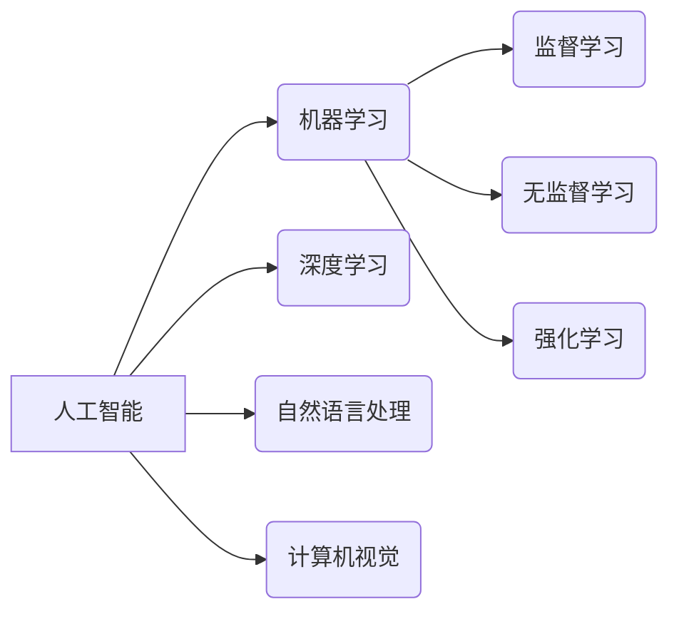

> 人工智能、深度学习、自然语言处理、计算机视觉、机器学习、算法、模型、应用

## 1. 背景介绍

我们正处在一个人工智能（AI）发展史上的独特时刻。从 AlphaGo 击败世界围棋冠军到 GPT-3 生成逼真的文本，AI 已经展现出惊人的能力，并开始深刻地改变着我们的生活。

过去几十年，人工智能领域取得了长足的进步，这得益于以下几个关键因素：

* **计算能力的飞跃:**  摩尔定律的持续发展使得计算能力以指数级增长，为训练复杂的 AI 模型提供了强大的基础。
* **数据量的爆炸式增长:**  互联网、移动设备和物联网的普及带来了海量数据，为 AI 模型的训练提供了充足的燃料。
* **算法的突破:**  深度学习算法的出现，特别是卷积神经网络和循环神经网络，为解决复杂问题提供了新的思路和方法。

这些因素共同推动了 AI 的快速发展，使其从实验室的理论研究走向现实世界的应用。

## 2. 核心概念与联系

**2.1  人工智能 (AI)**

人工智能是指模拟人类智能行为的计算机系统。它涵盖了广泛的领域，包括：

* **机器学习 (ML):**  使计算机能够从数据中学习，并根据学习到的知识进行预测或决策。
* **深度学习 (DL):**  一种更高级的机器学习方法，利用多层神经网络来模拟人类大脑的学习过程。
* **自然语言处理 (NLP):**  使计算机能够理解和处理人类语言。
* **计算机视觉 (CV):**  使计算机能够“看”图像和视频，并从中提取信息。

**2.2  核心概念关系图**



**2.3  AI 的发展阶段**

AI 的发展历程可以大致分为以下几个阶段：

* **早期阶段 (1950s-1970s):**  人工智能的萌芽期，主要集中在规则式 AI 和专家系统领域。
* **知识表示阶段 (1980s-1990s):**  研究如何将知识表示为计算机可以理解的形式，例如语义网络和逻辑推理。
* **机器学习阶段 (2000s-至今):**  机器学习算法的突破，使得 AI 能够从数据中学习，并取得了显著的进展。

## 3. 核心算法原理 & 具体操作步骤

**3.1  算法原理概述**

深度学习算法的核心是多层神经网络。神经网络由许多相互连接的神经元组成，每个神经元接收输入信号，对其进行处理，并输出信号。

**3.2  算法步骤详解**

1. **数据预处理:**  将原始数据转换为深度学习模型可以理解的形式，例如归一化、编码等。
2. **网络结构设计:**  根据任务需求设计神经网络的结构，包括层数、神经元数量、激活函数等。
3. **参数初始化:**  为神经网络中的参数赋予初始值。
4. **前向传播:**  将输入数据通过神经网络传递，计算输出结果。
5. **反向传播:**  计算输出结果与真实值的误差，并根据误差调整神经网络的参数。
6. **训练:**  重复前向传播和反向传播的过程，直到模型的性能达到预期的水平。
7. **测试:**  使用训练数据之外的数据来评估模型的性能。

**3.3  算法优缺点**

**优点:**

* **强大的学习能力:**  深度学习算法能够从海量数据中学习复杂的模式。
* **自动特征提取:**  深度学习模型能够自动提取数据的特征，无需人工干预。
* **泛化能力强:**  经过充分训练的深度学习模型能够对新的数据进行较好的泛化。

**缺点:**

* **数据依赖性强:**  深度学习算法需要大量的训练数据才能达到良好的性能。
* **计算资源消耗大:**  训练深度学习模型需要大量的计算资源。
* **可解释性差:**  深度学习模型的决策过程难以理解，缺乏透明度。

**3.4  算法应用领域**

深度学习算法已广泛应用于各个领域，例如：

* **图像识别:**  人脸识别、物体检测、图像分类等。
* **自然语言处理:**  机器翻译、文本摘要、情感分析等。
* **语音识别:**  语音助手、自动语音转文本等。
* **医疗诊断:**  疾病预测、图像分析等。
* **金融分析:**  欺诈检测、风险评估等。

## 4. 数学模型和公式 & 详细讲解 & 举例说明

**4.1  数学模型构建**

深度学习模型的核心是神经网络，其数学模型可以表示为一系列的矩阵运算和激活函数。

**4.2  公式推导过程**

* **前向传播:**  输入数据通过神经网络层层传递，每个神经元的输出可以表示为：

$$
y_i = f(w_i^T x + b_i)
$$

其中：

* $y_i$ 是神经元 $i$ 的输出
* $f$ 是激活函数
* $w_i$ 是神经元 $i$ 的权重向量
* $x$ 是输入向量
* $b_i$ 是神经元 $i$ 的偏置

* **反向传播:**  根据误差信号，调整神经网络的参数，例如权重和偏置。常用的优化算法包括梯度下降法和动量法。

**4.3  案例分析与讲解**

以图像分类为例，假设我们有一个包含 $n$ 个类别的图像分类模型。模型的输出是一个 $n$ 维的向量，每个元素代表该图像属于每个类别的概率。

例如，如果模型输出为 $[0.1, 0.8, 0.1]$, 则表示该图像最有可能属于第二个类别。

## 5. 项目实践：代码实例和详细解释说明

**5.1  开发环境搭建**

使用 Python 作为编程语言，并安装必要的库，例如 TensorFlow 或 PyTorch。

**5.2  源代码详细实现**

```python
import tensorflow as tf

# 定义模型结构
model = tf.keras.models.Sequential([
    tf.keras.layers.Conv2D(32, (3, 3), activation='relu', input_shape=(28, 28, 1)),
    tf.keras.layers.MaxPooling2D((2, 2)),
    tf.keras.layers.Conv2D(64, (3, 3), activation='relu'),
    tf.keras.layers.MaxPooling2D((2, 2)),
    tf.keras.layers.Flatten(),
    tf.keras.layers.Dense(10, activation='softmax')
])

# 编译模型
model.compile(optimizer='adam',
              loss='sparse_categorical_crossentropy',
              metrics=['accuracy'])

# 训练模型
model.fit(x_train, y_train, epochs=5)

# 评估模型
loss, accuracy = model.evaluate(x_test, y_test)
print('Test loss:', loss)
print('Test accuracy:', accuracy)
```

**5.3  代码解读与分析**

这段代码定义了一个简单的卷积神经网络模型，用于图像分类任务。

* `tf.keras.models.Sequential` 创建了一个顺序模型，即层级结构。
* `tf.keras.layers.Conv2D` 定义了一个卷积层，用于提取图像特征。
* `tf.keras.layers.MaxPooling2D` 定义了一个最大池化层，用于降低特征图的尺寸。
* `tf.keras.layers.Flatten` 将多维特征图转换为一维向量。
* `tf.keras.layers.Dense` 定义了一个全连接层，用于分类。
* `model.compile` 编译模型，指定优化器、损失函数和评价指标。
* `model.fit` 训练模型，使用训练数据进行训练。
* `model.evaluate` 评估模型，使用测试数据计算损失和准确率。

**5.4  运行结果展示**

训练完成后，模型可以用于预测新的图像类别。

## 6. 实际应用场景

**6.1  医疗诊断**

深度学习算法可以用于分析医学图像，例如 X 光片、CT 扫描和 MRI 图像，辅助医生诊断疾病。例如，可以用于检测肺结核、乳腺癌和脑肿瘤。

**6.2  金融风险评估**

深度学习算法可以用于分析金融数据，例如股票价格、交易记录和客户行为，识别潜在的金融风险。例如，可以用于欺诈检测、信用评分和风险管理。

**6.3  自动驾驶**

深度学习算法可以用于训练自动驾驶汽车，使其能够感知周围环境、做出决策并控制车辆。例如，可以用于物体检测、路径规划和避障。

**6.4  未来应用展望**

随着 AI 技术的不断发展，其应用场景将更加广泛，例如：

* **个性化教育:**  根据学生的学习情况提供个性化的学习方案。
* **智能客服:**  提供更加智能和人性化的客户服务。
* **科学研究:**  加速科学发现和技术创新。

## 7. 工具和资源推荐

**7.1  学习资源推荐**

* **在线课程:**  Coursera、edX、Udacity 等平台提供丰富的 AI 课程。
* **书籍:**  《深度学习》、《机器学习实战》等书籍是学习 AI 的经典教材。
* **博客和论坛:**  AI 相关的博客和论坛可以获取最新的技术资讯和交流经验。

**7.2  开发工具推荐**

* **TensorFlow:**  Google 开发的开源深度学习框架。
* **PyTorch:**  Facebook 开发的开源深度学习框架。
* **Keras:**  基于 TensorFlow 或 Theano 的高层深度学习 API。

**7.3  相关论文推荐**

* **AlphaGo论文:**  https://arxiv.org/abs/1607.02886
* **GPT-3论文:**  https://arxiv.org/abs/2005.14165

## 8. 总结：未来发展趋势与挑战

**8.1  研究成果总结**

近年来，AI 取得了长足的进步，在图像识别、自然语言处理、语音识别等领域取得了突破性进展。

**8.2  未来发展趋势**

* **模型规模的进一步扩大:**  更大的模型能够学习更复杂的模式，提高性能。
* **算法的创新:**  新的算法和架构将不断涌现，推动 AI 的发展。
* **边缘计算的普及:**  将 AI 模型部署到边缘设备上，实现更低延迟和更高效率。
* **AI 的伦理和安全问题:**  随着 AI 的发展，其伦理和安全问题也日益突出，需要引起重视。

**8.3  面临的挑战**

* **数据获取和隐私问题:**  训练高质量的 AI 模型需要大量数据，而数据获取和隐私保护是一个挑战。
* **算法的可解释性和透明度:**  许多 AI 模型的决策过程难以理解，缺乏透明度，这可能会导致信任问题。
* **AI 的公平性和偏见:**  AI 模型可能受到训练数据中的偏见影响，导致不公平的结果。

**8.4  研究展望**

未来，AI 研究将继续朝着更智能、更安全、更可解释的方向发展。

## 9. 附录：常见问题与解答

**9.1  什么是深度学习？**

深度学习是一种机器学习方法，利用多层神经网络来模拟人类大脑的学习过程。

**9.2  深度学习有哪些应用场景？**

深度学习已广泛应用于图像识别、自然语言处理、语音识别、自动驾驶等领域。

**9.3  如何学习深度学习？**

可以通过在线课程、书籍、博客和论坛等方式学习深度学习。

**9.4  有哪些深度学习框架？**

常用的深度学习框架包括 TensorFlow、PyTorch 和 Keras。