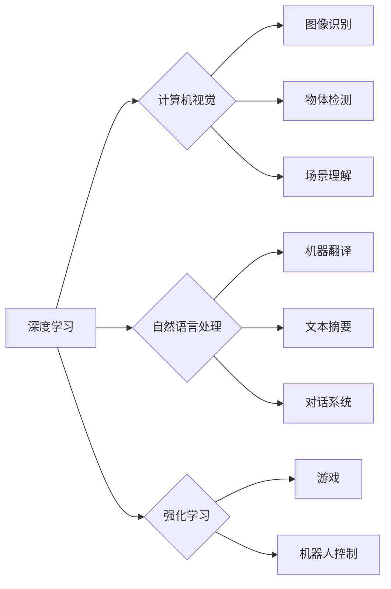

> 人工智能，深度学习，计算机视觉，自然语言处理，强化学习，伦理，可解释性

## 1. 背景介绍

人工智能（AI）正以惊人的速度发展，从自动驾驶到医疗诊断，AI正在改变着我们生活的方方面面。作为AI领域的领军人物，Andrej Karpathy 始终关注着AI技术的未来发展方向，并提出了许多具有远见卓识的观点。本文将探讨Karpathy对AI未来发展目标的思考，并分析其背后的核心概念、算法原理、应用场景以及面临的挑战。

## 2. 核心概念与联系

Karpathy认为，AI未来的发展将围绕以下几个核心概念展开：

* **深度学习**: 深度学习是目前AI领域最成功的技术之一，它能够从海量数据中学习复杂的模式和特征。
* **计算机视觉**: 计算机视觉是让计算机“看”世界的能力，它在图像识别、物体检测、场景理解等领域有着广泛的应用。
* **自然语言处理**: 自然语言处理是让计算机理解和生成人类语言的能力，它在机器翻译、文本摘要、对话系统等领域有着重要的应用价值。
* **强化学习**: 强化学习是让计算机通过与环境交互学习的算法，它能够解决许多复杂的任务，例如游戏、机器人控制等。

这些核心概念相互关联，共同推动着AI技术的进步。

**Mermaid 流程图**



## 3. 核心算法原理 & 具体操作步骤

### 3.1  算法原理概述

深度学习的核心算法是人工神经网络（ANN）。ANN由多个层的神经元组成，每个神经元接收来自其他神经元的输入，并通过激活函数进行处理，最终输出到下一个神经元。通过训练，ANN能够学习到数据中的复杂模式和特征。

### 3.2  算法步骤详解

1. **数据预处理**: 将原始数据转换为ANN能够理解的格式。
2. **网络结构设计**: 根据任务需求设计ANN的结构，包括神经元的数量、连接方式等。
3. **权值初始化**: 为ANN的连接赋予初始权值。
4. **前向传播**: 将输入数据通过网络层层传递，最终得到输出结果。
5. **反向传播**: 计算输出结果与真实值的误差，并根据误差调整网络权值。
6. **迭代训练**: 重复前向传播和反向传播的过程，直到网络性能达到预期的水平。

### 3.3  算法优缺点

**优点**:

* 能够学习到复杂的数据模式。
* 性能优于传统机器学习算法。
* 可应用于多种任务，例如图像识别、自然语言处理等。

**缺点**:

* 需要大量的训练数据。
* 训练过程耗时且耗能。
* 模型解释性较差。

### 3.4  算法应用领域

深度学习算法已广泛应用于以下领域：

* **计算机视觉**: 图像识别、物体检测、场景理解、图像生成等。
* **自然语言处理**: 机器翻译、文本摘要、情感分析、对话系统等。
* **语音识别**: 语音转文本、语音助手等。
* **推荐系统**: 商品推荐、内容推荐等。
* **医疗诊断**: 疾病诊断、影像分析等。

## 4. 数学模型和公式 & 详细讲解 & 举例说明

### 4.1  数学模型构建

深度学习模型的核心是神经网络，其数学模型可以表示为一系列的矩阵运算。

* **激活函数**: 激活函数将神经元的输入映射到输出，常用的激活函数包括 sigmoid 函数、ReLU 函数等。

* **损失函数**: 损失函数衡量模型预测结果与真实值的差异，常用的损失函数包括均方误差、交叉熵等。

* **优化算法**: 优化算法用于更新网络权值，使其能够最小化损失函数，常用的优化算法包括梯度下降、Adam 等。

### 4.2  公式推导过程

* **前向传播**:

$$
y = f(W^L x^L + b^L)
$$

其中，$y$ 是输出，$f$ 是激活函数，$W^L$ 是第 $L$ 层的权重矩阵，$x^L$ 是第 $L$ 层的输入，$b^L$ 是第 $L$ 层的偏置向量。

* **反向传播**:

$$
\frac{\partial L}{\partial W^L} = \frac{\partial L}{\partial y} \cdot \frac{\partial y}{\partial W^L}
$$

其中，$L$ 是损失函数，$\frac{\partial L}{\partial y}$ 是损失函数对输出的梯度，$\frac{\partial y}{\partial W^L}$ 是输出对权重矩阵的梯度。

### 4.3  案例分析与讲解

以图像识别为例，深度学习模型可以学习到图像中不同物体特征的表示。通过训练大量的图像数据，模型能够将图像映射到相应的类别标签。

## 5. 项目实践：代码实例和详细解释说明

### 5.1  开发环境搭建

使用 Python 作为编程语言，并安装必要的库，例如 TensorFlow、PyTorch 等深度学习框架。

### 5.2  源代码详细实现

```python
import tensorflow as tf

# 定义模型结构
model = tf.keras.models.Sequential([
    tf.keras.layers.Conv2D(32, (3, 3), activation='relu', input_shape=(28, 28, 1)),
    tf.keras.layers.MaxPooling2D((2, 2)),
    tf.keras.layers.Conv2D(64, (3, 3), activation='relu'),
    tf.keras.layers.MaxPooling2D((2, 2)),
    tf.keras.layers.Flatten(),
    tf.keras.layers.Dense(10, activation='softmax')
])

# 编译模型
model.compile(optimizer='adam',
              loss='sparse_categorical_crossentropy',
              metrics=['accuracy'])

# 训练模型
model.fit(x_train, y_train, epochs=5)

# 评估模型
loss, accuracy = model.evaluate(x_test, y_test)
print('Test loss:', loss)
print('Test accuracy:', accuracy)
```

### 5.3  代码解读与分析

这段代码定义了一个简单的卷积神经网络模型，用于手写数字识别任务。

* **Conv2D**: 卷积层，用于提取图像特征。
* **MaxPooling2D**: 最大池化层，用于降维和提高模型鲁棒性。
* **Flatten**: 将多维数据转换为一维数据。
* **Dense**: 全连接层，用于分类。

### 5.4  运行结果展示

训练完成后，模型能够准确识别手写数字。

## 6. 实际应用场景

### 6.1  自动驾驶

深度学习算法在自动驾驶领域有着广泛的应用，例如图像识别、物体检测、路径规划等。

### 6.2  医疗诊断

深度学习算法可以辅助医生进行疾病诊断，例如图像分析、基因预测等。

### 6.3  金融风险管理

深度学习算法可以用于识别金融风险，例如欺诈检测、信用评分等。

### 6.4  未来应用展望

未来，深度学习算法将应用于更多领域，例如个性化教育、智能家居、虚拟现实等。

## 7. 工具和资源推荐

### 7.1  学习资源推荐

* **书籍**:
    * 深度学习
    * 人工神经网络
* **在线课程**:
    * Coursera 深度学习课程
    * Udacity 深度学习工程师 Nanodegree

### 7.2  开发工具推荐

* **TensorFlow**: 开源深度学习框架
* **PyTorch**: 开源深度学习框架
* **Keras**: 高级深度学习API

### 7.3  相关论文推荐

* **ImageNet Classification with Deep Convolutional Neural Networks**
* **Attention Is All You Need**

## 8. 总结：未来发展趋势与挑战

### 8.1  研究成果总结

深度学习算法取得了显著的成果，在图像识别、自然语言处理等领域取得了突破性进展。

### 8.2  未来发展趋势

* **模型规模和复杂度**: 模型规模和复杂度将继续增加，以提高模型性能。
* **数据效率**: 研究更有效的训练方法，以降低对数据量的依赖。
* **可解释性**: 研究更可解释的深度学习模型，以提高模型透明度。
* **安全性和隐私**: 研究深度学习模型的安全性和隐私保护机制。

### 8.3  面临的挑战

* **数据获取和标注**: 获取高质量的训练数据和标注数据仍然是一个挑战。
* **计算资源**: 训练大型深度学习模型需要大量的计算资源。
* **伦理问题**: 深度学习算法的应用可能带来伦理问题，例如算法偏见、隐私泄露等。

### 8.4  研究展望

未来，深度学习研究将继续朝着更强大、更安全、更可解释的方向发展。


## 9. 附录：常见问题与解答

### 9.1  深度学习和机器学习的区别是什么？

深度学习是机器学习的一种子集，它利用多层神经网络来学习数据特征。

### 9.2  如何选择合适的深度学习框架？

选择深度学习框架需要考虑项目需求、开发经验、社区支持等因素。

### 9.3  如何解决深度学习模型的过拟合问题？

可以使用正则化、数据增强、Dropout 等技术来解决过拟合问题。


作者：禅与计算机程序设计艺术 / Zen and the Art of Computer Programming 
<end_of_turn>