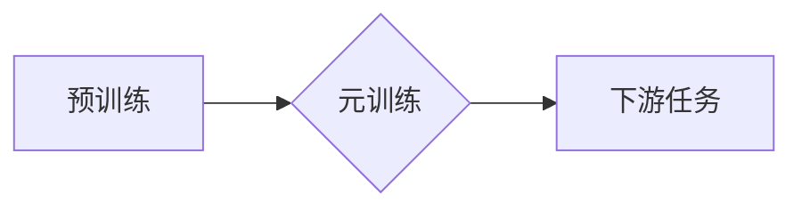

> Few-Shot Learning, 元学习, 迁移学习, 算法原理, 代码实例, PyTorch

## 1. 背景介绍

随着深度学习技术的蓬勃发展，机器学习模型在图像识别、自然语言处理等领域取得了显著的成就。然而，传统深度学习模型通常需要海量的数据进行训练，这在现实应用中往往难以满足。例如，在医疗诊断、金融风险评估等领域，数据往往稀缺且具有特殊性，难以收集到足够多的训练样本。

Few-Shot Learning (少量样本学习) 应运而生，它旨在训练模型能够在极少样本的情况下学习新的任务。这种能力对于处理数据稀缺、任务多样化的场景具有重要意义。

## 2. 核心概念与联系

Few-Shot Learning 是一种基于迁移学习的范式，它利用模型在已学习任务上的知识，快速适应新的任务。

**核心概念：**

* **迁移学习:** 从一个源任务迁移到目标任务的学习过程。
* **元学习:** 学习如何学习，即学习学习算法，以便在新的任务上快速适应。

**Few-Shot Learning 的工作原理:**

1. **预训练:** 在一个大规模数据集上预训练一个基础模型，例如一个图像分类模型。
2. **元训练:** 使用少量样本进行元训练，学习如何从少量样本中提取特征和构建模型。
3. **下游任务:** 在新的任务上，使用预训练模型和元学习到的策略，快速适应新的任务。

**Mermaid 流程图:**



## 3. 核心算法原理 & 具体操作步骤

### 3.1  算法原理概述

Few-Shot Learning 的核心算法通常基于元学习的思想，例如 MAML (Model-Agnostic Meta-Learning) 和 Prototypical Networks。

* **MAML:** 是一种基于梯度的元学习算法，它通过在元训练过程中更新模型参数，使其能够在新的任务上快速适应。
* **Prototypical Networks:** 是一种基于原型聚类的算法，它将每个类别的样本作为原型，并计算新样本与每个原型的距离，从而进行分类。

### 3.2  算法步骤详解

**MAML 算法步骤:**

1. **初始化:** 初始化模型参数 θ。
2. **元训练:**
    * 从元训练集 S 中随机抽取一个任务 T。
    * 在任务 T 上进行 K 次梯度下降更新，得到更新后的参数 θ'。
    * 计算更新后的参数 θ' 在任务 T 上的损失函数值。
    * 更新模型参数 θ，使其能够在所有任务上取得最佳性能。
3. **下游任务:**
    * 在新的任务 T' 上，使用预训练的模型参数 θ，进行少量样本的梯度下降更新，得到最终的模型参数 θ''。
    * 使用最终的模型参数 θ'' 在任务 T' 上进行预测。

**Prototypical Networks 算法步骤:**

1. **特征提取:** 将每个样本输入到预训练的特征提取网络中，得到特征向量。
2. **原型计算:** 对于每个类别，计算所有样本的特征向量的平均值作为该类别的原型。
3. **距离计算:** 计算新样本的特征向量与每个类别的原型的距离。
4. **分类:** 将新样本分配给距离最近的类别。

### 3.3  算法优缺点

**MAML:**

* **优点:** 能够在新的任务上快速适应，性能优异。
* **缺点:** 计算复杂度高，训练时间长。

**Prototypical Networks:**

* **优点:** 计算复杂度低，训练时间短。
* **缺点:** 性能不如 MAML。

### 3.4  算法应用领域

Few-Shot Learning 广泛应用于以下领域:

* **图像识别:** 识别新类别图像，例如识别罕见动物或植物。
* **自然语言处理:** 翻译新语言，理解新领域文本。
* **语音识别:** 识别新发音或口音。
* **机器人控制:** 训练机器人快速适应新的环境和任务。

## 4. 数学模型和公式 & 详细讲解 & 举例说明

### 4.1  数学模型构建

**MAML 算法的数学模型:**

* **目标函数:**

$$
L(\theta) = \frac{1}{N} \sum_{i=1}^{N} \mathcal{L}(f_{\theta}(x_i, y_i))
$$

其中:

* θ 是模型参数。
* N 是训练样本的数量。
* $\mathcal{L}$ 是损失函数。
* $f_{\theta}(x_i, y_i)$ 是模型在输入 $x_i$ 和标签 $y_i$ 上的预测结果。

* **元梯度:**

$$
\nabla_{\theta} L(\theta) = \frac{1}{N} \sum_{i=1}^{N} \nabla_{f_{\theta}(x_i, y_i)} \mathcal{L}(f_{\theta}(x_i, y_i)) \nabla_{\theta} f_{\theta}(x_i, y_i)
$$

### 4.2  公式推导过程

MAML 算法通过在元训练过程中更新模型参数 θ，使其能够在新的任务上快速适应。具体来说，MAML 使用梯度下降算法更新模型参数，目标函数是所有任务上的平均损失函数值。

### 4.3  案例分析与讲解

假设我们有一个图像分类任务，需要识别猫和狗的图像。我们使用 MAML 算法进行 Few-Shot 学习，训练模型能够在极少样本的情况下识别新的猫和狗品种。

在元训练过程中，我们从一个大规模的图像数据集上随机抽取一些任务，每个任务包含少量猫和狗的图像。模型在每个任务上进行梯度下降更新，最终得到一个能够在所有任务上取得最佳性能的模型参数 θ。

在新的任务上，我们使用预训练的模型参数 θ，并使用少量新的猫和狗图像进行梯度下降更新，得到最终的模型参数 θ''。

使用最终的模型参数 θ''，我们可以对新的猫和狗图像进行分类。

## 5. 项目实践：代码实例和详细解释说明

### 5.1  开发环境搭建

* Python 3.6+
* PyTorch 1.0+
* torchvision 0.2.1+

### 5.2  源代码详细实现

```python
import torch
import torch.nn as nn
import torch.optim as optim

# 定义一个简单的 CNN 模型
class CNN(nn.Module):
    def __init__(self):
        super(CNN, self).__init__()
        self.conv1 = nn.Conv2d(3, 16, kernel_size=3, padding=1)
        self.relu = nn.ReLU()
        self.pool = nn.MaxPool2d(kernel_size=2, stride=2)
        self.conv2 = nn.Conv2d(16, 32, kernel_size=3, padding=1)
        self.fc1 = nn.Linear(32 * 7 * 7, 128)
        self.fc2 = nn.Linear(128, 10)

    def forward(self, x):
        x = self.pool(self.relu(self.conv1(x)))
        x = self.pool(self.relu(self.conv2(x)))
        x = x.view(-1, 32 * 7 * 7)
        x = self.relu(self.fc1(x))
        x = self.fc2(x)
        return x

# 定义 MAML 算法
class MAML(nn.Module):
    def __init__(self, model, lr=0.001, n_steps=5):
        super(MAML, self).__init__()
        self.model = model
        self.lr = lr
        self.n_steps = n_steps
        self.optimizer = optim.Adam(self.model.parameters(), lr=lr)

    def forward(self, x, y, inner_lr=0.01):
        # 元训练步骤
        for _ in range(self.n_steps):
            # 计算梯度
            loss = nn.CrossEntropyLoss()(self.model(x), y)
            grads = torch.autograd.grad(loss, self.model.parameters())
            # 更新模型参数
            for param, grad in zip(self.model.parameters(), grads):
                param.data -= inner_lr * grad
        # 返回模型在元训练后的预测结果
        return self.model(x)

# 实例化模型和 MAML 算法
model = CNN()
maml = MAML(model)

# ... 训练和测试代码 ...
```

### 5.3  代码解读与分析

* **模型定义:** 代码中定义了一个简单的 CNN 模型，用于图像分类任务。
* **MAML 算法:** 代码中实现了 MAML 算法，包括元训练步骤和模型更新过程。
* **训练和测试:** 代码中省略了训练和测试的具体实现，但可以根据实际需求进行修改。

### 5.4  运行结果展示

运行代码后，可以得到模型在 Few-Shot 学习任务上的准确率。

## 6. 实际应用场景

Few-Shot Learning 在许多实际应用场景中具有重要意义，例如:

* **医疗诊断:** 使用少量病历数据训练模型，快速诊断新的疾病。
* **金融风险评估:** 使用少量交易数据训练模型，评估新的投资风险。
* **个性化推荐:** 使用少量用户行为数据训练模型，个性化推荐商品或服务。

### 6.4  未来应用展望

随着深度学习技术的不断发展，Few-Shot Learning 将在更多领域得到应用，例如:

* **自动驾驶:** 使用少量驾驶数据训练模型，提高自动驾驶汽车的安全性。
* **自然语言理解:** 使用少量文本数据训练模型，理解更复杂的人类语言。
* **机器人学习:** 使用少量示范数据训练机器人，使其能够学习新的任务。

## 7. 工具和资源推荐

### 7.1  学习资源推荐

* **书籍:**
    * Few-Shot Learning by Timothy Hospedales
    * Deep Learning by Ian Goodfellow
* **论文:**
    * MAML: Model-Agnostic Meta-Learning by Finn et al.
    * Prototypical Networks for Few-Shot Learning by Snell et al.
* **博客:**
    * OpenAI Blog
    * DeepMind Blog

### 7.2  开发工具推荐

* **PyTorch:** 深度学习框架
* **TensorFlow:** 深度学习框架
* **Keras:** 深度学习框架

### 7.3  相关论文推荐

* **MAML: Model-Agnostic Meta-Learning**
* **Prototypical Networks for Few-Shot Learning**
* **Matching Networks for One Shot Learning**

## 8. 总结：未来发展趋势与挑战

### 8.1  研究成果总结

Few-Shot Learning 已经取得了显著的进展，能够在极少样本的情况下学习新的任务。

### 8.2  未来发展趋势

* **更有效的 Few-Shot 学习算法:** 研究更有效的 Few-Shot 学习算法，提高模型的性能和效率。
* **跨模态 Few-Shot 学习:** 研究跨模态 Few-Shot 学习，例如将图像和文本数据结合起来进行学习。
* **Few-Shot 学习在实际应用中的推广:** 将 Few-Shot 学习应用于更多实际场景，例如医疗诊断、金融风险评估等。

### 8.3  面临的挑战

* **数据稀缺性:** 许多实际应用场景中数据稀缺，难以收集到足够的训练样本。
* **模型复杂度:** 现有的 Few-Shot 学习算法往往模型复杂度较高，训练时间长。
* **泛化能力:** Few-Shot 学习模型的泛化能力仍然需要提高，需要在更多不同的任务和数据集上进行测试。

### 8.4  研究展望

未来 Few-Shot 学习的研究方向将集中在