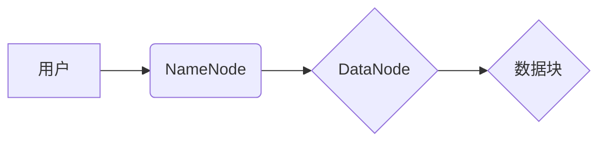

> Hadoop, HDFS, 分布式文件系统, 数据存储, 数据处理, 大数据, 容错, 高可用性

## 1. 背景介绍

在当今数据爆炸的时代，海量数据的存储和处理已成为各大企业和研究机构面临的重大挑战。传统的集中式文件系统难以满足对大规模数据存储和处理的需求。为了解决这一问题，Apache Hadoop 生态系统应运而生，其中，Hadoop Distributed File System（HDFS）作为其核心组件，为大数据存储提供了可靠、高效、可扩展的解决方案。

HDFS 是一种分布式文件系统，将数据存储在集群中多个节点上，并采用分片存储和副本机制，确保数据的可靠性和高可用性。它以数据块为基本单位，将文件分割成多个数据块，并将其存储在不同的节点上。每个数据块都有多个副本，以防止数据丢失。

## 2. 核心概念与联系

HDFS 的核心概念包括：

* **NameNode:** HDFS 的元数据管理节点，负责管理文件系统元数据，如文件路径、数据块位置、副本数量等。
* **DataNode:** HDFS 的数据存储节点，负责存储数据块和处理数据访问请求。
* **数据块:** HDFS 将文件分割成大小固定的数据块，每个数据块的大小通常为 128MB 或 256MB。
* **副本:** 为了保证数据可靠性，每个数据块都会有多个副本，通常为 3 个副本。
* **文件系统树:** HDFS 文件系统以树状结构组织文件，根目录为 /，用户可以创建目录和文件。

**HDFS 架构流程图:**



## 3. 核心算法原理 & 具体操作步骤

### 3.1  算法原理概述

HDFS 的核心算法包括数据分片、数据副本、数据块定位和数据访问等。

* **数据分片:** 将文件分割成多个数据块，并将其存储在不同的 DataNode 上，以提高数据存储效率和容错能力。
* **数据副本:** 为每个数据块创建多个副本，并将其存储在不同的 DataNode 上，以保证数据可靠性。
* **数据块定位:** 当用户请求访问文件时，NameNode 会根据文件路径和数据块信息，定位到存储数据块的 DataNode。
* **数据访问:** DataNode 会根据请求，读取并返回相应的用户数据。

### 3.2  算法步骤详解

1. **文件上传:** 用户将文件上传到 HDFS 时，NameNode 会将文件分割成数据块，并分配每个数据块到不同的 DataNode 上存储。
2. **数据块复制:** DataNode 会将每个数据块复制到指定数量的副本，并将其存储在不同的 DataNode 上。
3. **文件访问:** 当用户请求访问文件时，NameNode 会根据文件路径和数据块信息，定位到存储数据块的 DataNode。
4. **数据读取:** DataNode 会根据请求，读取并返回相应的用户数据。

### 3.3  算法优缺点

**优点:**

* **高可靠性:** 数据副本机制保证了数据的可靠性，即使部分 DataNode 发生故障，数据也不会丢失。
* **高可用性:** 数据分布在多个 DataNode 上，即使部分 DataNode 发生故障，用户仍然可以访问数据。
* **高吞吐量:** 数据分片和并行读取机制提高了数据访问吞吐量。
* **可扩展性:** HDFS 可以轻松扩展到更大的集群，以满足不断增长的存储需求。

**缺点:**

* **数据访问延迟:** 数据分布在多个 DataNode 上，数据访问需要跨节点通信，可能会导致数据访问延迟。
* **复杂性:** HDFS 的架构和算法相对复杂，需要专业的技术人员进行管理和维护。

### 3.4  算法应用领域

HDFS 广泛应用于以下领域:

* **大数据分析:** HDFS 可以存储海量数据，为大数据分析提供可靠的数据基础。
* **机器学习:** HDFS 可以存储训练数据和模型参数，为机器学习算法提供数据支持。
* **云计算:** HDFS 可以作为云计算平台的数据存储层，为用户提供可靠和高效的数据存储服务。

## 4. 数学模型和公式 & 详细讲解 & 举例说明

### 4.1  数学模型构建

HDFS 的数据存储和访问可以抽象为以下数学模型:

* **数据块大小:**  $B$
* **副本数量:** $R$
* **数据节点数量:** $N$
* **文件大小:** $F$
* **数据块数量:** $C = \frac{F}{B}$
* **存储空间:** $S = C * B * R$

### 4.2  公式推导过程

* **数据块分布:** 每个数据块在 $N$ 个 DataNode 中随机分配，每个 DataNode 存储的平均数据块数量为 $\frac{C}{N}$。
* **数据访问延迟:** 数据访问延迟取决于数据块所在的 DataNode 的距离，以及网络传输速度。

### 4.3  案例分析与讲解

假设一个文件大小为 1GB，数据块大小为 128MB，副本数量为 3，数据节点数量为 10。

* 数据块数量: $C = \frac{1GB}{128MB} = 8$
* 存储空间: $S = 8 * 128MB * 3 = 3072MB$
* 每个 DataNode 存储的平均数据块数量: $\frac{8}{10} = 0.8$

## 5. 项目实践：代码实例和详细解释说明

### 5.1  开发环境搭建

HDFS 的开发环境搭建需要以下软件:

* **Hadoop:** HDFS 的运行环境，可以从 Apache 官网下载安装。
* **Java Development Kit (JDK):** HDFS 是基于 Java 开发的，需要安装 JDK。
* **IDE:** 可以使用 Eclipse 或 IntelliJ IDEA 等 IDE 进行开发。

### 5.2  源代码详细实现

由于 HDFS 的代码量庞大，这里只提供一个简单的 HDFS 文件上传示例代码:

```java
import org.apache.hadoop.conf.Configuration;
import org.apache.hadoop.fs.FileSystem;
import org.apache.hadoop.fs.Path;

public class HDFSUpload {

    public static void main(String[] args) throws Exception {
        // 配置 HDFS 连接信息
        Configuration conf = new Configuration();
        conf.set("fs.defaultFS", "hdfs://localhost:9000");

        // 获取 HDFS 文件系统
        FileSystem fs = FileSystem.get(conf);

        // 上传文件路径
        String localFilePath = "/path/to/local/file";
        String hdfsFilePath = "/path/to/hdfs/file";

        // 上传文件
        fs.copyFromLocalFile(new Path(localFilePath), new Path(hdfsFilePath));

        // 关闭文件系统
        fs.close();
    }
}
```

### 5.3  代码解读与分析

* **配置 HDFS 连接信息:** 使用 `Configuration` 对象配置 HDFS 连接信息，包括 namenode 地址等。
* **获取 HDFS 文件系统:** 使用 `FileSystem.get(conf)` 方法获取 HDFS 文件系统对象。
* **上传文件:** 使用 `fs.copyFromLocalFile()` 方法将本地文件上传到 HDFS。

### 5.4  运行结果展示

运行上述代码后，本地文件将被上传到指定 HDFS 文件路径。

## 6. 实际应用场景

HDFS 在实际应用场景中广泛应用于以下领域:

* **电商平台:** 存储用户数据、商品信息、订单记录等海量数据。
* **社交媒体:** 存储用户画像、帖子内容、评论信息等海量数据。
* **金融机构:** 存储交易记录、客户信息、风险评估数据等海量数据。

### 6.4  未来应用展望

随着大数据技术的不断发展，HDFS 将在以下领域得到更广泛的应用:

* **人工智能:** 存储和处理海量训练数据，支持人工智能算法的训练和推理。
* **物联网:** 存储和分析海量物联网设备数据，实现智能感知和决策。
* **边缘计算:** 将 HDFS 部署在边缘节点，实现数据本地化处理和分析。

## 7. 工具和资源推荐

### 7.1  学习资源推荐

* **Apache Hadoop 官方文档:** https://hadoop.apache.org/docs/
* **HDFS 权威指南:** https://www.oreilly.com/library/view/hadoop-distributed-file/9781449360359/

### 7.2  开发工具推荐

* **Eclipse:** https://www.eclipse.org/
* **IntelliJ IDEA:** https://www.jetbrains.com/idea/

### 7.3  相关论文推荐

* **Hadoop: A Distributed File System for Reliable Data Storage:** https://www.usenix.org/system/files/conference/osdi08/osdi08-brown.pdf

## 8. 总结：未来发展趋势与挑战

### 8.1  研究成果总结

HDFS 作为一种成熟的分布式文件系统，在可靠性、高可用性和可扩展性方面取得了显著的成果。它为大数据存储和处理提供了可靠的解决方案，并广泛应用于各个领域。

### 8.2  未来发展趋势

HDFS 将朝着以下方向发展:

* **更强的性能:** 通过优化数据块分配、数据访问和数据传输机制，提高 HDFS 的数据吞吐量和访问速度。
* **更低的延迟:** 通过采用更先进的网络协议和数据传输技术，降低 HDFS 的数据访问延迟。
* **更强的安全性:** 通过采用更完善的访问控制机制和数据加密技术，增强 HDFS 的数据安全性。
* **更智能的管理:** 通过采用人工智能和机器学习技术，实现 HDFS 的智能化管理和优化。

### 8.3  面临的挑战

HDFS 也面临着一些挑战:

* **数据安全:** 海量数据的存储和处理带来了数据安全风险，需要加强数据加密和访问控制机制。
* **数据一致性:** 在分布式环境下，保证数据的一致性是一个难题，需要采用更有效的容错机制和数据同步机制。
* **数据管理:** 海量数据的管理和维护需要专业的技术人员和工具支持。

### 8.4  研究展望

未来，HDFS 将继续朝着更可靠、更高效、更安全的方向发展，并与其他大数据技术融合，为大数据时代提供更强大的数据存储和处理解决方案。

## 9. 附录：常见问题与解答

**常见问题:**

* **HDFS 的数据块大小如何设置?**

**解答:** 数据块大小可以通过配置参数 `dfs.blocksize` 设置，通常设置为 128MB 或 256MB。

* **HDFS 的副本数量如何设置?**

**解答:** 副本数量可以通过配置参数 `dfs.replication` 设置，通常设置为 3。

* **如何监控 HDFS 的运行状态?**

**解答:** 可以使用 HDFS 的 Web UI 或命令行工具监控 HDFS 的运行状态。

作者：禅与计算机程序设计艺术 / Zen and the Art of Computer Programming


<end_of_turn>