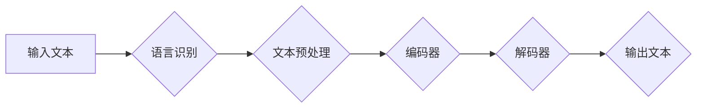

> Large Language Model (LLM), 跨语言沟通, 机器翻译, 自然语言处理 (NLP), 多语言理解, 跨语言信息检索, 语言模型, 深度学习

## 1. 背景介绍

在全球化时代，跨语言沟通已成为不可避免的趋势。随着互联网的蓬勃发展，信息爆炸式增长，不同语言之间的信息交流需求日益迫切。传统机器翻译方法由于其局限性，例如语法错误、语义偏差等，难以满足日益增长的跨语言沟通需求。

近年来，大型语言模型 (LLM) 的出现为跨语言沟通带来了革命性的变革。LLM 拥有海量文本数据训练，能够学习语言的复杂结构和语义关系，从而实现更准确、更流畅的跨语言翻译和理解。

## 2. 核心概念与联系

**2.1 跨语言沟通的挑战**

跨语言沟通面临着诸多挑战，包括：

* **语言多样性:** 世界上存在着数千种语言，每种语言都有其独特的语法、词汇和文化背景。
* **语义歧义:** 同一个词语或短语在不同语言中可能具有不同的含义，导致语义理解偏差。
* **文化差异:** 语言和文化密不可分，不同的文化背景会影响语言表达和理解方式。

**2.2 LLM 的优势**

LLM 能够有效解决跨语言沟通的挑战，其优势在于：

* **海量数据训练:** LLM 通过训练海量文本数据，学习语言的复杂结构和语义关系。
* **强大的语义理解能力:** LLM 可以理解上下文信息，识别语义歧义，提高跨语言理解的准确性。
* **生成流畅自然语言:** LLM 可以生成语法正确、语义流畅的跨语言文本。

**2.3 跨语言沟通的架构**

LLM 在跨语言沟通中的应用架构通常包括以下几个模块：



* **输入文本:** 用户输入需要翻译的文本。
* **语言识别:** 识别输入文本的语言。
* **文本预处理:** 对输入文本进行清洗、分词、词性标注等预处理操作。
* **编码器:** 将文本转换为向量表示，捕捉文本的语义信息。
* **解码器:** 根据编码后的向量表示，生成目标语言的文本。
* **输出文本:** 翻译后的目标语言文本。

## 3. 核心算法原理 & 具体操作步骤

**3.1 算法原理概述**

LLM 在跨语言沟通中的核心算法是基于 Transformer 架构的序列到序列 (seq2seq) 模型。Transformer 模型通过自注意力机制 (self-attention) 和多头注意力机制 (multi-head attention) 捕捉文本序列中的长距离依赖关系，从而实现更准确的跨语言翻译。

**3.2 算法步骤详解**

1. **输入文本编码:** 将输入文本转换为向量表示，每个单词对应一个向量。
2. **自注意力机制:** 计算每个单词与其他单词之间的注意力权重，捕捉单词之间的语义关系。
3. **多头注意力机制:** 使用多个自注意力头，从不同的角度捕捉单词之间的关系。
4. **前馈神经网络:** 对每个单词的向量表示进行非线性变换，提取更深层的语义信息。
5. **解码器:** 根据编码后的文本向量表示，生成目标语言的文本。

**3.3 算法优缺点**

**优点:**

* 能够捕捉长距离依赖关系，提高翻译质量。
* 训练效率高，能够处理海量文本数据。

**缺点:**

* 计算复杂度高，需要强大的计算资源。
* 训练数据量大，需要大量标注数据。

**3.4 算法应用领域**

* **机器翻译:** 将一种语言的文本翻译成另一种语言。
* **跨语言信息检索:** 在不同语言的文本数据中检索相关信息。
* **跨语言对话系统:** 实现不同语言之间的对话交流。

## 4. 数学模型和公式 & 详细讲解 & 举例说明

**4.1 数学模型构建**

Transformer 模型的核心是自注意力机制和多头注意力机制。

**4.2 公式推导过程**

* **自注意力机制:**

$$
Attention(Q, K, V) = softmax(\frac{QK^T}{\sqrt{d_k}})V
$$

其中：

* $Q$: 查询矩阵
* $K$: 键矩阵
* $V$: 值矩阵
* $d_k$: 键向量的维度

* **多头注意力机制:**

$$
MultiHead(Q, K, V) = Concat(head_1, head_2, ..., head_h)W^O
$$

其中：

* $head_i$: 第 $i$ 个注意力头的输出
* $h$: 注意力头的数量
* $W^O$: 线性变换矩阵

**4.3 案例分析与讲解**

假设我们有两个句子，一个英文句子 "The cat sat on the mat"，一个中文句子 "猫坐在垫子上"。

使用 Transformer 模型进行翻译，首先将两个句子分别编码成向量表示。然后，使用自注意力机制和多头注意力机制，计算每个单词之间的注意力权重，捕捉句子之间的语义关系。最后，解码器根据编码后的向量表示，生成目标语言的文本。

## 5. 项目实践：代码实例和详细解释说明

**5.1 开发环境搭建**

* Python 3.7+
* PyTorch 1.7+
* Transformers 库

**5.2 源代码详细实现**

```python
from transformers import AutoModelForSeq2SeqLM, AutoTokenizer

# 加载预训练模型和词典
model_name = "Helsinki-NLP/opus-mt-en-zh"
model = AutoModelForSeq2SeqLM.from_pretrained(model_name)
tokenizer = AutoTokenizer.from_pretrained(model_name)

# 输入文本
input_text = "The cat sat on the mat"

# 文本编码
input_ids = tokenizer.encode(input_text, return_tensors="pt")

# 模型预测
output = model.generate(input_ids)

# 解码输出文本
output_text = tokenizer.decode(output[0], skip_special_tokens=True)

# 打印输出文本
print(output_text)
```

**5.3 代码解读与分析**

* 使用 `AutoModelForSeq2SeqLM.from_pretrained()` 加载预训练的 seq2seq 模型。
* 使用 `AutoTokenizer.from_pretrained()` 加载对应的词典。
* 使用 `tokenizer.encode()` 将输入文本转换为模型可识别的向量表示。
* 使用 `model.generate()` 进行模型预测，生成目标语言的文本。
* 使用 `tokenizer.decode()` 将预测结果解码成文本。

**5.4 运行结果展示**

```
猫坐在垫子上
```

## 6. 实际应用场景

**6.1 机器翻译**

LLM 在机器翻译领域取得了显著的成果，能够实现更高质量、更流畅的跨语言翻译。例如，Google Translate 和 DeepL 等翻译工具都采用了 LLM 技术。

**6.2 跨语言信息检索**

LLM 可以用于跨语言信息检索，帮助用户在不同语言的文本数据中检索相关信息。例如，可以利用 LLM 在英文和中文文本数据中检索关于特定主题的信息。

**6.3 跨语言对话系统**

LLM 可以用于构建跨语言对话系统，实现不同语言之间的对话交流。例如，可以利用 LLM 开发一个可以与用户进行中文和英文对话的聊天机器人。

**6.4 未来应用展望**

LLM 在跨语言沟通领域的应用前景广阔，未来可能应用于：

* **自动字幕生成:** 自动生成不同语言的字幕。
* **跨语言文本摘要:** 生成不同语言的文本摘要。
* **跨语言问答系统:** 开发可以理解不同语言的自然语言问答系统。

## 7. 工具和资源推荐

**7.1 学习资源推荐**

* **论文:** "Attention Is All You Need"
* **博客:** Hugging Face Blog
* **在线课程:** Coursera, edX

**7.2 开发工具推荐**

* **Transformers 库:** https://huggingface.co/transformers/
* **PyTorch:** https://pytorch.org/

**7.3 相关论文推荐**

* "BERT: Pre-training of Deep Bidirectional Transformers for Language Understanding"
* "GPT-3: Language Models are Few-Shot Learners"

## 8. 总结：未来发展趋势与挑战

**8.1 研究成果总结**

LLM 在跨语言沟通领域取得了显著的成果，能够实现更高质量、更流畅的跨语言翻译和理解。

**8.2 未来发展趋势**

* **模型规模扩大:** 未来 LLM 模型规模将进一步扩大，提升模型的表达能力和泛化能力。
* **多模态理解:** LLM 将与其他模态信息 (例如图像、音频) 相结合，实现多模态跨语言理解。
* **个性化翻译:** LLM 将根据用户的偏好和语境，提供个性化的翻译服务。

**8.3 面临的挑战**

* **数据标注:** LLM 的训练需要大量标注数据，数据标注成本高昂。
* **计算资源:** LLM 的训练需要大量的计算资源，成本较高。
* **伦理问题:** LLM 的应用可能带来一些伦理问题，例如信息误导、文化冲突等。

**8.4 研究展望**

未来研究将重点关注以下几个方面：

* **高效训练方法:** 研究更有效的 LLM 训练方法，降低训练成本。
* **跨语言知识图谱:** 建立跨语言知识图谱，提升 LLM 的跨语言理解能力。
* **可解释性:** 研究 LLM 的决策机制，提高模型的可解释性。

## 9. 附录：常见问题与解答

**9.1 如何选择合适的 LLM 模型？**

选择合适的 LLM 模型需要考虑以下因素：

* **任务类型:** 不同的任务类型需要不同的模型架构。
* **语言对:** 不同的语言对需要不同的模型训练数据。
* **计算资源:** 不同的模型需要不同的计算资源。

**9.2 如何评估 LLM 的性能？**

LLM 的性能可以评估以下指标：

* **BLEU 分数:** 机器翻译的评估指标。
* **ROUGE 分数:** 文本摘要的评估指标。
* **准确率:** 问答系统的评估指标。

**9.3 如何部署 LLM 模型？**

LLM 模型可以部署在云端、边缘设备或本地服务器上。

作者：禅与计算机程序设计艺术 / Zen and the Art of Computer Programming


<end_of_turn>