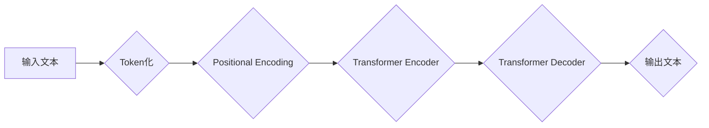

> Megatron-Turing NLG, 大规模语言模型, Transformer, 训练技巧, 代码实例, 实际应用

## 1. 背景介绍

近年来，大规模语言模型（LLM）在自然语言处理领域取得了显著进展，展现出强大的文本生成、翻译、摘要和问答能力。其中，Megatron-Turing NLG 是由 NVIDIA 和 Microsoft 联合开发的，拥有 530 亿参数的巨型语言模型，在多个 NLP 任务上取得了 state-of-the-art 的性能。

Megatron-Turing NLG 的诞生标志着 LLMs 规模和能力的飞跃，但也带来了新的挑战，例如训练成本高、模型部署复杂等。本文将深入探讨 Megatron-Turing NLG 的原理、训练技巧、代码实例以及实际应用场景，帮助读者理解和应用这一先进的语言模型。

## 2. 核心概念与联系

Megatron-Turing NLG 基于 Transformer 架构，并结合了多种先进的训练技巧，例如：

* **并行训练:** 利用多卡并行训练，加速模型训练速度。
* **混合精度训练:** 使用 FP16 和 FP32 混合精度训练，降低内存占用和训练成本。
* **梯度累积:** 将多个梯度累积后再更新模型参数，提高训练稳定性。
* **模型蒸馏:** 使用小型模型学习大型模型的知识，降低部署成本。

**核心概念与架构流程图:**

## 3. 核心算法原理 & 具体操作步骤

### 3.1  算法原理概述

Megatron-Turing NLG 的核心算法是 Transformer，它是一种基于注意力机制的序列到序列模型。Transformer 采用编码器-解码器结构，分别用于处理输入文本和生成输出文本。

* **编码器:** 将输入文本序列映射到一个隐藏表示，捕捉文本的语义信息。
* **解码器:** 基于编码器的输出，生成目标文本序列。

Transformer 的注意力机制能够捕捉文本中不同词之间的依赖关系，从而更好地理解文本语义。

### 3.2  算法步骤详解

1. **Token化:** 将输入文本分割成一个个独立的词或子词，称为 token。
2. **Positional Encoding:** 为每个 token 添加位置信息，因为 Transformer 无法直接理解词序。
3. **编码器:** 将 token 序列输入编码器，经过多层 Transformer 块处理，得到隐藏表示。
4. **解码器:** 将编码器的输出作为输入，解码器生成目标文本序列。
5. **输出:** 将生成的 token 序列解码成文本。

### 3.3  算法优缺点

**优点:**

* 能够捕捉长距离依赖关系。
* 并行训练效率高。
* 在多个 NLP 任务上取得了 state-of-the-art 的性能。

**缺点:**

* 训练成本高。
* 模型规模大，部署复杂。

### 3.4  算法应用领域

* **文本生成:** 写作、对话、故事创作等。
* **机器翻译:** 将一种语言翻译成另一种语言。
* **文本摘要:** 将长文本压缩成短文本。
* **问答系统:** 回答用户提出的问题。

## 4. 数学模型和公式 & 详细讲解 & 举例说明

### 4.1  数学模型构建

Transformer 模型的核心是注意力机制和多头注意力机制。

**注意力机制:**

注意力机制允许模型关注输入序列中与当前词语相关的部分，从而更好地理解上下文信息。注意力权重表示每个词语对当前词语的重要性。

**公式:**

$$
\text{Attention}(Q, K, V) = \text{softmax}\left(\frac{Q K^T}{\sqrt{d_k}}\right) V
$$

其中：

* $Q$：查询矩阵
* $K$：键矩阵
* $V$：值矩阵
* $d_k$：键向量的维度

**多头注意力机制:**

多头注意力机制将注意力机制应用于多个不同的子空间，从而捕捉不同类型的上下文信息。

**公式:**

$$
\text{MultiHeadAttention}(Q, K, V) = \text{Concat}\left(\text{head}_1, \text{head}_2, ..., \text{head}_h\right) W^O
$$

其中：

* $h$：注意力头的数量
* $\text{head}_i$：第 $i$ 个注意力头的输出

### 4.2  公式推导过程

注意力机制的公式推导过程如下：

1. 计算查询矩阵 $Q$、键矩阵 $K$ 和值矩阵 $V$。
2. 计算注意力权重矩阵：

$$
\text{AttentionWeights} = \text{softmax}\left(\frac{Q K^T}{\sqrt{d_k}}\right)
$$

3. 将注意力权重矩阵与值矩阵相乘，得到注意力输出：

$$
\text{AttentionOutput} = \text{AttentionWeights} V
$$

### 4.3  案例分析与讲解

假设我们有一个句子 "The cat sat on the mat"，我们想要计算 "sat" 这个词语的注意力权重。

1. 将句子 token 化，得到 [The, cat, sat, on, the, mat]。
2. 计算每个词语的查询矩阵 $Q$、键矩阵 $K$ 和值矩阵 $V$。
3. 计算注意力权重矩阵，其中每个元素表示 "sat" 这个词语对其他词语的注意力权重。
4. 将注意力权重矩阵与值矩阵相乘，得到 "sat" 这个词语的注意力输出，它包含了 "sat" 这个词语与其他词语之间的语义关系。

## 5. 项目实践：代码实例和详细解释说明

### 5.1  开发环境搭建

Megatron-Turing NLG 的开发环境需要满足以下条件：

* **GPU:** 至少需要 8 个 NVIDIA V100 GPU。
* **内存:** 至少需要 256 GB 的内存。
* **软件:** 需要安装 PyTorch、CUDA、cuDNN 等软件。

### 5.2  源代码详细实现

Megatron-Turing NLG 的源代码开源在 GitHub 上，可以参考官方文档进行实现。

### 5.3  代码解读与分析

Megatron-Turing NLG 的代码主要包含以下部分：

* **模型定义:** 定义 Transformer 模型的结构和参数。
* **数据加载:** 加载和预处理训练数据。
* **训练循环:** 实现模型的训练过程，包括前向传播、反向传播和参数更新。
* **评估:** 评估模型的性能。

### 5.4  运行结果展示

Megatron-Turing NLG 的训练结果可以展示在 TensorBoard 中，包括训练损失、准确率等指标。

## 6. 实际应用场景

Megatron-Turing NLG 可以应用于以下场景：

* **聊天机器人:** 开发更智能、更自然的聊天机器人。
* **文本摘要:** 自动生成新闻、文章等文本的摘要。
* **机器翻译:** 实现更高质量的机器翻译。
* **代码生成:** 自动生成代码片段。

### 6.4  未来应用展望

随着 LLMs 的不断发展，Megatron-Turing NLG 将有更多潜在的应用场景，例如：

* **个性化教育:** 为每个学生提供个性化的学习内容。
* **医疗诊断:** 辅助医生进行疾病诊断。
* **科学研究:** 加速科学研究的进展。

## 7. 工具和资源推荐

### 7.1  学习资源推荐

* **论文:** Megatron-Turing NLG 的论文可以参考官方网站或 arXiv。
* **博客:** 许多技术博客对 Megatron-Turing NLG 进行过介绍和讲解。
* **在线课程:** 一些在线平台提供关于 LLMs 和 Transformer 的课程。

### 7.2  开发工具推荐

* **PyTorch:** Megatron-Turing NLG 的开发框架。
* **TensorBoard:** 用于可视化训练过程和模型性能。
* **HuggingFace Transformers:** 提供预训练的 Transformer 模型和工具。

### 7.3  相关论文推荐

* **BERT: Pre-training of Deep Bidirectional Transformers for Language Understanding**
* **GPT-3: Language Models are Few-Shot Learners**
* **T5: Text-to-Text Transfer Transformer**

## 8. 总结：未来发展趋势与挑战

### 8.1  研究成果总结

Megatron-Turing NLG 的研究成果表明，LLMs 在 NLP 领域取得了显著进展，并展现出巨大的潜力。

### 8.2  未来发展趋势

未来 LLMs 的发展趋势包括：

* **模型规模更大:** 训练更大的模型，提高模型性能。
* **训练效率更高:** 开发更有效的训练算法，降低训练成本。
* **应用场景更广泛:** 将 LLMs 应用于更多领域，例如科学研究、医疗诊断等。

### 8.3  面临的挑战

LLMs 还面临着一些挑战，例如：

* **数据偏见:** LLMs 的训练数据可能存在偏见，导致模型输出存在偏差。
* **可解释性:** LLMs 的决策过程难以解释，难以理解模型的内部机制。
* **安全问题:** LLMs 可能被用于生成恶意内容，例如虚假新闻、仇恨言论等。

### 8.4  研究展望

未来研究方向包括：

* **解决数据偏见问题:** 开发新的数据预处理方法和模型训练算法，减少模型输出的偏差。
* **提高模型可解释性:** 研究 LLMs 的决策过程，开发可解释的 LLMs。
* **确保模型安全:** 开发安全机制，防止 LLMs 被用于恶意目的。

## 9. 附录：常见问题与解答

**常见问题:**

* Megatron-Turing NLG 的训练需要多少时间？
* Megatron-Turing NLG 的模型参数量是多少？
* Megatron-Turing NLG 的开源代码在哪里？

**解答:**

* Megatron-Turing NLG 的训练时间取决于硬件配置和训练数据规模，通常需要数周甚至数月。
* Megatron-Turing NLG 的模型参数量为 530 亿。
* Megatron-Turing NLG 的开源代码可以在 GitHub 上找到。

作者：禅与计算机程序设计艺术 / Zen and the Art of Computer Programming 
<end_of_turn>