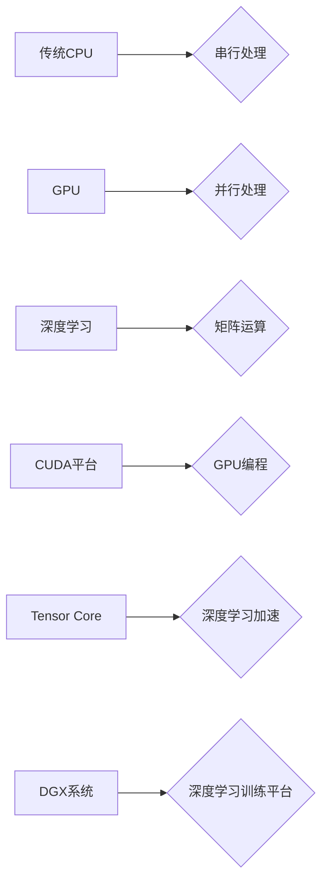

> NVIDIA, GPU, AI, 深度学习, CUDA, Tensor Core, Transformer, 算力, 训练效率

## 1. 背景介绍

人工智能（AI）的蓬勃发展，特别是深度学习技术的兴起，对算力的需求呈指数级增长。训练大型深度学习模型需要海量数据和强大的计算能力，这推动了GPU（图形处理单元）在AI领域的应用。NVIDIA作为GPU领域的领导者，凭借其强大的硬件和软件生态系统，在AI算力的进化中扮演着至关重要的角色。

从早期GPU加速科学计算到如今的AI训练平台，NVIDIA不断创新，推出了各种针对AI算力的解决方案，例如CUDA、Tensor Core、DGX等。这些技术突破推动了深度学习模型的规模和性能提升，加速了AI技术的应用落地。

## 2. 核心概念与联系

**2.1 GPU加速计算的原理**

传统CPU（中央处理器）采用串行处理方式，每个核心处理一个任务，效率相对较低。而GPU采用并行处理方式，拥有大量并行计算单元，可以同时处理多个任务，因此在处理大量数据时具有显著优势。

深度学习算法本质上是大量矩阵运算，GPU的并行计算能力使其成为深度学习训练的理想平台。

**2.2 NVIDIA CUDA平台**

CUDA（Compute Unified Device Architecture）是NVIDIA开发的并行计算平台，它允许开发者将程序移植到GPU上进行加速计算。CUDA提供了丰富的API和工具，简化了GPU编程开发过程。

**2.3 NVIDIA Tensor Core**

Tensor Core是NVIDIA在GPU架构中专门为深度学习设计的加速单元。它能够高效地执行深度学习所需的矩阵乘法和累加运算，大幅提升训练速度。

**2.4 NVIDIA DGX系统**

DGX系统是NVIDIA为深度学习训练量身打造的超级计算平台，它集成了多个高性能GPU、高速内存和高效网络，能够提供强大的算力和低延迟的训练环境。

**2.5 核心概念关系流程图**



## 3. 核心算法原理 & 具体操作步骤

**3.1 算法原理概述**

深度学习算法的核心是多层神经网络，它通过学习数据中的特征表示来完成各种任务，例如图像识别、自然语言处理等。

**3.2 算法步骤详解**

1. **数据预处理:** 将原始数据转换为深度学习模型可以理解的格式，例如归一化、编码等。
2. **模型构建:** 根据任务需求设计神经网络结构，包括层数、节点数、激活函数等。
3. **模型训练:** 使用训练数据训练模型，通过反向传播算法调整模型参数，使模型输出与真实值尽可能接近。
4. **模型评估:** 使用测试数据评估模型性能，例如准确率、召回率等。
5. **模型部署:** 将训练好的模型部署到实际应用场景中，例如图像识别系统、语音助手等。

**3.3 算法优缺点**

**优点:**

* 表现力强：深度学习模型能够学习到数据中的复杂特征，从而实现高精度和鲁棒性。
* 自动特征提取：深度学习模型能够自动学习特征，无需人工特征工程。
* 可扩展性强：深度学习模型可以轻松扩展到更大的数据集和更复杂的模型架构。

**缺点:**

* 训练成本高：深度学习模型训练需要大量的计算资源和时间。
* 数据依赖性强：深度学习模型的性能取决于训练数据的质量和数量。
* 可解释性差：深度学习模型的决策过程难以理解，缺乏透明度。

**3.4 算法应用领域**

深度学习算法已广泛应用于各个领域，例如：

* **计算机视觉:** 图像识别、物体检测、图像分割、人脸识别等。
* **自然语言处理:** 文本分类、情感分析、机器翻译、对话系统等。
* **语音识别:** 语音转文本、语音助手等。
* **医疗保健:** 疾病诊断、药物研发、影像分析等。
* **金融科技:** 风险评估、欺诈检测、投资预测等。

## 4. 数学模型和公式 & 详细讲解 & 举例说明

**4.1 数学模型构建**

深度学习模型本质上是一个复杂的数学模型，它通过一系列的矩阵运算和激活函数来学习数据中的特征表示。

**4.2 公式推导过程**

深度学习模型的训练过程基于梯度下降算法，其核心公式为：

$$
\theta = \theta - \alpha \nabla L(\theta)
$$

其中：

* $\theta$：模型参数
* $\alpha$：学习率
* $\nabla L(\theta)$：损失函数对模型参数的梯度

**4.3 案例分析与讲解**

假设我们训练一个简单的线性回归模型，其损失函数为均方误差：

$$
L(\theta) = \frac{1}{2} \sum_{i=1}^{n} (y_i - \hat{y}_i)^2
$$

其中：

* $y_i$：真实值
* $\hat{y}_i$：模型预测值
* $n$：样本数量

通过计算损失函数对模型参数的梯度，并使用梯度下降算法更新模型参数，最终可以得到一个能够准确预测目标变量的线性回归模型。

## 5. 项目实践：代码实例和详细解释说明

**5.1 开发环境搭建**

* 操作系统：Ubuntu 20.04
* CUDA版本：11.4
* cuDNN版本：8.2
* Python版本：3.8

**5.2 源代码详细实现**

```python
import torch
import torch.nn as nn

# 定义线性回归模型
class LinearRegression(nn.Module):
    def __init__(self, input_size, output_size):
        super(LinearRegression, self).__init__()
        self.linear = nn.Linear(input_size, output_size)

    def forward(self, x):
        return self.linear(x)

# 创建模型实例
model = LinearRegression(input_size=1, output_size=1)

# 定义损失函数和优化器
criterion = nn.MSELoss()
optimizer = torch.optim.SGD(model.parameters(), lr=0.01)

# 训练数据
x_train = torch.randn(100, 1)
y_train = 2 * x_train + 1 + torch.randn(100, 1)

# 训练模型
for epoch in range(100):
    # 前向传播
    outputs = model(x_train)
    # 计算损失
    loss = criterion(outputs, y_train)
    # 反向传播
    optimizer.zero_grad()
    loss.backward()
    # 更新参数
    optimizer.step()

    if (epoch + 1) % 10 == 0:
        print(f'Epoch [{epoch+1}/{100}], Loss: {loss.item():.4f}')

# 保存模型
torch.save(model.state_dict(), 'linear_regression_model.pth')
```

**5.3 代码解读与分析**

这段代码实现了简单的线性回归模型训练。

* 首先定义了线性回归模型类 `LinearRegression`，它包含一个线性层 `nn.Linear`。
* 然后创建模型实例 `model`，并定义损失函数 `criterion` 和优化器 `optimizer`。
* 接下来准备训练数据 `x_train` 和 `y_train`。
* 最后进行模型训练，迭代更新模型参数，并打印训练过程中的损失值。

**5.4 运行结果展示**

训练完成后，模型能够准确预测目标变量。

## 6. 实际应用场景

**6.1 图像识别**

NVIDIA GPU加速的深度学习模型在图像识别领域取得了突破性进展，例如：

* **物体检测:** 识别图像中存在的物体，并标注其位置和类别。
* **图像分类:** 将图像分类到预定义的类别中。
* **图像分割:** 将图像分割成不同的区域，每个区域代表不同的物体或场景。

**6.2 自然语言处理**

NVIDIA GPU加速的深度学习模型在自然语言处理领域也取得了显著成果，例如：

* **机器翻译:** 将文本从一种语言翻译成另一种语言。
* **文本摘要:** 自动生成文本的简短摘要。
* **对话系统:** 开发能够与人类进行自然对话的智能助手。

**6.3 其他应用场景**

* **语音识别:** 将语音转换为文本。
* **药物研发:** 利用深度学习加速药物发现和开发过程。
* **金融科技:** 进行风险评估、欺诈检测和投资预测。

**6.4 未来应用展望**

随着AI技术的不断发展，NVIDIA GPU加速的深度学习模型将在更多领域得到应用，例如：

* **自动驾驶:** 提高自动驾驶汽车的感知能力和决策能力。
* **医疗诊断:** 辅助医生进行疾病诊断和治疗方案制定。
* **个性化教育:** 提供个性化的学习内容和教学方式。

## 7. 工具和资源推荐

**7.1 学习资源推荐**

* **NVIDIA Deep Learning Institute (DLI):** 提供各种深度学习课程和培训资源。
* **Coursera:** 提供深度学习相关的在线课程，例如Andrew Ng的深度学习课程。
* **Udacity:** 提供深度学习相关的在线课程和项目。

**7.2 开发工具推荐**

* **CUDA Toolkit:** NVIDIA开发的GPU编程工具包。
* **cuDNN:** NVIDIA开发的深度学习库，提供高效的矩阵运算和神经网络算法实现。
* **PyTorch:** 开源深度学习框架，支持GPU加速。
* **TensorFlow:** 开源深度学习框架，支持GPU加速。

**7.3 相关论文推荐**

* **ImageNet Classification with Deep Convolutional Neural Networks**
* **Attention Is All You Need**
* **BERT: Pre-training of Deep Bidirectional Transformers for Language Understanding**

## 8. 总结：未来发展趋势与挑战

**8.1 研究成果总结**

NVIDIA在AI算力领域取得了显著成就，其GPU加速技术和深度学习平台推动了深度学习技术的快速发展。

**8.2 未来发展趋势**

* **算力继续提升:** GPU架构将继续朝着更高性能、更高效率的方向发展。
* **模型规模扩大:** 深度学习模型将继续朝着更大规模的方向发展，以提高模型性能和泛化能力。
* **新兴应用场景:** 深度学习技术将应用于更多新的领域，例如自动驾驶、医疗诊断、个性化教育等。

**8.3 面临的挑战**

* **算力需求爆炸式增长:** 深度学习模型的训练需要大量的算力资源，如何满足不断增长的算力需求是一个挑战。
* **模型可解释性:** 深度学习模型的决策过程难以理解，缺乏透明度，如何提高模型的可解释性是一个重要问题。
* **数据安全和隐私:** 深度学习模型的训练需要大量数据，如何保护数据安全和隐私是一个关键问题。

**8.4 研究展望**

未来，AI算力将继续朝着更高效、更智能、更安全的方向发展。NVIDIA将继续发挥其技术优势，推动AI技术的创新和应用，为人类社会创造更多价值。

## 9. 附录：常见问题与解答

**9.1 如何选择合适的GPU？**

选择合适的GPU取决于具体的应用场景和预算。对于深度学习训练，建议选择具有高性能计算能力和大量内存的GPU，例如NVIDIA A100、H100等。

**9.2 如何安装CUDA和cuDNN？**

NVIDIA官方网站提供详细的CUDA和cuDNN安装指南。

**9.3 如何使用PyTorch进行深度学习开发？**

PyTorch官方网站提供丰富的文档和教程，可以帮助开发者快速入门。

作者：禅与计算机程序设计艺术 / Zen and the Art of Computer Programming


<end_of_turn>