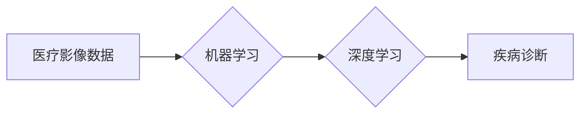

> 机器学习，医疗影像，诊断，Python，深度学习，CNN，图像分类

## 1. 背景介绍

医疗影像诊断是临床医学的重要环节，它为医生提供疾病诊断、治疗方案制定和病情监测的重要依据。随着医学影像技术的不断发展，影像数据量呈指数级增长，传统的影像诊断方法难以满足临床需求。机器学习作为一种强大的数据分析技术，在医疗影像诊断领域展现出巨大的潜力。

机器学习算法能够从海量影像数据中学习特征，识别疾病模式，并辅助医生进行诊断。相比于传统的基于经验的诊断方法，机器学习方法具有以下优势：

* **提高诊断准确率:** 机器学习算法能够识别出人类难以察觉的微小特征，从而提高诊断的准确率。
* **加速诊断速度:** 机器学习算法能够快速处理大量影像数据，显著缩短诊断时间。
* **降低诊断成本:** 机器学习算法可以自动化部分诊断流程，降低人工成本。
* **提高诊断一致性:** 机器学习算法可以帮助医生形成更一致的诊断标准，减少主观判断的影响。

## 2. 核心概念与联系

### 2.1  医疗影像数据

医疗影像数据是指通过各种医学影像设备（如X射线机、CT扫描仪、MRI扫描仪等）获取的图像数据。这些数据通常包含丰富的病理信息，是机器学习算法进行疾病诊断的重要基础。

### 2.2  机器学习

机器学习是一种人工智能技术，它通过算法学习数据中的模式和规律，从而实现对未知数据的预测和分类。在医疗影像诊断领域，机器学习算法可以用于识别疾病特征、预测疾病风险、辅助医生进行诊断等。

### 2.3  深度学习

深度学习是机器学习的一个子领域，它利用多层神经网络来模拟人类大脑的学习过程。深度学习算法能够从复杂的数据中学习更深层次的特征，在图像识别、语音识别等领域取得了突破性进展。

**核心概念与联系流程图:**



## 3. 核心算法原理 & 具体操作步骤

### 3.1  算法原理概述

卷积神经网络（CNN）是一种专门用于处理图像数据的深度学习算法。CNN的结构灵感来源于生物视觉系统，它利用卷积层、池化层和全连接层来提取图像特征，并进行分类或识别。

* **卷积层:** 卷积层使用卷积核对图像进行卷积运算，提取图像局部特征。
* **池化层:** 池化层对卷积层的输出进行降维，减少计算量，提高算法的鲁棒性。
* **全连接层:** 全连接层将池化层的输出连接起来，进行分类或识别。

### 3.2  算法步骤详解

1. **数据预处理:** 将原始影像数据进行预处理，例如图像裁剪、归一化等，以提高算法的性能。
2. **模型构建:** 根据具体的应用场景，构建CNN模型，包括卷积层、池化层和全连接层。
3. **模型训练:** 使用训练数据训练CNN模型，调整模型参数，使模型能够准确识别疾病特征。
4. **模型评估:** 使用测试数据评估模型的性能，例如准确率、召回率等。
5. **模型部署:** 将训练好的模型部署到实际应用场景中，用于辅助医生进行诊断。

### 3.3  算法优缺点

**优点:**

* **高准确率:** CNN算法能够从图像数据中学习到丰富的特征，从而实现高准确率的疾病诊断。
* **自动化程度高:** CNN算法可以自动化大部分诊断流程，减少人工干预。
* **可扩展性强:** CNN算法可以应用于多种类型的医疗影像数据，例如X射线、CT、MRI等。

**缺点:**

* **数据依赖性强:** CNN算法需要大量的训练数据才能达到较高的准确率。
* **计算资源需求高:** 训练CNN模型需要大量的计算资源，例如GPU。
* **解释性差:** CNN算法的决策过程比较复杂，难以解释其识别疾病的依据。

### 3.4  算法应用领域

CNN算法在医疗影像诊断领域具有广泛的应用前景，例如：

* **肿瘤检测:** 识别肺癌、乳腺癌、脑肿瘤等。
* **骨骼疾病诊断:** 诊断骨折、骨质疏松等。
* **心脏病诊断:** 识别心肌梗塞、心律失常等。
* **眼科疾病诊断:** 诊断白内障、青光眼等。

## 4. 数学模型和公式 & 详细讲解 & 举例说明

### 4.1  数学模型构建

CNN模型的数学模型主要包括卷积层、池化层和全连接层的数学公式。

* **卷积层:** 卷积层使用卷积核对图像进行卷积运算，计算公式如下：

$$
y_{i,j} = \sum_{m=0}^{M-1} \sum_{n=0}^{N-1} x_{i+m,j+n} * w_{m,n} + b
$$

其中：

* $y_{i,j}$ 是卷积层的输出值。
* $x_{i+m,j+n}$ 是输入图像的像素值。
* $w_{m,n}$ 是卷积核的权重值。
* $b$ 是卷积层的偏置值。

* **池化层:** 池化层对卷积层的输出进行降维，常用的池化方法是最大池化，计算公式如下：

$$
y_{i,j} = \max_{m=0}^{M-1} \max_{n=0}^{N-1} x_{i+m,j+n}
$$

其中：

* $y_{i,j}$ 是池化层的输出值。
* $x_{i+m,j+n}$ 是卷积层的输出值。

* **全连接层:** 全连接层将池化层的输出连接起来，进行分类或识别，计算公式如下：

$$
y_i = \sum_{j=0}^{J-1} w_{i,j} * x_j + b_i
$$

其中：

* $y_i$ 是全连接层的输出值。
* $w_{i,j}$ 是全连接层的权重值。
* $x_j$ 是池化层的输出值。
* $b_i$ 是全连接层的偏置值。

### 4.2  公式推导过程

卷积层的公式推导过程可以参考相关机器学习教材，例如《深度学习》一书。

### 4.3  案例分析与讲解

以肺癌检测为例，CNN模型可以学习到肺部图像中的肿瘤特征，并将其与正常肺部图像进行区分。

## 5. 项目实践：代码实例和详细解释说明

### 5.1  开发环境搭建

* Python 3.6+
* TensorFlow 2.0+
* Keras 2.0+
* Jupyter Notebook

### 5.2  源代码详细实现

```python
import tensorflow as tf
from tensorflow.keras.models import Sequential
from tensorflow.keras.layers import Conv2D, MaxPooling2D, Flatten, Dense

# 定义CNN模型
model = Sequential()
model.add(Conv2D(32, (3, 3), activation='relu', input_shape=(128, 128, 3)))
model.add(MaxPooling2D((2, 2)))
model.add(Conv2D(64, (3, 3), activation='relu'))
model.add(MaxPooling2D((2, 2)))
model.add(Flatten())
model.add(Dense(10, activation='softmax'))

# 编译模型
model.compile(optimizer='adam',
              loss='categorical_crossentropy',
              metrics=['accuracy'])

# 训练模型
model.fit(x_train, y_train, epochs=10, batch_size=32)

# 评估模型
loss, accuracy = model.evaluate(x_test, y_test)
print('Test loss:', loss)
print('Test accuracy:', accuracy)
```

### 5.3  代码解读与分析

* **模型定义:** 使用`Sequential`类定义一个顺序模型，并添加卷积层、池化层、扁平化层和全连接层。
* **模型编译:** 使用`compile`方法编译模型，指定优化器、损失函数和评价指标。
* **模型训练:** 使用`fit`方法训练模型，指定训练数据、训练轮数和批处理大小。
* **模型评估:** 使用`evaluate`方法评估模型在测试数据上的性能。

### 5.4  运行结果展示

训练完成后，可以查看模型在测试数据上的准确率等指标，并可视化模型的预测结果。

## 6. 实际应用场景

### 6.1  肺癌检测

CNN算法可以用于识别肺部图像中的肿瘤，辅助医生进行肺癌诊断。

### 6.2  乳腺癌筛查

CNN算法可以用于分析乳腺图像，识别乳腺癌病灶，提高乳腺癌的早期筛查率。

### 6.3  脑肿瘤分割

CNN算法可以用于分割脑部图像中的肿瘤区域，为肿瘤手术提供精准的定位信息。

### 6.4  未来应用展望

随着人工智能技术的不断发展，机器学习在医疗影像诊断领域将有更广泛的应用前景，例如：

* **个性化医疗:** 根据患者的影像数据，为患者提供个性化的诊断和治疗方案。
* **远程医疗:** 利用机器学习算法，实现远程医疗诊断，为偏远地区患者提供医疗服务。
* **辅助手术:** 利用机器学习算法，辅助医生进行手术，提高手术的精准度和安全性。

## 7. 工具和资源推荐

### 7.1  学习资源推荐

* **书籍:**
    * 《深度学习》
    * 《Python机器学习实战》
* **在线课程:**
    * Coursera: 深度学习
    * Udacity: 机器学习工程师
* **博客:**
    * TensorFlow博客
    * Keras博客

### 7.2  开发工具推荐

* **Python:** 
* **TensorFlow:** 深度学习框架
* **Keras:** 高级API，简化TensorFlow的使用
* **PyTorch:** 深度学习框架

### 7.3  相关论文推荐

* **AlexNet:** ImageNet Classification with Deep Convolutional Neural Networks
* **VGGNet:** Very Deep Convolutional Networks for Large-Scale Image Recognition
* **ResNet:** Deep Residual Learning for Image Recognition

## 8. 总结：未来发展趋势与挑战

### 8.1  研究成果总结

机器学习在医疗影像诊断领域取得了显著的成果，例如提高了疾病诊断的准确率、加速了诊断速度、降低了诊断成本等。

### 8.2  未来发展趋势

* **模型更深更复杂:** 研究更深层次、更复杂的CNN模型，提高算法的性能。
* **数据更丰富更多样:** 收集更多类型的医疗影像数据，提高算法的泛化能力。
* **解释性更强:** 研究更具解释性的机器学习算法，帮助医生理解算法的决策过程。
* **临床应用更广泛:** 将机器学习算法应用到更多类型的医疗影像诊断场景。

### 8.3  面临的挑战

* **数据隐私和安全:** 医疗影像数据包含敏感信息，需要保障数据的隐私和安全。
* **算法可解释性:** 现有的机器学习算法难以解释其决策过程，这可能会影响医生的信任度。
* **伦理问题:** 机器学习算法在医疗诊断中的应用可能会引发伦理问题，例如算法偏见、责任归属等。

### 8.4  研究展望

未来，机器学习在医疗影像诊断领域将继续发展，并与其他人工智能技术融合，例如自然语言处理、计算机视觉等，为临床医疗提供更智能、更便捷的服务。

## 9. 附录：常见问题与解答

### 9.1  Q1: 如何选择合适的