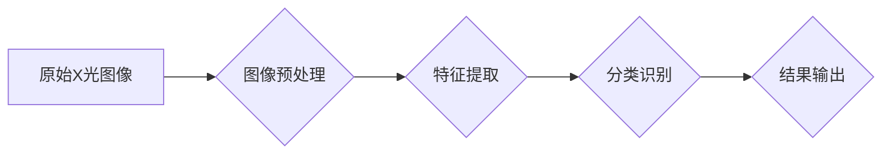

> X光安检, 物品识别, 深度学习, 计算机视觉, 算法原理, 项目实践, 应用场景

## 1. 背景介绍

随着全球化进程的加速和安全意识的增强，安检工作的重要性日益凸显。传统的安检方式，例如人工检查和金属探测器，存在效率低、漏检率高、对人体安全隐患等问题。X光安检技术作为一种先进的安检手段，凭借其无损、高效率、高准确率等特点，在机场、车站、海关等场所得到了广泛应用。

X光安检物品识别算法是X光安检技术的核心，其目的是通过对X光图像进行分析和处理，识别出潜在的危险物品，例如武器、爆炸物、毒品等。随着计算机视觉和深度学习技术的快速发展，X光安检物品识别算法取得了显著的进步，能够识别出越来越多的物品类型，并提高了识别精度。

## 2. 核心概念与联系

**2.1  X光安检原理**

X光安检原理基于X射线穿透物体不同程度的特性。不同类型的物质对X射线的吸收能力不同，例如金属、骨骼和有机物对X射线的吸收能力强，而空气和塑料对X射线的吸收能力弱。通过对X射线穿透后的图像进行分析，可以识别出不同类型的物体。

**2.2  计算机视觉与深度学习**

计算机视觉是赋予计算机“看”的能力，它利用图像处理、模式识别等技术，使计算机能够理解和解释图像信息。深度学习是一种机器学习方法，它利用多层神经网络来学习复杂的特征，能够从大量数据中提取出有用的信息。

**2.3  X光安检物品识别算法架构**

X光安检物品识别算法通常包含以下几个步骤：

1. **图像预处理:** 对原始X光图像进行增强、去噪、分割等处理，提高图像质量。
2. **特征提取:** 从预处理后的图像中提取特征，例如颜色、纹理、形状等。
3. **分类识别:** 利用机器学习模型对提取的特征进行分类识别，判断图像中是否存在危险物品。
4. **结果输出:** 将识别结果以文本、图形等形式输出，并进行报警或其他操作。

**2.4  Mermaid 流程图**



## 3. 核心算法原理 & 具体操作步骤

### 3.1  算法原理概述

X光安检物品识别算法主要基于深度学习技术，利用卷积神经网络（CNN）来实现图像识别。CNN具有强大的特征提取能力，能够自动学习图像中的复杂特征，并将其映射到高维空间，从而实现对不同物品的识别。

### 3.2  算法步骤详解

1. **数据采集和预处理:** 收集大量X光图像数据，并进行标注，将图像中的物品进行分类。然后对图像进行预处理，例如调整图像大小、归一化像素值等。
2. **模型构建:** 使用深度学习框架，例如TensorFlow或PyTorch，构建CNN模型。模型结构通常包含多个卷积层、池化层和全连接层。
3. **模型训练:** 将预处理后的图像数据输入到模型中进行训练，利用反向传播算法调整模型参数，使模型能够准确识别不同类型的物品。
4. **模型评估:** 在训练完成后，使用测试数据集对模型进行评估，计算模型的识别精度、召回率、F1-score等指标。
5. **模型部署:** 将训练好的模型部署到实际应用场景中，例如安检设备中，用于识别X光图像中的物品。

### 3.3  算法优缺点

**优点:**

* **高识别精度:** 深度学习算法能够自动学习图像特征，识别精度高。
* **自动化程度高:** 算法自动化程度高，可以减少人工干预。
* **适应性强:** 可以识别多种类型的物品，并适应不同的X光图像质量。

**缺点:**

* **数据依赖性强:** 需要大量标注数据进行训练。
* **计算资源消耗大:** 训练深度学习模型需要大量的计算资源。
* **可解释性差:** 深度学习模型的决策过程难以解释。

### 3.4  算法应用领域

X光安检物品识别算法广泛应用于以下领域:

* **机场安检:** 识别手提行李、行李箱中的危险物品。
* **车站安检:** 识别乘客携带的物品，防止携带危险物品上车。
* **海关安检:** 识别货物中的违禁品和危险物品。
* **物流安检:** 识别包裹中的危险物品，保障物流安全。
* **食品安全:** 识别食品中的异物和污染物。

## 4. 数学模型和公式 & 详细讲解 & 举例说明

### 4.1  数学模型构建

X光安检物品识别算法通常使用卷积神经网络（CNN）作为数学模型。CNN由多个卷积层、池化层和全连接层组成。

**卷积层:** 使用卷积核对图像进行卷积运算，提取图像特征。卷积核是一个小的矩阵，通过滑动在图像上，提取图像局部特征。

**池化层:** 对卷积层的输出进行池化运算，例如最大池化或平均池化，降低图像维度，提高模型鲁棒性。

**全连接层:** 将池化层的输出连接到全连接层，进行分类识别。全连接层将图像特征映射到类别空间，输出每个类别的概率。

### 4.2  公式推导过程

**卷积运算公式:**

$$
y_{i,j} = \sum_{m=0}^{M-1} \sum_{n=0}^{N-1} x_{i+m,j+n} * w_{m,n}
$$

其中:

* $y_{i,j}$ 是卷积层的输出值。
* $x_{i+m,j+n}$ 是输入图像的像素值。
* $w_{m,n}$ 是卷积核的权值。
* $M$ 和 $N$ 是卷积核的大小。

**最大池化公式:**

$$
y_{i,j} = \max_{m=0}^{k-1} \max_{n=0}^{l-1} x_{i*s+m,j*s+n}
$$

其中:

* $y_{i,j}$ 是池化层的输出值。
* $x_{i*s+m,j*s+n}$ 是池化区域内的像素值。
* $s$ 是池化窗口的大小。
* $k$ 和 $l$ 是池化窗口的大小。

### 4.3  案例分析与讲解

假设我们使用CNN模型识别X光图像中的刀具。训练过程中，模型会学习到刀具的特征，例如形状、边缘、颜色等。当模型遇到新的X光图像时，它会将图像特征与训练过程中学习到的特征进行比较，并输出刀具存在的概率。

## 5. 项目实践：代码实例和详细解释说明

### 5.1  开发环境搭建

* 操作系统: Ubuntu 20.04
* Python 版本: 3.8
* 深度学习框架: TensorFlow 2.0
* 其他依赖库: OpenCV, NumPy, Matplotlib

### 5.2  源代码详细实现

```python
import tensorflow as tf
from tensorflow.keras.models import Sequential
from tensorflow.keras.layers import Conv2D, MaxPooling2D, Flatten, Dense

# 定义CNN模型
model = Sequential()
model.add(Conv2D(32, (3, 3), activation='relu', input_shape=(img_height, img_width, 3)))
model.add(MaxPooling2D((2, 2)))
model.add(Conv2D(64, (3, 3), activation='relu'))
model.add(MaxPooling2D((2, 2)))
model.add(Flatten())
model.add(Dense(10, activation='softmax'))

# 编译模型
model.compile(optimizer='adam',
              loss='categorical_crossentropy',
              metrics=['accuracy'])

# 训练模型
model.fit(train_images, train_labels, epochs=10)

# 评估模型
loss, accuracy = model.evaluate(test_images, test_labels)
print('Test loss:', loss)
print('Test accuracy:', accuracy)
```

### 5.3  代码解读与分析

* **模型定义:** 使用Sequential模型定义CNN模型，包含卷积层、池化层、扁平化层和全连接层。
* **卷积层:** 使用Conv2D层进行卷积运算，提取图像特征。
* **池化层:** 使用MaxPooling2D层进行池化运算，降低图像维度。
* **扁平化层:** 使用Flatten层将多维特征转换为一维向量。
* **全连接层:** 使用Dense层进行分类识别，输出每个类别的概率。
* **模型编译:** 使用adam优化器、categorical_crossentropy损失函数和accuracy指标编译模型。
* **模型训练:** 使用fit方法训练模型，输入训练数据和标签，设置训练轮数。
* **模型评估:** 使用evaluate方法评估模型，输入测试数据和标签，计算测试损失和准确率。

### 5.4  运行结果展示

训练完成后，可以将模型应用于实际场景，例如识别X光图像中的刀具。模型的识别结果可以以文本、图形等形式输出，并进行报警或其他操作。

## 6. 实际应用场景

### 6.1  机场安检

在机场安检中，X光安检物品识别算法可以识别手提行李、行李箱中的危险物品，例如刀具、枪支、炸弹等。通过识别这些危险物品，可以提高安检效率，保障乘客安全。

### 6.2  车站安检

在车站安检中，X光安检物品识别算法可以识别乘客携带的物品，例如背包、手提包、行李等。通过识别这些物品，可以防止乘客携带危险物品上车，保障乘客安全。

### 6.3  海关安检

在海关安检中，X光安检物品识别算法可以识别货物中的违禁品和危险物品，例如毒品、武器、爆炸物等。通过识别这些物品，可以加强海关监管，防止违禁品和危险物品流入国内。

### 6.4  未来应用展望

随着人工智能技术的不断发展，X光安检物品识别算法将有更广泛的应用场景。例如，可以应用于食品安全、医疗诊断、文物保护等领域。

## 7. 工具和资源推荐

### 7.1  学习资源推荐

* **书籍:**
    * 深度学习
    * 计算机视觉
* **在线课程:**
    * Coursera: 深度学习
    * Udacity: 计算机视觉
* **博客:**
    * TensorFlow Blog
    * PyTorch Blog

### 7.2  开发工具推荐

* **深度学习框架:** TensorFlow, PyTorch
* **图像处理库:** OpenCV
* **数值计算库:** NumPy
* **可视化库:** Matplotlib

### 7.3  相关论文推荐

* **YOLO: Real-Time Object Detection**
* **Faster R-CNN: Towards Real-Time Object Detection with Region Proposal Networks**
* **ResNet: Deep Residual Learning for Image Recognition**

## 8. 总结：未来发展趋势与挑战

### 8.1  研究成果总结

X光安检物品识别算法取得了显著的进步，能够识别出越来越多的物品类型，并提高了识别精度。

### 8.2  未来发展趋势

* **模型精度提升:** 研究更深、更复杂的CNN模型，提高识别精度。
* **实时性增强:** 优化模型结构和算法，提高识别速度，实现实时识别。
* **场景适应性强:** 研究能够适应不同X光图像质量和场景的算法。
* **解释性增强:** 研究能够解释模型决策过程的算法，提高算法可信度。

### 