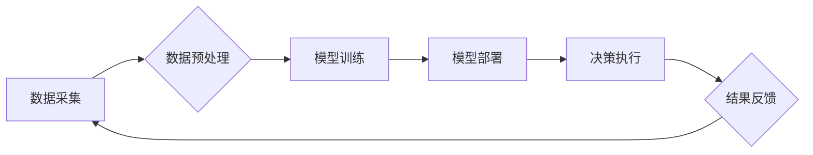

>  人工智能、先进制造业、数字孪生、机器学习、深度学习、预测维护、智能优化

## 1. 背景介绍

先进制造业，作为推动经济发展和社会进步的重要引擎，正在经历一场由数字化、智能化引领的深刻变革。人工智能（AI）作为新一代信息技术的重要组成部分，正在以其强大的学习、推理和决策能力，为先进制造业的转型升级注入强劲动力。

传统制造业面临着诸多挑战，例如生产效率低下、产品质量难以保证、成本控制困难等。而AI技术的应用，能够有效解决这些问题，提升制造业的整体竞争力。例如，AI驱动的机器视觉可以实现对产品缺陷的精准识别，AI驱动的预测维护可以提前预警设备故障，AI驱动的智能优化可以实现生产流程的智能化控制。

## 2. 核心概念与联系

**2.1 数字孪生**

数字孪生是基于物理实体构建的虚拟模型，它能够实时反映物理实体的状态、行为和运行情况。数字孪生技术将物理世界与数字世界相连接，为先进制造业提供了全新的数据感知和决策支持平台。

**2.2 AI在先进制造业中的应用**

AI技术在先进制造业中的应用场景广泛，主要包括：

* **智能制造：** 利用AI技术实现生产过程的自动化、智能化控制，提高生产效率和产品质量。
* **预测维护：** 通过对设备运行数据的分析，预测设备故障的发生时间和原因，实现提前预防和维护。
* **质量控制：** 利用AI技术实现对产品缺陷的精准识别，提高产品质量和一致性。
* **供应链管理：** 利用AI技术优化供应链流程，提高供应链效率和响应能力。
* **设计优化：** 利用AI技术辅助产品设计，优化产品结构和性能。

**2.3 AI技术架构**

AI技术在先进制造业中的应用，通常采用以下架构：



**数据采集:** 从传感器、设备、生产线等获取生产数据。

**数据预处理:** 对采集到的数据进行清洗、转换、特征提取等处理，使其能够被AI模型所使用。

**模型训练:** 利用机器学习、深度学习等算法，对预处理后的数据进行训练，构建AI模型。

**模型部署:** 将训练好的AI模型部署到生产环境中，用于实时决策和控制。

**决策执行:** AI模型根据实时数据进行决策，并执行相应的控制指令。

**结果反馈:** 决策执行的结果反馈到数据采集环节，用于模型的持续优化和改进。

## 3. 核心算法原理 & 具体操作步骤

**3.1 算法原理概述**

在先进制造业中，常用的AI算法包括：

* **机器学习:** 通过对数据进行学习，建立预测模型，实现对未知数据的预测和分类。
* **深度学习:** 基于多层神经网络，能够学习更复杂的特征，实现更精准的预测和识别。
* **强化学习:** 通过试错学习，实现智能决策和控制。

**3.2 算法步骤详解**

以机器学习为例，其基本步骤包括：

1. **数据收集:** 收集与目标任务相关的训练数据。
2. **数据预处理:** 对数据进行清洗、转换、特征提取等处理。
3. **模型选择:** 根据任务需求选择合适的机器学习算法。
4. **模型训练:** 利用训练数据对模型进行训练，调整模型参数。
5. **模型评估:** 利用测试数据评估模型的性能，并进行模型调优。
6. **模型部署:** 将训练好的模型部署到生产环境中，用于实际应用。

**3.3 算法优缺点**

不同的AI算法具有不同的优缺点，需要根据具体应用场景进行选择。

* **机器学习:** 优点是易于实现，性能较好；缺点是需要大量的训练数据，对数据质量要求较高。
* **深度学习:** 优点是能够学习更复杂的特征，性能更优；缺点是训练时间长，对硬件资源要求高。
* **强化学习:** 优点是能够实现智能决策和控制；缺点是训练难度大，需要大量的试错学习。

**3.4 算法应用领域**

AI算法在先进制造业的应用领域广泛，例如：

* **智能制造:** 利用机器学习算法实现生产过程的自动化、智能化控制。
* **预测维护:** 利用机器学习算法预测设备故障的发生时间和原因。
* **质量控制:** 利用机器学习算法实现对产品缺陷的精准识别。
* **供应链管理:** 利用机器学习算法优化供应链流程。

## 4. 数学模型和公式 & 详细讲解 & 举例说明

**4.1 数学模型构建**

在AI算法的训练过程中，需要构建数学模型来描述数据之间的关系。常用的数学模型包括线性回归模型、逻辑回归模型、支持向量机模型等。

**4.2 公式推导过程**

例如，线性回归模型的目标是找到一条直线，能够最佳地拟合数据点。其数学公式如下：

$$y = wx + b$$

其中，$y$ 是预测值，$x$ 是输入特征，$w$ 是权重系数，$b$ 是偏置项。

通过最小化预测值与真实值的误差，可以求解出最佳的权重系数和偏置项。

**4.3 案例分析与讲解**

假设我们有一组数据，描述了房屋面积和房屋价格之间的关系。我们可以使用线性回归模型来预测房屋价格。

通过训练模型，我们可以得到最佳的权重系数和偏置项，例如：

$$w = 5000$$

$$b = 100000$$

因此，我们可以使用以下公式来预测房屋价格：

$$价格 = 5000 * 面积 + 100000$$

例如，如果房屋面积为100平方米，则其预测价格为：

$$价格 = 5000 * 100 + 100000 = 150000$$

## 5. 项目实践：代码实例和详细解释说明

**5.1 开发环境搭建**

为了实现AI算法的应用，需要搭建相应的开发环境。常用的开发环境包括：

* **Python:** Python是一种开源的编程语言，拥有丰富的AI库和工具，例如TensorFlow、PyTorch、Scikit-learn等。
* **Jupyter Notebook:** Jupyter Notebook是一种交互式编程环境，方便进行代码编写、调试和可视化。
* **云计算平台:** 云计算平台，例如AWS、Azure、GCP等，提供强大的计算资源和AI服务，可以简化开发流程。

**5.2 源代码详细实现**

以下是一个使用Python和Scikit-learn库实现线性回归模型的代码示例：

```python
from sklearn.linear_model import LinearRegression
from sklearn.model_selection import train_test_split
import numpy as np

# 生成示例数据
X = np.array([[1], [2], [3], [4], [5]])
y = np.array([2, 4, 5, 4, 5])

# 将数据划分为训练集和测试集
X_train, X_test, y_train, y_test = train_test_split(X, y, test_size=0.2)

# 创建线性回归模型
model = LinearRegression()

# 训练模型
model.fit(X_train, y_train)

# 预测测试集数据
y_pred = model.predict(X_test)

# 计算模型性能
from sklearn.metrics import mean_squared_error
mse = mean_squared_error(y_test, y_pred)
print(f"Mean Squared Error: {mse}")
```

**5.3 代码解读与分析**

这段代码首先导入必要的库，然后生成示例数据。接着，将数据划分为训练集和测试集，并创建线性回归模型。

然后，使用训练集训练模型，并使用测试集预测结果。最后，计算模型性能，例如均方误差。

**5.4 运行结果展示**

运行这段代码，可以得到模型的性能指标，例如均方误差。

## 6. 实际应用场景

**6.1 智能制造**

AI技术可以应用于智能制造，实现生产过程的自动化、智能化控制。例如，利用机器视觉技术实现对产品缺陷的精准识别，利用预测维护技术提前预警设备故障，利用智能优化技术优化生产流程。

**6.2 预测维护**

预测维护是指利用数据分析技术，预测设备故障的发生时间和原因，并提前进行维护。AI技术可以帮助企业实现更精准的预测维护，降低设备故障率，提高设备利用率。

**6.3 质量控制**

质量控制是指对产品进行检验和测试，确保产品质量符合标准。AI技术可以帮助企业实现更精准的质量控制，例如利用机器视觉技术对产品缺陷进行识别，利用机器学习技术对产品质量进行预测。

**6.4 未来应用展望**

随着AI技术的不断发展，其在先进制造业的应用场景将更加广泛。例如，AI技术可以应用于个性化定制、柔性制造、协作机器人等领域。

## 7. 工具和资源推荐

**7.1 学习资源推荐**

* **在线课程:** Coursera、edX、Udacity等平台提供丰富的AI课程。
* **书籍:** 《深度学习》、《机器学习实战》等书籍是学习AI技术的经典教材。
* **开源社区:** TensorFlow、PyTorch等开源社区提供丰富的学习资源和技术支持。

**7.2 开发工具推荐**

* **Python:** Python是一种开源的编程语言，拥有丰富的AI库和工具。
* **Jupyter Notebook:** Jupyter Notebook是一种交互式编程环境，方便进行代码编写、调试和可视化。
* **云计算平台:** AWS、Azure、GCP等云计算平台提供强大的计算资源和AI服务。

**7.3 相关论文推荐**

* **《ImageNet Classification with Deep Convolutional Neural Networks》**
* **《Attention Is All You Need》**
* **《Generative Adversarial Networks》**

## 8. 总结：未来发展趋势与挑战

**8.1 研究成果总结**

AI技术在先进制造业的应用取得了显著成果，例如智能制造、预测维护、质量控制等领域取得了突破性进展。

**8.2 未来发展趋势**

未来，AI技术在先进制造业的应用将更加广泛和深入，例如：

* **更智能的制造系统:** AI技术将赋予制造系统更强的智能化能力，实现更精准的控制和优化。
* **更个性化的产品定制:** AI技术将帮助企业实现更个性化的产品定制，满足客户多样化的需求。
* **更安全的生产环境:** AI技术将帮助企业提高生产安全，降低生产事故风险。

**8.3 面临的挑战**

AI技术在先进制造业的应用也面临着一些挑战，例如：

* **数据质量问题:** AI算法对数据质量要求较高，数据质量问题会影响模型的性能。
* **算法解释性问题:** 一些AI算法的决策过程难以解释，这可能会导致企业难以信任AI系统。
* **人才短缺问题:** AI技术人才短缺，这可能会制约AI技术的应用推广。

**8.4 研究展望**

未来，需要加强对AI算法的解释性研究，提高AI算法的鲁棒性和安全性，培养更多AI技术人才，推动AI技术在先进制造业的健康发展。

## 9. 附录：常见问题与解答

**9.1 如何选择合适的AI算法？**

选择合适的AI算法需要根据具体应用场景和数据特点进行选择。例如，对于分类问题，可以使用逻辑回归、支持向量机等算法；对于回归问题，可以使用线性回归、决策树等算法。

**9.2 如何解决数据质量问题？**

数据质量问题是AI算法应用中的常见问题，需要采取以下措施解决：

* 数据清洗：去除数据中的噪声、缺失值等异常数据。
* 数据转换：将数据转换为