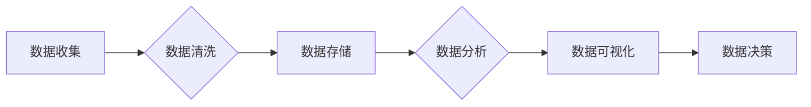

> 人工智能，数据管理，数据治理，数据安全，数据隐私，数据可视化，数据分析

## 1. 背景介绍

人工智能（AI）正以惊人的速度发展，并深刻地改变着各行各业。从医疗保健到金融，从制造业到零售，AI 正在推动创新，提高效率，创造新的商业模式。然而，AI 的成功离不开高质量的数据。数据是 AI 算法的燃料，是训练模型、发现模式和做出预测的基础。

对于 AI 初创企业来说，数据管理至关重要。拥有大量数据并不意味着成功，关键在于如何有效地收集、存储、处理和分析数据。良好的数据管理实践可以帮助 AI 初创企业：

* **提高模型准确性:** 高质量的数据可以训练出更准确、更可靠的 AI 模型。
* **降低开发成本:**  有效的数据管理可以减少数据清理和预处理的时间，从而降低开发成本。
* **加速时间到市场:**  快速访问和分析数据可以帮助 AI 初创企业更快地开发和部署新产品和服务。
* **增强竞争优势:**  数据驱动的决策和洞察可以帮助 AI 初创企业更好地了解市场趋势，并做出更明智的商业决策。

## 2. 核心概念与联系

数据管理在 AI 初创企业中是一个复杂的过程，涉及多个核心概念和技术。

**2.1 数据治理**

数据治理是指建立和维护数据质量、一致性和安全性的框架和流程。它涵盖了数据定义、数据标准、数据安全和数据隐私等方面。

**2.2 数据安全**

数据安全是指保护数据免受未经授权的访问、使用、披露或破坏。它涉及到数据加密、访问控制、身份验证和审计等技术。

**2.3 数据隐私**

数据隐私是指保护个人数据的机密性和完整性。它涉及到数据匿名化、数据脱敏和数据安全合规等方面。

**2.4 数据可视化**

数据可视化是指将数据以图形、图表等形式呈现出来，以便于理解和分析。它可以帮助 AI 初创企业发现数据中的模式和趋势，并更好地理解业务问题。

**2.5 数据分析**

数据分析是指使用统计方法和机器学习算法对数据进行分析，以提取有价值的洞察和知识。它可以帮助 AI 初创企业做出数据驱动的决策，并优化业务流程。

**2.6 数据仓库和数据湖**

数据仓库和数据湖是用于存储和管理数据的集中式系统。数据仓库通常用于结构化数据，而数据湖则用于存储各种类型的数据，包括结构化、半结构化和非结构化数据。

**2.7 数据管道**

数据管道是指将数据从源系统传输到目标系统的自动化流程。它可以帮助 AI 初创企业收集、清洗和转换数据，并将其传输到数据仓库或数据湖中。

**2.8 数据质量管理**

数据质量管理是指确保数据准确、完整、一致和及时。它涉及到数据验证、数据清洗和数据标准化等过程。

**2.9 数据生命周期管理**

数据生命周期管理是指从数据创建到数据销毁的整个过程。它涵盖了数据收集、数据存储、数据使用、数据备份和数据销毁等方面。

**2.10 数据伦理**

数据伦理是指在收集、使用和共享数据时遵循道德原则和社会规范。它涉及到数据隐私、数据公平性和数据透明度等方面。

**Mermaid 流程图**



## 3. 核心算法原理 & 具体操作步骤

### 3.1  算法原理概述

在 AI 数据管理中，许多算法被用于数据清洗、数据转换、数据分析和数据可视化等任务。一些常用的算法包括：

* **K-Means 聚类算法:** 用于将数据点分组到不同的簇中。
* **决策树算法:** 用于构建决策规则，用于分类或回归任务。
* **支持向量机 (SVM) 算法:** 用于分类任务，通过找到数据点之间的最佳分离超平面。
* **随机森林算法:**  通过构建多个决策树并进行投票，提高分类或回归的准确性。
* **线性回归算法:** 用于预测连续变量的值。
* **逻辑回归算法:** 用于预测分类变量的值。

### 3.2  算法步骤详解

以 K-Means 聚类算法为例，详细说明其步骤：

1. **初始化:** 随机选择 K 个数据点作为初始聚类中心。
2. **分配:** 将每个数据点分配到距离其最近的聚类中心所属的簇中。
3. **更新:** 计算每个簇的中心点，并将其作为新的聚类中心。
4. **重复:** 重复步骤 2 和 3，直到聚类中心不再发生变化，或者达到预设的迭代次数。

### 3.3  算法优缺点

**K-Means 聚类算法的优点:**

* 简单易懂，易于实现。
* 能够处理高维数据。
* 运行速度较快。

**K-Means 聚类算法的缺点:**

* 需要预先指定聚类数 K。
* 对初始聚类中心的选择敏感。
* 难以处理非球形数据簇。

### 3.4  算法应用领域

K-Means 聚类算法广泛应用于以下领域:

* **客户细分:** 将客户根据他们的购买行为、人口统计特征等进行分组。
* **图像压缩:** 将图像分割成不同的区域，并使用较少的颜色来表示每个区域。
* **异常检测:** 将异常数据点从正常数据点中分离出来。

## 4. 数学模型和公式 & 详细讲解 & 举例说明

### 4.1  数学模型构建

在数据分析中，数学模型可以用来描述数据之间的关系，并进行预测。例如，线性回归模型可以用来预测连续变量的值，其数学模型如下：

$$y = mx + c$$

其中：

* $y$ 是预测变量的值。
* $x$ 是自变量的值。
* $m$ 是回归系数，表示自变量对因变量的影响程度。
* $c$ 是截距，表示当自变量为 0 时，因变量的值。

### 4.2  公式推导过程

线性回归模型的回归系数 $m$ 和截距 $c$ 可以通过最小二乘法来计算。最小二乘法是指寻找一条直线，使得直线到所有数据点的距离之和最小。

### 4.3  案例分析与讲解

假设我们有一组数据，记录了学生学习时间 $x$ 和考试成绩 $y$ 的关系。我们可以使用线性回归模型来预测学生的考试成绩。

**数据:**

| 学习时间 (小时) | 考试成绩 |
|---|---|
| 2 | 60 |
| 4 | 70 |
| 6 | 80 |
| 8 | 90 |

**线性回归模型:**

$$y = mx + c$$

**计算回归系数 $m$ 和截距 $c$:**

使用最小二乘法，我们可以计算出 $m = 5$ 和 $c = 50$。

**预测模型:**

$$y = 5x + 50$$

**预测:**

如果一个学生学习了 10 小时，我们可以使用模型预测他的考试成绩:

$$y = 5 * 10 + 50 = 100$$

## 5. 项目实践：代码实例和详细解释说明

### 5.1  开发环境搭建

* **操作系统:** Ubuntu 20.04 LTS
* **编程语言:** Python 3.8
* **库:** pandas, scikit-learn, matplotlib

### 5.2  源代码详细实现

```python
import pandas as pd
from sklearn.cluster import KMeans
import matplotlib.pyplot as plt

# 加载数据
data = pd.read_csv('data.csv')

# 选择特征变量
X = data[['feature1', 'feature2']]

# 创建 KMeans 模型
kmeans = KMeans(n_clusters=3, random_state=0)

# 训练模型
kmeans.fit(X)

# 获取聚类标签
labels = kmeans.labels_

# 将聚类标签添加到数据中
data['cluster'] = labels

# 可视化聚类结果
plt.scatter(X['feature1'], X['feature2'], c=data['cluster'], cmap='viridis')
plt.title('K-Means 聚类结果')
plt.xlabel('Feature 1')
plt.ylabel('Feature 2')
plt.show()
```

### 5.3  代码解读与分析

* **数据加载:** 使用 pandas 库加载数据文件。
* **特征选择:** 选择用于聚类的特征变量。
* **模型创建:** 创建 KMeans 模型，指定聚类数为 3。
* **模型训练:** 使用 `fit()` 方法训练模型。
* **聚类标签获取:** 使用 `labels_` 属性获取每个数据点的聚类标签。
* **数据增强:** 将聚类标签添加到数据中，方便后续分析。
* **可视化结果:** 使用 matplotlib 库绘制散点图，根据聚类标签对数据点进行颜色区分。

### 5.4  运行结果展示

运行代码后，将生成一个散点图，将数据点根据聚类结果进行分组。每个簇的颜色不同，可以直观地观察到数据点的聚类结构。

## 6. 实际应用场景

### 6.1  客户关系管理 (CRM)

AI 数据管理可以帮助 CRM 系统更好地理解客户行为，并提供个性化的服务。例如，可以根据客户的购买历史、浏览记录和互动行为，将客户进行细分，并针对不同的客户群提供不同的营销策略。

### 6.2  精准营销

AI 数据管理可以帮助企业进行精准营销，将广告投放给最有可能感兴趣的目标客户。例如，可以根据客户的兴趣爱好、地理位置和购买行为，预测他们对特定产品的兴趣，并针对这些客户进行个性化的广告投放。

### 6.3  欺诈检测

AI 数据管理可以帮助金融机构检测欺诈行为。例如，可以分析客户的交易记录，识别异常交易行为，并进行预警。

### 6.4  未来应用展望

随着 AI 技术的不断发展，数据管理在 AI 应用中的作用将更加重要。未来，我们可能会看到以下趋势:

* **更智能的数据管理系统:**  AI 系统将能够自动识别数据质量问题，并进行自动修复。
* **更个性化的数据分析:**  AI 系统将能够根据用户的需求，提供更个性化的数据分析结果。
* **更安全的的数据管理:**  AI 系统将能够更好地保护数据安全，防止数据泄露和滥用。

## 7. 工具和资源推荐

### 7.1  学习资源推荐

* **书籍:**
    * 《数据科学实战》
    * 《机器学习》
    * 《Python数据科学手册》
* **在线课程:**
    * Coursera: 数据科学专业
    * edX: 机器学习专业
    * Udacity: 数据科学纳米学位

### 7.2  开发工具推荐

* **数据分析工具:**
    * pandas
    * NumPy
    * SciPy
* **机器学习库:**
    * scikit-learn
    * TensorFlow
    * PyTorch
* **可视化工具:**
    * matplotlib
    * seaborn
    * Plotly

### 7.3  相关论文推荐

* **K-Means 聚类算法:**
    * MacQueen, J. (1967). Some methods for classification and analysis of multivariate observations.
* **线性回归模型:**
    * Ordinary Least Squares (OLS) Regression: https://en.wikipedia.org/wiki/Ordinary_least_squares

## 8. 总结：未来发展趋势与挑战

### 8.1  研究成果总结

AI 数据管理是一个快速发展的领域，已经取得了许多重要的成果。例如，K-Means 聚类算法和线性回归模型等算法已经广泛应用于各种领域。

### 8.2  未来发展趋势

未来，AI 数据管理将朝着以下方向发展:

*