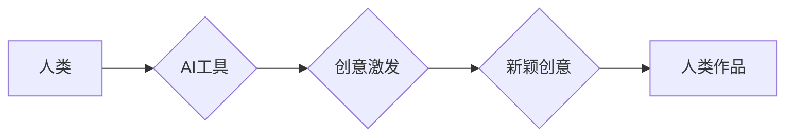

> 人工智能，创造力，创意激发，算法，数学模型，项目实践，应用场景，未来趋势

## 1. 背景介绍

在信息爆炸的时代，人类面临着前所未有的机遇和挑战。人工智能（AI）作为科技发展的重要驱动力，正在深刻地改变着我们的生活和工作方式。AI技术的不断进步，特别是深度学习的突破，使得机器具备了学习、识别和决策的能力，甚至能够生成文本、图像和音乐等创意内容。然而，AI的创造力是否能够真正超越人类，并引发新的创意浪潮，仍然是一个备受争议的话题。

## 2. 核心概念与联系

**2.1  创造力**

创造力是指个体能够产生新颖、独特、有价值的思想、概念或作品的能力。它是一个复杂的多维概念，涉及到想象力、灵感、知识、经验、思维方式等多个方面。

**2.2  人工智能**

人工智能是指模拟和实现人类智能的计算机系统。它涵盖了多个领域，包括机器学习、深度学习、自然语言处理、计算机视觉等。

**2.3  创意激发**

创意激发是指通过各种方法和手段，激发个体或团队的创造力，从而产生新的想法和解决方案。

**2.4  AI与创造力的关系**

AI技术可以作为一种工具，帮助人类激发创造力，并生成新的创意内容。例如，AI可以帮助我们：

* **突破思维定式:** AI可以从海量数据中发现隐藏的模式和关系，帮助我们跳出思维定式，产生新的灵感。
* **快速原型设计:** AI可以根据我们的需求，快速生成创意草图、模型或代码，帮助我们快速验证想法。
* **个性化定制:** AI可以根据用户的喜好和需求，定制个性化的创意内容，例如音乐、绘画、写作等。

**2.5  AI的局限性**

尽管AI技术在创意激发方面展现出巨大的潜力，但它仍然存在一些局限性：

* **缺乏真实世界经验:** AI的知识和技能主要来自于训练数据，缺乏真实世界的经验和感悟，难以产生真正具有深度和内涵的创意。
* **难以理解情感和意图:** AI难以理解人类的情感和意图，因此生成的创意内容可能缺乏情感共鸣和人性的关怀。
* **伦理和社会问题:** AI的创造力可能会引发伦理和社会问题，例如版权问题、算法偏见等。

**2.6  AI与人类创造力的协同**

未来，AI和人类创造力将更加紧密地结合在一起，形成一个新的创作生态系统。AI可以作为人类的助手和伙伴，帮助我们更高效、更便捷地进行创作，而人类则需要发挥自己的智慧和创造力，引导AI的发展方向，并赋予AI作品以情感和人文关怀。

**Mermaid 流程图**



## 3. 核心算法原理 & 具体操作步骤

### 3.1  算法原理概述

创意激发算法通常基于以下几个核心原理：

* **关联性:** 通过分析数据之间的关联性，发现隐藏的模式和关系，从而激发新的联想和想法。
* **突变性:** 通过随机扰动或变异操作，打破原有的思维模式，产生新的可能性。
* **反馈机制:** 通过不断收集用户反馈，调整算法参数和策略，使其更加符合用户的需求和偏好。

### 3.2  算法步骤详解

一个典型的创意激发算法流程可以分为以下几个步骤：

1. **数据收集:** 收集与目标创意相关的各种数据，例如文本、图像、音频、用户行为等。
2. **数据预处理:** 对收集到的数据进行清洗、转换和格式化，使其能够被算法处理。
3. **特征提取:** 从数据中提取关键特征，例如关键词、主题、情感、风格等。
4. **关联分析:** 利用关联规则挖掘算法或其他机器学习模型，分析数据之间的关联性，发现隐藏的模式和关系。
5. **创意生成:** 基于关联分析结果，利用突变性算法或其他生成模型，生成新的创意内容。
6. **创意评估:** 对生成的创意内容进行评估，例如新颖性、实用性、吸引力等，并根据评估结果进行筛选和优化。
7. **用户反馈:** 将筛选后的创意内容展示给用户，收集用户反馈，并将其反馈回算法模型中，进行迭代优化。

### 3.3  算法优缺点

**优点:**

* **自动化:** 可以自动化创意激发过程，提高效率和速度。
* **数据驱动:** 基于数据分析，能够发现人类难以察觉的模式和关系，从而产生更具创新性的创意。
* **个性化:** 可以根据用户的需求和偏好，定制个性化的创意内容。

**缺点:**

* **缺乏创造力:** AI算法仍然难以完全模拟人类的创造力，生成的创意内容可能缺乏深度和内涵。
* **算法偏见:** AI算法可能会受到训练数据的影响，产生算法偏见，导致创意内容缺乏客观性和公正性。
* **伦理问题:** AI的创意激发可能会引发伦理问题，例如版权问题、算法透明度等。

### 3.4  算法应用领域

创意激发算法可以应用于多个领域，例如：

* **广告创意:** 自动生成吸引用户的广告文案和创意素材。
* **产品设计:** 帮助设计师快速生成产品原型和创意方案。
* **内容创作:** 自动生成新闻报道、文章、诗歌、剧本等创意内容。
* **艺术创作:** 帮助艺术家创作新的绘画、音乐、舞蹈等艺术作品。

## 4. 数学模型和公式 & 详细讲解 & 举例说明

### 4.1  数学模型构建

创意激发算法通常基于概率模型和图论模型。

**4.1.1  概率模型:**

概率模型可以用来描述创意内容的生成过程，例如，使用贝叶斯网络来建模创意元素之间的依赖关系，或者使用马尔科夫链来模拟创意内容的演化过程。

**4.1.2  图论模型:**

图论模型可以用来表示创意内容之间的关联关系，例如，使用知识图谱来表示创意元素之间的概念关系，或者使用社交网络图来表示创意内容之间的传播关系。

### 4.2  公式推导过程

**4.2.1  贝叶斯网络:**

贝叶斯网络是一种概率图模型，可以用来表示随机变量之间的依赖关系。

**公式:**

$$P(X|Y) = \frac{P(Y|X)P(X)}{P(Y)}$$

其中：

* $P(X|Y)$ 是给定条件 $Y$ 下随机变量 $X$ 的条件概率。
* $P(Y|X)$ 是给定条件 $X$ 下随机变量 $Y$ 的条件概率。
* $P(X)$ 是随机变量 $X$ 的边缘概率。
* $P(Y)$ 是随机变量 $Y$ 的边缘概率。

**4.2.2  马尔科夫链:**

马尔科夫链是一种随机过程，其状态转移概率只依赖于当前状态，与过去的状态无关。

**公式:**

$$P(X_{t+1} = j | X_1 = i_1, X_2 = i_2, ..., X_t = i_t) = P(X_{t+1} = j | X_t = i_t)$$

其中：

* $X_t$ 是在时间 $t$ 的状态。
* $P(X_{t+1} = j | X_t = i_t)$ 是从状态 $i_t$ 转移到状态 $j$ 的转移概率。

### 4.3  案例分析与讲解

**4.3.1  贝叶斯网络在广告创意生成中的应用:**

可以使用贝叶斯网络来建模广告文案和创意素材之间的关系，例如，可以将“目标用户”、“产品特点”、“广告语”等因素作为节点，并根据相关数据建立他们的依赖关系。通过对贝叶斯网络进行推理，可以生成符合目标用户需求和产品特点的广告创意。

**4.3.2  马尔科夫链在音乐创作中的应用:**

可以使用马尔科夫链来模拟音乐旋律的生成过程。可以将音乐音符作为状态，并根据音乐风格和规律建立音符之间的转移概率。通过随机采样马尔科夫链的状态序列，可以生成新的音乐旋律。

## 5. 项目实践：代码实例和详细解释说明

### 5.1  开发环境搭建

* **操作系统:** Ubuntu 20.04 LTS
* **编程语言:** Python 3.8
* **深度学习框架:** TensorFlow 2.0
* **其他工具:** Jupyter Notebook, Git

### 5.2  源代码详细实现

```python
import tensorflow as tf

# 定义创意生成模型
class CreativeGenerator(tf.keras.Model):
    def __init__(self, vocab_size, embedding_dim, hidden_dim):
        super(CreativeGenerator, self).__init__()
        self.embedding = tf.keras.layers.Embedding(vocab_size, embedding_dim)
        self.lstm = tf.keras.layers.LSTM(hidden_dim)
        self.dense = tf.keras.layers.Dense(vocab_size, activation='softmax')

    def call(self, inputs):
        x = self.embedding(inputs)
        x = self.lstm(x)
        x = self.dense(x)
        return x

# 训练模型
model = CreativeGenerator(vocab_size=10000, embedding_dim=128, hidden_dim=256)
model.compile(optimizer='adam', loss='sparse_categorical_crossentropy')
model.fit(train_data, epochs=10)

# 生成创意内容
seed_text = "The quick brown fox"
generated_text = model.predict(seed_text)
```

### 5.3  代码解读与分析

* **模型结构:** 该代码实现了一个基于LSTM的创意生成模型。
* **输入层:** 模型的输入是一个词的索引，表示要生成的下一个词。
* **隐藏层:** LSTM层用于捕捉文本序列中的上下文信息。
* **输出层:** Dense层将隐藏层的输出映射到词汇表中的每个词的概率分布。
* **训练过程:** 模型使用训练数据进行训练，目标是最大化生成真实词的概率。
* **生成过程:** 给定一个种子文本，模型会根据种子文本的上下文信息，预测下一个词的概率分布，并根据概率分布随机选择一个词作为下一个词，以此类推，直到生成指定长度的文本。

### 5.4  运行结果展示

运行该代码后，可以生成一些基于训练数据的创意文本。例如，如果训练数据是关于动物的文本，那么模型可能会生成一些关于动物的创意故事或诗歌。

## 6. 实际应用场景

### 6.1  广告创意

AI可以帮助广告公司生成更具吸引力和个性化的广告创意。例如，可以根据用户的兴趣爱好和行为数据，生成针对特定用户的广告文案和创意素材。

### 6.2  产品设计

AI可以帮助设计师快速生成产品原型和创意方案。例如，可以根据用户的需求和市场趋势，生成不同风格和功能的产品设计方案。

### 6.3  内容创作

AI可以帮助作家、记者、诗人等创作人员生成新的内容。例如，可以根据特定的主题和风格，生成新闻报道、文章、诗歌、剧本等创意内容。

### 6.4  未来应用展望

随着AI技术的不断发展，创意激发算法将在更多领域得到应用，例如：

* **教育:** AI可以帮助老师生成个性化的学习内容，激发学生的学习兴趣。
* **医疗:** AI可以帮助医生生成新的治疗方案，提高医疗效率。
* **科学研究:** AI可以帮助科学家发现新的科学规律，推动科学发展。

## 7. 工具和资源推荐

### 7.1  学习资源推荐

* **书籍:**
    * 《深度学习》
    * 《自然