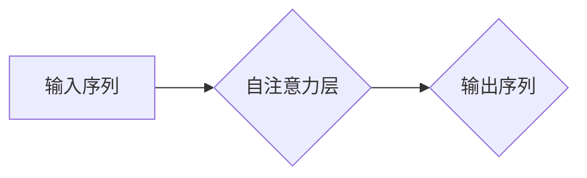

> GPT, Transformer, 自然语言处理, 深度学习, 大语言模型, 训练数据, 参数规模, 性能提升

## 1. 背景介绍

自 2018 年 OpenAI 发布了基于 Transformer 架构的 GPT (Generative Pre-trained Transformer) 模型以来，大语言模型 (LLM) 领域迎来了前所未有的发展热潮。GPT 系列模型凭借其强大的文本生成能力和广泛的应用场景，迅速成为人工智能领域最受关注的明星技术之一。从 GPT-1 到 GPT-3.5，OpenAI 不断迭代升级，不断突破模型规模和性能极限，也为自然语言处理 (NLP) 领域带来了前所未有的机遇和挑战。

## 2. 核心概念与联系

### 2.1 Transformer 架构

Transformer 架构是 GPT 模型的核心，它彻底改变了 NLP 模型的设计思路，并为大规模模型的训练提供了基础。与传统的 RNN (循环神经网络) 模型相比，Transformer 具有以下优势：

* **并行计算能力:** Transformer 可以并行处理输入序列中的所有元素，大大提高了训练速度。
* **长距离依赖关系:** Transformer 通过自注意力机制 (Self-Attention) 可以有效捕捉长距离依赖关系，解决 RNN 模型在处理长文本时容易出现的梯度消失问题。

### 2.2 自注意力机制

自注意力机制是 Transformer 架构的关键创新，它允许模型关注输入序列中不同位置的词语之间的关系，从而更好地理解上下文信息。

**Mermaid 流程图:**



### 2.3 预训练与微调

GPT 模型采用预训练与微调的训练策略。首先，在海量文本数据上进行预训练，学习语言的通用知识和模式。然后，将预训练模型微调到特定任务，例如文本生成、机器翻译、问答系统等。

## 3. 核心算法原理 & 具体操作步骤

### 3.1 算法原理概述

GPT 模型的核心算法是基于 Transformer 架构的解码器网络。解码器网络接收输入序列，并通过多层 Transformer 块进行处理，最终生成输出序列。

### 3.2 算法步骤详解

1. **输入处理:** 将输入文本序列转换为词向量表示。
2. **编码器处理:** 将词向量输入到 Transformer 的编码器网络中，编码器网络通过多层 Transformer 块进行处理，生成上下文表示。
3. **解码器处理:** 将上下文表示输入到 Transformer 的解码器网络中，解码器网络通过多层 Transformer 块进行处理，并生成输出序列。
4. **输出生成:** 将输出序列中的词向量转换为文本。

### 3.3 算法优缺点

**优点:**

* 强大的文本生成能力
* 能够捕捉长距离依赖关系
* 训练效率高

**缺点:**

* 模型规模庞大，训练成本高
* 容易受到训练数据偏差的影响
* 生成文本可能存在逻辑错误或偏见

### 3.4 算法应用领域

* 文本生成: 故事创作、诗歌创作、代码生成
* 机器翻译: 将一种语言翻译成另一种语言
* 问答系统: 回答用户提出的问题
* 对话系统: 与用户进行自然语言对话

## 4. 数学模型和公式 & 详细讲解 & 举例说明

### 4.1 数学模型构建

GPT 模型的核心数学模型是基于 Transformer 架构的解码器网络。解码器网络由多层 Transformer 块组成，每个 Transformer 块包含以下组件:

* **多头自注意力层:** 用于捕捉输入序列中不同位置的词语之间的关系。
* **前馈神经网络:** 用于对每个词语的上下文表示进行非线性变换。
* **残差连接:** 用于缓解梯度消失问题。

### 4.2 公式推导过程

自注意力机制的核心公式是计算每个词语与其他词语之间的注意力权重。注意力权重表示每个词语对其他词语的影响程度。

**注意力权重计算公式:**

$$
\text{Attention}(Q, K, V) = \text{softmax}\left(\frac{Q K^T}{\sqrt{d_k}}\right) V
$$

其中:

* $Q$ 是查询矩阵
* $K$ 是键矩阵
* $V$ 是值矩阵
* $d_k$ 是键向量的维度
* $\text{softmax}$ 是归一化函数

### 4.3 案例分析与讲解

假设我们有一个句子 "The cat sat on the mat"，我们想要计算 "sat" 这个词语与其他词语之间的注意力权重。

1. 将每个词语转换为词向量表示。
2. 计算查询矩阵 $Q$、键矩阵 $K$ 和值矩阵 $V$。
3. 使用注意力权重计算公式计算每个词语与 "sat" 的注意力权重。
4. 将注意力权重进行归一化，得到每个词语对 "sat" 的影响程度。

## 5. 项目实践：代码实例和详细解释说明

### 5.1 开发环境搭建

* Python 3.7+
* PyTorch 1.7+
* CUDA 10.2+

### 5.2 源代码详细实现

```python
import torch
import torch.nn as nn

class TransformerBlock(nn.Module):
    def __init__(self, d_model, nhead, dim_feedforward=2048, dropout=0.1):
        super(TransformerBlock, self).__init__()
        self.self_attn = nn.MultiheadAttention(d_model, nhead, dropout=dropout)
        self.linear1 = nn.Linear(d_model, dim_feedforward)
        self.dropout = nn.Dropout(dropout)
        self.linear2 = nn.Linear(dim_feedforward, d_model)

    def forward(self, x):
        # Self-attention
        attn_output, _ = self.self_attn(x, x, x)
        attn_output = self.dropout(attn_output)
        # Feed-forward network
        ffn_output = self.linear2(self.dropout(torch.relu(self.linear1(attn_output))))
        # Residual connection
        return x + ffn_output

# GPT Decoder
class GPTDecoder(nn.Module):
    def __init__(self, vocab_size, d_model, nhead, num_layers, dim_feedforward, dropout=0.1):
        super(GPTDecoder, self).__init__()
        self.embedding = nn.Embedding(vocab_size, d_model)
        self.transformer_blocks = nn.ModuleList([TransformerBlock(d_model, nhead, dim_feedforward, dropout) for _ in range(num_layers)])
        self.linear = nn.Linear(d_model, vocab_size)

    def forward(self, x):
        # Embedding
        x = self.embedding(x)
        # Transformer blocks
        for block in self.transformer_blocks:
            x = block(x)
        # Linear layer
        x = self.linear(x)
        return x
```

### 5.3 代码解读与分析

* `TransformerBlock` 类定义了 Transformer 块的结构，包含自注意力层、前馈神经网络和残差连接。
* `GPTDecoder` 类定义了 GPT 解码器的结构，包含嵌入层、Transformer 块和线性层。
* 嵌入层将输入词语转换为词向量表示。
* Transformer 块用于处理词向量表示，捕捉上下文信息。
* 线性层将处理后的词向量表示转换为输出概率分布。

### 5.4 运行结果展示

训练 GPT 模型后，可以将其用于各种自然语言处理任务，例如文本生成、机器翻译、问答系统等。

## 6. 实际应用场景

GPT 模型在各个领域都有着广泛的应用场景:

### 6.1 文本生成

* **故事创作:** GPT 可以根据给定的主题或情节生成故事文本。
* **诗歌创作:** GPT 可以根据给定的韵律或主题生成诗歌文本。
* **代码生成:** GPT 可以根据给定的需求生成代码文本。

### 6.2 机器翻译

* GPT 可以将一种语言翻译成另一种语言，例如将英文翻译成中文。

### 6.3 问答系统

* GPT 可以根据给定的问题生成相应的答案。

### 6.4 对话系统

* GPT 可以与用户进行自然语言对话，例如聊天机器人。

### 6.5 未来应用展望

* **个性化教育:** 根据学生的学习进度和风格定制个性化学习内容。
* **医疗诊断:** 辅助医生进行疾病诊断，提高诊断准确率。
* **法律服务:** 自动生成法律文件，提高法律服务效率。

## 7. 工具和资源推荐

### 7.1 学习资源推荐

* **论文:**
    * Vaswani, A., Shazeer, N., Parmar, N., Uszkoreit, J., Jones, L., Gomez, A. N., ... & Polosukhin, I. (2017). Attention is all you need. In Advances in neural information processing systems (pp. 5998-6008).
* **博客:**
    * https://openai.com/blog/
    * https://jalammar.github.io/

### 7.2 开发工具推荐

* **PyTorch:** https://pytorch.org/
* **HuggingFace Transformers:** https://huggingface.co/transformers/

### 7.3 相关论文推荐

* **BERT:** Devlin, J., Chang, M. W., Lee, K., & Toutanova, K. (2018). Bert: Pre-training of deep bidirectional transformers for language understanding. arXiv preprint arXiv:1810.04805.
* **XLNet:** Yang, Z., Dai, Z., Yang, Y., Carbonell, J., Salakhutdinov, R., & Le, Q. V. (2019). Xlnet: Generalized autoregressive pretraining for language understanding. arXiv preprint arXiv:1906.08237.

## 8. 总结：未来发展趋势与挑战

### 8.1 研究成果总结

从 GPT-1 到 GPT-3.5，大语言模型在文本生成、机器翻译、问答系统等领域取得了显著的进展。模型规模不断扩大，性能不断提升，为 NLP 领域带来了前所未有的机遇。

### 8.2 未来发展趋势

* **模型规模进一步扩大:** 预计未来大语言模型的规模将继续扩大，从而提升模型的性能和能力。
* **多模态学习:** 将文本与其他模态信息 (例如图像、音频、视频) 相结合，构建更强大的多模态模型。
* **可解释性增强:** 研究大语言模型的决策机制，提高模型的可解释性和透明度。

### 8.3 面临的挑战

* **训练成本:** 训练大型语言模型需要大量的计算资源和时间，成本很高。
* **数据偏差:** 训练数据可能存在偏差，导致模型生成文本存在偏见或错误。
* **安全风险:** 大语言模型可能被用于生成恶意内容，例如虚假新闻、网络攻击等。

### 8.4 研究展望

未来，大语言模型的研究将继续朝着更强大、更安全、更可解释的方向发展。


## 9. 附录：常见问题与解答

### 9.1 什么是 Transformer 架构?

Transformer 架构是一种新型的深度学习网络架构，它通过自注意力机制有效地捕捉长距离依赖关系，并被广泛应用于自然语言处理任务。

### 9.2 GPT 模型的训练数据是什么?

GPT 模型的训练数据是海量文本数据，包括书籍、文章、代码等。

### 9.3 GPT 模型的应用场景有哪些?

GPT 模型的应用场景包括文本生成、机器翻译、问答系统、对话系统等。

### 9.4 如何训练 GPT 模型?

训练 GPT 模型需要大量的计算资源和时间，通常需要使用分布式训练框架和高性能计算集群。

### 9.5 GPT 模型的未来发展趋势是什么?

GPT 模型的