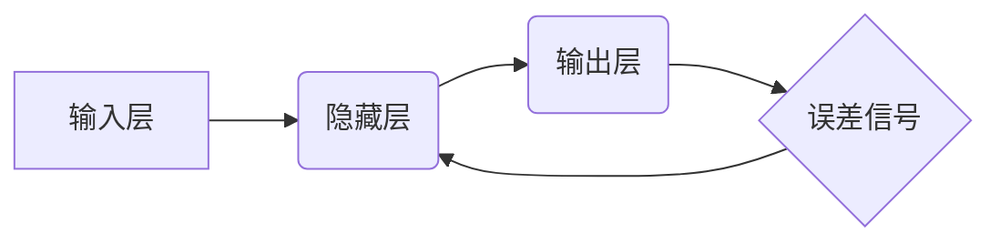

> 大模型、反馈神经网络、反向传播算法、深度学习、机器学习、神经网络、梯度下降

## 1. 背景介绍

近年来，深度学习技术取得了令人瞩目的成就，在图像识别、自然语言处理、语音识别等领域展现出强大的应用潜力。这些成就离不开大模型的不断发展。大模型是指参数量庞大的深度学习模型，其强大的学习能力使其能够处理复杂的任务，并取得更优的性能。

然而，训练大模型需要大量的计算资源和时间，并且需要大量的标注数据。因此，如何高效地训练和微调大模型成为了一个重要的研究方向。反向传播算法作为深度学习训练的核心算法，在高效训练大模型中扮演着至关重要的角色。

## 2. 核心概念与联系

**2.1 核心概念**

* **神经网络:** 仿照人脑神经元结构的计算模型，由多个层级的神经元组成，每个神经元接收输入信号，进行处理后输出信号。
* **反馈神经网络:** 神经网络的一种类型，其特点是网络的输出可以反馈到输入，形成闭环结构。
* **反向传播算法:** 用于训练反馈神经网络的算法，通过计算误差信号并反向传播到网络各层，调整神经元权重，从而使网络输出更接近真实值。

**2.2 架构关系**



**2.3 核心联系**

反向传播算法的核心思想是利用链式法则，将误差信号反向传播到网络各层，并根据误差信号调整神经元权重。通过不断迭代，网络的输出逐渐逼近真实值。

## 3. 核心算法原理 & 具体操作步骤

**3.1 算法原理概述**

反向传播算法的核心是利用梯度下降法来更新神经网络的权重。梯度下降法是一种迭代优化算法，其目标是找到一个函数的最小值。在反向传播算法中，函数就是损失函数，损失函数衡量网络输出与真实值的差距。

**3.2 算法步骤详解**

1. **前向传播:** 将输入数据传递到网络，计算网络输出。
2. **计算损失函数:** 计算网络输出与真实值的差距，即损失函数的值。
3. **反向传播:** 计算损失函数对每个神经元权重的梯度。
4. **更新权重:** 根据梯度值，更新每个神经元权重。
5. **重复步骤1-4:** 重复上述步骤，直到损失函数达到最小值。

**3.3 算法优缺点**

**优点:**

* 能够有效地训练复杂的深度神经网络。
* 理论基础扎实，算法原理清晰易懂。
* 广泛应用于各种机器学习任务。

**缺点:**

* 训练过程需要大量的计算资源和时间。
* 容易陷入局部最优解。
* 对初始权重敏感。

**3.4 算法应用领域**

反向传播算法广泛应用于各种机器学习任务，例如：

* **图像识别:** 识别图像中的物体、场景等。
* **自然语言处理:** 机器翻译、文本摘要、情感分析等。
* **语音识别:** 将语音转换为文本。
* **推荐系统:** 根据用户的历史行为推荐感兴趣的内容。

## 4. 数学模型和公式 & 详细讲解 & 举例说明

**4.1 数学模型构建**

假设我们有一个包含 $L$ 层的神经网络，第 $l$ 层有 $N_l$ 个神经元。每个神经元接收来自上一层的 $N_{l-1}$ 个输入信号，并将其线性组合后通过激活函数进行处理。

**4.2 公式推导过程**

损失函数通常定义为网络输出与真实值的均方误差。

$$
J(\theta) = \frac{1}{2} \sum_{i=1}^{m} ||y^{(i)} - \hat{y}^{(i)}||^2
$$

其中：

* $J(\theta)$ 是损失函数。
* $\theta$ 是网络的所有权重参数。
* $m$ 是训练样本的数量。
* $y^{(i)}$ 是第 $i$ 个样本的真实值。
* $\hat{y}^{(i)}$ 是第 $i$ 个样本的网络输出。

通过链式法则，我们可以计算损失函数对每个权重的梯度。

$$
\frac{\partial J(\theta)}{\partial \theta_j} = \frac{\partial J(\theta)}{\partial a_L^{(i)}} \cdot \frac{\partial a_L^{(i)}}{\partial \theta_j}
$$

其中：

* $a_L^{(i)}$ 是第 $L$ 层第 $i$ 个神经元的输出。
* $\theta_j$ 是第 $j$ 个权重参数。

**4.3 案例分析与讲解**

假设我们有一个简单的两层神经网络，用于预测房价。输入层有三个特征：面积、房间数、位置。隐藏层有四个神经元，输出层有一个神经元，输出房价。

我们可以使用反向传播算法来训练这个神经网络。首先，我们需要定义损失函数，例如均方误差。然后，我们需要计算损失函数对每个权重的梯度。最后，我们需要根据梯度值更新每个权重。

通过不断迭代，网络的输出逐渐逼近真实房价。

## 5. 项目实践：代码实例和详细解释说明

**5.1 开发环境搭建**

* Python 3.7+
* TensorFlow 2.0+
* Jupyter Notebook

**5.2 源代码详细实现**

```python
import tensorflow as tf

# 定义模型
model = tf.keras.models.Sequential([
    tf.keras.layers.Dense(64, activation='relu', input_shape=(3,)),
    tf.keras.layers.Dense(1)
])

# 定义损失函数和优化器
model.compile(loss='mse', optimizer='adam')

# 训练模型
model.fit(x_train, y_train, epochs=10)

# 评估模型
loss = model.evaluate(x_test, y_test)
print('Loss:', loss)
```

**5.3 代码解读与分析**

* 我们使用 TensorFlow 库构建了一个简单的两层神经网络。
* 输入层有三个特征，隐藏层有 64 个神经元，输出层有一个神经元。
* 我们使用 ReLU 激活函数和 Adam 优化器。
* 我们使用均方误差作为损失函数，并训练模型 10 个 epochs。
* 最后，我们评估模型在测试集上的性能。

**5.4 运行结果展示**

运行代码后，我们可以看到模型在测试集上的损失值。

## 6. 实际应用场景

反向传播算法在各种实际应用场景中发挥着重要作用，例如：

* **图像识别:** 识别人脸、物体、场景等。
* **自然语言处理:** 机器翻译、文本摘要、情感分析等。
* **语音识别:** 将语音转换为文本。
* **推荐系统:** 根据用户的历史行为推荐感兴趣的内容。

## 7. 工具和资源推荐

**7.1 学习资源推荐**

* **Deep Learning Specialization (Coursera):** https://www.coursera.org/specializations/deep-learning
* **Neural Networks and Deep Learning (Michael Nielsen):** http://neuralnetworksanddeeplearning.com/
* **Hands-On Machine Learning with Scikit-Learn, Keras & TensorFlow (Aurélien Géron):** https://www.oreilly.com/library/view/hands-on-machine-learning/9781492032632/

**7.2 开发工具推荐**

* **TensorFlow:** https://www.tensorflow.org/
* **PyTorch:** https://pytorch.org/
* **Keras:** https://keras.io/

**7.3 相关论文推荐**

* **Backpropagation:** https://www.sciencedirect.com/science/article/pii/0022519386900198
* **Gradient Descent:** https://www.jstor.org/stable/2323070

## 8. 总结：未来发展趋势与挑战

**8.1 研究成果总结**

反向传播算法是深度学习训练的核心算法，其发展推动了深度学习技术的进步，并在各个领域取得了显著的成果。

**8.2 未来发展趋势**

* **加速训练:** 研究更有效的训练算法，例如并行训练、分布式训练等，以加速大模型的训练速度。
* **提高效率:** 研究更有效的权重初始化方法、正则化方法等，以提高训练效率。
* **增强鲁棒性:** 研究更鲁棒的训练方法，使模型能够更好地应对噪声数据和对抗攻击。

**8.3 面临的挑战**

* **计算资源:** 训练大模型需要大量的计算资源，这对于资源有限的机构和个人来说是一个挑战。
* **数据标注:** 大模型需要大量的标注数据，数据标注成本高昂，并且标注质量难以保证。
* **可解释性:** 深度学习模型的决策过程难以解释，这对于一些需要透明度和可解释性的应用场景来说是一个挑战。

**8.4 研究展望**

未来，反向传播算法的研究将继续深入，探索更有效的训练方法、提高模型的效率和鲁棒性，并解决模型可解释性问题。


## 9. 附录：常见问题与解答

**9.1 什么是梯度下降？**

梯度下降是一种迭代优化算法，其目标是找到一个函数的最小值。

**9.2 反向传播算法是如何工作的？**

反向传播算法利用链式法则，将误差信号反向传播到网络各层，并根据误差信号更新每个神经元的权重。

**9.3 为什么反向传播算法需要大量的计算资源？**

反向传播算法需要计算每个神经元权重的梯度，并且需要迭代多次才能找到最优解。对于大模型来说，计算量非常大。


作者：禅与计算机程序设计艺术 / Zen and the Art of Computer Programming 
<end_of_turn>