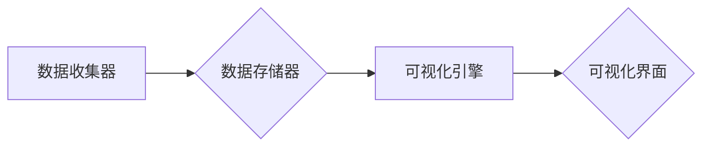

> tensorboardX, 大模型, 微调, 可视化, 机器学习, 深度学习

## 1. 背景介绍

在深度学习领域，模型训练是一个复杂且耗时的过程。训练过程中，需要不断地监控模型的性能，以便及时调整训练参数，优化模型结构，最终获得最佳的模型效果。为了方便开发者直观地观察和分析模型训练过程，TensorFlow 提供了强大的可视化工具 TensorBoard。

TensorBoard 是一个用于可视化 TensorFlow 模型训练过程的开源工具。它可以帮助开发者监控训练过程中的各种指标，例如损失函数值、准确率、学习率等，并可视化模型的结构、参数、激活函数等信息。TensorBoard 的强大功能使其成为深度学习开发中不可或缺的工具之一。

然而，TensorBoard 的原始版本在某些方面存在局限性，例如缺乏对自定义指标的支持、可视化界面不够灵活等。为了解决这些问题，TensorBoardX 应运而生。

TensorBoardX 是一个基于 TensorBoard 的开源可视化工具，它继承了 TensorBoard 的优点，并对其进行了扩展和改进。TensorBoardX 提供了更丰富的可视化功能，例如支持自定义指标、可视化多个模型的训练过程、支持多种数据格式等。此外，TensorBoardX 的代码结构更加简洁易懂，更容易进行二次开发和定制。

## 2. 核心概念与联系

TensorBoardX 的核心概念是将模型训练过程中的数据以可视化的形式呈现出来，以便开发者更好地理解模型的训练过程和性能。

TensorBoardX 的工作原理是通过记录模型训练过程中的各种数据，例如损失函数值、准确率、学习率等，并将其存储在磁盘上。然后，TensorBoardX 会读取这些数据，并将其可视化成图表、曲线图、热力图等形式。

TensorBoardX 的架构可以概括为以下几个部分：

* **数据收集器:** 负责收集模型训练过程中的数据。
* **数据存储器:** 负责存储收集到的数据。
* **可视化引擎:** 负责将数据可视化成图表、曲线图、热力图等形式。

**Mermaid 流程图:**



## 3. 核心算法原理 & 具体操作步骤

TensorBoardX 的核心算法原理是基于数据可视化的思想，通过将模型训练过程中的数据以图表、曲线图、热力图等形式呈现出来，帮助开发者更好地理解模型的训练过程和性能。

### 3.1  算法原理概述

TensorBoardX 的算法原理主要包括以下几个方面：

* **数据收集:** TensorBoardX 提供了多种方法来收集模型训练过程中的数据，例如使用 `tf.summary` API 记录损失函数值、准确率等指标，使用 `tf.summary.histogram` 记录模型参数的分布等。
* **数据存储:** TensorBoardX 将收集到的数据存储在磁盘上，并使用一种特定的格式进行存储，以便后续可视化。
* **数据可视化:** TensorBoardX 提供了多种可视化工具，例如图表、曲线图、热力图等，可以将数据以不同的形式呈现出来，帮助开发者更好地理解数据。

### 3.2  算法步骤详解

TensorBoardX 的具体操作步骤如下：

1. **安装 TensorBoardX:** 使用 pip 安装 TensorBoardX 库。
2. **导入 TensorBoardX 库:** 在 Python 代码中导入 TensorBoardX 库。
3. **创建 TensorBoardX 对象:** 创建一个 TensorBoardX 对象，并指定数据存储路径。
4. **记录数据:** 使用 `tf.summary` API 记录模型训练过程中的数据，例如损失函数值、准确率等指标。
5. **启动 TensorBoardX:** 使用 `tensorboardX --logdir=./logs` 命令启动 TensorBoardX，并指定数据存储路径。
6. **访问 TensorBoardX:** 在浏览器中访问 `http://localhost:6006`，即可查看 TensorBoardX 的可视化界面。

### 3.3  算法优缺点

**优点:**

* **易于使用:** TensorBoardX 的 API 简单易用，可以方便地记录和可视化模型训练过程中的数据。
* **功能丰富:** TensorBoardX 提供了多种可视化工具，可以满足不同的需求。
* **开源免费:** TensorBoardX 是一个开源免费的工具，可以免费使用。

**缺点:**

* **性能瓶颈:** 当训练数据量很大时，TensorBoardX 的性能可能会受到瓶颈。
* **可视化界面不够灵活:** TensorBoardX 的可视化界面相对固定，无法进行完全的定制化。

### 3.4  算法应用领域

TensorBoardX 的应用领域非常广泛，例如：

* **图像识别:** 可视化模型训练过程中的损失函数值、准确率等指标，帮助开发者更好地理解模型的训练效果。
* **自然语言处理:** 可视化模型训练过程中的词嵌入、注意力机制等信息，帮助开发者更好地理解模型的内部机制。
* **推荐系统:** 可视化模型训练过程中的召回率、点击率等指标，帮助开发者更好地优化模型的推荐效果。

## 4. 数学模型和公式 & 详细讲解 & 举例说明

TensorBoardX 的核心算法原理是基于数据可视化的思想，它并没有特定的数学模型。

但是，在 TensorBoardX 中使用的一些技术，例如数据归一化、数据降维等，都涉及到一定的数学模型和公式。

### 4.1  数学模型构建

TensorBoardX 中的数据归一化通常使用 Min-Max 归一化方法，其公式如下：

$$x_{normalized} = \frac{x - min(x)}{max(x) - min(x)}$$

其中，$x$ 是原始数据，$min(x)$ 是数据的最小值，$max(x)$ 是数据的最大值。

### 4.2  公式推导过程

Min-Max 归一化方法的推导过程如下：

1. 将数据范围映射到 [0, 1] 之间。
2. 使用公式将原始数据转换为归一化后的数据。

### 4.3  案例分析与讲解

例如，假设我们有一个数据集，其中数据范围为 [0, 100]。

使用 Min-Max 归一化方法，我们可以将数据范围映射到 [0, 1] 之间。

假设一个原始数据为 50，则归一化后的数据为：

$$x_{normalized} = \frac{50 - 0}{100 - 0} = 0.5$$

## 5. 项目实践：代码实例和详细解释说明

以下是一个使用 TensorBoardX 记录模型训练过程的简单代码实例：

### 5.1  开发环境搭建

* Python 3.6+
* TensorFlow 1.12+
* TensorBoardX

### 5.2  源代码详细实现

```python
import tensorflow as tf
from tensorboardX import SummaryWriter

# 创建 TensorBoardX 对象
writer = SummaryWriter(logdir='./logs')

# 定义模型
model = tf.keras.models.Sequential([
    tf.keras.layers.Dense(10, activation='relu', input_shape=(784,)),
    tf.keras.layers.Dense(10, activation='softmax')
])

# 定义损失函数和优化器
loss_fn = tf.keras.losses.SparseCategoricalCrossentropy()
optimizer = tf.keras.optimizers.Adam()

# 训练模型
for epoch in range(10):
    for batch in range(100):
        # 训练数据
        x_train = tf.random.normal((64, 784))
        y_train = tf.random.uniform((64,), minval=0, maxval=10, dtype=tf.int32)

        # 计算损失
        with tf.GradientTape() as tape:
            predictions = model(x_train)
            loss = loss_fn(y_train, predictions)

        # 反向传播
        gradients = tape.gradient(loss, model.trainable_variables)
        optimizer.apply_gradients(zip(gradients, model.trainable_variables))

        # 记录损失
        writer.add_scalar('loss', loss, epoch * 100 + batch)

# 关闭 TensorBoardX 对象
writer.close()
```

### 5.3  代码解读与分析

* **创建 TensorBoardX 对象:** 使用 `SummaryWriter` 类创建 TensorBoardX 对象，并指定数据存储路径。
* **定义模型:** 使用 TensorFlow 的 Keras API 定义一个简单的多层感知机模型。
* **定义损失函数和优化器:** 使用 `SparseCategoricalCrossentropy` 作为损失函数，使用 `Adam` 作为优化器。
* **训练模型:** 训练模型 10 个 epoch，每个 epoch 训练 100 个 batch。
* **记录损失:** 在每个 batch 结束时，使用 `writer.add_scalar` 方法记录损失值，并将其命名为 'loss'。
* **关闭 TensorBoardX 对象:** 训练完成后，使用 `writer.close` 方法关闭 TensorBoardX 对象。

### 5.4  运行结果展示

运行上述代码后，会在 `./logs` 目录下生成一个 TensorBoardX 数据文件。

然后，使用 `tensorboardX --logdir=./logs` 命令启动 TensorBoardX，并访问 `http://localhost:6006`，即可查看 TensorBoardX 的可视化界面。

在可视化界面中，可以观察到模型训练过程中的损失值随 epoch 和 batch 的变化趋势。

## 6. 实际应用场景

TensorBoardX 在实际应用场景中具有广泛的应用价值，例如：

### 6.1  模型训练监控

TensorBoardX 可以帮助开发者实时监控模型训练过程中的各种指标，例如损失函数值、准确率、学习率等，以便及时调整训练参数，优化模型结构，最终获得最佳的模型效果。

### 6.2  模型参数可视化

TensorBoardX 可以可视化模型的参数分布，例如权重、偏置等，帮助开发者更好地理解模型的内部结构和参数的分布情况。

### 6.3  模型性能分析

TensorBoardX 可以帮助开发者分析模型的性能，例如在不同数据集上的准确率、召回率等，以便更好地评估模型的性能和选择合适的模型结构。

### 6.4  未来应用展望

随着深度学习技术的不断发展，TensorBoardX 的应用场景将会更加广泛。

例如，未来 TensorBoardX 可以支持更丰富的可视化功能，例如可视化模型的注意力机制、可视化模型的梯度流等，帮助开发者更好地理解模型的内部机制。

## 7. 工具和资源推荐

### 7.1  学习资源推荐

* **TensorBoardX 官方文档:** https://www.tensorflow.org/tensorboard/tensorboardX
* **TensorFlow 官方文档:** https://www.tensorflow.org/

### 7.2  开发工具推荐

* **TensorFlow:** https://www.tensorflow.org/
* **Keras:** https://keras.io/

### 7.3  相关论文推荐

* **TensorBoard: A Visualization Tool for TensorFlow:** https://arxiv.org/abs/1609.09217

## 8. 总结：未来发展趋势与挑战

### 8.1  研究成果总结

TensorBoardX 是一个强大的深度学习可视化工具，它可以帮助开发者更好地理解模型的训练过程和性能。

TensorBoardX 的核心算法原理是基于数据可视化的思想，它并没有特定的数学模型。

但是，在 TensorBoardX 中使用的一些技术，例如数据归一化、数据降维等，都涉及到一定的数学模型和公式。

### 8.2  未来发展趋势

随着深度学习技术的不断发展，TensorBoardX 的未来发展趋势主要包括以下几个方面：

* **支持更丰富的可视化功能:** 例如可视化模型的注意力机制、