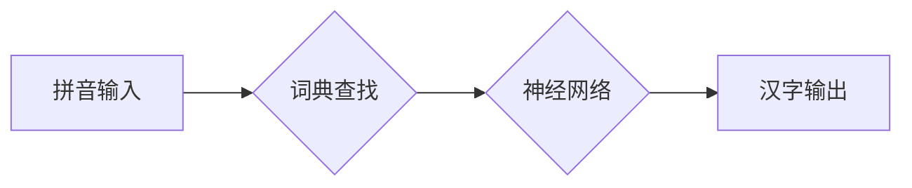

> 大模型、微调、拼音汉字、自然语言处理、深度学习、Transformer

## 1. 背景介绍

近年来，深度学习在自然语言处理 (NLP) 领域取得了突破性进展，大规模语言模型 (LLM) 的出现更是推动了 NLP 技术的快速发展。这些模型，例如 GPT-3、BERT 和 LaMDA，展现出强大的文本生成、理解和翻译能力，在各个领域都有着广泛的应用前景。

然而，训练大型语言模型需要海量数据和强大的计算资源，对于个人开发者和小型团队来说，部署和训练这些模型存在一定的门槛。因此，如何高效地利用现有的预训练模型，针对特定任务进行微调，成为一个重要的研究方向。

拼音汉字模型作为一种特殊的语言模型，其核心在于将拼音与汉字进行映射，能够实现拼音输入汉字输出的功能。这种模型在中文输入法、语音识别、机器翻译等领域具有重要的应用价值。

本篇文章将从零开始，介绍如何开发和微调一个拼音汉字模型，并深入探讨其核心算法原理、数学模型和代码实现。

## 2. 核心概念与联系

拼音汉字模型的核心概念包括：

* **拼音:**  汉字的音标符号，通常由声母和韵母组成。
* **汉字:**  汉语的文字符号，每个汉字代表一个词语或一个概念。
* **词典:**  包含拼音和汉字映射关系的字典，是模型训练和预测的基础。
* **神经网络:**  用于学习拼音和汉字之间的映射关系的算法模型。

**核心架构流程图:**



## 3. 核心算法原理 & 具体操作步骤

### 3.1  算法原理概述

拼音汉字模型通常采用基于神经网络的机器学习算法，例如循环神经网络 (RNN) 或 Transformer，来学习拼音和汉字之间的映射关系。

* **循环神经网络 (RNN):** RNN 是一种能够处理序列数据的网络结构，其内部包含循环单元，能够记忆之前的信息，从而更好地理解拼音序列的上下文关系。

* **Transformer:** Transformer 是一种更先进的序列模型，其核心是注意力机制，能够更有效地捕捉序列中的长距离依赖关系。

### 3.2  算法步骤详解

1. **数据预处理:** 将拼音汉字数据进行清洗、格式化和编码，例如将拼音转换为数字表示，将汉字转换为字符向量。
2. **模型构建:** 根据选择的算法，构建相应的网络结构，例如 RNN 或 Transformer。
3. **模型训练:** 使用训练数据，通过反向传播算法，调整模型参数，使模型能够准确地预测汉字。
4. **模型评估:** 使用测试数据，评估模型的预测准确率、召回率等指标。
5. **模型微调:** 根据评估结果，对模型参数进行微调，进一步提高模型性能。

### 3.3  算法优缺点

* **RNN:**
    * **优点:** 能够处理序列数据，记忆之前的信息。
    * **缺点:** 训练速度慢，难以捕捉长距离依赖关系。
* **Transformer:**
    * **优点:** 训练速度快，能够有效地捕捉长距离依赖关系。
    * **缺点:** 参数量大，需要更多的计算资源。

### 3.4  算法应用领域

* **中文输入法:** 将拼音转换为汉字，实现快速输入。
* **语音识别:** 将语音信号转换为拼音，然后转换为汉字。
* **机器翻译:** 将英文或其他语言转换为拼音，然后转换为汉字。

## 4. 数学模型和公式 & 详细讲解 & 举例说明

### 4.1  数学模型构建

拼音汉字模型通常采用多层感知机 (MLP) 或卷积神经网络 (CNN) 作为其核心结构。

* **多层感知机 (MLP):** MLP 由多个全连接层组成，能够学习拼音和汉字之间的非线性映射关系。

* **卷积神经网络 (CNN):** CNN 利用卷积核提取拼音序列的特征，能够更好地捕捉拼音序列的局部模式。

### 4.2  公式推导过程

假设拼音序列长度为 T，汉字字典大小为 V，则模型的输出层是一个大小为 V 的向量，每个元素代表预测的汉字概率。

**损失函数:**

$$
L = -\sum_{t=1}^{T} \sum_{v=1}^{V} y_{t,v} \log(p_{t,v})
$$

其中：

* $y_{t,v}$ 是真实标签，表示第 t 个拼音对应的汉字为 v。
* $p_{t,v}$ 是模型预测的汉字概率，表示第 t 个拼音对应的汉字为 v 的概率。

**反向传播算法:**

通过反向传播算法，计算模型参数的梯度，并使用梯度下降算法更新模型参数。

### 4.3  案例分析与讲解

假设我们有一个拼音序列 "ni hao"，目标是预测对应的汉字 "你好"。

模型会将每个拼音 "n", "i", "h", "a", "o" 转换为对应的数字表示，然后输入到网络中。网络会根据训练数据学习到的映射关系，预测每个拼音对应的汉字概率。最终，模型会输出一个概率最高的汉字向量，表示预测的汉字为 "你好"。

## 5. 项目实践：代码实例和详细解释说明

### 5.1  开发环境搭建

* Python 3.x
* TensorFlow 或 PyTorch
* CUDA 和 cuDNN (可选，用于 GPU 加速)

### 5.2  源代码详细实现

```python
import tensorflow as tf

# 定义模型结构
model = tf.keras.Sequential([
    tf.keras.layers.Embedding(input_dim=len(vocabulary), output_dim=embedding_dim),
    tf.keras.layers.LSTM(units=lstm_units),
    tf.keras.layers.Dense(units=len(vocabulary), activation='softmax')
])

# 编译模型
model.compile(optimizer='adam',
              loss='sparse_categorical_crossentropy',
              metrics=['accuracy'])

# 训练模型
model.fit(x_train, y_train, epochs=epochs, batch_size=batch_size)

# 评估模型
loss, accuracy = model.evaluate(x_test, y_test)
print('Loss:', loss)
print('Accuracy:', accuracy)
```

### 5.3  代码解读与分析

* **Embedding 层:** 将拼音转换为稠密的向量表示。
* **LSTM 层:** 学习拼音序列的上下文关系。
* **Dense 层:** 将 LSTM 输出转换为汉字概率分布。
* **Adam 优化器:** 用于更新模型参数。
* **Sparse Categorical Crossentropy 损失函数:** 用于计算模型预测与真实标签之间的差异。
* **Accuracy 指标:** 用于评估模型的预测准确率。

### 5.4  运行结果展示

训练完成后，可以使用测试数据评估模型的性能，并可视化模型的预测结果。

## 6. 实际应用场景

### 6.1  中文输入法

拼音汉字模型可以用于构建高效的中文输入法，用户只需输入拼音，即可快速获得对应的汉字。

### 6.2  语音识别

拼音汉字模型可以用于语音识别系统，将语音信号转换为拼音，然后转换为汉字。

### 6.3  机器翻译

拼音汉字模型可以用于机器翻译系统，将英文或其他语言转换为拼音，然后转换为汉字。

### 6.4  未来应用展望

* **个性化输入法:** 根据用户的输入习惯，个性化定制拼音汉字映射关系。
* **多语言支持:** 支持多种语言的拼音汉字转换。
* **语音合成:** 将汉字转换为语音，实现语音合成功能。

## 7. 工具和资源推荐

### 7.1  学习资源推荐

* **深度学习入门:**
    * 深度学习公开课 (Deep Learning Specialization)
    * fast.ai
* **自然语言处理:**
    * 自然语言处理入门 (Natural Language Processing with Python)
    * Stanford NLP

### 7.2  开发工具推荐

* **TensorFlow:** 开源深度学习框架
* **PyTorch:** 开源深度学习框架
* **Hugging Face Transformers:** 预训练模型库

### 7.3  相关论文推荐

* **Attention Is All You Need:** https://arxiv.org/abs/1706.03762
* **BERT: Pre-training of Deep Bidirectional Transformers for Language Understanding:** https://arxiv.org/abs/1810.04805

## 8. 总结：未来发展趋势与挑战

### 8.1  研究成果总结

本篇文章介绍了拼音汉字模型的开发和微调方法，并探讨了其核心算法原理、数学模型和代码实现。

### 8.2  未来发展趋势

* **模型规模和性能提升:** 随着计算资源的不断发展，拼音汉字模型的规模和性能将会进一步提升。
* **多模态融合:** 将拼音汉字模型与其他模态数据，例如图像和音频，进行融合，实现更智能的应用。
* **个性化定制:** 根据用户的输入习惯和语言风格，个性化定制拼音汉字映射关系。

### 8.3  面临的挑战

* **数据标注:** 高质量的拼音汉字数据标注仍然是一个挑战。
* **模型解释性:** 深度学习模型的内部机制难以解释，如何提高模型的解释性是一个重要的研究方向。
* **伦理问题:** 

拼音汉字模型的应用可能涉及到隐私和偏见等伦理问题，需要谨慎考虑。

### 8.4  研究展望

未来，拼音汉字模型将会在更多领域得到应用，并推动中文语言技术的进一步发展。


## 9. 附录：常见问题与解答

* **Q: 如何选择合适的算法？**
    * **A:** 对于较短的拼音序列，RNN 是一种不错的选择。对于较长的拼音序列，Transformer 能够更好地捕捉长距离依赖关系。
* **Q: 如何处理未知的拼音？**
    * **A:** 可以使用一个特殊的标记来表示未知的拼音，并在训练过程中将其作为训练数据的一部分。
* **Q: 如何评估模型的性能？**
    * **A:** 可以使用准确率、召回率、F1-score 等指标来评估模型的性能。

作者：禅与计算机程序设计艺术 / Zen and the Art of Computer Programming


<end_of_turn>