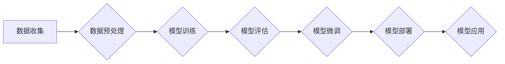

> 大模型、模型开发、微调、模型架构、深度学习、Transformer

## 1. 背景介绍

近年来，深度学习技术取得了飞速发展，大模型的出现更是掀起了人工智能领域的全新浪潮。大模型，是指参数规模庞大、训练数据海量的人工智能模型，其强大的学习能力和泛化能力使其在自然语言处理、计算机视觉、语音识别等领域展现出令人瞩目的应用潜力。

然而，大模型的开发和部署并非易事。其训练成本高昂，硬件资源需求巨大，模型规模庞大，部署和推理效率也面临挑战。因此，如何高效地开发和微调大模型，使其能够在实际应用场景中发挥最大价值，成为当前人工智能领域的研究热点。

本篇文章将从零开始，深入探讨大模型的开发与微调，涵盖模型设计、核心算法原理、数学模型构建、代码实现、实际应用场景等多个方面，旨在为读者提供一个全面的学习指南。

## 2. 核心概念与联系

大模型的开发与微调涉及到多个核心概念和技术，这些概念相互关联，共同构成了大模型的整体框架。

**2.1 模型架构**

模型架构是决定模型性能的关键因素之一。常见的模型架构包括 Transformer、BERT、GPT 等，这些架构在设计上都具有独特的优势，能够有效地捕捉语言的上下文信息和语义关系。

**2.2 预训练与微调**

预训练是指在海量文本数据上训练一个初始模型，使其具备一定的语言理解和生成能力。微调则是将预训练模型应用于特定任务，通过在任务相关的少量数据上进行训练，进一步提升模型的性能。

**2.3 参数量与训练数据**

模型的参数量和训练数据规模是决定模型性能的重要因素。参数量越多，模型的表达能力越强，但训练成本也越高。训练数据越多，模型的泛化能力越强，但数据标注成本也越高。

**2.4 硬件资源**

大模型的训练和部署需要大量的计算资源，通常需要使用高性能的GPU集群。

**2.5 评估指标**

模型性能的评估需要使用相应的指标，例如准确率、召回率、F1-score 等。不同的任务可能需要使用不同的评估指标。

**2.6 流程图**



## 3. 核心算法原理 & 具体操作步骤

### 3.1 算法原理概述

大模型的训练主要基于深度学习算法，其中 Transformer 架构是目前最流行的模型架构之一。Transformer 架构的核心思想是利用注意力机制来捕捉语言的上下文信息，从而实现更准确的语言理解和生成。

### 3.2 算法步骤详解

1. **数据预处理:** 将原始文本数据进行清洗、分词、词向量化等预处理操作，使其能够被模型理解。
2. **模型训练:** 使用深度学习框架（例如 TensorFlow、PyTorch）训练 Transformer 模型，通过反向传播算法不断优化模型参数。
3. **模型评估:** 在验证集上评估模型性能，并根据评估结果调整模型超参数。
4. **模型微调:** 将预训练模型应用于特定任务，在任务相关的少量数据上进行微调，进一步提升模型性能。

### 3.3 算法优缺点

**优点:**

* 强大的语言理解和生成能力
* 能够捕捉长距离依赖关系
* 训练效率高

**缺点:**

* 参数量大，训练成本高
* 对硬件资源需求高
* 训练数据量大

### 3.4 算法应用领域

* 自然语言处理：文本分类、情感分析、机器翻译、问答系统等
* 计算机视觉：图像识别、目标检测、图像分割等
* 语音识别：语音转文本、语音合成等

## 4. 数学模型和公式 & 详细讲解 & 举例说明

### 4.1 数学模型构建

Transformer 模型的核心是注意力机制，其数学模型可以表示为：

$$
Attention(Q, K, V) = softmax(\frac{QK^T}{\sqrt{d_k}})V
$$

其中：

* $Q$：查询矩阵
* $K$：键矩阵
* $V$：值矩阵
* $d_k$：键向量的维度
* $softmax$：softmax 函数

### 4.2 公式推导过程

注意力机制的目的是计算查询向量 $Q$ 与键向量 $K$ 之间的相似度，并根据相似度对值向量 $V$ 进行加权求和。

* $QK^T$：计算查询向量与键向量的点积，得到一个得分矩阵。
* $\frac{QK^T}{\sqrt{d_k}}$：对得分矩阵进行缩放，以防止梯度爆炸。
* $softmax$：对缩放后的得分矩阵进行 softmax 操作，得到每个键向量的权重。
* $V$：将权重与值向量 $V$ 进行加权求和，得到最终的输出。

### 4.3 案例分析与讲解

假设我们有一个句子 "我爱学习编程"，将其转换为词向量表示，得到查询向量 $Q$、键向量 $K$ 和值向量 $V$。

通过计算注意力机制，我们可以得到每个词对其他词的注意力权重，例如 "我" 对 "学习" 的注意力权重较高，因为它们在语义上相关。

## 5. 项目实践：代码实例和详细解释说明

### 5.1 开发环境搭建

* Python 3.7+
* TensorFlow 或 PyTorch
* CUDA 和 cuDNN

### 5.2 源代码详细实现

```python
import tensorflow as tf

# 定义 Transformer 模型
class Transformer(tf.keras.Model):
    def __init__(self, vocab_size, embedding_dim, num_heads, num_layers):
        super(Transformer, self).__init__()
        self.embedding = tf.keras.layers.Embedding(vocab_size, embedding_dim)
        self.transformer_layers = tf.keras.layers.StackedRNNCells([
            tf.keras.layers.Attention(num_heads=num_heads)
            for _ in range(num_layers)
        ])

    def call(self, inputs):
        embeddings = self.embedding(inputs)
        outputs = self.transformer_layers(embeddings)
        return outputs

# 实例化 Transformer 模型
model = Transformer(vocab_size=10000, embedding_dim=128, num_heads=8, num_layers=6)

# 编译模型
model.compile(optimizer='adam', loss='mse')

# 训练模型
model.fit(x_train, y_train, epochs=10)
```

### 5.3 代码解读与分析

* `Transformer` 类定义了 Transformer 模型的结构。
* `embedding` 层将词向量化。
* `transformer_layers` 层堆叠了多个注意力层，实现 Transformer 的核心功能。
* `call` 方法定义了模型的输入和输出。
* `compile` 方法配置了优化器和损失函数。
* `fit` 方法训练模型。

### 5.4 运行结果展示

训练完成后，可以使用模型对新的文本数据进行预测。

## 6. 实际应用场景

### 6.1 自然语言处理

* **文本分类:** 将文本分类到预定义的类别中，例如情感分析、主题分类等。
* **机器翻译:** 将文本从一种语言翻译成另一种语言。
* **问答系统:** 根据给定的问题，从文本数据中找到答案。

### 6.2 计算机视觉

* **图像识别:** 将图像分类到预定义的类别中，例如识别物体、场景等。
* **目标检测:** 在图像中定位和识别目标，例如人、车、动物等。
* **图像分割:** 将图像分割成不同的区域，例如分割前景和背景。

### 6.3 语音识别

* **语音转文本:** 将语音信号转换为文本。
* **语音合成:** 将文本转换为语音信号。

### 6.4 未来应用展望

大模型在未来将应用于更广泛的领域，例如：

* **医疗保健:** 辅助诊断、预测疾病风险、个性化治疗方案。
* **教育:** 智能辅导、个性化学习路径、自动批改作业。
* **金融:** 风险评估、欺诈检测、投资决策。

## 7. 工具和资源推荐

### 7.1 学习资源推荐

* **书籍:**
    * 《深度学习》
    * 《自然语言处理》
    * 《Transformer 详解》
* **在线课程:**
    * Coursera: 深度学习
    * Udacity: 自然语言处理
    * fast.ai: 深度学习

### 7.2 开发工具推荐

* **深度学习框架:** TensorFlow、PyTorch
* **文本处理工具:** NLTK、spaCy
* **数据可视化工具:** Matplotlib、Seaborn

### 7.3 相关论文推荐

* 《Attention Is All You Need》
* 《BERT: Pre-training of Deep Bidirectional Transformers for Language Understanding》
* 《GPT-3: Language Models are Few-Shot Learners》

## 8. 总结：未来发展趋势与挑战

### 8.1 研究成果总结

近年来，大模型在自然语言处理、计算机视觉等领域取得了显著的成果，其强大的学习能力和泛化能力为人工智能的发展带来了新的机遇。

### 8.2 未来发展趋势

* **模型规模的进一步扩大:** 随着计算资源的不断提升，大模型的规模将继续扩大，从而提升模型的性能。
* **多模态大模型的开发:** 将文本、图像、音频等多种模态数据融合到一起，开发更强大的多模态大模型。
* **可解释性研究:** 研究大模型的决策过程，使其更加透明和可解释。

### 8.3 面临的挑战

* **训练成本高:** 大模型的训练需要大量的计算资源和时间，成本很高。
* **数据标注成本高:** 大模型的训练需要海量标注数据，标注成本也很高。
* **模型部署效率低:** 大模型的部署需要大量的计算资源，部署效率较低。

### 8.4 研究展望

未来，大模型研究将继续朝着更强大、更通用、更可解释的方向发展。

## 9. 附录：常见问题与解答

**Q1: 如何选择合适的模型架构？**

**A1:** 选择合适的模型架构取决于具体的应用场景和数据特点。

**Q2: 如何进行模型微调？**

**A2:** 模型微调需要使用任务相关的少量数据，调整预训练模型的参数。

**Q3: 如何评估大模型的性能？**

**A3:** 使用相应的评估指标，例如准确率、召回率、F1-score 等。

**作者：禅与计算机程序设计艺术 / Zen and the Art of Computer Programming**


<end_of_turn>