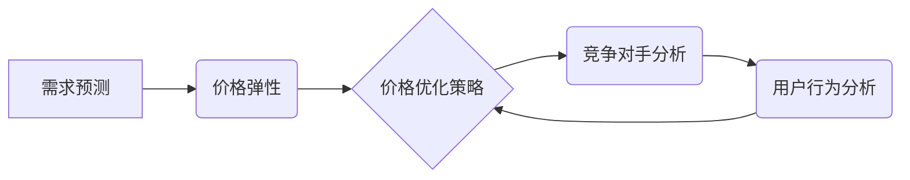

> 价格优化,电商,机器学习,深度学习,预测模型,算法,策略

## 1. 背景介绍

在当今激烈的电商市场竞争中，价格策略扮演着至关重要的角色。如何制定合理的定价策略，既能最大化利润，又能保持竞争力，是电商企业面临的重大挑战。传统的定价方法往往依赖于经验和主观判断，难以适应市场变化的快速节奏。随着人工智能技术的快速发展，价格优化技术逐渐成为电商企业提升竞争力的重要手段。

价格优化技术通过运用机器学习、深度学习等算法，分析海量商品数据、市场趋势、用户行为等信息，并建立预测模型，从而实现智能化定价。它能够帮助电商企业：

* **精准预测商品需求**: 通过分析历史销售数据、市场趋势等信息，预测未来商品的需求量，从而制定更精准的定价策略。
* **动态调整价格**: 根据实时市场变化、竞争对手价格、用户行为等因素，动态调整商品价格，最大化利润。
* **个性化定价**: 根据用户的购买历史、浏览记录、偏好等信息，为不同用户提供个性化的价格，提升用户体验和转化率。
* **优化库存管理**: 通过预测商品需求，优化库存管理，减少库存积压和缺货风险。

## 2. 核心概念与联系

价格优化技术的核心概念包括：

* **需求预测**: 预测未来商品的需求量，是价格优化技术的基础。
* **价格弹性**: 指商品价格变化对需求量变化的敏感程度。
* **竞争对手分析**: 分析竞争对手的定价策略，制定差异化定价策略。
* **用户行为分析**: 分析用户的购买行为、浏览记录、偏好等信息，为个性化定价提供依据。

**核心概念架构**



## 3. 核心算法原理 & 具体操作步骤

### 3.1  算法原理概述

价格优化算法通常基于机器学习和深度学习技术，通过训练模型，学习商品价格与需求之间的关系，并预测未来商品需求量。常见的算法包括：

* **线性回归**: 用于预测连续变量，例如商品价格和需求量之间的线性关系。
* **逻辑回归**: 用于预测分类变量，例如商品是否会被购买。
* **决策树**: 用于根据一系列规则，预测商品需求量。
* **支持向量机**: 用于寻找最佳的分隔超平面，将数据分类。
* **神经网络**: 用于学习复杂的数据关系，预测商品需求量。

### 3.2  算法步骤详解

1. **数据收集**: 收集商品价格、销售量、市场趋势、用户行为等数据。
2. **数据预处理**: 对数据进行清洗、转换、特征工程等处理，使其适合模型训练。
3. **模型选择**: 根据数据特点和需求，选择合适的算法模型。
4. **模型训练**: 使用训练数据，训练模型参数，使其能够准确预测商品需求量。
5. **模型评估**: 使用测试数据，评估模型的预测精度。
6. **模型部署**: 将训练好的模型部署到生产环境中，用于实时预测商品需求量。
7. **价格调整**: 根据模型预测结果，动态调整商品价格。

### 3.3  算法优缺点

| 算法 | 优点 | 缺点 |
|---|---|---|
| 线性回归 | 简单易懂，计算速度快 | 只能处理线性关系，对异常值敏感 |
| 逻辑回归 | 用于分类问题，对异常值鲁棒性强 | 只能处理线性可分的数据 |
| 决策树 | 可以处理非线性关系，解释性强 | 容易过拟合，对数据特征依赖性强 |
| 支持向量机 | 对高维数据处理能力强，鲁棒性好 | 计算复杂度高，参数选择困难 |
| 神经网络 | 可以学习复杂的数据关系，预测精度高 | 计算复杂度高，训练时间长，解释性差 |

### 3.4  算法应用领域

价格优化算法广泛应用于电商、旅游、金融、医疗等各个领域，例如：

* **电商**: 商品定价、促销活动优化、库存管理
* **旅游**: 机票、酒店、旅游套餐定价
* **金融**: 贷款利率、保险费率
* **医疗**: 就诊费用、药品价格

## 4. 数学模型和公式 & 详细讲解 & 举例说明

### 4.1  数学模型构建

价格优化模型通常基于需求预测模型，其核心目标是找到最佳的商品价格，以最大化利润。常见的数学模型包括：

* **线性需求模型**: 假设商品需求量与价格呈线性关系，可以用以下公式表示：

$$Q = a - bP$$

其中：

* $Q$：商品需求量
* $P$：商品价格
* $a$：需求量在价格为0时的水平
* $b$：价格弹性

* **二次需求模型**: 假设商品需求量与价格呈二次关系，可以用以下公式表示：

$$Q = a - bP + cP^2$$

其中：

* $a$，$b$，$c$：模型参数

### 4.2  公式推导过程

利润可以定义为：

$$Profit = P \times Q - Cost$$

其中：

* $Cost$：商品生产成本

将需求模型代入利润公式，可以得到利润的函数关系。通过求解该函数的极值，可以找到最佳的商品价格。

### 4.3  案例分析与讲解

假设一个商品的生产成本为10元，线性需求模型参数为 $a = 100$，$b = 20$。

* **利润函数**:

$$Profit = P \times (100 - 20P) - 10$$

* **求解利润函数的极值**:

通过求导和解方程，可以得到利润函数的极值点。

* **最佳定价**:

将极值点代入价格公式，可以得到最佳的商品价格。

## 5. 项目实践：代码实例和详细解释说明

### 5.1  开发环境搭建

* **操作系统**: Linux/Windows/macOS
* **编程语言**: Python
* **库依赖**: pandas, numpy, scikit-learn, matplotlib

### 5.2  源代码详细实现

```python
import pandas as pd
from sklearn.linear_model import LinearRegression

# 数据加载
data = pd.read_csv('price_data.csv')

# 数据预处理
X = data[['price']]
y = data['demand']

# 模型训练
model = LinearRegression()
model.fit(X, y)

# 模型预测
new_price = pd.DataFrame({'price': [10, 20, 30]})
predicted_demand = model.predict(new_price)

# 结果展示
print(predicted_demand)
```

### 5.3  代码解读与分析

* **数据加载**: 使用 pandas 库加载商品价格和需求量数据。
* **数据预处理**: 将数据转换为模型所需的格式，例如将价格和需求量分别作为特征和目标变量。
* **模型训练**: 使用 scikit-learn 库的 LinearRegression 模型训练模型，学习价格和需求量之间的关系。
* **模型预测**: 使用训练好的模型预测不同价格下的需求量。
* **结果展示**: 打印预测结果。

### 5.4  运行结果展示

运行代码后，将输出不同价格下的预测需求量。

## 6. 实际应用场景

价格优化技术在电商领域有着广泛的应用场景，例如：

* **商品定价**: 根据商品属性、市场趋势、竞争对手价格等信息，制定合理的商品定价策略。
* **促销活动优化**: 根据用户行为、市场需求等信息，优化促销活动力度和时间，最大化促销效果。
* **库存管理**: 通过预测商品需求量，优化库存管理，减少库存积压和缺货风险。
* **个性化定价**: 根据用户的购买历史、浏览记录、偏好等信息，为不同用户提供个性化的价格，提升用户体验和转化率。

### 6.4  未来应用展望

随着人工智能技术的不断发展，价格优化技术将更加智能化、个性化、精准化。未来，价格优化技术可能应用于以下领域：

* **动态定价**: 根据实时市场变化、竞争对手价格、用户行为等因素，动态调整商品价格。
* **预测性定价**: 利用大数据分析和机器学习算法，预测未来商品需求量，制定更精准的定价策略。
* **协同定价**: 多个电商平台之间协同制定价格策略，共同应对市场竞争。

## 7. 工具和资源推荐

### 7.1  学习资源推荐

* **书籍**:
    * 《机器学习》 - 周志华
    * 《深度学习》 - Ian Goodfellow
* **在线课程**:
    * Coursera: Machine Learning
    * edX: Deep Learning

### 7.2  开发工具推荐

* **Python**: 
    * pandas
    * numpy
    * scikit-learn
    * matplotlib
* **云平台**:
    * AWS
    * Azure
    * Google Cloud

### 7.3  相关论文推荐

* **Pricing Optimization with Machine Learning**: https://arxiv.org/abs/1706.04077
* **Deep Learning for Dynamic Pricing**: https://arxiv.org/abs/1806.03674

## 8. 总结：未来发展趋势与挑战

### 8.1  研究成果总结

价格优化技术已经取得了显著的成果，能够帮助电商企业提高利润、提升竞争力。

### 8.2  未来发展趋势

未来，价格优化技术将更加智能化、个性化、精准化。

### 8.3  面临的挑战

* **数据质量**: 价格优化模型依赖于高质量的数据，数据质量问题会影响模型的预测精度。
* **模型解释性**: 许多深度学习模型的内部机制难以解释，这使得模型的决策结果难以被理解和信任。
* **伦理问题**: 价格优化技术可能会被用于操纵市场价格，损害消费者利益，需要关注其伦理问题。

### 8.4  研究展望

未来，需要进一步研究以下问题：

* 如何提高价格优化模型的鲁棒性和解释性。
* 如何解决价格优化技术带来的伦理问题。
* 如何将价格优化技术与其他人工智能技术结合，实现更智能化的电商运营。

## 9. 附录：常见问题与解答

* **Q1**: 价格优化技术是否适用于所有商品？

* **A1**: 价格优化技术适用于大部分商品，但对于一些特殊商品，例如奢侈品、艺术品等，其定价策略可能需要更加复杂。

* **Q2**: 价格优化技术会降低商品价格吗？

* **A2**: 价格优化技术的目标是最大化利润，因此它可能会提高、降低或保持商品价格，具体取决于市场情况和商品属性。

* **Q3**: 价格优化技术是否会影响用户体验？

* **A3**: 如果合理应用，价格优化技术可以提升用户体验，例如通过个性化定价，为用户提供更优惠的价格。

作者：禅与计算机程序设计艺术 / Zen and the Art of Computer Programming


<end_of_turn>