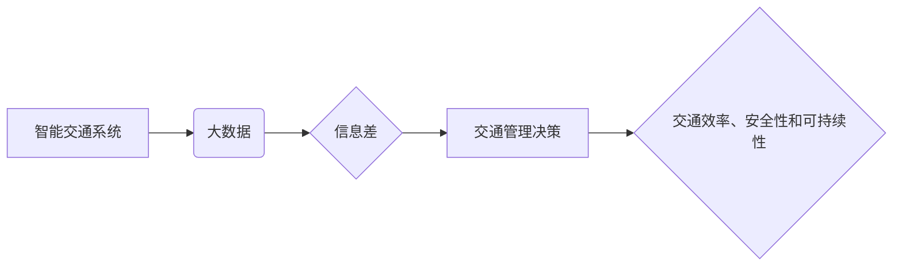

> 智能交通, 大数据, 信息差, 交通流量预测, 路网优化, 算法模型, 实际应用

## 1. 背景介绍

随着全球人口的不断增长和城市化的加速推进，交通拥堵已成为许多城市面临的严峻挑战。传统的交通管理模式难以有效应对日益复杂的交通状况，亟需寻求新的解决方案。智能交通系统 (ITS) 应运而生，旨在通过信息技术手段，提高交通效率、安全性和可持续性。

大数据作为智能交通系统的核心驱动力，为交通管理提供了前所未有的机遇。通过收集、分析和挖掘海量交通数据，我们可以洞察交通规律，预测交通流量，优化路网结构，并为驾驶员提供精准的导航和出行信息。

然而，大数据在智能交通中的应用也面临着一些挑战。其中，信息差问题尤为突出。由于数据来源分散、格式不统一、数据质量参差不齐等原因，难以形成完整的交通数据体系，导致交通管理决策缺乏准确的依据。

## 2. 核心概念与联系

**2.1 智能交通系统 (ITS)**

智能交通系统 (ITS) 是利用信息技术手段，对交通系统进行感知、控制和优化的一系列系统。ITS 的目标是提高交通效率、安全性和可持续性，并为驾驶员、乘客和城市提供更便捷、舒适和安全的出行体验。

**2.2 大数据**

大数据是指海量、高速度、高多样性、高价值的数据。大数据分析技术可以从海量数据中挖掘出隐藏的规律和价值，为交通管理决策提供科学依据。

**2.3 信息差**

信息差是指不同主体之间对交通信息的掌握程度不一致，导致决策失误和资源配置不合理的情况。

**2.4 信息差与智能交通的关系**

信息差是智能交通系统发展面临的重大挑战。由于数据来源分散、格式不统一、数据质量参差不齐等原因，难以形成完整的交通数据体系，导致交通管理决策缺乏准确的依据。

**2.5 信息差的解决方案**

为了解决信息差问题，需要采取以下措施：

* 建立统一的数据标准和接口，实现数据互联互通。
* 加强数据共享机制，促进数据资源的开放和利用。
* 提升数据质量，确保数据的准确性、完整性和时效性。
* 开发先进的数据分析和挖掘技术，从海量数据中提取有价值的信息。

**2.6  核心概念架构**



## 3. 核心算法原理 & 具体操作步骤

**3.1 算法原理概述**

在智能交通系统中，大数据分析算法被广泛应用于交通流量预测、路网优化、交通事故预警等领域。常见的算法包括：

* **时间序列分析算法:** 用于预测未来交通流量，例如ARIMA、SARIMA、Prophet等。
* **机器学习算法:** 用于识别交通模式、预测交通拥堵等，例如回归算法、分类算法、聚类算法等。
* **深度学习算法:** 用于处理复杂交通数据，例如卷积神经网络 (CNN)、循环神经网络 (RNN) 等。

**3.2 算法步骤详解**

以交通流量预测为例，详细介绍算法步骤：

1. **数据收集:** 收集历史交通流量数据、天气数据、道路状况数据等。
2. **数据预处理:** 清洗数据、处理缺失值、归一化数据等。
3. **特征工程:** 从原始数据中提取特征，例如时间特征、曜日特征、节日特征等。
4. **模型选择:** 根据数据特点和预测目标选择合适的算法模型。
5. **模型训练:** 使用训练数据训练模型，调整模型参数。
6. **模型评估:** 使用测试数据评估模型性能，例如均方误差 (MSE)、平均绝对误差 (MAE) 等。
7. **模型部署:** 将训练好的模型部署到生产环境中，用于实时预测交通流量。

**3.3 算法优缺点**

不同的算法具有不同的优缺点，需要根据实际应用场景选择合适的算法。

* **时间序列分析算法:** 优点是简单易用，缺点是难以处理非线性数据。
* **机器学习算法:** 优点是能够处理非线性数据，缺点是需要大量的训练数据。
* **深度学习算法:** 优点是能够处理复杂数据，缺点是训练成本高，需要强大的计算能力。

**3.4 算法应用领域**

大数据分析算法在智能交通系统中应用广泛，例如：

* **交通流量预测:** 预测未来交通流量，为交通管理提供决策依据。
* **路网优化:** 优化路网结构，缓解交通拥堵。
* **交通事故预警:** 识别交通事故风险，及时预警。
* **智能交通信号灯控制:** 根据实时交通流量调整信号灯时间，提高交通效率。
* **智能停车系统:** 提供停车位信息，引导车辆前往空闲停车位。

## 4. 数学模型和公式 & 详细讲解 & 举例说明

**4.1 数学模型构建**

交通流量预测模型通常采用时间序列模型，例如ARIMA模型。ARIMA模型假设交通流量的时间序列具有自回归 (AR)、移动平均 (MA) 和季节性 (I) 的特性。

**4.2 公式推导过程**

ARIMA模型的数学公式如下：

$$
y_t = c + \phi_1 y_{t-1} + \phi_2 y_{t-2} + ... + \phi_p y_{t-p} + \theta_1 \epsilon_{t-1} + \theta_2 \epsilon_{t-2} + ... + \theta_q \epsilon_{t-q} + \epsilon_t
$$

其中：

* $y_t$ 表示时间 $t$ 的交通流量。
* $c$ 表示截距项。
* $\phi_i$ 表示自回归系数。
* $p$ 表示自回归阶数。
* $\theta_i$ 表示移动平均系数。
* $q$ 表示移动平均阶数。
* $\epsilon_t$ 表示时间 $t$ 的随机误差项。

**4.3 案例分析与讲解**

假设我们想要预测某条道路的未来交通流量，可以使用ARIMA模型进行预测。首先，我们需要收集该道路的历史交通流量数据，然后使用ARIMA模型进行参数估计。最后，我们可以使用训练好的模型预测未来交通流量。

## 5. 项目实践：代码实例和详细解释说明

**5.1 开发环境搭建**

* 操作系统: Ubuntu 20.04
* Python 版本: 3.8
* 必要的库: pandas, numpy, statsmodels, matplotlib

**5.2 源代码详细实现**

```python
import pandas as pd
from statsmodels.tsa.arima.model import ARIMA
from matplotlib import pyplot as plt

# 加载数据
data = pd.read_csv('traffic_data.csv', index_col='Date', parse_dates=True)

# 数据预处理
data['Traffic'] = data['Traffic'].astype(float)

# 模型训练
model = ARIMA(data['Traffic'], order=(5, 1, 0))
model_fit = model.fit()

# 模型预测
predictions = model_fit.predict(start=len(data), end=len(data)+10)

# 结果展示
plt.plot(data['Traffic'], label='实际流量')
plt.plot(predictions, label='预测流量')
plt.legend()
plt.show()
```

**5.3 代码解读与分析**

* 首先，我们使用 pandas 库加载交通流量数据，并将其转换为时间序列格式。
* 然后，我们使用 statsmodels 库中的 ARIMA 模型进行模型训练。
* 在模型训练过程中，我们需要指定 ARIMA 模型的阶数 (p, d, q)。
* 最后，我们使用训练好的模型预测未来交通流量，并将其与实际流量进行对比。

**5.4 运行结果展示**

运行代码后，会生成一个图表，展示实际交通流量和预测流量的对比。

## 6. 实际应用场景

**6.1 交通流量预测**

交通流量预测是智能交通系统的重要应用场景之一。通过预测未来交通流量，可以为交通管理部门提供决策依据，例如调整信号灯时间、引导车辆避开拥堵路段等。

**6.2 路网优化**

路网优化是指根据交通流量和道路状况，调整道路结构和交通信号灯设置，以提高交通效率和安全性。

**6.3 交通事故预警**

交通事故预警系统可以利用大数据分析技术，识别交通事故风险，并及时预警驾驶员，避免交通事故发生。

**6.4 未来应用展望**

随着大数据技术和人工智能技术的不断发展，大数据在智能交通系统中的应用将更加广泛和深入。未来，大数据将被应用于更多智能交通场景，例如：

* **自动驾驶:** 自动驾驶系统需要大量交通数据来训练模型，大数据可以为自动驾驶提供所需的训练数据。
* **智能停车:** 智能停车系统可以利用大数据分析停车位信息，引导车辆前往空闲停车位。
* **共享出行:** 共享出行平台可以利用大数据分析出行需求，优化车辆调度和路线规划。

## 7. 工具和资源推荐

**7.1 学习资源推荐**

* **书籍:**
    * 《大数据分析》
    * 《机器学习》
    * 《深度学习》
* **在线课程:**
    * Coursera: 数据科学
    * edX: 机器学习
    * Udacity: 深度学习

**7.2 开发工具推荐**

* **Python:** 
    * pandas
    * numpy
    * scikit-learn
    * TensorFlow
    * PyTorch
* **R:** 
    * tidyverse
    * caret
    * mlr

**7.3 相关论文推荐**

* **交通流量预测:**
    * "A Deep Learning Approach for Traffic Flow Prediction"
    * "Traffic Flow Prediction Using Recurrent Neural Networks"
* **路网优化:**
    * "Traffic Network Optimization Using Machine Learning"
    * "A Genetic Algorithm Approach to Traffic Network Optimization"

## 8. 总结：未来发展趋势与挑战

**8.1 研究成果总结**

大数据在智能交通系统中的应用取得了显著成果，例如交通流量预测、路网优化、交通事故预警等。这些成果为提高交通效率、安全性和可持续性提供了新的思路和方法。

**8.2 未来发展趋势**

未来，大数据在智能交通系统中的应用将更加深入和广泛，例如：

* **更精准的预测:** 利用更先进的算法模型和更丰富的交通数据，实现更精准的交通流量预测。
* **更智能的决策:** 利用大数据分析技术，为交通管理部门提供更智能的决策支持。
* **更个性化的服务:** 利用大数据分析用户出行需求，提供更个性化的出行服务。

**8.3 面临的挑战**

大数据在智能交通系统中的应用也面临着一些挑战，例如：

* **数据质量问题:** 交通数据来源分散、格式不统一、数据质量参差不齐，需要加强数据标准化和质量控制。
* **数据安全问题:** 交通数据涉及到个人隐私信息，需要加强数据安全保护。
* **算法模型的复杂性:** 复杂的算法模型需要强大的计算能力和专业人才进行开发和维护。

**8.4 研究展望**

未来，我们需要继续加强对大数据在智能交通系统中的应用研究，解决数据质量、数据安全和算法模型复杂性等问题，推动大数据技术在智能交通领域的创新发展。

## 9. 附录：常见问题与解答

**9.1 Q: 如何解决交通数据质量问题？**

**A:** 可以通过以下措施解决交通数据质量问题：

* 建立统一的数据标准和接口，实现数据互联互通。
* 加强数据共享机制，促进数据资源的开放和利用。
* 提升数据质量，确保数据的准确性、完整性和时效性。

**9.2 Q: 如何保护交通数据安全？**

**A:**