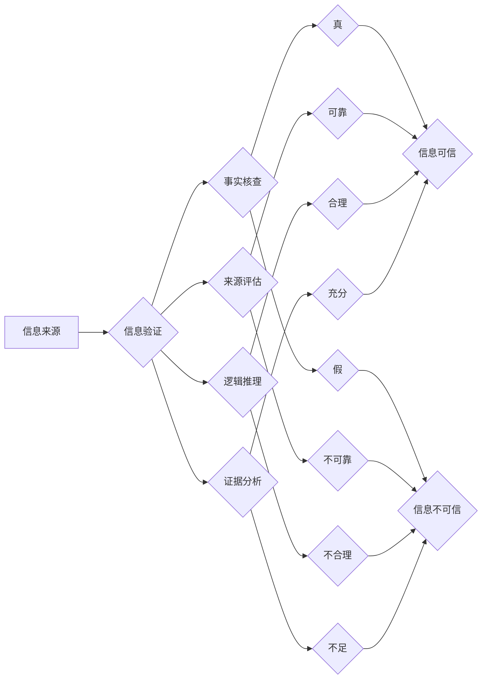

> 信息验证，批判性思维，深度学习，自然语言处理，谣言检测，事实核查，人工智能，信息安全

## 1. 背景介绍

在信息爆炸的时代，我们每天都被海量的信息淹没。从社交媒体到新闻网站，从搜索引擎到电子邮件，信息无处不在。然而，这些信息并非都真实可靠。假新闻、谣言和虚假信息泛滥，对个人、社会和国家安全构成严重威胁。

面对信息洪流，如何有效地验证信息，培养批判性思维，成为当今社会面临的重大挑战。信息验证不仅仅是查证事实的简单过程，更需要我们具备分析、判断和评估信息的能力。

## 2. 核心概念与联系

**2.1 信息验证**

信息验证是指通过多种手段和方法，对信息的真实性、准确性和可靠性进行核查和确认的过程。它涉及到多个方面，包括：

* **事实核查:** 通过查阅可靠的来源，确认信息的真实性。
* **来源评估:** 评估信息的来源可靠性，判断信息的客观性和公正性。
* **逻辑推理:** 分析信息的逻辑关系，识别逻辑谬误和矛盾之处。
* **证据分析:** 评估信息的证据是否充分、可靠和相关。

**2.2 批判性思维**

批判性思维是指能够系统地、理性的分析、评估和解释信息的能力。它包括以下几个关键要素：

* **质疑:** 对信息提出质疑，不盲目接受。
* **分析:** 将信息分解成各个部分，理解其内在逻辑。
* **评估:** 评估信息的价值、可靠性和适用性。
* **判断:** 基于分析和评估，做出明智的判断。
* **反思:** 反思自己的思维过程，识别自己的认知偏差。

**2.3 信息验证与批判性思维的联系**

信息验证和批判性思维是相互关联、相互促进的。批判性思维是信息验证的基础，它帮助我们更好地理解信息、分析信息和评估信息。而信息验证的过程本身也是一种批判性思维的训练，它让我们更加熟悉信息验证的方法和技巧，提高我们的信息辨别能力。

**Mermaid 流程图**



## 3. 核心算法原理 & 具体操作步骤

**3.1 算法原理概述**

信息验证算法通常基于自然语言处理（NLP）和机器学习（ML）技术，通过分析文本内容、结构和语义关系，识别和过滤虚假信息。常见的算法包括：

* **谣言检测算法:** 基于文本特征、社交网络结构和用户行为等信息，识别潜在的谣言传播。
* **事实核查算法:** 利用知识图谱、事实库和搜索引擎等资源，验证信息的真实性。
* **深度学习模型:** 利用深度神经网络，学习文本的语义表示，识别虚假信息和恶意内容。

**3.2 算法步骤详解**

1. **数据收集:** 收集大量文本数据，包括真实信息、虚假信息、谣言等。
2. **数据预处理:** 对文本数据进行清洗、格式化和标注，例如去除停用词、分词、标记情感倾向等。
3. **特征提取:** 从文本数据中提取特征，例如词频、词向量、语法结构、情感倾向等。
4. **模型训练:** 利用机器学习算法，训练模型，识别虚假信息和真实信息。
5. **模型评估:** 使用测试数据评估模型的性能，例如准确率、召回率、F1-score等。
6. **模型部署:** 将训练好的模型部署到实际应用场景中，例如信息验证平台、社交媒体平台等。

**3.3 算法优缺点**

**优点:**

* 自动化信息验证，提高效率。
* 识别复杂和隐蔽的虚假信息。
* 帮助用户做出更明智的判断。

**缺点:**

* 算法依赖于训练数据，数据质量直接影响算法性能。
* 算法可能存在偏差，导致误判。
* 无法识别所有类型的虚假信息，例如图片、视频等。

**3.4 算法应用领域**

* **新闻媒体:** 验证新闻真实性，识别假新闻和谣言。
* **社交媒体:** 过滤虚假信息和恶意内容，维护平台安全。
* **搜索引擎:** 排除虚假信息，提供更准确的搜索结果。
* **政府机构:** 识别网络谣言，维护社会稳定。
* **教育机构:** 帮助学生培养批判性思维，识别虚假信息。

## 4. 数学模型和公式 & 详细讲解 & 举例说明

**4.1 数学模型构建**

信息验证算法通常基于概率模型，例如贝叶斯网络、隐马尔可夫模型等。这些模型可以用来计算信息真实性的概率，并根据概率阈值进行判断。

**4.2 公式推导过程**

例如，假设我们有一个谣言检测模型，它需要判断一条文本消息是否为谣言。我们可以使用贝叶斯定理来计算消息为谣言的概率：

$$P(谣言|消息) = \frac{P(消息|谣言) * P(谣言)}{P(消息)}$$

其中：

* $P(谣言|消息)$ 是消息为谣言的概率。
* $P(消息|谣言)$ 是给定消息为谣言的情况下，观察到该消息的概率。
* $P(谣言)$ 是消息为谣言的先验概率。
* $P(消息)$ 是消息出现的概率。

**4.3 案例分析与讲解**

假设我们有一个谣言检测模型，它已经训练好了，并知道以下信息：

* $P(谣言) = 0.1$ (谣言的先验概率为10%)
* $P(消息|谣言) = 0.8$ (给定消息为谣言的情况下，观察到该消息的概率为80%)
* $P(消息) = 0.2$ (消息出现的概率为20%)

我们可以使用贝叶斯定理计算消息为谣言的概率：

$$P(谣言|消息) = \frac{0.8 * 0.1}{0.2} = 0.4$$

因此，根据模型的判断，该消息为谣言的概率为40%。

## 5. 项目实践：代码实例和详细解释说明

**5.1 开发环境搭建**

* Python 3.x
* TensorFlow 或 PyTorch
* NLTK 或 spaCy

**5.2 源代码详细实现**

```python
import nltk
from nltk.corpus import stopwords
from sklearn.feature_extraction.text import TfidfVectorizer
from sklearn.linear_model import LogisticRegression

# 数据加载
train_data = ...
test_data = ...

# 数据预处理
stop_words = set(stopwords.words('english'))
def preprocess_text(text):
    text = text.lower()
    text = ' '.join([word for word in text.split() if word not in stop_words])
    return text

train_data = [preprocess_text(text) for text in train_data]
test_data = [preprocess_text(text) for text in test_data]

# 特征提取
vectorizer = TfidfVectorizer()
train_features = vectorizer.fit_transform(train_data)
test_features = vectorizer.transform(test_data)

# 模型训练
model = LogisticRegression()
model.fit(train_features, train_labels)

# 模型评估
predictions = model.predict(test_features)
accuracy = accuracy_score(test_labels, predictions)
print(f'Accuracy: {accuracy}')

# 模型部署
# ...
```

**5.3 代码解读与分析**

这段代码展示了一个简单的谣言检测模型的实现过程。

1. 数据加载和预处理：首先加载训练数据和测试数据，然后对文本数据进行预处理，例如转换为小写、去除停用词等。
2. 特征提取：使用TF-IDF向量化技术，将文本数据转换为数字特征向量。
3. 模型训练：使用逻辑回归模型训练，将特征向量与标签进行关联。
4. 模型评估：使用准确率等指标评估模型的性能。
5. 模型部署：将训练好的模型部署到实际应用场景中。

**5.4 运行结果展示**

运行代码后，可以得到模型的准确率等评估指标，并根据模型的预测结果判断文本消息是否为谣言。

## 6. 实际应用场景

**6.1 新闻媒体**

新闻媒体可以使用信息验证算法来识别和过滤假新闻，确保新闻内容的真实性和可靠性。

**6.2 社交媒体**

社交媒体平台可以使用信息验证算法来识别和过滤虚假信息和恶意内容，维护平台安全和用户体验。

**6.3 搜索引擎**

搜索引擎可以使用信息验证算法来识别和过滤虚假信息，提供更准确的搜索结果。

**6.4 政府机构**

政府机构可以使用信息验证算法来识别网络谣言，维护社会稳定和公共秩序。

**6.5 教育机构**

教育机构可以使用信息验证算法来帮助学生培养批判性思维，识别虚假信息。

**6.6 未来应用展望**

随着人工智能技术的不断发展，信息验证算法将更加智能化、自动化和精准化。未来，信息验证将应用于更广泛的领域，例如医疗、金融、法律等，帮助人们更好地应对信息爆炸时代带来的挑战。

## 7. 工具和资源推荐

**7.1 学习资源推荐**

* **书籍:**
    * 《信息论与编码》
    * 《自然语言处理》
    * 《机器学习》
* **在线课程:**
    * Coursera: 自然语言处理
    * edX: 机器学习
    * Udacity: 深度学习

**7.2 开发工具推荐**

* **Python:** 
    * TensorFlow
    * PyTorch
    * NLTK
    * spaCy
* **其他工具:**
    * Jupyter Notebook
    * Git

**7.3 相关论文推荐**

* **谣言检测:**
    * "Detecting Rumors on Social Media"
    * "A Survey on Rumor Detection"
* **事实核查:**
    * "Fact Verification with Deep Learning"
    * "A Survey on Fact Verification"

## 8. 总结：未来发展趋势与挑战

**8.1 研究成果总结**

近年来，信息验证领域取得了显著进展，特别是深度学习技术的应用，使得信息验证算法更加智能化和精准化。

**8.2 未来发展趋势**

* **更强大的模型:** 研究更强大的深度学习模型，提高信息验证的准确率和效率。
* **多模态信息验证:** 将文本、图像、视频等多模态信息融合到信息验证模型中，提高信息验证的全面性和准确性。
* **可解释性增强:** 研究更可解释的信息验证模型，帮助用户理解模型的决策过程。
* **跨语言信息验证:** 研究跨语言的信息验证模型，解决不同语言之间的信息验证问题。

**8.3 面临的挑战**

* **数据质量:** 信息验证算法依赖于高质量的数据，而真实信息和虚假信息的边界往往模糊，数据标注难度较大。
* **对抗样本:** 攻击者可以设计对抗样本，欺骗信息验证模型，导致误判。
* **伦理问题:** 信息验证算法可能会存在偏见和歧视，需要关注算法的伦理问题。

**8.4 研究展望**