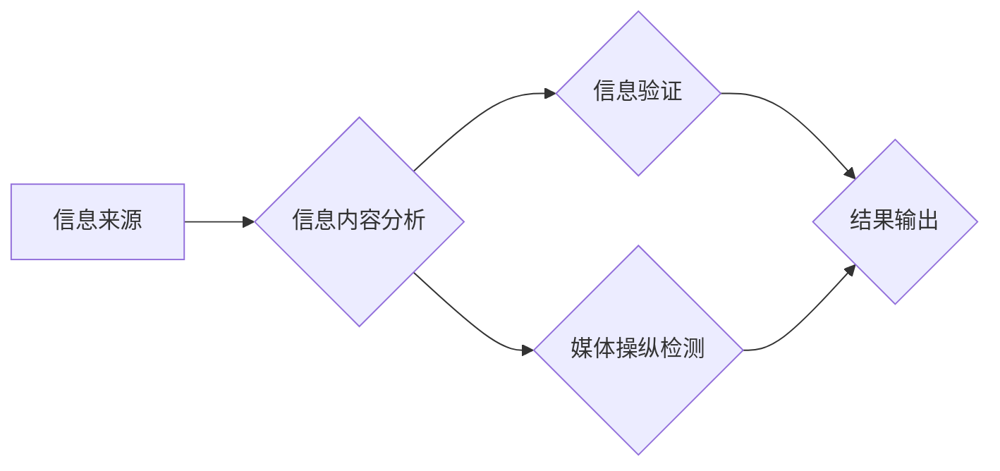

> 信息验证、批判性阅读、假新闻、媒体操纵、深度学习、自然语言处理、信息素养、网络安全

## 1. 背景介绍

在信息爆炸的时代，我们每天都被海量的信息淹没。从社交媒体到新闻网站，从搜索引擎到电子邮件，信息无处不在。然而，这些信息并非都真实可靠。假新闻、谣言、误导性内容泛滥，严重影响着人们的判断力和决策能力，甚至引发社会动荡。

面对这种信息环境的挑战，我们需要具备强大的信息验证和批判性阅读能力。这不仅关乎个人认知的健康发展，也关系到社会和谐稳定。

## 2. 核心概念与联系

**2.1 信息验证**

信息验证是指通过多种手段，对信息的真实性、准确性和可靠性进行核实的过程。它涉及到对信息来源、内容、时间、上下文等多方面的分析和判断。

**2.2 媒体操纵**

媒体操纵是指利用媒体平台和传播手段，有意地传播虚假信息、误导公众舆论，达到特定目的的行为。它可以采取多种形式，例如编造新闻、夸大事实、散播谣言、操控公关等。

**2.3 关键技术：深度学习与自然语言处理**

深度学习和自然语言处理（NLP）是信息验证和媒体操纵检测的关键技术。

* **深度学习**：通过构建复杂的网络模型，能够自动学习和识别信息中的模式和特征，例如识别假新闻的写作风格、识别谣言传播的网络结构等。
* **自然语言处理**：能够理解和处理人类语言，例如识别文本中的情感倾向、识别文本中的事实关系等。

**2.4 核心架构**



## 3. 核心算法原理 & 具体操作步骤

**3.1 算法原理概述**

信息验证和媒体操纵检测算法通常基于以下原理：

* **文本特征提取**: 从文本中提取关键词、语法结构、情感倾向等特征，作为算法的输入。
* **机器学习模型训练**: 利用大量真实和虚假信息的训练数据，训练机器学习模型，例如支持向量机（SVM）、随机森林（RF）、深度神经网络（DNN）等。
* **模型预测**: 将待验证的信息输入到训练好的模型中，模型根据学习到的特征和模式，预测该信息的真实性或媒体操纵可能性。

**3.2 算法步骤详解**

1. **数据收集**: 收集大量真实和虚假信息的文本数据，并进行预处理，例如去除停用词、分词、词性标注等。
2. **特征提取**: 利用自然语言处理技术，从文本中提取关键词、语法结构、情感倾向、写作风格等特征。
3. **模型选择**: 根据任务需求和数据特点，选择合适的机器学习模型，例如SVM、RF、DNN等。
4. **模型训练**: 利用训练数据，训练选择的机器学习模型，并进行模型评估，例如准确率、召回率、F1-score等。
5. **模型部署**: 将训练好的模型部署到实际应用场景中，例如网站、应用程序等。
6. **信息验证**: 将待验证的信息输入到部署的模型中，模型根据学习到的特征和模式，预测该信息的真实性或媒体操纵可能性。

**3.3 算法优缺点**

* **优点**:
    * 自动化程度高，能够快速处理大量信息。
    * 能够识别一些人类难以察觉的模式和特征。
    * 随着数据量的增加，模型的准确率会不断提高。
* **缺点**:
    * 需要大量高质量的训练数据。
    * 模型容易受到数据偏差的影响。
    * 难以识别新的、复杂的媒体操纵手法。

**3.4 算法应用领域**

* **新闻媒体**: 检测假新闻、谣言、误导性内容。
* **社交媒体**: 识别网络攻击、恶意传播、情绪操控等行为。
* **搜索引擎**: 排除虚假信息，提高搜索结果的可靠性。
* **政府机构**: 监测网络舆情，防范网络安全威胁。

## 4. 数学模型和公式 & 详细讲解 & 举例说明

**4.1 数学模型构建**

信息验证和媒体操纵检测算法通常基于概率模型，例如贝叶斯网络、隐马尔可夫模型等。这些模型能够描述信息之间的关系和依赖性，并根据输入的信息，计算出信息真实性的概率。

**4.2 公式推导过程**

例如，假设我们有一个贝叶斯网络模型，用于判断一条新闻是否为假新闻。该模型包含以下节点：

* **新闻来源**: 表示新闻的来源，例如知名媒体、个人博客等。
* **新闻内容**: 表示新闻的具体内容。
* **新闻真实性**: 表示新闻的真实性，例如真实、虚假等。

我们可以使用贝叶斯公式来计算新闻真实性的概率：

$$P(真实|来源,内容) = \frac{P(来源,内容|真实) * P(真实)}{P(来源,内容)}$$

其中：

* $P(真实|来源,内容)$: 给定新闻来源和内容，新闻真实性的概率。
* $P(来源,内容|真实)$: 给定新闻真实，新闻来源和内容的联合概率。
* $P(真实)$: 新闻真实性的先验概率。
* $P(来源,内容)$: 新闻来源和内容的联合概率。

**4.3 案例分析与讲解**

假设我们有一个来自个人博客的新闻，内容描述了某位政治人物的丑闻。根据贝叶斯网络模型，我们可以计算出该新闻真实性的概率。

* $P(来源,内容|真实)$: 个人博客发布真实新闻的概率较低。
* $P(真实)$: 政治丑闻的真实性概率较高。
* $P(来源,内容)$: 个人博客发布政治丑闻的概率较高。

根据以上信息，我们可以计算出该新闻真实性的概率，并根据该概率进行判断。

## 5. 项目实践：代码实例和详细解释说明

**5.1 开发环境搭建**

* 操作系统：Linux/macOS/Windows
* Python 版本：3.6+
* 必要的库：NLTK、spaCy、scikit-learn、TensorFlow/PyTorch

**5.2 源代码详细实现**

```python
# 导入必要的库
import nltk
import spacy
from sklearn.model_selection import train_test_split
from sklearn.linear_model import LogisticRegression

# 数据预处理
# ...

# 特征提取
def extract_features(text):
    # 使用 NLTK 和 spaCy 进行文本分析，提取关键词、语法结构、情感倾向等特征
    # ...
    return features

# 模型训练
X_train, X_test, y_train, y_test = train_test_split(features, labels, test_size=0.2)
model = LogisticRegression()
model.fit(X_train, y_train)

# 模型评估
accuracy = model.score(X_test, y_test)
print(f"模型准确率: {accuracy}")

# 信息验证
def verify_information(text):
    # 使用训练好的模型预测文本的真实性
    features = extract_features(text)
    prediction = model.predict([features])
    return prediction

# ...
```

**5.3 代码解读与分析**

* 数据预处理：对原始数据进行清洗、格式化、分词等操作，以便于后续的特征提取和模型训练。
* 特征提取：利用自然语言处理技术，从文本中提取关键词、语法结构、情感倾向等特征，作为模型的输入。
* 模型训练：使用机器学习算法，例如逻辑回归，对训练数据进行训练，学习文本特征与真实性的关系。
* 模型评估：使用测试数据评估模型的性能，例如准确率、召回率等。
* 信息验证：将待验证的信息输入到训练好的模型中，模型根据学习到的特征和模式，预测该信息的真实性。

**5.4 运行结果展示**

运行代码后，可以得到模型的准确率以及对特定文本的真实性预测结果。

## 6. 实际应用场景

**6.1 新闻媒体**

* 自动检测假新闻和谣言，提高新闻的真实性和可靠性。
* 识别媒体操纵手法，帮助用户辨别真实信息和虚假信息。
* 为新闻编辑提供数据支持，帮助他们做出更准确的判断。

**6.2 社交媒体**

* 识别网络攻击、恶意传播、情绪操控等行为，维护社交媒体平台的健康发展。
* 为用户提供信息验证服务，帮助他们识别虚假信息和垃圾信息。
* 帮助政府机构监测网络舆情，防范网络安全威胁。

**6.3 搜索引擎**

* 排除虚假信息，提高搜索结果的可靠性。
* 为用户提供信息来源和真实性评估，帮助他们做出更明智的选择。
* 帮助搜索引擎算法更好地理解用户需求，提供更精准的搜索结果。

**6.4 未来应用展望**

随着人工智能技术的不断发展，信息验证和媒体操纵检测技术将更加成熟和完善。未来，我们可以期待：

* 更准确、更可靠的信息验证系统。
* 更智能的媒体操纵检测系统，能够识别更复杂的操纵手法。
* 更广泛的应用场景，例如教育、医疗、金融等领域。

## 7. 工具和资源推荐

**7.1 学习资源推荐**

* **书籍**:
    * 《深度学习》
    * 《自然语言处理》
    * 《信息论与编码理论》
* **在线课程**:
    * Coursera: 深度学习
    * edX: 自然语言处理
    * Udacity: 机器学习工程师

**7.2 开发工具推荐**

* **Python**: 广泛应用于人工智能领域，拥有丰富的库和工具。
* **TensorFlow**: 开源深度学习框架，支持多种硬件平台。
* **PyTorch**: 开源深度学习框架，以其灵活性和易用性而闻名。
* **spaCy**: 开源自然语言处理库，提供强大的文本分析功能。

**7.3 相关论文推荐**

* **BERT**: Devlin et al. (2018)
* **GPT-3**: Brown et al. (2020)
* **XLNet**: Yang et al. (2019)

## 8. 总结：未来发展趋势与挑战

**8.1 研究成果总结**

近年来，信息验证和媒体操纵检测技术取得了显著进展，例如深度学习和自然语言处理技术的应用，使得模型的准确率和性能得到大幅提升。

**8.2 未来发展趋势**

* **模型更加智能化**: 能够识别更复杂的媒体操纵手法，并提供更精准的信息验证结果。
* **应用场景更加广泛**: 扩展到更多领域，例如教育、医疗、金融等。
* **数据安全和隐私保护**: 更加重视数据安全和隐私保护，确保信息验证过程的合法性和可靠性。

**8.3 面临的挑战**

* **数据偏差**: 训练数据可能存在偏差，导致模型的准确率下降。
* **新手法不断涌现**: 媒体操纵手法不断更新，模型需要不断学习和适应。
* **伦理问题**: 信息验证技术可能被滥用，例如用于监控和控制用户行为。

**8.4 研究展望**

未来，我们需要继续加强对信息验证和媒体操纵检测技术的研发，并关注其伦理和社会影响。同时，还需要加强公众的媒体素养教育，帮助他们提高信息辨别能力，抵御虚假信息和媒体操纵的侵害。

## 9. 附录：常见问题与解答

**9.1 如何判断一条信息是否真实？**

* 来源可靠：查看信息来源的信誉度和专业性。
* 内容逻辑：判断信息的逻辑性和可信度。
* 多方核实