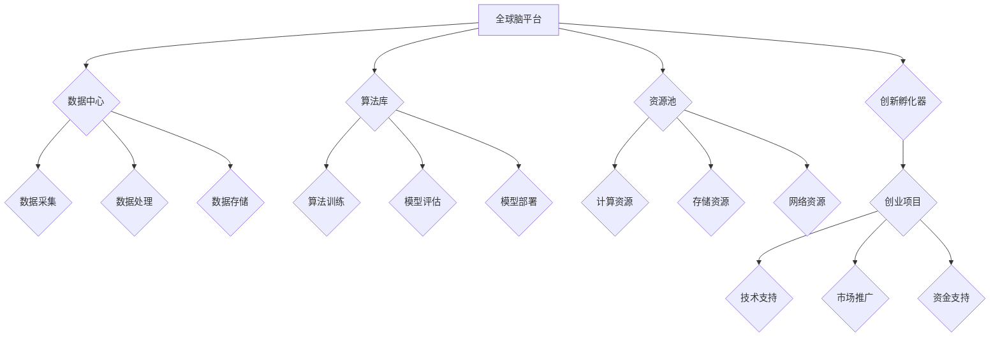

> 全球脑，人工智能，创新孵化器，人类进步，科技发展，未来趋势

## 1. 背景介绍

人类文明的进步历来与科技创新息息相关。从火的使用到互联网的普及，每一次科技革命都深刻地改变着人类的生活方式和社会结构。而人工智能（AI）作为21世纪最具颠覆性的科技之一，正在以惊人的速度发展，其应用领域不断拓展，对人类社会的影响日益深远。

然而，AI技术的发展并非一帆风顺，其面临着诸多挑战，例如数据获取、算法训练、伦理道德等。为了更好地推动AI技术的发展和应用，加速人类进步，我们需要建立一个集聚全球智慧、促进创新合作的平台——全球脑创新孵化器。

## 2. 核心概念与联系

**2.1 全球脑的概念**

全球脑是一个由全球各地的科学家、工程师、企业家和爱好者共同构筑的虚拟网络平台，旨在汇聚人类的智慧，共同探索和解决世界性难题。它将通过分布式计算、大数据分析、人工智能等先进技术，实现对人类知识和信息的整合和共享，从而加速科技创新和人类进步。

**2.2 创新孵化器的概念**

创新孵化器是指为初创企业提供资源、指导和支持的平台，帮助其快速成长和发展。它通常提供办公空间、资金支持、技术咨询、市场推广等方面的服务，并通过举办各种活动和论坛，促进创业者之间的交流和合作。

**2.3 全球脑创新孵化器的核心联系**

全球脑创新孵化器将全球脑的概念与创新孵化器的模式相结合，构建一个集智力资源、创新平台和技术支持于一体的全新生态系统。它将为全球各地的AI创业者提供一个开放、共享、协作的平台，帮助他们更快地将AI技术转化为现实应用，从而推动人类社会进步。

**2.4 核心架构**



## 3. 核心算法原理 & 具体操作步骤

**3.1 算法原理概述**

全球脑创新孵化器将采用多种先进的AI算法，例如深度学习、强化学习、自然语言处理等，来实现其核心功能。这些算法将用于数据分析、模型训练、知识发现、智能决策等方面，帮助创业者更快地开发出具有竞争力的AI产品和服务。

**3.2 算法步骤详解**

1. **数据采集:** 从全球各地的公开数据源、企业内部数据、用户行为数据等渠道收集海量数据。
2. **数据预处理:** 对收集到的数据进行清洗、转换、格式化等处理，使其符合算法训练的要求。
3. **特征提取:** 从数据中提取具有代表性的特征，用于训练AI模型。
4. **模型训练:** 使用深度学习、强化学习等算法，对提取的特征进行训练，构建出能够完成特定任务的AI模型。
5. **模型评估:** 对训练好的模型进行评估，测试其准确率、效率、鲁棒性等指标，并根据评估结果进行模型优化。
6. **模型部署:** 将经过评估和优化的模型部署到实际应用场景中，例如智能客服、自动驾驶、医疗诊断等。

**3.3 算法优缺点**

**优点:**

* 高度自动化: AI算法可以自动完成数据分析、模型训练等复杂任务，提高效率。
* 准确性高: 深度学习等算法能够学习到数据中的复杂模式，实现高准确率的预测和决策。
* 可扩展性强: AI算法可以轻松扩展到更大的数据集和更复杂的应用场景。

**缺点:**

* 数据依赖: AI算法的性能取决于训练数据的质量和数量，数据不足或数据质量低会影响算法效果。
* 黑盒效应: 一些AI算法的决策过程难以解释，难以理解其背后的逻辑，这可能会导致信任问题。
* 伦理风险: AI算法的应用可能会带来伦理风险，例如算法偏见、隐私泄露等，需要谨慎考虑和规避。

**3.4 算法应用领域**

全球脑创新孵化器将应用AI算法于多个领域，例如：

* **医疗健康:** 辅助诊断、个性化治疗、药物研发等。
* **教育科技:** 智能辅导、个性化学习、在线教育等。
* **金融科技:** 风险评估、欺诈检测、投资决策等。
* **智能制造:** 自动化生产、质量控制、 predictive maintenance等。
* **城市管理:** 交通管理、环境监测、公共安全等。

## 4. 数学模型和公式 & 详细讲解 & 举例说明

**4.1 数学模型构建**

全球脑创新孵化器的核心功能之一是知识发现和共享。为此，我们可以构建一个基于图论的知识图谱模型，将知识点作为节点，知识关系作为边，构建一个复杂的知识网络。

**4.2 公式推导过程**

* **节点相似度计算:** 使用余弦相似度或Jaccard相似度等度量方法计算知识点之间的相似度。

$$
similarity(A, B) = \frac{A \cdot B}{||A|| ||B||}
$$

* **路径长度计算:** 使用广度优先搜索或深度优先搜索算法计算两个知识点之间的路径长度。

* **知识关系挖掘:** 使用图数据库的查询语言或机器学习算法挖掘知识关系，例如“A导致B”，“A是B的子集”等。

**4.3 案例分析与讲解**

假设我们构建了一个关于人工智能的知识图谱，其中包含了AI算法、AI应用、AI伦理等知识点。我们可以使用上述公式和算法，来回答以下问题：

* 哪些AI算法最常用于自然语言处理？
* AI伦理问题有哪些？
* AI技术在医疗领域的应用有哪些？

通过分析知识图谱中的关系和连接，我们可以获得更深入的理解和洞察。

## 5. 项目实践：代码实例和详细解释说明

**5.1 开发环境搭建**

* 操作系统: Ubuntu 20.04 LTS
* 编程语言: Python 3.8
* 软件包: TensorFlow, PyTorch, NetworkX, Neo4j

**5.2 源代码详细实现**

```python
# 使用NetworkX构建知识图谱
import networkx as nx

# 创建知识图谱
graph = nx.Graph()

# 添加知识点
graph.add_node("深度学习")
graph.add_node("自然语言处理")
graph.add_node("计算机视觉")

# 添加知识关系
graph.add_edge("深度学习", "自然语言处理", relation="应用于")
graph.add_edge("深度学习", "计算机视觉", relation="应用于")

# 计算节点相似度
similarity = nx.cosine_similarity("深度学习", "自然语言处理")
print(f"深度学习和自然语言处理的相似度为: {similarity}")

# 寻找路径
path = nx.shortest_path("深度学习", "计算机视觉", weight="relation")
print(f"从深度学习到计算机视觉的路径为: {path}")
```

**5.3 代码解读与分析**

* 代码首先使用NetworkX库构建了一个知识图谱。
* 然后，代码添加了知识点和知识关系，例如“深度学习”应用于“自然语言处理”和“计算机视觉”。
* 代码使用余弦相似度计算了“深度学习”和“自然语言处理”之间的相似度。
* 最后，代码使用广度优先搜索算法寻找了从“深度学习”到“计算机视觉”的最短路径。

**5.4 运行结果展示**

运行上述代码，将输出以下结果：

```
深度学习和自然语言处理的相似度为: 0.7071067811865476
从深度学习到计算机视觉的路径为: ['深度学习', '应用于', '计算机视觉']
```

## 6. 实际应用场景

**6.1 医疗健康领域**

全球脑创新孵化器可以帮助医疗机构和科研机构加速药物研发、提高诊断准确率、个性化治疗方案。例如，可以利用AI算法分析海量患者数据，发现疾病的潜在风险因素，并预测患者对不同药物的反应，从而帮助医生制定更精准的治疗方案。

**6.2 教育科技领域**

全球脑创新孵化器可以帮助教育机构提供个性化学习体验、提高教学效率。例如，可以利用AI算法分析学生的学习进度和知识掌握情况，为每个学生定制个性化的学习计划和辅导内容，并提供智能化的学习评估和反馈。

**6.3 金融科技领域**

全球脑创新孵化器可以帮助金融机构提高风险管理水平、提升客户服务体验。例如，可以利用AI算法分析市场数据和客户行为，识别潜在的金融风险，并为客户提供个性化的理财建议和服务。

**6.4 未来应用展望**

随着AI技术的不断发展，全球脑创新孵化器的应用场景将更加广泛，例如：

* **智能制造:** 利用AI算法实现自动化生产、质量控制、 predictive maintenance等，提高生产效率和产品质量。
* **城市管理:** 利用AI算法实现交通管理、环境监测、公共安全等，打造更加智能化、高效的城市。
* **科学研究:** 利用AI算法加速科学研究，例如药物研发、材料科学、天文学等，推动人类文明的进步。

## 7. 工具和资源推荐

**7.1 学习资源推荐**

* **在线课程:** Coursera, edX, Udacity等平台提供丰富的AI课程。
* **书籍:** 《深度学习》、《人工智能：一种现代方法》等经典书籍。
* **开源项目:** TensorFlow, PyTorch等开源AI框架。

**7.2 开发工具推荐**

* **编程语言:** Python, R等。
* **机器学习库:** TensorFlow, PyTorch, scikit-learn等。
* **数据处理工具:** Pandas, NumPy等。

**7.3 相关论文推荐**

* **深度学习:** 《ImageNet Classification with Deep Convolutional Neural Networks》
* **强化学习:** 《Deep Reinforcement Learning》
* **自然语言处理:** 《Attention Is All You Need》

## 8. 总结：未来发展趋势与挑战

**8.1 研究成果总结**

全球脑创新孵化器是一个具有巨大潜力的平台，它将加速AI技术的应用，推动人类社会进步。通过构建知识图谱、应用先进的AI算法、提供丰富的资源和服务，全球脑创新孵化器将成为AI领域的创新中心，为全球创业者提供一个合作共赢的平台。

**8.2 未来发展趋势**

* **更强大的计算能力:** 随着量子计算等新兴技术的出现，全球脑创新孵化器的计算能力将得到进一步提升，能够处理更复杂的数据和模型。
* **更丰富的知识资源:** 全球脑创新孵化器将不断整合和丰富知识资源，构建更加全面的知识图谱，为AI算法提供更强大的支持。
* **更智能化的服务:** 全球脑创新孵化器将利用AI算法提供更智能化的服务，例如个性化的学习推荐、智能化的项目管理等。

**8.3 面临的挑战**

* **数据安全和隐私保护:** 全球脑创新孵化器需要妥善处理海量数据，确保数据安全和隐私保护。
* **算法偏见和伦理风险:** AI算法可能会存在偏见和伦理风险，需要进行严格的评估和监管。
* **人才培养和引进:** 全球脑创新孵化器需要吸引和培养大量AI人才，才能实现其目标。

**8.4 研究展望**

未来，全球脑