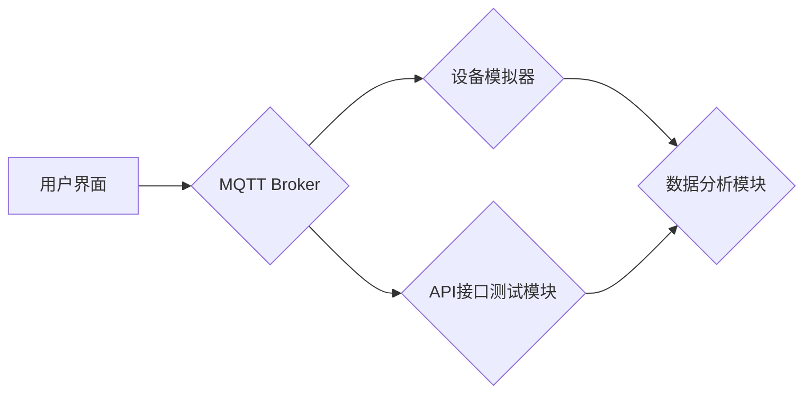

> MQTT, RESTful API, 智能家居, 自动化测试, 平台架构, 协议解析, 数据交互, 测试用例

## 1. 背景介绍

随着物联网技术的快速发展，智能家居已成为现代生活的重要组成部分。智能家居系统通过传感器、 actuators 和网络连接，实现对家居环境的智能控制和管理，为用户提供更加便捷、舒适和安全的居住体验。然而，智能家居系统的复杂性也带来了新的挑战，例如设备互联互通、数据安全、系统稳定性等。为了确保智能家居系统的可靠性和安全性，需要进行全面的测试和验证。

传统的智能家居测试方法往往依赖于人工操作和目视检查，效率低下且难以覆盖所有场景。随着智能家居系统的规模和复杂度不断增加，传统的测试方法已难以满足需求。因此，亟需开发一种高效、自动化、可扩展的智能家居测试平台。

## 2. 核心概念与联系

### 2.1 MQTT协议

MQTT（Message Queuing Telemetry Transport）是一种轻量级的消息传输协议，专门设计用于物联网应用场景。它采用发布/订阅模式，支持设备间异步通信，具有低功耗、高可靠性和实时性等特点，非常适合智能家居系统中的设备互联。

### 2.2 RESTful API

RESTful API（Representational State Transfer Application Programming Interface）是一种基于 HTTP 协议的软件架构风格，用于构建 Web 服务。它采用资源定位、状态转移和自描述等原则，提供了一种简单、灵活和可扩展的接口设计方式。RESTful API 广泛应用于智能家居系统中，用于设备控制、数据获取和系统管理等功能。

### 2.3 平台架构

基于 MQTT 协议和 RESTful API 的智能家居自动化测试平台，其核心架构如图所示：



**平台架构说明：**

* **用户界面：** 提供用户操作和测试用例管理界面。
* **MQTT Broker：** 负责消息的发布和订阅，连接设备模拟器和 API 接口测试模块。
* **设备模拟器：** 模拟智能家居设备，发送和接收 MQTT 消息，并提供设备状态和行为模拟。
* **API 接口测试模块：** 发送 RESTful API 请求，验证 API 接口的正确性、性能和安全性。
* **数据分析模块：** 收集和分析测试数据，生成测试报告和性能指标。

## 3. 核心算法原理 & 具体操作步骤

### 3.1 算法原理概述

本平台的核心算法主要包括 MQTT 消息解析、API 接口测试和数据分析。

* **MQTT 消息解析：** 基于 MQTT 协议规范，解析 MQTT 消息内容，提取设备状态、控制指令等信息。
* **API 接口测试：** 基于 RESTful API 设计规范，设计测试用例，发送 API 请求，验证 API 返回结果和状态码。
* **数据分析：** 收集测试数据，进行统计分析和可视化展示，生成测试报告和性能指标。

### 3.2 算法步骤详解

**MQTT 消息解析步骤：**

1. 接收 MQTT 消息。
2. 解析消息头，获取消息类型、主题、QoS 等信息。
3. 解析消息体，提取设备状态、控制指令等信息。
4. 将解析结果存储到数据库或内存中。

**API 接口测试步骤：**

1. 根据测试用例，构建 API 请求报文。
2. 发送 API 请求到服务器。
3. 接收服务器返回的响应报文。
4. 验证响应报文状态码、内容和格式。
5. 记录测试结果。

**数据分析步骤：**

1. 收集测试数据，包括 API 接口测试结果、设备状态变化等。
2. 对测试数据进行统计分析，例如成功率、响应时间、错误率等。
3. 使用图表和报告等形式展示分析结果。

### 3.3 算法优缺点

**优点：**

* **高效自动化：** 自动化测试流程，提高测试效率。
* **全面覆盖：** 可以覆盖多种测试场景，例如设备连接、控制指令、数据交互等。
* **可扩展性强：** 可以根据需要添加新的设备模拟器和 API 接口测试模块。

**缺点：**

* **开发成本较高：** 需要开发复杂的测试平台和工具。
* **测试环境复杂：** 需要搭建模拟智能家居环境。
* **测试用例设计难度大：** 需要考虑各种可能的场景和异常情况。

### 3.4 算法应用领域

本平台的算法可以应用于智能家居系统的测试和验证，例如：

* **设备互联互通测试：** 验证不同设备之间的通信协议和数据交互。
* **功能测试：** 验证智能家居系统各个功能的正确性，例如灯光控制、温度调节、安全报警等。
* **性能测试：** 测试智能家居系统的响应时间、吞吐量和稳定性。
* **安全性测试：** 验证智能家居系统的安全机制，例如数据加密、身份认证等。

## 4. 数学模型和公式 & 详细讲解 & 举例说明

### 4.1 数学模型构建

本平台的测试数据分析采用统计学模型，主要包括以下几个指标：

* **成功率：** 指测试用例执行成功的比例，计算公式为：

$$
SuccessRate = \frac{SuccessfulCases}{TotalCases}
$$

* **平均响应时间：** 指 API 接口响应的平均时间，计算公式为：

$$
AverageResponseTime = \frac{SumOfResponseTimes}{NumberOfRequests}
$$

* **错误率：** 指测试用例执行失败的比例，计算公式为：

$$
ErrorRate = \frac{FailedCases}{TotalCases}
$$

### 4.2 公式推导过程

上述公式的推导过程基于基本统计学原理，例如样本平均、比例计算等。

* **成功率：** 成功率是测试用例成功次数与总测试次数的比值，反映了测试用例的执行成功率。
* **平均响应时间：** 平均响应时间是所有 API 接口响应时间的总和除以请求次数，反映了 API 接口的响应速度。
* **错误率：** 错误率是测试用例失败次数与总测试次数的比值，反映了测试用例的执行失败率。

### 4.3 案例分析与讲解

假设进行 100 次 API 接口测试，其中 95 次成功，5 次失败，平均响应时间为 200 毫秒。

* 成功率：95/100 = 0.95
* 错误率：5/100 = 0.05
* 平均响应时间：200 毫秒

通过以上指标，可以评估 API 接口的性能和稳定性。

## 5. 项目实践：代码实例和详细解释说明

### 5.1 开发环境搭建

本平台的开发环境包括：

* 操作系统：Linux 或 Windows
* 编程语言：Python
* MQTT Broker：Mosquitto
* 数据库：MySQL 或 PostgreSQL

### 5.2 源代码详细实现

以下代码示例展示了 MQTT 消息解析和 API 接口测试的实现：

```python
# MQTT 消息解析
import paho.mqtt.client as mqtt

def on_message(client, userdata, message):
    print("Received message:", str(message.payload.decode("utf-8")))

client = mqtt.Client()
client.on_message = on_message
client.connect("mqtt.example.com", 1883, 60)
client.subscribe("home/status")
client.loop_forever()

# API 接口测试
import requests

def test_api(url, method="GET", data=None):
    response = requests.request(method, url, data=data)
    print("API response:", response.text)
    assert response.status_code == 200, "API request failed"

test_api("http://api.example.com/lights")
```

### 5.3 代码解读与分析

* **MQTT 消息解析：** 使用 paho-mqtt 库连接 MQTT Broker，订阅主题 "home/status"，接收设备状态消息并打印到控制台。
* **API 接口测试：** 使用 requests 库发送 API 请求，验证 API 返回状态码和内容。

### 5.4 运行结果展示

运行以上代码，可以实现以下功能：

* 连接 MQTT Broker，接收设备状态消息。
* 发送 API 请求，获取灯光状态信息。

## 6. 实际应用场景

本平台可以应用于智能家居系统的测试和验证，例如：

* **新设备接入测试：** 验证新设备是否能够正常连接 MQTT Broker，并发送和接收消息。
* **功能更新测试：** 验证智能家居系统功能更新是否正常，例如灯光控制、温度调节等。
* **系统稳定性测试：** 模拟大量设备连接和数据交互，验证智能家居系统的稳定性。

### 6.4 未来应用展望

未来，本平台可以进一步扩展功能，例如：

* 支持更多协议和接口，例如 Zigbee、Z-Wave、HTTP 等。
* 支持自动化测试用例生成和执行。
* 集成机器学习算法，进行智能测试用例优化和故障诊断。

## 7. 工具和资源推荐

### 7.1 学习资源推荐

* **MQTT 协议规范：** https://docs.oasis-open.org/mqtt/mqtt/v3.1.1/os/mqtt-v3.1.1-os.html
* **RESTful API 设计规范：** https://restfulapi.net/

### 7.2 开发工具推荐

* **MQTT Broker：** Mosquitto (https://mosquitto.org/)
* **API 测试工具：** Postman (https://www.postman.com/)
* **Python 开发环境：** PyCharm (https://www.jetbrains.com/pycharm/)

### 7.3 相关论文推荐

* **MQTT协议在物联网中的应用研究**
* **基于RESTful API的智能家居系统设计与实现**

## 8. 总结：未来发展趋势与挑战

### 8.1 研究成果总结

本平台基于 MQTT 协议和 RESTful API，构建了一个高效、自动化、可扩展的智能家居自动化测试平台。该平台可以帮助开发者快速测试和验证智能家居系统的功能、性能和安全性。

### 8.2 未来发展趋势

未来，智能家居测试平台将朝着以下方向发展：

* **更智能化：** 利用机器学习算法，进行智能测试用例生成和优化。
* **更自动化：** 实现自动化测试用例执行和报告生成。
* **更安全：** 加强数据安全保护，防止测试数据泄露。

### 8.3 面临的挑战

智能家居测试平台面临的挑战包括：

* **测试环境复杂：** 智能家居系统涉及多种设备和协议，搭建测试环境难度较大。
* **测试用例设计难度大：** 需要考虑各种可能的场景和异常情况，设计全面覆盖的测试用例。
* **数据安全问题：** 需要保护测试数据安全，防止泄露。

### 8.4 研究展望

未来，我们将继续研究智能家居测试平台的优化和扩展，例如：

* 开发更智能的测试用例生成算法。
* 实现自动化测试用例执行和报告生成。
* 加强数据安全保护机制。


## 9. 附录：常见问题与解答

**常见问题：**

* **如何搭建测试环境？**

**解答：**

搭建测试环境需要准备以下硬件和软件：

* **硬件：** 智能家居设备、路由器、电脑
* **软件：** MQTT Broker、数据库、API 测试工具

**详细步骤：**

1. 安装 MQTT Broker 和数据库。
2. 连接智能家居设备到 MQTT Broker。
3. 安装 API 测试工具，配置 API 接口地址。
4. 开发测试用例，并运行测试。

* **如何设计测试用例？**

**解答：**

设计测试用例需要考虑以下因素：

* **功能覆盖：** 确保测试用例涵盖所有智能家居系统功能。
* **场景覆盖：**