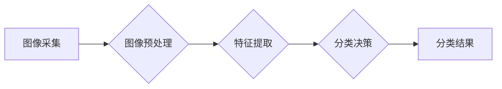

> OpenCV,图像分类,鲜花识别,深度学习,卷积神经网络,Python

## 1. 背景介绍

鲜花作为一种重要的观赏植物，在人们的生活中扮演着重要的角色。随着人工智能技术的快速发展，图像识别技术也取得了长足的进步。基于图像识别的鲜花分类系统能够自动识别不同种类的鲜花，为花卉种植、销售、研究等领域提供便利。

传统的鲜花分类方法主要依赖于人工特征提取，效率低且难以处理复杂的花卉品种。而深度学习技术能够自动学习图像特征，提高分类精度和效率。本文将介绍基于OpenCV和深度学习的鲜花图像分类系统的设计与实现。

## 2. 核心概念与联系

### 2.1  图像分类概述

图像分类是指将图像自动地归类到预定义的类别中。它是一个重要的计算机视觉任务，广泛应用于图像检索、目标检测、医疗诊断等领域。

### 2.2  OpenCV

OpenCV（Open Source Computer Vision Library）是一个开源的计算机视觉库，提供了一系列图像处理、计算机视觉和机器学习算法。它支持多种编程语言，包括C++、Python、Java等。

### 2.3  深度学习

深度学习是一种机器学习的子领域，利用多层神经网络来学习数据特征。卷积神经网络（CNN）是深度学习中的一种常用网络结构，能够有效地提取图像特征。

**核心架构流程图**



## 3. 核心算法原理 & 具体操作步骤

### 3.1  算法原理概述

本文采用基于CNN的图像分类算法。CNN能够自动学习图像特征，并将其映射到不同的类别。

### 3.2  算法步骤详解

1. **图像采集:** 从摄像头或图像文件获取鲜花图像。
2. **图像预处理:** 对图像进行尺寸调整、归一化、数据增强等操作，提高图像质量和算法性能。
3. **特征提取:** 使用预训练的CNN模型提取图像特征。
4. **分类决策:** 将提取的特征输入到全连接层，进行分类决策。
5. **分类结果:** 输出分类结果，例如“玫瑰”、“百合”、“向日葵”等。

### 3.3  算法优缺点

**优点:**

* 自动学习图像特征，无需人工特征提取。
* 分类精度高，能够识别复杂的花卉品种。
* 算法效率高，能够快速完成图像分类。

**缺点:**

* 需要大量的训练数据。
* 模型训练时间长，需要强大的计算资源。

### 3.4  算法应用领域

* **花卉种植:** 自动识别不同种类的鲜花，帮助种植者进行品种管理和病虫害防治。
* **花卉销售:** 自动识别鲜花种类和质量，提高销售效率和准确性。
* **花卉研究:** 自动识别和分类鲜花样本，为花卉研究提供数据支持。

## 4. 数学模型和公式 & 详细讲解 & 举例说明

### 4.1  数学模型构建

CNN模型由多个卷积层、池化层和全连接层组成。卷积层使用卷积核提取图像特征，池化层对特征图进行降维，全连接层进行分类决策。

### 4.2  公式推导过程

卷积操作的数学公式如下：

$$
y_{i,j} = \sum_{m=0}^{M-1} \sum_{n=0}^{N-1} x_{i+m,j+n} * w_{m,n} + b
$$

其中：

* $y_{i,j}$ 是卷积核输出的像素值。
* $x_{i+m,j+n}$ 是输入图像的像素值。
* $w_{m,n}$ 是卷积核的权值。
* $b$ 是偏置项。

### 4.3  案例分析与讲解

假设输入图像大小为 32x32，卷积核大小为 3x3，步长为 1。则卷积操作后，输出图像大小为 30x30。

## 5. 项目实践：代码实例和详细解释说明

### 5.1  开发环境搭建

* Python 3.x
* OpenCV 4.x
* TensorFlow/Keras

### 5.2  源代码详细实现

```python
import cv2
import numpy as np
from tensorflow.keras.models import load_model

# 加载预训练模型
model = load_model('flower_classification_model.h5')

# 定义图像预处理函数
def preprocess_image(image):
    image = cv2.resize(image, (224, 224))
    image = image / 255.0
    image = np.expand_dims(image, axis=0)
    return image

# 加载图像并进行预处理
image = cv2.imread('flower_image.jpg')
preprocessed_image = preprocess_image(image)

# 进行图像分类
prediction = model.predict(preprocessed_image)
predicted_class = np.argmax(prediction)

# 输出分类结果
class_names = ['rose', 'lily', 'sunflower']
print(f'Predicted class: {class_names[predicted_class]}')

# 显示图像
cv2.imshow('Flower Image', image)
cv2.waitKey(0)
cv2.destroyAllWindows()
```

### 5.3  代码解读与分析

1. **加载预训练模型:** 使用 `load_model()` 函数加载预训练的CNN模型。
2. **定义图像预处理函数:** 对图像进行尺寸调整、归一化和添加批处理维度。
3. **加载图像并进行预处理:** 使用 `cv2.imread()` 函数加载图像，并调用预处理函数进行预处理。
4. **进行图像分类:** 使用 `model.predict()` 函数对预处理后的图像进行分类，得到预测概率。
5. **输出分类结果:** 使用 `np.argmax()` 函数获取预测概率最大的类别，并根据类别名称输出分类结果。
6. **显示图像:** 使用 `cv2.imshow()` 函数显示图像。

### 5.4  运行结果展示

运行代码后，将显示加载的鲜花图像，并输出预测的鲜花类别。

## 6. 实际应用场景

### 6.1  花卉种植

鲜花种植过程中，需要对不同种类的鲜花进行识别和管理。基于图像分类系统的鲜花识别技术可以帮助种植者：

* 自动识别不同种类的鲜花，方便进行品种管理。
* 识别鲜花病虫害，及时采取防治措施。
* 监测鲜花生长状况，优化种植方案。

### 6.2  花卉销售

花卉销售过程中，需要对鲜花种类和质量进行快速准确的识别。基于图像分类系统的鲜花识别技术可以帮助花卉销售人员：

* 自动识别鲜花种类，提高销售效率。
* 根据鲜花种类和质量进行定价，确保合理利润。
* 为顾客提供准确的鲜花信息，提升顾客体验。

### 6.3  花卉研究

花卉研究需要对大量鲜花样本进行分类和分析。基于图像分类系统的鲜花识别技术可以帮助花卉研究人员：

* 自动识别和分类鲜花样本，为研究提供数据支持。
* 分析鲜花特征，研究花卉品种的遗传关系。
* 监测鲜花生长发育过程，研究花卉的生物学特性。

### 6.4  未来应用展望

随着人工智能技术的不断发展，鲜花图像分类系统将拥有更广泛的应用场景，例如：

* **智能家居:** 利用鲜花图像分类系统，实现智能家居中的花卉管理功能。
* **电商平台:** 在电商平台上，利用鲜花图像分类系统，实现自动识别和推荐鲜花功能。
* **医疗诊断:** 利用鲜花图像分类系统，辅助医生进行植物性疾病的诊断。

## 7. 工具和资源推荐

### 7.1  学习资源推荐

* **OpenCV官方文档:** https://docs.opencv.org/
* **TensorFlow官方文档:** https://www.tensorflow.org/
* **Keras官方文档:** https://keras.io/

### 7.2  开发工具推荐

* **VS Code:** https://code.visualstudio.com/
* **PyCharm:** https://www.jetbrains.com/pycharm/

### 7.3  相关论文推荐

* **AlexNet: ImageNet Classification with Deep Convolutional Neural Networks:** https://papers.nips.cc/paper/4824-imagenet-classification-with-deep-convolutional-neural-networks.pdf
* **VGGNet: Very Deep Convolutional Networks for Large-Scale Image Recognition:** https://arxiv.org/abs/1409.1556

## 8. 总结：未来发展趋势与挑战

### 8.1  研究成果总结

本文介绍了基于OpenCV和深度学习的鲜花图像分类系统的设计与实现。该系统能够自动识别不同种类的鲜花，并具有较高的分类精度。

### 8.2  未来发展趋势

* **模型精度提升:** 探索更深更复杂的CNN模型结构，提高鲜花图像分类的精度。
* **实时性增强:** 优化模型推理速度，实现实时鲜花图像分类。
* **多模态融合:** 将图像识别与其他传感器数据融合，例如气味、纹理等，提高鲜花识别准确率。

### 8.3  面临的挑战

* **数据标注:** 鲜花图像分类需要大量的标注数据，数据标注工作量大且耗时。
* **模型泛化能力:** 现有的模型在识别新花卉品种时，泛化能力有限。
* **计算资源:** 训练深度学习模型需要大量的计算资源，成本较高。

### 8.4  研究展望

未来将继续研究鲜花图像分类技术，探索更先进的算法和模型，提高鲜花识别精度和效率，并将其应用于更多领域。

## 9. 附录：常见问题与解答

**Q1: 如何获取鲜花图像数据集？**

**A1:** 可以从公开的图像数据库中获取，例如ImageNet、CIFAR-10等。也可以自己收集鲜花图像数据。

**Q2: 如何训练鲜花图像分类模型？**

**A2:** 可以使用TensorFlow或Keras等深度学习框架，训练CNN模型。需要准备标注数据，并选择合适的模型结构和训练参数。

**Q3: 如何评估鲜花图像分类模型的性能？**

**A3:** 可以使用准确率、召回率、F1-score等指标来评估模型性能。

作者：禅与计算机程序设计艺术 / Zen and the Art of Computer Programming


<end_of_turn>