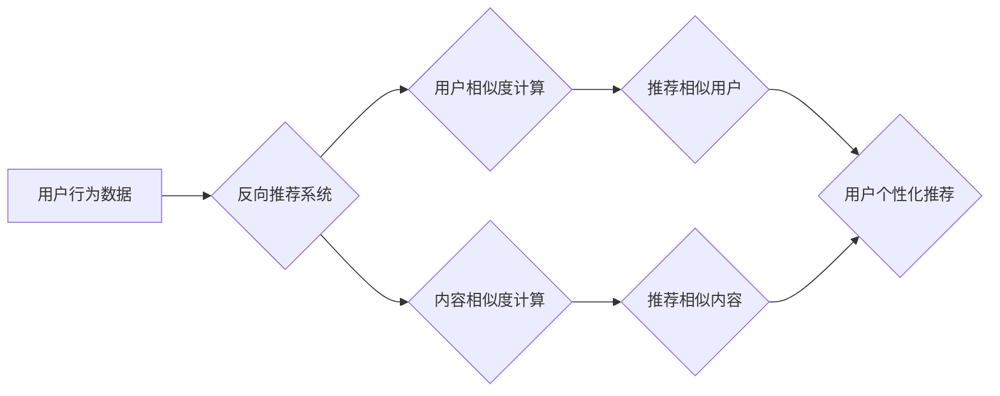

> 反向推荐，个性化推荐，协同过滤，矩阵分解，深度学习，用户行为分析

## 1. 背景介绍

在信息爆炸的时代，海量数据和个性化需求的日益增长，使得推荐系统成为连接用户和内容的关键桥梁。传统的基于内容的推荐和基于协同过滤的推荐算法，虽然取得了一定的成功，但仍然存在一些局限性。例如，基于内容的推荐算法容易陷入“同质化推荐”的困境，而基于协同过滤的算法则难以处理冷启动问题和数据稀疏性问题。

反向推荐，也称为逆向推荐，是一种新兴的推荐算法，它从用户的角度出发，通过分析用户的历史行为、偏好和兴趣，推荐与用户相关的其他用户、内容或服务。反向推荐能够有效解决传统推荐算法的局限性，并为用户提供更个性化、更精准的推荐体验。

## 2. 核心概念与联系

### 2.1  反向推荐的概念

反向推荐是指根据用户的行为数据，推荐与用户兴趣相似的其他用户、内容或服务。例如，如果用户A喜欢观看科幻电影，反向推荐系统可以推荐与用户A兴趣相似的其他用户，或者推荐与用户A观看过的科幻电影风格相似的其他电影。

### 2.2  反向推荐与传统推荐算法的联系

反向推荐可以看作是传统推荐算法的一种扩展，它将用户的行为数据作为核心要素，并通过分析用户之间的关系和内容之间的相似性，实现个性化推荐。

**反向推荐与传统推荐算法的关系可概括如下：**

* **基于内容的推荐:** 反向推荐可以利用用户对内容的偏好，推荐与用户兴趣相似的其他用户，从而扩展用户的内容发现范围。
* **基于协同过滤的推荐:** 反向推荐可以利用用户之间的相似性，推荐与用户兴趣相似的其他用户，从而发现更多与用户兴趣相符的内容。

**反向推荐与传统推荐算法的差异主要体现在以下几个方面：**

* **推荐对象:** 传统推荐算法主要推荐内容，而反向推荐可以推荐用户、内容或服务。
* **推荐依据:** 传统推荐算法主要基于用户对内容的评分或浏览记录，而反向推荐则更注重用户之间的关系和行为相似性。
* **推荐策略:** 传统推荐算法通常采用基于内容的匹配或基于协同过滤的相似度计算，而反向推荐则可能采用更复杂的机器学习算法，例如深度学习。

**Mermaid 流程图：**



## 3. 核心算法原理 & 具体操作步骤

### 3.1  算法原理概述

反向推荐算法的核心原理是基于用户行为数据，计算用户之间的相似度和内容之间的相似度，从而推荐与用户兴趣相似的其他用户、内容或服务。

**主要算法包括：**

* **协同过滤:** 基于用户对内容的评分或浏览记录，计算用户之间的相似度，推荐与用户兴趣相似的其他用户。
* **矩阵分解:** 将用户-内容交互矩阵分解成用户特征矩阵和内容特征矩阵，通过计算用户和内容的特征相似度，实现推荐。
* **深度学习:** 利用深度神经网络，学习用户行为数据中的复杂模式，实现更精准的个性化推荐。

### 3.2  算法步骤详解

**以协同过滤算法为例，详细说明反向推荐算法的具体操作步骤：**

1. **数据收集:** 收集用户对内容的评分、浏览记录、购买记录等行为数据。
2. **数据预处理:** 对收集到的数据进行清洗、去噪、格式转换等预处理操作。
3. **相似度计算:** 利用余弦相似度、皮尔逊相关系数等方法，计算用户之间的相似度和内容之间的相似度。
4. **推荐结果生成:** 根据用户之间的相似度和内容之间的相似度，推荐与用户兴趣相似的其他用户、内容或服务。
5. **结果评估:** 利用准确率、召回率、F1-score等指标，评估推荐结果的质量。

### 3.3  算法优缺点

**协同过滤算法的优缺点：**

* **优点:**

    * 能够发现用户之间的隐性关系，推荐更个性化的内容。
    * 算法原理简单易懂，易于实现。

* **缺点:**

    * 容易受到数据稀疏性的影响，难以推荐冷启动用户或冷启动内容。
    * 存在数据偏差问题，可能导致推荐结果不准确。

### 3.4  算法应用领域

反向推荐算法广泛应用于以下领域：

* **电商推荐:** 推荐与用户兴趣相似的其他用户，或者推荐与用户购买过的商品风格相似的其他商品。
* **社交推荐:** 推荐与用户兴趣相似的其他用户，帮助用户拓展社交圈。
* **内容推荐:** 推荐与用户阅读习惯相似的其他用户，或者推荐与用户阅读过的文章主题相似的其他文章。

## 4. 数学模型和公式 & 详细讲解 & 举例说明

### 4.1  数学模型构建

**协同过滤算法的数学模型:**

* **用户-内容交互矩阵:** 用矩阵 $R$ 表示用户-内容交互关系，其中 $R_{ui}$ 表示用户 $u$ 对内容 $i$ 的评分或交互行为。

* **用户特征向量:** 用向量 $u$ 表示用户 $u$ 的特征，其中 $u_j$ 表示用户 $u$ 在特征 $j$ 上的得分。

* **内容特征向量:** 用向量 $v$ 表示内容 $i$ 的特征，其中 $v_j$ 表示内容 $i$ 在特征 $j$ 上的得分。

**模型假设:** 用户对内容的评分可以表示为用户特征向量和内容特征向量的内积。

### 4.2  公式推导过程

**目标函数:**

$$
\min_{u,v} \frac{1}{2} \sum_{u,i} (R_{ui} - u \cdot v) ^2 + \lambda (||u||^2 + ||v||^2)
$$

其中:

* $R_{ui}$ 是用户 $u$ 对内容 $i$ 的评分。
* $u$ 是用户 $u$ 的特征向量。
* $v$ 是内容 $i$ 的特征向量。
* $\lambda$ 是正则化参数，用于防止模型过拟合。

**优化方法:**

可以使用梯度下降法或其他优化算法，对目标函数进行最小化，从而得到用户特征向量和内容特征向量。

### 4.3  案例分析与讲解

**举例说明:**

假设有一个用户-内容交互矩阵 $R$，其中用户 $u$ 对内容 $i$ 的评分为 $R_{ui}$。

使用协同过滤算法，可以得到用户 $u$ 的特征向量 $u$ 和内容 $i$ 的特征向量 $v$。

然后，可以计算用户 $u$ 对内容 $i$ 的预测评分:

$$
\hat{R}_{ui} = u \cdot v
$$

如果 $\hat{R}_{ui}$ 与实际评分 $R_{ui}$ 相近，则说明推荐结果准确。

## 5. 项目实践：代码实例和详细解释说明

### 5.1  开发环境搭建

* **操作系统:** Ubuntu 20.04 LTS
* **编程语言:** Python 3.8
* **库依赖:**

    * numpy
    * pandas
    * scikit-learn
    * matplotlib

### 5.2  源代码详细实现

```python
import numpy as np
from sklearn.metrics.pairwise import cosine_similarity

# 用户-内容交互矩阵
R = np.array([
    [5, 4, 3, 2],
    [4, 5, 2, 3],
    [3, 2, 5, 4],
    [2, 3, 4, 5]
])

# 计算用户之间的相似度
user_similarity = cosine_similarity(R)

# 获取用户1与其他用户的相似度
user1_similarity = user_similarity[0]

# 打印用户1与其他用户的相似度
print(user1_similarity)

# 推荐与用户1兴趣相似的其他用户
similar_users = np.argsort(user1_similarity)[::-1][1:4]  # 排序后取前3个

print(f"与用户1兴趣相似的其他用户: {similar_users}")
```

### 5.3  代码解读与分析

* **用户-内容交互矩阵:** 代码中定义了一个用户-内容交互矩阵 $R$，其中每个元素表示用户对内容的评分。
* **相似度计算:** 使用 `cosine_similarity` 函数计算用户之间的余弦相似度。
* **推荐结果生成:** 根据用户之间的相似度，选择与目标用户兴趣相似的其他用户进行推荐。

### 5.4  运行结果展示

运行上述代码，可以得到用户1与其他用户的相似度以及与用户1兴趣相似的其他用户。

## 6. 实际应用场景

### 6.1  电商推荐

* **用户相似性推荐:** 根据用户的购买历史、浏览记录等行为数据，推荐与用户兴趣相似的其他用户，例如推荐与用户购买过相同商品的用户，或者推荐与用户浏览过相同商品的用户。
* **内容相似性推荐:** 根据用户的购买历史、浏览记录等行为数据，推荐与用户购买过或浏览过的商品风格相似的其他商品。

### 6.2  社交推荐

* **兴趣相似的用户推荐:** 根据用户的兴趣爱好、社交关系等数据，推荐与用户兴趣相似的其他用户，例如推荐与用户关注相同话题的用户，或者推荐与用户拥有相同兴趣爱好的人。

### 6.3  内容推荐

* **阅读习惯相似的用户推荐:** 根据用户的阅读历史、浏览记录等数据，推荐与用户阅读习惯相似的其他用户，例如推荐与用户阅读过相同类型的文章的用户，或者推荐与用户阅读过相同作者的文章的用户。

### 6.4  未来应用展望

反向推荐算法在未来将有更广泛的应用场景，例如：

* **个性化教育推荐:** 根据学生的学习成绩、学习习惯等数据，推荐与学生学习风格相似的其他学生，或者推荐与学生学习内容相关的其他学习资源。
* **个性化医疗推荐:** 根据患者的病史、症状等数据，推荐与患者病情相似的其他患者，或者推荐与患者病情相关的其他医疗资源。

## 7. 工具和资源推荐

### 7.1  学习资源推荐

* **书籍:**

    * 《推荐系统》 by  Koren, Yehuda
    * 《机器学习》 by  周志华

* **在线课程:**

    * Coursera: Recommender Systems
    * edX: Machine Learning

### 7.2  开发工具推荐

* **Python:** 广泛应用于推荐系统开发，拥有丰富的机器学习库和工具。
* **Spark:** 用于大规模数据处理，可以处理海量用户-内容交互数据。
* **TensorFlow/PyTorch:** 深度学习框架，可以用于构建更复杂的推荐模型。

### 7.3  相关论文推荐

* **Collaborative Filtering for Implicit Feedback Datasets** by  Rendle, Stefan
* **Matrix Factorization Techniques for Recommender Systems** by  Koren, Yehuda
* **Deep Learning for Recommender Systems** by  Wang, Xiangnan

## 8. 总结：未来发展趋势与挑战

### 8.1  研究成果总结

反向推荐算法在个性化推荐领域取得了显著的成果，能够有效解决传统推荐算法的局限性，并为用户提供更精准、更个性化的推荐体验。

### 8.2  未来发展趋势

* **多模态推荐:** 将文本、图像、音频等多种数据类型融合到推荐系统中，实现更全面的用户画像和内容理解。
* **联邦学习:** 在保护用户隐私的前提下，利用分布式数据训练推荐模型，提升模型的泛化能力和鲁棒性。