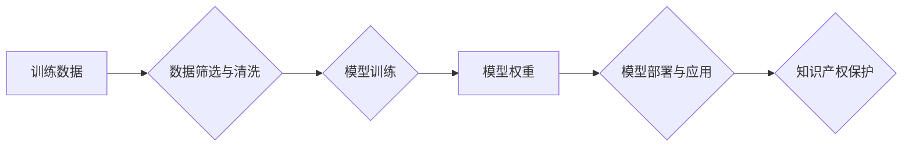

> 大模型、知识产权、保护策略、训练数据、模型权重、开源、商业化、法律法规、技术手段

## 1. 背景介绍

近年来，大模型技术蓬勃发展，其强大的泛化能力和应用潜力吸引了各界关注。从自然语言处理到计算机视觉，从药物研发到科学探索，大模型正在深刻地改变着我们的生活和工作方式。然而，大模型的快速发展也带来了新的挑战，其中知识产权保护尤为突出。

大模型的训练依赖于海量数据，而这些数据往往包含着大量的知识产权信息，例如 copyrighted 文本、图像、代码等。如果大模型在训练过程中未经授权使用这些数据，就可能侵犯知识产权，导致法律纠纷和商业风险。此外，大模型本身的权重参数也蕴含着大量的知识和算法，其价值不容忽视。

因此，大模型企业在开发和应用大模型的过程中，必须重视知识产权保护，制定有效的策略来规避风险，保障自身利益。

## 2. 核心概念与联系

大模型的知识产权保护涉及到多个核心概念和环节，包括：

* **训练数据：** 大模型的训练数据是其核心资产之一，其质量和来源直接影响着大模型的性能和可靠性。
* **模型权重：** 大模型的权重参数是其知识和算法的体现，其价值与模型的性能密切相关。
* **开源与商业化：** 大模型的开源与商业化模式对知识产权保护提出了不同的挑战。
* **法律法规：** 不同国家和地区的法律法规对知识产权的保护力度和范围有所不同。
* **技术手段：** 利用技术手段来保护大模型的知识产权，例如数据加密、模型压缩、知识蒸馏等。

这些核心概念之间相互关联，共同构成了大模型知识产权保护的复杂体系。

**Mermaid 流程图**

## 3. 核心算法原理 & 具体操作步骤

### 3.1  算法原理概述

大模型的训练通常采用深度学习算法，例如 Transformer、BERT 等。这些算法通过多层神经网络结构，学习数据中的复杂模式和关系，从而实现对语言、图像等数据的理解和生成。

### 3.2  算法步骤详解

大模型的训练过程一般包括以下步骤：

1. **数据准备：** 收集、清洗和预处理训练数据，将其转换为模型可以理解的格式。
2. **模型构建：** 根据任务需求，选择合适的深度学习模型架构，并设置模型参数。
3. **模型训练：** 利用训练数据，通过反向传播算法，调整模型参数，使其能够准确地预测或生成目标输出。
4. **模型评估：** 使用测试数据评估模型的性能，并根据评估结果进行模型调优。
5. **模型部署：** 将训练好的模型部署到实际应用场景中，用于进行预测或生成。

### 3.3  算法优缺点

**优点：**

* 强大的泛化能力：大模型能够学习到数据中的复杂模式，并将其应用于新的、未见过的数据。
* 高的准确率：大模型在许多任务中，例如机器翻译、文本摘要、图像识别等，能够达到很高的准确率。
* 可扩展性：大模型可以根据需要进行扩展，例如增加模型层数、增加训练数据量等。

**缺点：**

* 训练成本高：大模型的训练需要大量的计算资源和时间。
* 数据依赖性强：大模型的性能直接取决于训练数据的质量和数量。
* 可解释性差：大模型的决策过程往往是复杂的，难以解释其背后的逻辑。

### 3.4  算法应用领域

大模型在各个领域都有广泛的应用，例如：

* **自然语言处理：** 机器翻译、文本摘要、问答系统、聊天机器人等。
* **计算机视觉：** 图像识别、物体检测、图像生成等。
* **语音识别：** 语音转文本、语音合成等。
* **药物研发：** 药物发现、药物设计等。
* **科学探索：** 数据分析、模型预测等。

## 4. 数学模型和公式 & 详细讲解 & 举例说明

### 4.1  数学模型构建

大模型的训练过程可以看作是一个优化问题，目标是找到最优的模型参数，使得模型在训练数据上的损失函数最小。

损失函数通常采用交叉熵损失函数或均方误差损失函数。

**交叉熵损失函数：**

$$
L_{CE} = -\sum_{i=1}^{N} y_i \log(\hat{y}_i)
$$

其中：

* $N$ 是样本数量。
* $y_i$ 是真实标签。
* $\hat{y}_i$ 是模型预测的概率。

**均方误差损失函数：**

$$
L_{MSE} = \frac{1}{N} \sum_{i=1}^{N} (y_i - \hat{y}_i)^2
$$

其中：

* $N$ 是样本数量。
* $y_i$ 是真实标签。
* $\hat{y}_i$ 是模型预测的输出值。

### 4.2  公式推导过程

模型参数的更新通常采用梯度下降算法。梯度下降算法的基本思想是：沿着梯度方向更新模型参数，使得损失函数不断减小。

梯度下降算法的更新公式为：

$$
\theta = \theta - \alpha \nabla L(\theta)
$$

其中：

* $\theta$ 是模型参数。
* $\alpha$ 是学习率。
* $\nabla L(\theta)$ 是损失函数对模型参数的梯度。

### 4.3  案例分析与讲解

例如，在机器翻译任务中，大模型需要学习将源语言文本翻译成目标语言文本。

训练数据包括源语言文本和目标语言文本的对应对。

模型的目标是找到最优的模型参数，使得模型能够将源语言文本准确地翻译成目标语言文本。

损失函数通常采用交叉熵损失函数，模型参数的更新采用梯度下降算法。

## 5. 项目实践：代码实例和详细解释说明

### 5.1  开发环境搭建

大模型的开发环境通常需要强大的计算资源和软件工具支持。

例如，需要安装深度学习框架，例如 TensorFlow、PyTorch 等，以及必要的库和工具。

### 5.2  源代码详细实现

大模型的源代码通常包含模型架构定义、数据处理模块、训练模块、评估模块等。

例如，使用 TensorFlow 实现一个 BERT 模型的源代码可能包含以下部分：

* 模型架构定义：使用 TensorFlow 的 Keras API 定义 BERT 模型的层结构和参数。
* 数据处理模块：使用 TensorFlow 的 Dataset API 读取和处理训练数据，并将其转换为模型可以理解的格式。
* 训练模块：使用 TensorFlow 的训练 API 训练模型，并根据损失函数和学习率更新模型参数。
* 评估模块：使用 TensorFlow 的评估 API 评估模型的性能，并输出评估结果。

### 5.3  代码解读与分析

需要对源代码进行详细解读和分析，了解模型的结构、参数、训练过程等。

例如，需要分析 BERT 模型的 Transformer 结构，了解其编码器和解码器的功能，以及注意力机制的作用。

### 5.4  运行结果展示

需要运行模型代码，并观察模型的训练过程和评估结果。

例如，需要观察模型的损失函数值随训练轮数的变化趋势，以及模型在测试数据上的准确率。

## 6. 实际应用场景

### 6.1  自然语言处理

大模型在自然语言处理领域有广泛的应用，例如：

* **机器翻译：** Google Translate、DeepL 等机器翻译工具都使用了大模型技术。
* **文本摘要：** 可以使用大模型自动生成文本摘要，例如新闻文章、会议记录等。
* **问答系统：** 可以使用大模型构建问答系统，例如智能客服、搜索引擎等。
* **聊天机器人：** 可以使用大模型构建聊天机器人，例如微信公众号、QQ机器人等。

### 6.2  计算机视觉

大模型在计算机视觉领域也有广泛的应用，例如：

* **图像识别：** 可以使用大模型识别图像中的物体、场景、人物等。
* **物体检测：** 可以使用大模型检测图像中物体的位置和类别。
* **图像生成：** 可以使用大模型生成新的图像，例如人脸生成、场景合成等。

### 6.3  语音识别

大模型在语音识别领域也有广泛的应用，例如：

* **语音转文本：** 可以使用大模型将语音转换为文本，例如语音助手、语音输入等。
* **语音合成：** 可以使用大模型将文本转换为语音，例如语音播报、语音合成等。

### 6.4  未来应用展望

大模型的应用前景十分广阔，未来可能会在更多领域得到应用，例如：

* **药物研发：** 大模型可以用于药物发现、药物设计等。
* **科学探索：** 大模型可以用于数据分析、模型预测等。
* **教育培训：** 大模型可以用于个性化学习、智能辅导等。

## 7. 工具和资源推荐

### 7.1  学习资源推荐

* **书籍：**
    * 《深度学习》
    * 《自然语言处理》
    * 《计算机视觉》
* **在线课程：**
    * Coursera
    * edX
    * Udacity
* **博客和论坛：**
    * TensorFlow Blog
    * PyTorch Blog
    * Kaggle

### 7.2  开发工具推荐

* **深度学习框架：**
    * TensorFlow
    * PyTorch
    * Keras
* **数据处理工具：**
    * Pandas
    * NumPy
* **版本控制工具：**
    * Git

### 7.3  相关论文推荐

* **BERT：** Devlin, J., Chang, M. W., Lee, K., & Toutanova, K. (2018). Bert: Pre-training of deep bidirectional transformers for language understanding. arXiv preprint arXiv:1810.04805.
* **GPT-3：** Brown, T. B., Mann, B., Ryder, N., Subbiah, M., Kaplan, J., Dhariwal, P., ... & Amodei, D. (2020). Language models are few-shot learners. arXiv preprint arXiv:2005.14165.

## 8. 总结：未来发展趋势与挑战

### 8.1  研究成果总结

近年来，大模型技术取得了显著进展，模型规模不断扩大，性能不断提升。

大模型在自然语言处理、计算机视觉、语音识别等领域取得了突破性进展，并开始应用于更多领域。

### 8.2  未来发展趋势

未来，大模型技术将继续发展，主要趋势包括：

* **模型规模的进一步扩大：** 模型规模的扩大将进一步提升模型的性能。
* **模型架构的创新：** 新的模型架构将不断涌现，例如 Transformer 的变体、混合模型等。
* **训练数据的多样化：** 训练数据的多样化将有助于模型泛化能力的提升。
* **模型的解释性和可控性：** 研究人员将致力于提高模型的解释性和可控性，使其更易于理解和应用。

### 8.3  面临的挑战

大模型技术也面临着一些挑战，例如：

* **训练成本高：** 大模型的训练需要大量的计算资源和时间，成本很高。
* **数据依赖性强：** 大模型的性能直接取决于训练数据的质量和数量，数据获取和处理是一个难题。
* **可解释性和可控性差：** 大模型的决策过程往往是复杂的，难以解释其背后的逻辑，缺乏可控性。
* **伦理和社会问题：** 大模型的应用可能带来一些伦理和社会问题，例如偏见、隐私、安全等。

### 8.