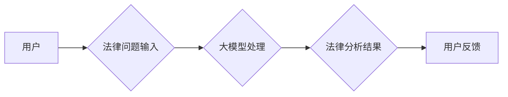

> 大模型，智慧司法，法律服务，普惠化，人工智能，自然语言处理，法律科技

## 1. 背景介绍

近年来，人工智能（AI）技术蓬勃发展，特别是大模型的涌现，为各行各业带来了革命性的变革。其中，智慧司法领域展现出巨大的潜力，大模型能够有效提升法律服务效率，降低法律服务门槛，推动法律服务普惠化。

传统法律服务模式面临着诸多挑战：

* **服务成本高昂：** 律师咨询和诉讼费用对普通民众来说往往难以负担。
* **服务效率低下：** 法律文件审查、合同分析等工作耗时费力，效率低下。
* **服务地域不均：** 法律人才分布不均衡，一些偏远地区缺乏优质法律服务。

大模型技术的应用可以有效解决这些问题，为构建更加公平、高效、便捷的司法体系提供强有力的技术支撑。

## 2. 核心概念与联系

**2.1 大模型概述**

大模型是指在海量数据上训练的深度学习模型，拥有强大的泛化能力和知识表示能力。其参数规模通常在数十亿甚至数千亿级别，能够处理复杂的任务，例如文本生成、翻译、问答、代码生成等。

**2.2 智慧司法概述**

智慧司法是指利用人工智能、大数据、云计算等新兴技术，提升司法效率、公平性和透明度，构建更加智能化、便捷化的司法服务体系。

**2.3 核心概念联系**

大模型为智慧司法提供了强大的技术基础。通过对海量法律文本数据的训练，大模型可以学习法律知识、理解法律逻辑，并应用于各种司法场景，例如：

* **法律文本分析：** 自动识别法律条款、提取关键信息、分析法律风险。
* **法律问答：** 回答用户关于法律问题的咨询，提供法律知识普及。
* **案件预测：** 根据案件信息预测案件结果，辅助法官判决。
* **法律法规生成：** 基于法律原则和案例，自动生成法律法规草案。

**2.4 核心架构**



## 3. 核心算法原理 & 具体操作步骤

**3.1 算法原理概述**

大模型的训练主要基于深度学习算法，例如Transformer模型。Transformer模型通过自注意力机制学习文本之间的上下文关系，能够捕捉长距离依赖关系，实现更精准的法律文本理解和分析。

**3.2 算法步骤详解**

1. **数据预处理：** 收集海量法律文本数据，进行清洗、标注、格式化等预处理工作。
2. **模型训练：** 使用Transformer模型，在预处理后的数据上进行训练，学习法律知识和逻辑关系。
3. **模型评估：** 使用测试数据评估模型的性能，例如准确率、召回率、F1-score等指标。
4. **模型调优：** 根据评估结果，调整模型参数、训练策略等，提升模型性能。
5. **模型部署：** 将训练好的模型部署到生产环境，提供法律服务。

**3.3 算法优缺点**

* **优点：**
    * 强大的泛化能力，能够处理各种法律文本类型。
    * 准确率高，能够理解复杂的法律逻辑。
    * 效率高，能够快速处理大量法律文件。
* **缺点：**
    * 训练成本高，需要海量数据和强大的计算资源。
    * 模型解释性差，难以解释模型的决策过程。
    * 存在潜在的偏见问题，需要进行数据清洗和模型调优。

**3.4 算法应用领域**

* **法律文本分析：** 合同审查、法律文件归档、法律风险评估等。
* **法律问答：** 在线法律咨询、法律知识普及等。
* **案件预测：** 案件胜诉概率预测、案件处理时间预测等。
* **法律法规生成：** 法律草案生成、法律条文解释等。

## 4. 数学模型和公式 & 详细讲解 & 举例说明

**4.1 数学模型构建**

大模型的训练过程可以看作是一个优化问题，目标是找到模型参数，使得模型在训练数据上的损失函数最小。常用的损失函数包括交叉熵损失函数、均方误差损失函数等。

**4.2 公式推导过程**

假设模型输出为 $y$, 真实标签为 $t$, 则交叉熵损失函数可以表示为：

$$
L = -\sum_{i=1}^{N} t_i \log y_i + (1-t_i) \log (1-y_i)
$$

其中，$N$ 为样本数量。

**4.3 案例分析与讲解**

例如，在法律文本分类任务中，模型需要将法律文本分类到不同的类别，例如合同、诉讼、刑事等。

假设模型输出 $y$ 为每个类别的概率，真实标签 $t$ 为对应类别的指示向量。则可以使用交叉熵损失函数来衡量模型的预测结果与真实标签之间的差异。

## 5. 项目实践：代码实例和详细解释说明

**5.1 开发环境搭建**

* Python 3.7+
* TensorFlow/PyTorch
* CUDA/cuDNN

**5.2 源代码详细实现**

```python
import tensorflow as tf

# 定义模型结构
model = tf.keras.Sequential([
    tf.keras.layers.Embedding(input_dim=vocab_size, output_dim=embedding_dim),
    tf.keras.layers.LSTM(units=128),
    tf.keras.layers.Dense(units=num_classes, activation='softmax')
])

# 编译模型
model.compile(optimizer='adam',
              loss='sparse_categorical_crossentropy',
              metrics=['accuracy'])

# 训练模型
model.fit(x_train, y_train, epochs=10, batch_size=32)

# 评估模型
loss, accuracy = model.evaluate(x_test, y_test)
print('Loss:', loss)
print('Accuracy:', accuracy)
```

**5.3 代码解读与分析**

* 代码使用 TensorFlow 库构建了一个 LSTM 模型，用于法律文本分类任务。
* 模型输入为词嵌入向量，输出为每个类别的概率。
* 模型使用 Adam 优化器，交叉熵损失函数，并使用准确率作为评估指标。

**5.4 运行结果展示**

训练完成后，可以将模型部署到生产环境，用于实际的法律文本分类任务。

## 6. 实际应用场景

**6.1 法律文本分析**

大模型可以用于自动分析法律文件，例如合同、诉状、判决书等，提取关键信息，识别法律条款，分析法律风险。

**6.2 法律问答**

大模型可以构建法律问答系统，回答用户关于法律问题的咨询，提供法律知识普及。

**6.3 案件预测**

大模型可以根据案件信息预测案件结果，例如胜诉概率、处理时间等，辅助法官判决。

**6.4 未来应用展望**

* **智能合同：** 基于大模型，自动生成智能合同，根据合同条款自动执行交易。
* **法律法规生成：** 基于法律原则和案例，自动生成法律法规草案，提高法律法规制定效率。
* **法律数据分析：** 利用大模型分析法律数据，发现法律趋势，预测法律风险。

## 7. 工具和资源推荐

**7.1 学习资源推荐**

* **书籍：**
    * 《深度学习》
    * 《自然语言处理》
* **在线课程：**
    * Coursera: 深度学习
    * edX: 自然语言处理
* **开源项目：**
    * TensorFlow
    * PyTorch

**7.2 开发工具推荐**

* **IDE：**
    * PyCharm
    * VS Code
* **库：**
    * TensorFlow
    * PyTorch
    * NLTK
    * SpaCy

**7.3 相关论文推荐**

* BERT: Pre-training of Deep Bidirectional Transformers for Language Understanding
* GPT-3: Language Models are Few-Shot Learners
* T5: Text-to-Text Transfer Transformer

## 8. 总结：未来发展趋势与挑战

**8.1 研究成果总结**

大模型技术在智慧司法领域取得了显著成果，为构建更加公平、高效、便捷的司法体系提供了强有力的技术支撑。

**8.2 未来发展趋势**

* **模型规模和能力提升：** 未来大模型规模将进一步扩大，能力将更加强大，能够处理更复杂的任务。
* **多模态融合：** 大模型将融合文本、图像、音频等多模态数据，实现更全面的法律服务。
* **解释性增强：** 研究者将致力于提高大模型的解释性，使得模型的决策过程更加透明可信。

**8.3 面临的挑战**

* **数据质量和隐私保护：** 大模型训练需要海量数据，数据质量和隐私保护是关键挑战。
* **模型公平性和可解释性：** 大模型存在潜在的偏见问题，需要进行数据清洗和模型调优，提高模型的公平性和可解释性。
* **法律法规和伦理规范：** 大模型的应用需要遵循法律法规和伦理规范，需要制定相应的法律法规和伦理规范。

**8.4 研究展望**

未来，大模型技术将继续推动智慧司法的发展，为构建更加公平、高效、便捷的司法体系做出更大的贡献。


## 9. 附录：常见问题与解答

**9.1 如何保证大模型的准确性？**

大模型的准确性取决于训练数据的质量和模型的结构。需要使用高质量的法律文本数据进行训练，并选择合适的模型结构和训练策略。

**9.2 如何解决大模型的偏见问题？**

大模型的偏见问题可以通过数据清洗、模型调优和算法设计等方式解决。

**9.3 如何保护法律数据隐私？**

法律数据隐私保护需要采取相应的技术措施和法律法规保障。

**9.4 大模型的应用是否会取代律师？**

大模型可以辅助律师工作，提高效率，但不会取代律师。律师需要具备专业知识、法律判断力和沟通能力，这些都是大模型无法替代的。


作者：禅与计算机程序设计艺术 / Zen and the Art of Computer Programming 
<end_of_turn>