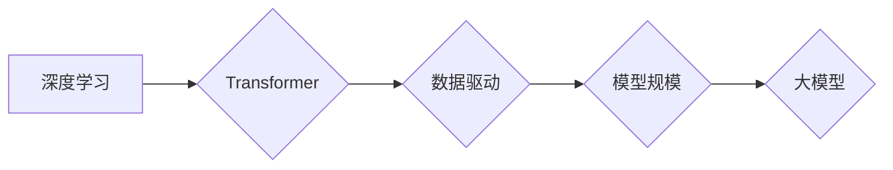

> 大模型、深度学习、Transformer、自然语言处理、计算机视觉、数据驱动、模型训练、应用场景

## 1. 背景介绍

近年来，人工智能（AI）技术取得了飞速发展，其中大模型作为AI领域的重要突破口，展现出强大的学习和推理能力，在自然语言处理、计算机视觉、语音识别等领域取得了令人瞩目的成果。大模型是指参数规模庞大、训练数据海量的人工智能模型，其规模通常在数十亿甚至数千亿参数以上。

大模型的出现，标志着人工智能从规则式方法向数据驱动方法的转变。通过学习海量数据，大模型能够自动提取数据中的规律和模式，从而实现对复杂问题的理解和解决。

## 2. 核心概念与联系

大模型的核心概念包括：

* **深度学习:** 大模型的训练基于深度学习算法，通过多层神经网络结构，学习数据中的复杂特征。
* **Transformer:** Transformer是一种新型的深度学习架构，其自注意力机制能够有效捕捉序列数据中的长距离依赖关系，成为大模型训练的基石。
* **数据驱动:** 大模型的训练依赖于海量数据，数据质量和规模直接影响模型的性能。
* **模型规模:** 大模型的参数规模通常在数十亿甚至数千亿以上，更大的模型规模通常意味着更强的学习能力。

**核心概念与联系流程图:**



## 3. 核心算法原理 & 具体操作步骤

### 3.1  算法原理概述

大模型的训练主要基于深度学习算法，其中Transformer架构是目前最主流的训练方法。Transformer通过自注意力机制，能够有效捕捉序列数据中的长距离依赖关系，从而实现更精准的文本理解和生成。

### 3.2  算法步骤详解

1. **数据预处理:** 将原始数据进行清洗、格式化和编码，使其能够被模型理解。
2. **模型构建:** 根据预设的架构，搭建Transformer模型，包括编码器、解码器和注意力机制等模块。
3. **模型训练:** 使用海量数据训练模型，通过反向传播算法，不断调整模型参数，使其能够生成更准确的输出。
4. **模型评估:** 使用测试数据评估模型的性能，并根据评估结果进行模型调优。
5. **模型部署:** 将训练好的模型部署到实际应用场景中，用于文本生成、翻译、问答等任务。

### 3.3  算法优缺点

**优点:**

* 强大的学习能力：能够学习复杂数据中的模式和规律。
* 精准的文本理解和生成：能够准确捕捉文本中的语义和上下文关系。
* 广泛的应用场景：在自然语言处理、计算机视觉、语音识别等领域都有广泛应用。

**缺点:**

* 训练成本高：需要海量数据和强大的计算资源。
* 模型解释性差：难以理解模型的内部工作机制。
* 存在潜在的偏见：模型的训练数据可能存在偏见，导致模型输出存在偏差。

### 3.4  算法应用领域

大模型在以下领域具有广泛的应用场景：

* **自然语言处理:** 文本生成、机器翻译、问答系统、文本摘要、情感分析等。
* **计算机视觉:** 图像识别、物体检测、图像分割、视频分析等。
* **语音识别:** 语音转文本、语音合成、语音助手等。
* **推荐系统:** 商品推荐、内容推荐、个性化服务等。
* **药物研发:** 药物发现、药物设计、药物安全性评估等。

## 4. 数学模型和公式 & 详细讲解 & 举例说明

### 4.1  数学模型构建

大模型的训练基于深度学习算法，其数学模型主要包括以下几个方面：

* **神经网络:** 神经网络是一种模仿人脑神经元结构的计算模型，通过连接多个神经元，形成多层网络结构。
* **激活函数:** 激活函数用于引入非线性，使神经网络能够学习复杂的数据模式。常见的激活函数包括ReLU、Sigmoid和Tanh等。
* **损失函数:** 损失函数用于衡量模型预测结果与真实值的差距，其目标是通过优化模型参数，最小化损失函数的值。常见的损失函数包括交叉熵损失和均方误差损失等。
* **优化算法:** 优化算法用于更新模型参数，使其能够更好地拟合训练数据。常见的优化算法包括梯度下降、Adam和RMSprop等。

### 4.2  公式推导过程

Transformer模型的核心是自注意力机制，其计算公式如下：

$$
Attention(Q, K, V) = softmax(\frac{QK^T}{\sqrt{d_k}})V
$$

其中：

* $Q$：查询矩阵
* $K$：键矩阵
* $V$：值矩阵
* $d_k$：键向量的维度
* $softmax$：softmax函数

### 4.3  案例分析与讲解

假设我们有一个句子“我爱学习编程”，将其转换为词向量表示，得到查询矩阵$Q$、键矩阵$K$和值矩阵$V$。通过自注意力机制，模型能够计算每个词与其他词之间的相关性，并根据相关性权重，生成句子表示。

## 5. 项目实践：代码实例和详细解释说明

### 5.1  开发环境搭建

大模型的开发环境通常需要强大的计算资源，建议使用GPU加速训练。常用的开发框架包括TensorFlow、PyTorch和JAX等。

### 5.2  源代码详细实现

由于大模型的代码实现较为复杂，这里只提供一个简单的Transformer模型的代码示例：

```python
import tensorflow as tf

class Transformer(tf.keras.Model):
    def __init__(self, vocab_size, embedding_dim, num_heads, num_layers):
        super(Transformer, self).__init__()
        self.embedding = tf.keras.layers.Embedding(vocab_size, embedding_dim)
        self.transformer_layers = tf.keras.layers.StackedRNNCells([
            tf.keras.layers.MultiHeadAttention(num_heads=num_heads, key_dim=embedding_dim)
            for _ in range(num_layers)
        ])

    def call(self, inputs):
        embeddings = self.embedding(inputs)
        outputs = self.transformer_layers(embeddings)
        return outputs
```

### 5.3  代码解读与分析

该代码示例定义了一个简单的Transformer模型，包含嵌入层、多头注意力层和堆叠的RNN单元。

* 嵌入层将词向量表示为稠密的向量。
* 多头注意力层用于捕捉序列数据中的长距离依赖关系。
* 堆叠的RNN单元用于处理序列数据。

### 5.4  运行结果展示

模型训练完成后，可以使用测试数据评估模型的性能，并可视化模型的输出结果。

## 6. 实际应用场景

大模型在各个领域都有着广泛的应用场景：

### 6.1  自然语言处理

* **机器翻译:** 大模型能够实现高质量的机器翻译，例如Google Translate。
* **文本摘要:** 大模型能够自动生成文本摘要，例如新闻文章的摘要。
* **问答系统:** 大模型能够理解用户的问题，并从知识库中找到答案，例如ChatGPT。

### 6.2  计算机视觉

* **图像识别:** 大模型能够识别图像中的物体，例如Google Lens。
* **物体检测:** 大模型能够检测图像中物体的位置和类别，例如自动驾驶汽车。
* **图像分割:** 大模型能够将图像分割成不同的区域，例如医学图像分析。

### 6.3  语音识别

* **语音转文本:** 大模型能够将语音转换为文本，例如语音助手Siri。
* **语音合成:** 大模型能够将文本转换为语音，例如语音朗读软件。
* **语音识别:** 大模型能够识别语音中的说话人、情绪和意图，例如情感分析系统。

### 6.4  未来应用展望

大模型的应用场景还在不断扩展，未来将有更多创新应用出现，例如：

* **个性化教育:** 根据学生的学习情况，提供个性化的学习内容和辅导。
* **医疗诊断:** 辅助医生进行疾病诊断，提高诊断准确率。
* **科学研究:** 加速科学研究的进程，例如药物研发和材料科学。

## 7. 工具和资源推荐

### 7.1  学习资源推荐

* **书籍:**
    * 《深度学习》
    * 《Transformer 详解》
* **在线课程:**
    * Coursera深度学习课程
    * fast.ai深度学习课程

### 7.2  开发工具推荐

* **TensorFlow:** 开源深度学习框架
* **PyTorch:** 开源深度学习框架
* **JAX:** 高性能自动微分库

### 7.3  相关论文推荐

* 《Attention Is All You Need》
* 《BERT: Pre-training of Deep Bidirectional Transformers for Language Understanding》
* 《GPT-3: Language Models are Few-Shot Learners》

## 8. 总结：未来发展趋势与挑战

### 8.1  研究成果总结

大模型在人工智能领域取得了显著的进展，其强大的学习能力和广泛的应用场景，推动了人工智能技术的快速发展。

### 8.2  未来发展趋势

* **模型规模的进一步扩大:** 随着计算资源的不断提升，大模型的规模将继续扩大，从而提升模型的性能。
* **模型训练效率的提升:** 研究人员将探索新的训练方法和算法，提高模型训练效率。
* **模型解释性和可控性的增强:** 研究人员将致力于提高模型的解释性和可控性，使其能够更好地服务于人类。

### 8.3  面临的挑战

* **数据获取和隐私保护:** 大模型的训练需要海量数据，如何获取高质量数据并保护用户隐私是一个重要的挑战。
* **计算资源的限制:** 大模型的训练需要大量的计算资源，如何降低训练成本是一个重要的课题。
* **模型的偏见和公平性:** 大模型的训练数据可能存在偏见，导致模型输出存在偏差，如何解决模型的偏见和公平性问题是一个重要的挑战。

### 8.4  研究展望

未来，大模型研究将继续朝着更强大、更智能、更安全的方向发展，为人类社会带来更多福祉。

## 9. 附录：常见问题与解答

**常见问题:**

* **什么是大模型？**

大模型是指参数规模庞大、训练数据海量的人工智能模型。

* **大模型的训练需要哪些资源？**

大模型的训练需要强大的计算资源、海量数据和专业的开发团队。

* **大模型有哪些应用场景？**

大模型在自然语言处理、计算机视觉、语音识别等领域都有广泛的应用场景。

* **大模型有哪些挑战？**

大模型面临着数据获取、计算资源、模型偏见等挑战。

**解答:**

* **什么是大模型？**

大模型是指参数规模庞大、训练数据海量的人工智能模型。

* **大模型的训练需要哪些资源？**

大模型的训练需要强大的计算资源、海量数据和专业的开发团队。

* **大模型有哪些应用场景？**

大模型在自然语言处理、计算机视觉、语音识别等领域都有广泛的应用场景。

* **大模型有哪些挑战？**

大模型面临着数据获取、计算资源、模型偏见等挑战。


作者：禅与计算机程序设计艺术 / Zen and the Art of Computer Programming 
<end_of_turn>