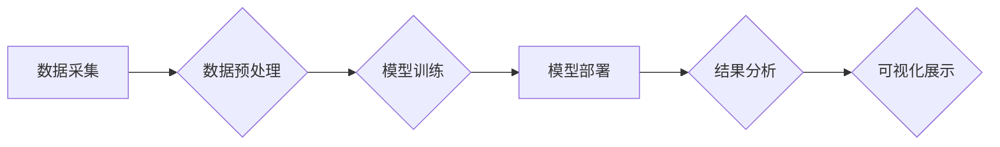

> 大模型、深度学习、自然语言处理、计算机视觉、商业智能、数据分析、预测建模

## 1. 背景介绍

在当今数据爆炸的时代，商业智能（BI）正扮演着越来越重要的角色。企业需要从海量数据中挖掘价值，以做出更明智的决策。传统 BI 工具依赖于人工特征工程和规则化分析，难以应对复杂、非结构化数据的挑战。而大模型的出现，为商业智能领域带来了新的机遇和可能性。

大模型是指参数规模庞大、训练数据海量的人工智能模型。近年来，随着深度学习技术的飞速发展，大模型取得了令人瞩目的成就，在自然语言处理、计算机视觉等领域展现出强大的能力。大模型的优势在于：

* **强大的泛化能力:** 大模型通过学习海量数据，能够捕捉到数据中的复杂模式和关系，从而对未知数据进行更准确的预测和分析。
* **自动特征提取:** 大模型能够自动学习数据中的特征，无需人工特征工程，大大降低了分析成本和时间。
* **端到端学习:** 大模型可以实现端到端的学习，从原始数据到最终结果，无需中间环节，提高了分析效率和准确性。

## 2. 核心概念与联系

大模型的商业智能应用主要围绕以下核心概念展开：

* **数据预处理:** 将原始数据清洗、转换、格式化，使其适合大模型训练和使用。
* **模型训练:** 使用大模型框架和算法，对预处理后的数据进行训练，学习数据中的模式和关系。
* **模型部署:** 将训练好的大模型部署到生产环境中，用于对实时数据进行分析和预测。
* **结果可视化:** 将分析结果以图表、报告等形式呈现，方便用户理解和决策。

**大模型商业智能架构**



## 3. 核心算法原理 & 具体操作步骤

### 3.1  算法原理概述

大模型商业智能的核心算法主要包括：

* **深度神经网络:** 深度神经网络是一种强大的机器学习模型，能够学习数据中的复杂模式和关系。
* **Transformer:** Transformer是一种新型的深度神经网络架构，在自然语言处理领域取得了突破性进展，能够处理长距离依赖关系。
* **强化学习:** 强化学习是一种机器学习方法，通过奖励机制训练模型，使其能够在特定环境中做出最优决策。

### 3.2  算法步骤详解

**以深度神经网络为例，其训练步骤如下：**

1. **数据准备:** 收集和预处理数据，将其转换为模型可识别的格式。
2. **模型构建:** 根据任务需求，选择合适的深度神经网络架构，并定义模型参数。
3. **模型训练:** 使用训练数据，通过反向传播算法，更新模型参数，使其能够准确预测目标变量。
4. **模型评估:** 使用测试数据，评估模型的性能，例如准确率、召回率等。
5. **模型调优:** 根据评估结果，调整模型参数和超参数，提高模型性能。

### 3.3  算法优缺点

**深度神经网络的优点:**

* 强大的学习能力，能够学习数据中的复杂模式和关系。
* 泛化能力强，能够对未知数据进行准确预测。

**深度神经网络的缺点:**

* 训练数据量大，需要大量的计算资源。
* 模型解释性差，难以理解模型的决策过程。

### 3.4  算法应用领域

深度神经网络在商业智能领域有广泛的应用，例如：

* **客户关系管理 (CRM):** 预测客户流失、个性化推荐产品。
* **市场营销:** 分析市场趋势、预测广告效果。
* **财务分析:** 预测财务指标、识别欺诈行为。
* **供应链管理:** 优化库存管理、预测需求变化。

## 4. 数学模型和公式 & 详细讲解 & 举例说明

### 4.1  数学模型构建

深度神经网络的数学模型主要基于线性变换和非线性激活函数。

**线性变换:**

$$
y = Wx + b
$$

其中，$x$ 是输入向量，$W$ 是权重矩阵，$b$ 是偏置向量，$y$ 是输出向量。

**非线性激活函数:**

常用的激活函数包括 sigmoid 函数、ReLU 函数等。

$$
f(x) = \frac{1}{1 + e^{-x}}
$$

### 4.2  公式推导过程

反向传播算法是训练深度神经网络的核心算法。其核心思想是通过计算梯度，更新模型参数，使其能够最小化损失函数。

**损失函数:**

$$
L = \frac{1}{N} \sum_{i=1}^{N} (y_i - \hat{y}_i)^2
$$

其中，$N$ 是样本数量，$y_i$ 是真实值，$\hat{y}_i$ 是预测值。

**梯度下降:**

$$
\theta = \theta - \alpha \nabla L(\theta)
$$

其中，$\theta$ 是模型参数，$\alpha$ 是学习率，$\nabla L(\theta)$ 是损失函数对参数的梯度。

### 4.3  案例分析与讲解

以图像分类为例，假设我们训练了一个深度神经网络模型，用于识别猫和狗的图片。

**训练过程:**

1. 将猫和狗的图片数据进行预处理，并将其分为训练集和测试集。
2. 使用训练集数据，训练深度神经网络模型，并计算损失函数。
3. 根据梯度下降算法，更新模型参数，使其能够最小化损失函数。
4. 使用测试集数据，评估模型的性能，例如准确率、召回率等。

**结果分析:**

如果模型的准确率较高，则说明模型能够有效地识别猫和狗的图片。

## 5. 项目实践：代码实例和详细解释说明

### 5.1  开发环境搭建

* Python 3.7+
* TensorFlow/PyTorch
* Jupyter Notebook

### 5.2  源代码详细实现

```python
import tensorflow as tf

# 定义模型结构
model = tf.keras.models.Sequential([
    tf.keras.layers.Conv2D(32, (3, 3), activation='relu', input_shape=(28, 28, 1)),
    tf.keras.layers.MaxPooling2D((2, 2)),
    tf.keras.layers.Conv2D(64, (3, 3), activation='relu'),
    tf.keras.layers.MaxPooling2D((2, 2)),
    tf.keras.layers.Flatten(),
    tf.keras.layers.Dense(10, activation='softmax')
])

# 编译模型
model.compile(optimizer='adam',
              loss='sparse_categorical_crossentropy',
              metrics=['accuracy'])

# 训练模型
model.fit(x_train, y_train, epochs=5)

# 评估模型
loss, accuracy = model.evaluate(x_test, y_test)
print('Test loss:', loss)
print('Test accuracy:', accuracy)
```

### 5.3  代码解读与分析

* **模型结构:** 该代码定义了一个简单的卷积神经网络模型，用于图像分类任务。
* **编译模型:** 使用 Adam 优化器、交叉熵损失函数和准确率指标编译模型。
* **训练模型:** 使用训练数据训练模型，设置训练轮数为 5。
* **评估模型:** 使用测试数据评估模型的性能，打印测试损失和准确率。

### 5.4  运行结果展示

运行代码后，会输出测试损失和准确率。

## 6. 实际应用场景

### 6.1  客户关系管理 (CRM)

大模型可以用于预测客户流失、个性化推荐产品，提升客户体验和忠诚度。

### 6.2  市场营销

大模型可以分析市场趋势、预测广告效果，帮助企业制定更有效的营销策略。

### 6.3  财务分析

大模型可以预测财务指标、识别欺诈行为，帮助企业进行风险管理和财务决策。

### 6.4  未来应用展望

大模型在商业智能领域还有巨大的潜力，未来将应用于更多场景，例如：

* **智能客服:** 使用大模型构建智能客服系统，自动回答客户问题，提高服务效率。
* **个性化推荐:** 使用大模型进行个性化推荐，为用户提供更精准的产品和服务。
* **预测维护:** 使用大模型预测设备故障，提前进行维护，降低运营成本。

## 7. 工具和资源推荐

### 7.1  学习资源推荐

* **书籍:**
    * 深度学习
    * 自然语言处理
* **在线课程:**
    * Coursera
    * edX
    * fast.ai

### 7.2  开发工具推荐

* **TensorFlow:** 开源深度学习框架
* **PyTorch:** 开源深度学习框架
* **Jupyter Notebook:** 交互式编程环境

### 7.3  相关论文推荐

* Attention Is All You Need
* BERT: Pre-training of Deep Bidirectional Transformers for Language Understanding

## 8. 总结：未来发展趋势与挑战

### 8.1  研究成果总结

大模型在商业智能领域取得了显著的成果，为企业决策提供更智能、更精准的支撑。

### 8.2  未来发展趋势

* **模型规模更大:** 未来大模型的规模将进一步扩大，学习能力和性能将得到提升。
* **模型更加通用:** 未来大模型将更加通用，能够应用于更多场景。
* **模型解释性更强:** 未来研究将更加注重大模型的解释性，使其决策过程更加透明。

### 8.3  面临的挑战

* **数据获取和隐私保护:** 大模型训练需要海量数据，如何获取高质量数据并保护用户隐私是一个挑战。
* **模型训练成本:** 大模型训练成本高昂，需要强大的计算资源。
* **模型部署和维护:** 大模型部署和维护需要专业的技术人员和资源。

### 8.4  研究展望

未来研究将继续探索大模型在商业智能领域的应用，例如：

* **更精准的预测:** 开发更精准的预测模型，帮助企业做出更明智的决策。
* **更智能的自动化:** 利用大模型实现更智能的自动化，提高企业效率。
* **更个性化的服务:** 利用大模型提供更个性化的服务，提升用户体验。

## 9. 附录：常见问题与解答

**Q1: 大模型训练需要多少数据？**

A1: 大模型训练需要海量数据，通常需要百万甚至数十亿条数据。

**Q2: 大模型训练需要多少计算资源？**

A2: 大模型训练需要强大的计算资源，通常需要使用GPU集群进行训练。

**Q3: 如何部署大模型？**

A3: 大模型部署可以采用云端部署、边缘部署等方式。

**Q4: 如何评估大模型的性能？**

A4: 大模型的性能可以评估指标包括准确率、召回率、F1-score等。

**Q5: 大模型的未来发展趋势是什么？**

A5: 大模型的未来发展趋势包括模型规模更大、模型更加通用、模型解释性更强等。


作者：禅与计算机程序设计艺术 / Zen and the Art of Computer Programming 
<end_of_turn>