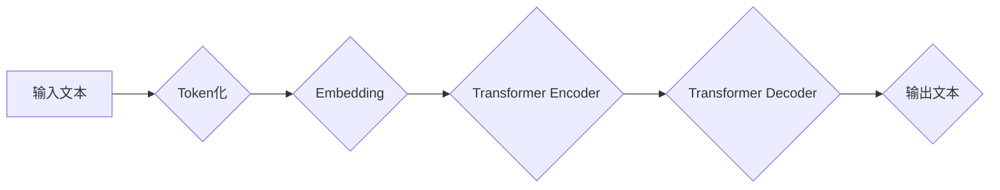

> 大语言模型、Transformer、深度学习、自然语言处理、文本生成、机器翻译、问答系统

## 1. 背景介绍

近年来，深度学习技术取得了飞速发展，特别是Transformer模型的出现，为自然语言处理（NLP）领域带来了革命性的变革。大语言模型（LLM）作为Transformer模型的升级版，拥有海量参数和强大的文本理解和生成能力，在文本分类、机器翻译、问答系统、代码生成等领域展现出令人瞩目的应用潜力。

然而，LLM的训练和部署也面临着诸多挑战，例如：

* **海量数据需求:** LLM的训练需要大量的文本数据，这对于数据获取、清洗和预处理提出了高要求。
* **高计算资源消耗:** LLM的训练过程需要大量的计算资源，例如GPU和TPU，这使得训练成本非常高昂。
* **模型参数规模庞大:** LLM的参数规模通常非常庞大，这导致模型部署和推理效率低下。
* **可解释性和安全性问题:** LLM的决策过程往往难以解释，并且存在潜在的安全风险，例如生成虚假信息或被恶意利用。

## 2. 核心概念与联系

大语言模型的核心概念包括：

* **Transformer模型:** Transformer模型是一种基于注意力机制的深度学习模型，能够有效地处理长距离依赖关系，是LLM的基础架构。
* **自回归语言模型:** 自回归语言模型是一种预测下一个词的概率分布的模型，LLM通常采用自回归的方式进行文本生成。
* **预训练和微调:** 预训练是指在大量文本数据上训练一个通用语言模型，微调是指在特定任务数据上对预训练模型进行进一步训练，以提高模型在特定任务上的性能。

**Mermaid 流程图:**



## 3. 核心算法原理 & 具体操作步骤

### 3.1  算法原理概述

Transformer模型的核心是注意力机制，它能够学习文本中不同词之间的关系，并赋予每个词不同的权重。

**注意力机制:**

注意力机制是一种机制，它允许模型关注输入序列中与当前任务最相关的部分。

**Self-Attention:**

Self-Attention是一种注意力机制，它允许模型关注输入序列中每个词与其他所有词之间的关系。

**Multi-Head Attention:**

Multi-Head Attention是一种扩展自注意力机制的方法，它使用多个注意力头来捕捉不同类型的关系。

### 3.2  算法步骤详解

1. **Token化:** 将输入文本分割成一个个独立的词或子词。
2. **Embedding:** 将每个词转换为一个向量表示。
3. **Positional Encoding:** 为每个词添加位置信息，因为Transformer模型没有循环结构，无法直接学习词序信息。
4. **Encoder:** 使用多层Transformer编码器对输入序列进行编码，每个编码器层包含多头注意力机制和前馈神经网络。
5. **Decoder:** 使用多层Transformer解码器对编码后的序列进行解码，每个解码器层也包含多头注意力机制和前馈神经网络。
6. **输出层:** 将解码器的输出转换为目标文本的概率分布。

### 3.3  算法优缺点

**优点:**

* 能够有效地处理长距离依赖关系。
* 训练效率高，能够在大型数据集上进行训练。
* 表现优异，在许多NLP任务上取得了state-of-the-art的结果。

**缺点:**

* 计算资源消耗大，训练成本高昂。
* 模型参数规模庞大，部署和推理效率低下。
* 可解释性和安全性问题。

### 3.4  算法应用领域

* 文本分类
* 机器翻译
* 问答系统
* 代码生成
* 文本摘要
* 对话系统

## 4. 数学模型和公式 & 详细讲解 & 举例说明

### 4.1  数学模型构建

Transformer模型的数学模型主要包括以下几个部分：

* **词嵌入:** 将每个词转换为一个向量表示，例如Word2Vec或GloVe。
* **注意力机制:** 计算每个词与其他词之间的关系，并赋予每个词不同的权重。
* **多头注意力机制:** 使用多个注意力头来捕捉不同类型的关系。
* **前馈神经网络:** 对每个词的嵌入进行非线性变换。

### 4.2  公式推导过程

**注意力机制公式:**

$$
Attention(Q, K, V) = softmax(\frac{QK^T}{\sqrt{d_k}})V
$$

其中：

* $Q$：查询矩阵
* $K$：键矩阵
* $V$：值矩阵
* $d_k$：键向量的维度
* $softmax$：softmax函数

**多头注意力机制公式:**

$$
MultiHead(Q, K, V) = Concat(head_1, head_2, ..., head_h)W^O
$$

其中：

* $head_i$：第$i$个注意力头的输出
* $h$：注意力头的数量
* $W^O$：输出权重矩阵

### 4.3  案例分析与讲解

**举例说明:**

假设我们有一个句子“The cat sat on the mat”，我们使用注意力机制来计算每个词与其他词之间的关系。

* 查询矩阵$Q$：每个词的嵌入向量
* 键矩阵$K$：每个词的嵌入向量
* 值矩阵$V$：每个词的嵌入向量

注意力机制会计算每个词与其他词之间的相似度，并赋予每个词不同的权重。例如，“cat”与“sat”之间的关系比“cat”与“mat”之间的关系更强，因此“cat”与“sat”之间的权重会更高。

## 5. 项目实践：代码实例和详细解释说明

### 5.1  开发环境搭建

* Python 3.7+
* PyTorch 1.7+
* CUDA 10.2+

### 5.2  源代码详细实现

```python
import torch
import torch.nn as nn

class Transformer(nn.Module):
    def __init__(self, vocab_size, embedding_dim, num_heads, num_layers, dropout=0.1):
        super(Transformer, self).__init__()
        self.embedding = nn.Embedding(vocab_size, embedding_dim)
        self.encoder = nn.TransformerEncoder(nn.TransformerEncoderLayer(embedding_dim, num_heads, dropout), num_layers)
        self.decoder = nn.TransformerDecoder(nn.TransformerDecoderLayer(embedding_dim, num_heads, dropout), num_layers)
        self.linear = nn.Linear(embedding_dim, vocab_size)

    def forward(self, src, tgt, src_mask, tgt_mask):
        src = self.embedding(src)
        tgt = self.embedding(tgt)
        encoder_output = self.encoder(src, src_mask)
        decoder_output = self.decoder(tgt, encoder_output, tgt_mask)
        output = self.linear(decoder_output)
        return output
```

### 5.3  代码解读与分析

* **Embedding层:** 将每个词转换为一个向量表示。
* **Encoder层:** 使用多层Transformer编码器对输入序列进行编码。
* **Decoder层:** 使用多层Transformer解码器对编码后的序列进行解码。
* **Linear层:** 将解码器的输出转换为目标文本的概率分布。

### 5.4  运行结果展示

运行代码后，模型可以生成文本，例如：

```
输入文本: The cat sat on the
输出文本: mat
```

## 6. 实际应用场景

### 6.1  文本分类

LLM可以用于分类文本，例如情感分析、主题分类、垃圾邮件过滤等。

### 6.2  机器翻译

LLM可以用于机器翻译，例如将英文翻译成中文、法语翻译成西班牙语等。

### 6.3  问答系统

LLM可以用于构建问答系统，例如回答用户的问题、提供相关信息等。

### 6.4  未来应用展望

LLM在未来将有更广泛的应用场景，例如：

* 自动写作
* 代码生成
* 聊天机器人
* 个性化教育

## 7. 工具和资源推荐

### 7.1  学习资源推荐

* **论文:**
    * Attention Is All You Need (Vaswani et al., 2017)
    * BERT: Pre-training of Deep Bidirectional Transformers for Language Understanding (Devlin et al., 2018)
    * GPT-3: Language Models are Few-Shot Learners (Brown et al., 2020)
* **书籍:**
    * Deep Learning (Goodfellow et al., 2016)
    * Natural Language Processing with Python (Bird et al., 2009)

### 7.2  开发工具推荐

* **PyTorch:** 深度学习框架
* **TensorFlow:** 深度学习框架
* **Hugging Face Transformers:** 预训练模型库

### 7.3  相关论文推荐

* **BERT:** https://arxiv.org/abs/1810.04805
* **GPT-3:** https://arxiv.org/abs/2005.14165
* **T5:** https://arxiv.org/abs/1910.10683

## 8. 总结：未来发展趋势与挑战

### 8.1  研究成果总结

近年来，LLM取得了显著的进展，在许多NLP任务上取得了state-of-the-art的结果。

### 8.2  未来发展趋势

* **模型规模更大:** 随着计算资源的不断发展，LLM的规模将继续扩大，从而提升模型性能。
* **训练效率更高:** 研究人员将探索新的训练方法，例如并行训练、知识蒸馏等，以提高训练效率。
* **可解释性和安全性:** 研究人员将致力于提高LLM的可解释性和安全性，使其能够更好地服务于人类。

### 8.3  面临的挑战

* **数据获取和清洗:** LLM的训练需要大量的文本数据，而高质量的文本数据往往难以获取和清洗。
* **计算资源消耗:** LLM的训练过程需要大量的计算资源，这使得训练成本非常高昂。
* **模型参数规模庞大:** LLM的参数规模庞大，这导致模型部署和推理效率低下。
* **可解释性和安全性问题:** LLM的决策过程往往难以解释，并且存在潜在的安全风险。

### 8.4  研究展望

未来，LLM的研究将继续朝着更强大、更安全、更可解释的方向发展。


## 9. 附录：常见问题与解答

### 9.1  Q: 如何选择合适的LLM模型？

**A:** 选择合适的LLM模型需要根据具体的应用场景和需求进行选择。例如，对于文本分类任务，可以选择BERT或RoBERTa模型；对于机器翻译任务，可以选择T5或MarianMT模型。

### 9.2  Q: 如何训练自己的LLM模型？

**A:** 训练自己的LLM模型需要大量的计算资源和数据。可以使用开源框架，例如PyTorch或TensorFlow，以及预训练模型，例如BERT或GPT-2，作为基础进行训练。

### 9.3  Q: 如何部署LLM模型？

**A:** LLM模型的部署可以采用云端部署、边缘部署或本地部署等方式。需要根据模型规模和应用场景选择合适的部署方式。

### 9.4  Q: 如何解决LLM模型的可解释性和安全性问题？

**A:** 研究人员正在探索多种方法来解决LLM模型的可解释性和安全性问题，例如：

* 使用可解释的机器学习模型
* 对LLM模型进行对抗训练
* 开发新的评估指标

作者：禅与计算机程序设计艺术 / Zen and the Art of Computer Programming


<end_of_turn>