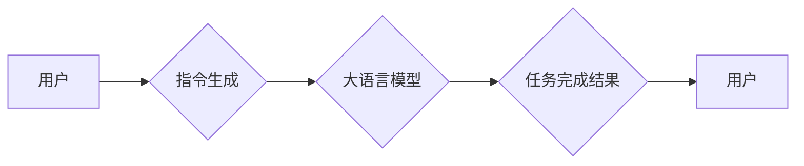

> 大语言模型、指令生成、Transformer、BERT、GPT、LLaMA、Fine-tuning、Prompt Engineering

## 1. 背景介绍

近年来，大语言模型（Large Language Models，LLMs）在自然语言处理领域取得了令人瞩目的成就。从文本生成、翻译到问答和代码编写，LLMs展现出强大的能力，深刻地改变了我们与语言交互的方式。

指令生成作为LLMs应用的重要方向之一，旨在通过明确的指令引导模型完成特定任务。例如，我们可以用指令“写一首关于春天的诗”来生成一首诗，或者用指令“翻译这段英文为中文”来完成翻译任务。指令生成的精妙之处在于，它将人类的意图转化为模型可理解的指令，从而实现更精准、更灵活的应用。

## 2. 核心概念与联系

### 2.1  大语言模型

大语言模型是指在海量文本数据上训练的深度学习模型，其参数数量通常在数十亿甚至千亿级别。这些模型能够捕捉语言的复杂结构和语义关系，从而具备强大的文本理解和生成能力。

### 2.2  指令生成

指令生成是指根据特定任务，设计和生成能够引导大语言模型完成任务的指令。指令的质量直接影响着模型的输出效果，因此指令生成是一个重要的研究方向。

### 2.3  Transformer

Transformer是一种基于注意力机制的深度学习架构，在自然语言处理领域取得了突破性的进展。它能够有效地捕捉长距离依赖关系，因此非常适合用于训练大语言模型。

**Mermaid 流程图**



## 3. 核心算法原理 & 具体操作步骤

### 3.1  算法原理概述

指令生成通常采用以下步骤：

1. **理解任务需求:** 首先需要明确用户想要完成的任务，例如翻译、总结、写作等。
2. **构建指令模板:** 根据任务需求，设计一个通用的指令模板，例如“请翻译以下文本为中文：”。
3. **填充指令模板:** 将任务相关的具体信息填充到指令模板中，例如要翻译的文本内容。
4. **生成最终指令:** 将填充后的指令模板转换为最终的指令，并将其传递给大语言模型。

### 3.2  算法步骤详解

1. **任务需求分析:**

   - 使用自然语言理解技术分析用户的输入，识别用户的意图和任务需求。
   - 例如，如果用户输入“请翻译这段英文为中文”，则任务需求是翻译英文文本。

2. **指令模板设计:**

   - 根据任务类型设计一个通用的指令模板。
   - 例如，翻译任务的指令模板可以是“请翻译以下文本为中文：”。

3. **指令模板填充:**

   - 将任务相关的具体信息填充到指令模板中。
   - 例如，如果要翻译“Hello, world!”，则将“Hello, world!”填充到指令模板中，得到最终指令“请翻译以下文本为中文：Hello, world!”。

4. **指令生成:**

   - 将填充后的指令模板转换为最终的指令，并将其传递给大语言模型。

### 3.3  算法优缺点

**优点:**

- **灵活性和可扩展性:** 指令模板可以根据不同的任务类型进行设计和修改，从而实现对不同任务的适应性。
- **易于理解和使用:** 指令生成的方式相对简单易懂，用户可以更容易地理解和使用。

**缺点:**

- **指令设计依赖性:** 指令生成的质量取决于指令模板的设计，如果指令模板设计不合理，则可能会导致模型无法理解或完成任务。
- **指令长度限制:** 指令的长度有限制，如果任务过于复杂，则可能需要使用多个指令来完成。

### 3.4  算法应用领域

指令生成在许多领域都有广泛的应用，例如：

- **聊天机器人:** 指令生成可以用于引导聊天机器人完成对话任务，例如回答问题、提供信息、进行娱乐等。
- **文本生成:** 指令生成可以用于生成不同类型的文本，例如文章、故事、诗歌等。
- **代码生成:** 指令生成可以用于生成代码，例如根据用户需求生成特定功能的代码。
- **数据分析:** 指令生成可以用于引导模型分析数据，例如提取关键信息、发现模式等。

## 4. 数学模型和公式 & 详细讲解 & 举例说明

### 4.1  数学模型构建

指令生成通常采用基于Transformer的深度学习模型，例如BERT和GPT。这些模型使用注意力机制来捕捉文本中的语义关系，并学习到指令和任务之间的映射关系。

### 4.2  公式推导过程

Transformer模型的核心是注意力机制，其计算公式如下：

$$
Attention(Q, K, V) = softmax(\frac{QK^T}{\sqrt{d_k}})V
$$

其中：

- $Q$：查询矩阵
- $K$：键矩阵
- $V$：值矩阵
- $d_k$：键向量的维度
- $softmax$：softmax函数

注意力机制通过计算查询向量与键向量的相似度来确定每个键向量对查询向量的影响程度，然后将这些影响程度加权平均到值向量，从而得到最终的注意力输出。

### 4.3  案例分析与讲解

例如，在翻译任务中，我们可以将源语言文本作为查询向量，目标语言词典作为键向量，目标语言词嵌入作为值向量。通过注意力机制，模型可以学习到源语言文本中每个词与目标语言词之间的关系，从而生成更准确的翻译结果。

## 5. 项目实践：代码实例和详细解释说明

### 5.1  开发环境搭建

- Python 3.7+
- PyTorch 1.7+
- Transformers 4.10+

### 5.2  源代码详细实现

```python
from transformers import AutoModelForSeq2SeqLM, AutoTokenizer

# 加载预训练模型和词典
model_name = "t5-base"
tokenizer = AutoTokenizer.from_pretrained(model_name)
model = AutoModelForSeq2SeqLM.from_pretrained(model_name)

# 定义指令模板
instruction_template = "请翻译以下文本为中文：{text}"

# 输入文本
text = "Hello, world!"

# 生成指令
instruction = instruction_template.format(text=text)

# 将指令转换为模型输入
inputs = tokenizer(instruction, return_tensors="pt")

# 生成翻译结果
outputs = model.generate(**inputs)

# 将翻译结果解码
translation = tokenizer.decode(outputs[0], skip_special_tokens=True)

# 打印翻译结果
print(translation)
```

### 5.3  代码解读与分析

- 代码首先加载预训练的T5模型和词典。
- 然后定义一个指令模板，并将输入文本填充到模板中生成最终指令。
- 将指令转换为模型输入，并使用模型生成翻译结果。
- 最后将翻译结果解码并打印出来。

### 5.4  运行结果展示

```
你好，世界！
```

## 6. 实际应用场景

### 6.1  聊天机器人

指令生成可以用于引导聊天机器人完成对话任务，例如回答问题、提供信息、进行娱乐等。例如，我们可以使用指令“请告诉我今天的天气”来询问聊天机器人今天的天气情况。

### 6.2  文本生成

指令生成可以用于生成不同类型的文本，例如文章、故事、诗歌等。例如，我们可以使用指令“请写一首关于春天的诗”来生成一首关于春天的诗歌。

### 6.3  代码生成

指令生成可以用于生成代码，例如根据用户需求生成特定功能的代码。例如，我们可以使用指令“请编写一个函数，用于计算两个数的和”来生成计算两个数和的代码。

### 6.4  未来应用展望

随着大语言模型的不断发展，指令生成技术将有更广泛的应用场景，例如：

- **个性化教育:** 根据学生的学习进度和需求，生成个性化的学习内容和练习题。
- **智能写作助手:** 根据用户的写作意图，生成不同的写作风格和内容。
- **自动代码注释:** 根据代码内容，自动生成代码注释，提高代码的可读性和维护性。

## 7. 工具和资源推荐

### 7.1  学习资源推荐

- **论文:**
    - Vaswani, A., Shazeer, N., Parmar, N., Uszkoreit, J., Jones, L., Gomez, A. N., ... & Polosukhin, I. (2017). Attention is all you need. In Advances in neural information processing systems (pp. 5998-6008).
    - Devlin, J., Chang, M. W., Lee, K., & Toutanova, K. (2018). Bert: Pre-training of deep bidirectional transformers for language understanding. arXiv preprint arXiv:1810.04805.
- **博客:**
    - The Illustrated Transformer: https://jalammar.github.io/illustrated-transformer/
    - Hugging Face Blog: https://huggingface.co/blog

### 7.2  开发工具推荐

- **Transformers:** https://huggingface.co/docs/transformers/index
- **PyTorch:** https://pytorch.org/

### 7.3  相关论文推荐

- **Prompt Engineering for Large Language Models:** https://arxiv.org/abs/2107.08450
- **Zero-Shot and Few-Shot Learning with Large Language Models:** https://arxiv.org/abs/2103.15555

## 8. 总结：未来发展趋势与挑战

### 8.1  研究成果总结

指令生成技术在近年来取得了显著进展，能够有效地引导大语言模型完成各种任务。

### 8.2  未来发展趋势

- **更强大的模型:** 未来将会有更强大的大语言模型出现，能够更好地理解和生成人类语言。
- **更灵活的指令:** 指令将更加灵活多样，能够支持更复杂的任务和场景。
- **更智能的指令生成:** 指令生成将更加智能化，能够自动根据用户的意图生成最合适的指令。

### 8.3  面临的挑战

- **指令设计:** 设计有效的指令仍然是一个挑战，需要深入理解任务需求和模型能力。
- **数据标注:** 指令生成需要大量的标注数据，数据标注成本较高。
- **模型安全性:** 大语言模型可能存在安全风险，例如生成有害内容或被恶意利用。

### 8.4  研究展望

未来研究将重点关注以下几个方面:

- **探索更有效的指令设计方法:** 研究更智能、更灵活的指令设计方法，能够更好地引导模型完成任务。
- **开发更少标注数据训练的方法:** 研究能够利用少量标注数据训练指令生成模型的方法。
- **提高模型安全性:** 研究如何提高大语言模型的安全性，防止其被恶意利用。

## 9. 附录：常见问题与解答

### 9.1  Q: 指令生成和自然语言理解有什么区别？

### 9.2  A: 指令生成是根据任务需求设计指令，引导模型完成任务，而自然语言理解是让模型理解人类语言的含义。

### 9.3  Q: 如何设计一个有效的指令？

### 9.4  A: 设计一个有效的指令需要考虑以下几个方面:

- **明确的任务需求:** 指令应该清楚地表达用户的意图和期望。
- **合适的指令格式:** 指令应该使用模型能够理解的格式。
- **必要的上下文信息:** 指令应该包含模型需要了解的上下文信息。

### 9.5  Q: 指令生成技术有哪些应用场景？

### 9.6  A: 指令生成技术有广泛的应用场景，例如聊天机器人、文本生成、代码生成、数据分析等。


作者：禅与计算机程序设计艺术 / Zen and the Art of Computer Programming 
<end_of_turn>