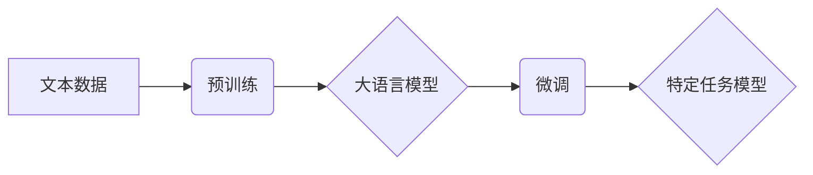

> 大语言模型，OpenAI，GPT-3，文本生成，自然语言处理，机器学习，深度学习

## 1. 背景介绍

近年来，人工智能（AI）领域取得了令人瞩目的进展，其中大语言模型（LLM）作为一种强大的AI技术，在自然语言处理（NLP）领域展现出巨大的潜力。大语言模型能够理解和生成人类语言，并具备广泛的应用场景，例如文本生成、机器翻译、问答系统、代码生成等。

OpenAI作为一家领先的AI研究机构，在LLM领域做出了突出贡献。其开发的GPT系列模型（Generative Pre-trained Transformer）是目前最先进的大语言模型之一，以其强大的文本生成能力和广泛的应用场景而闻名。

本指南将深入介绍OpenAI大语言模型，包括其核心概念、工作原理、应用场景以及未来发展趋势。

## 2. 核心概念与联系

大语言模型的核心概念是利用深度学习技术训练一个庞大的神经网络模型，使其能够理解和生成人类语言。

**2.1  Transformer架构**

OpenAI大语言模型基于Transformer架构，该架构是一种专门设计用于处理序列数据的网络结构。Transformer的核心特点是利用注意力机制（Attention Mechanism）来捕捉序列数据中的长距离依赖关系，从而提高模型的理解和生成能力。

**2.2  预训练与微调**

OpenAI大语言模型采用预训练与微调的训练策略。预训练阶段，模型在海量文本数据上进行无监督学习，学习语言的语法规则和语义关系。微调阶段，模型在特定任务数据上进行有监督学习，例如文本分类、机器翻译等，从而提高模型在特定任务上的性能。

**2.3  LLM与NLP的关系**

大语言模型是自然语言处理领域的重要发展方向。LLM能够处理各种NLP任务，例如：

* 文本生成：创作故事、诗歌、文章等。
* 机器翻译：将文本从一种语言翻译成另一种语言。
* 问答系统：回答用户提出的问题。
* 代码生成：生成计算机代码。
* 对话系统：与用户进行自然语言对话。

**2.4  Mermaid流程图**



## 3. 核心算法原理 & 具体操作步骤

### 3.1  算法原理概述

OpenAI大语言模型的核心算法是Transformer架构，其主要原理是利用注意力机制来捕捉序列数据中的长距离依赖关系。

**3.1.1  注意力机制**

注意力机制是一种机制，允许模型关注输入序列中与当前任务最相关的部分。

**3.1.2  多头注意力**

多头注意力机制是Transformer架构中的一种重要组成部分，它使用多个注意力头来捕捉不同类型的依赖关系。

**3.1.3  位置编码**

由于Transformer架构不具备序列信息的顺序性，因此需要使用位置编码来为每个词语添加位置信息。

### 3.2  算法步骤详解

1. **数据预处理:** 将文本数据进行清洗、分词、标记等预处理操作。
2. **词嵌入:** 将每个词语映射到一个低维向量空间中，称为词嵌入。
3. **位置编码:** 为每个词语添加位置信息。
4. **多头注意力:** 使用多头注意力机制来捕捉序列数据中的长距离依赖关系。
5. **前馈神经网络:** 使用前馈神经网络对注意力输出进行进一步处理。
6. **输出层:** 使用输出层生成最终的预测结果。

### 3.3  算法优缺点

**优点:**

* 能够捕捉长距离依赖关系。
* 训练效率高。
* 在各种NLP任务上表现出色。

**缺点:**

* 模型规模庞大，训练成本高。
* 对训练数据质量要求高。
* 存在潜在的偏差和错误。

### 3.4  算法应用领域

* 文本生成
* 机器翻译
* 问答系统
* 代码生成
* 对话系统
* 文本摘要
* 情感分析

## 4. 数学模型和公式 & 详细讲解 & 举例说明

### 4.1  数学模型构建

OpenAI大语言模型的数学模型构建基于Transformer架构，其核心是多头注意力机制和前馈神经网络。

**4.1.1  注意力机制公式**

$$
Attention(Q, K, V) = \frac{exp(Q \cdot K^T / \sqrt{d_k})}{exp(Q \cdot K^T / \sqrt{d_k})} \cdot V
$$

其中：

* $Q$：查询矩阵
* $K$：键矩阵
* $V$：值矩阵
* $d_k$：键向量的维度

**4.1.2  多头注意力机制**

多头注意力机制使用多个注意力头来捕捉不同类型的依赖关系。每个注意力头都独立计算注意力权重，然后将所有注意力头的输出进行拼接和线性变换。

**4.1.3  前馈神经网络**

前馈神经网络是一个多层感知机，用于对注意力输出进行进一步处理。

### 4.2  公式推导过程

注意力机制的公式推导过程基于softmax函数，其目的是将键向量映射到一个概率分布，表示每个键向量对查询向量的相关性。

多头注意力机制的公式推导过程是将多个注意力头并行计算，然后将所有注意力头的输出进行拼接和线性变换，从而捕捉不同类型的依赖关系。

### 4.3  案例分析与讲解

**4.3.1  文本生成案例**

假设我们使用OpenAI大语言模型生成一个关于猫的句子。模型会根据训练数据中的猫相关信息，利用注意力机制捕捉句子中相关词语的依赖关系，并生成一个合理的句子，例如“一只可爱的猫在草地上玩耍”。

**4.3.2  机器翻译案例**

假设我们使用OpenAI大语言模型将英文句子“The cat sat on the mat”翻译成中文。模型会根据训练数据中的英文和中文句子对，利用注意力机制捕捉句子中每个词语的对应关系，并生成一个合理的中文句子，例如“猫坐在垫子上”。

## 5. 项目实践：代码实例和详细解释说明

### 5.1  开发环境搭建

OpenAI提供API接口，可以通过API调用其大语言模型进行文本生成等操作。

**5.1.1  安装依赖库**

```python
pip install openai
```

**5.1.2  设置API密钥**

```python
import openai

openai.api_key = "YOUR_API_KEY"
```

### 5.2  源代码详细实现

```python
import openai

# 设置文本生成参数
prompt = "写一首关于猫的诗"
max_tokens = 100

# 调用OpenAI API进行文本生成
response = openai.Completion.create(
    engine="text-davinci-003",
    prompt=prompt,
    max_tokens=max_tokens,
    temperature=0.7
)

# 获取生成文本
generated_text = response.choices[0].text.strip()

# 打印生成文本
print(generated_text)
```

### 5.3  代码解读与分析

* `openai.Completion.create()`函数用于调用OpenAI API进行文本生成。
* `engine`参数指定使用的模型，例如"text-davinci-003"。
* `prompt`参数指定文本生成提示。
* `max_tokens`参数指定生成的文本长度。
* `temperature`参数控制文本生成的随机性。

### 5.4  运行结果展示

```
一只毛茸茸的小猫，
在阳光下跳跃，
它眯着眼睛，
享受着温暖。
```

## 6. 实际应用场景

OpenAI大语言模型在各个领域都有广泛的应用场景。

### 6.1  文本生成

* **内容创作:** 生成文章、故事、诗歌等内容。
* **广告文案:** 生成吸引人的广告文案。
* **产品描述:** 生成产品描述和规格。

### 6.2  机器翻译

* **跨语言沟通:** 将文本从一种语言翻译成另一种语言。
* **国际化产品:** 将产品文档和网站翻译成多种语言。

### 6.3  问答系统

* **客户服务:** 自动回答客户提出的常见问题。
* **搜索引擎:** 提供更精准的搜索结果。

### 6.4  代码生成

* **代码辅助:** 自动生成代码片段。
* **代码修复:** 自动修复代码错误。

### 6.5  对话系统

* **聊天机器人:** 与用户进行自然语言对话。
* **虚拟助手:** 提供个性化的服务和帮助。

## 7. 工具和资源推荐

### 7.1  学习资源推荐

* **OpenAI官方文档:** https://platform.openai.com/docs/
* **HuggingFace Transformers库:** https://huggingface.co/docs/transformers/index
* **DeepLearning.AI课程:** https://www.deeplearning.ai/

### 7.2  开发工具推荐

* **Python:** https://www.python.org/
* **Jupyter Notebook:** https://jupyter.org/

### 7.3  相关论文推荐

* **Attention Is All You Need:** https://arxiv.org/abs/1706.03762
* **BERT: Pre-training of Deep Bidirectional Transformers for Language Understanding:** https://arxiv.org/abs/1810.04805

## 8. 总结：未来发展趋势与挑战

### 8.1  研究成果总结

OpenAI大语言模型在NLP领域取得了显著的成果，其强大的文本生成能力和广泛的应用场景推动了AI技术的进步。

### 8.2  未来发展趋势

* **模型规模更大:** 未来大语言模型的规模将进一步扩大，从而提升模型的性能和能力。
* **多模态学习:** 大语言模型将与其他模态数据（例如图像、音频）进行融合，实现多模态理解和生成。
* **更强的推理能力:** 研究者将致力于提升大语言模型的推理能力，使其能够解决更复杂的任务。

### 8.3  面临的挑战

* **数据安全和隐私:** 大语言模型的训练需要海量数据，如何保证数据安全和隐私是一个重要挑战。
* **模型可解释性:** 大语言模型的决策过程难以理解，如何提高模型的可解释性是一个关键问题。
* **伦理问题:** 大语言模型可能被用于生成虚假信息或进行恶意攻击，如何应对这些伦理问题是一个需要认真思考的问题。

### 8.4  研究展望

未来，大语言模型将继续朝着更强大、更智能的方向发展，并在更多领域发挥重要作用。研究者将继续探索大语言模型的潜力，并致力于解决其面临的挑战，推动AI技术的进步和可持续发展。

## 9. 附录：常见问题与解答

**9.1  如何使用OpenAI API？**

请访问OpenAI官网，注册账号并获取API密钥。然后，可以使用Python等编程语言调用OpenAI API进行文本生成等操作。

**9.2  OpenAI大语言模型有哪些应用场景？**

OpenAI大语言模型在各个领域都有广泛的应用场景，例如文本生成、机器翻译、问答系统、代码生成、对话系统等。

**9.3  OpenAI大语言模型的训练数据是什么？**

OpenAI大语言模型的训练数据是海量文本数据，包括书籍、文章、代码等。

**9.4  OpenAI大语言模型的性能如何？**

OpenAI大语言模型在各种NLP任务上表现出色，其强大的文本生成能力和广泛的应用场景使其成为业界领先的大语言模型之一。

**9.5  OpenAI大语言模型的未来发展趋势是什么？**

未来，大语言模型将朝着更强大、更智能的方向发展，其规模将进一步扩大，并与其他模态数据进行融合，实现多模态理解和生成。


