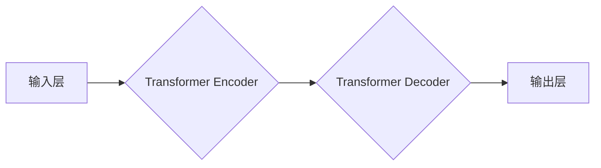

> 大语言模型、Transformer、自然语言处理、深度学习、人工智能、文本生成、机器翻译

## 1. 背景介绍

人工智能（AI）作为一项颠覆性技术，近年来取得了令人瞩目的进展。其中，大语言模型（LLM）作为AI领域最具潜力的应用之一，凭借其强大的文本理解和生成能力，正在深刻地改变着我们与信息交互的方式。从智能聊天机器人到自动写作工具，LLM的应用场景日益广泛，其发展势头不可阻挡。

然而，对于许多人来说，LLM仍然是一个充满神秘感的概念。本文将深入探讨LLM的原理、架构、算法以及应用场景，并为读者提供一个全面的理解指南。

## 2. 核心概念与联系

大语言模型的核心概念是利用深度学习技术训练一个能够理解和生成人类语言的模型。这些模型通常拥有数十亿甚至数千亿的参数，通过学习海量文本数据，能够掌握语言的语法、语义和上下文关系。

**LLM 架构**



LLM的架构通常基于Transformer网络，该网络结构能够有效地处理序列数据，例如文本。Transformer网络的核心组件是注意力机制，它允许模型关注输入序列中与当前任务最相关的部分，从而提高理解和生成文本的准确性。

## 3. 核心算法原理 & 具体操作步骤

### 3.1  算法原理概述

LLM的核心算法是基于深度学习的**自回归语言模型**。该模型通过预测下一个词来生成文本。训练过程是通过对比模型预测的词与真实词之间的差异来进行的，模型的目标是最大化预测准确率。

### 3.2  算法步骤详解

1. **数据预处理:** 将文本数据进行清洗、分词、标记等预处理操作，使其能够被模型理解。
2. **模型训练:** 使用深度学习框架（例如TensorFlow或PyTorch）训练LLM模型。训练过程包括以下步骤：
    * 将预处理后的文本数据输入模型。
    * 模型根据输入数据预测下一个词。
    * 计算模型预测结果与真实词之间的损失函数值。
    * 使用优化算法（例如Adam）更新模型参数，降低损失函数值。
3. **模型评估:** 使用测试数据评估模型的性能，例如困惑度（perplexity）和BLEU分数。
4. **模型部署:** 将训练好的模型部署到实际应用场景中，例如聊天机器人、文本生成工具等。

### 3.3  算法优缺点

**优点:**

* 能够生成高质量的文本，具有较强的语言理解和生成能力。
* 可以处理各种类型的文本任务，例如机器翻译、文本摘要、问答系统等。
* 随着训练数据的增加，模型性能会不断提高。

**缺点:**

* 训练成本高，需要大量的计算资源和时间。
* 模型参数量大，部署成本较高。
* 容易受到训练数据的影响，可能生成带有偏见或错误信息的文本。

### 3.4  算法应用领域

LLM的应用领域非常广泛，包括：

* **自然语言处理:** 机器翻译、文本摘要、问答系统、情感分析等。
* **人工智能助手:** 智能聊天机器人、虚拟助理等。
* **内容创作:** 自动写作、诗歌创作、剧本创作等。
* **教育:** 智能辅导系统、个性化学习平台等。
* **科学研究:** 文本挖掘、知识图谱构建等。

## 4. 数学模型和公式 & 详细讲解 & 举例说明

### 4.1  数学模型构建

LLM的核心数学模型是**自回归语言模型**，其目标是预测下一个词。模型使用**概率分布**来表示每个词出现的可能性。

### 4.2  公式推导过程

假设我们有一个文本序列 $x = (x_1, x_2, ..., x_T)$，其中 $x_i$ 表示第 $i$ 个词。LLM的目标是预测下一个词 $x_{T+1}$ 的概率分布 $P(x_{T+1}|x_1, x_2, ..., x_T)$。

可以使用**softmax函数**将模型的输出映射到概率分布：

$$
P(x_{T+1}|x_1, x_2, ..., x_T) = \frac{exp(s_{x_{T+1}})}{\sum_{w \in V} exp(s_w)}
$$

其中，$s_w$ 表示模型对词 $w$ 的预测得分，$V$ 是词典的大小。

### 4.3  案例分析与讲解

例如，假设我们有一个文本序列 "The cat sat on the"，LLM需要预测下一个词。模型可能会将 "mat"、"chair"、"table" 等词作为候选词，并根据上下文信息计算每个词的概率分布。最终，模型会选择概率最高的词作为预测结果。

## 5. 项目实践：代码实例和详细解释说明

### 5.1  开发环境搭建

LLM的开发环境通常需要以下软件：

* Python 3.x
* 深度学习框架（例如TensorFlow或PyTorch）
* 自然语言处理库（例如NLTK或spaCy）

### 5.2  源代码详细实现

以下是一个使用PyTorch训练简单LLM的代码示例：

```python
import torch
import torch.nn as nn

class SimpleLLM(nn.Module):
    def __init__(self, vocab_size, embedding_dim, hidden_dim):
        super(SimpleLLM, self).__init__()
        self.embedding = nn.Embedding(vocab_size, embedding_dim)
        self.lstm = nn.LSTM(embedding_dim, hidden_dim)
        self.fc = nn.Linear(hidden_dim, vocab_size)

    def forward(self, x):
        embedded = self.embedding(x)
        output, (hidden, cell) = self.lstm(embedded)
        output = self.fc(output[:, -1, :])
        return output

# ... 训练模型 ...
```

### 5.3  代码解读与分析

该代码定义了一个简单的LLM模型，包含嵌入层、LSTM层和全连接层。

* 嵌入层将每个词映射到一个低维向量。
* LSTM层用于处理文本序列，捕捉上下文信息。
* 全连接层将LSTM层的输出映射到概率分布。

### 5.4  运行结果展示

训练完成后，可以使用模型生成文本。例如，可以输入一个词作为种子，模型会根据上下文信息生成后续的文本。

## 6. 实际应用场景

### 6.1  智能聊天机器人

LLM可以用于构建智能聊天机器人，能够与人类进行自然流畅的对话。例如，可以利用LLM训练一个客服机器人，自动回答用户常见问题。

### 6.2  文本生成工具

LLM可以用于生成各种类型的文本，例如文章、故事、诗歌等。例如，可以利用LLM训练一个自动写作工具，帮助用户快速生成文章草稿。

### 6.3  机器翻译

LLM可以用于机器翻译，将一种语言翻译成另一种语言。例如，可以利用LLM训练一个英语-中文翻译模型，实现实时翻译。

### 6.4  未来应用展望

LLM的应用前景广阔，未来可能会在更多领域得到应用，例如：

* **个性化教育:** 根据学生的学习情况，提供个性化的学习内容和辅导。
* **医疗诊断:** 辅助医生进行疾病诊断，提高诊断准确率。
* **法律服务:** 自动分析法律文件，提供法律建议。

## 7. 工具和资源推荐

### 7.1  学习资源推荐

* **书籍:**
    * 《深度学习》
    * 《自然语言处理》
* **在线课程:**
    * Coursera: 自然语言处理
    * edX: 深度学习
* **博客:**
    * The Gradient
    * Towards Data Science

### 7.2  开发工具推荐

* **深度学习框架:** TensorFlow, PyTorch
* **自然语言处理库:** NLTK, spaCy
* **文本处理工具:** BeautifulSoup, Nginx

### 7.3  相关论文推荐

* **Attention Is All You Need**
* **BERT: Pre-training of Deep Bidirectional Transformers for Language Understanding**
* **GPT-3: Language Models are Few-Shot Learners**

## 8. 总结：未来发展趋势与挑战

### 8.1  研究成果总结

近年来，LLM取得了显著的进展，其性能不断提高，应用场景也越来越广泛。Transformer网络架构、注意力机制和预训练技术是LLM发展的重要驱动力。

### 8.2  未来发展趋势

未来，LLM的发展趋势包括：

* **模型规模的进一步扩大:** 更大的模型参数量能够带来更高的性能。
* **多模态LLM:** 将文本、图像、音频等多种模态信息融合到LLM中。
* **可解释性增强:** 提高LLM的透明度和可解释性，使其能够更好地被理解和信任。

### 8.3  面临的挑战

LLM也面临着一些挑战，例如：

* **训练成本高:** 训练大型LLM需要大量的计算资源和时间。
* **数据偏见:** 训练数据可能存在偏见，导致LLM生成带有偏见或错误信息的文本。
* **安全风险:** LLM可能被用于生成恶意内容，例如虚假新闻、网络攻击等。

### 8.4  研究展望

未来，LLM的研究需要关注以下几个方面：

* **降低训练成本:** 开发更有效的训练算法和硬件架构。
* **解决数据偏见问题:** 构建更公平、更代表性的训练数据集。
* **增强LLM的安全性和可靠性:** 开发安全性和可靠性更高的LLM模型和应用场景。

## 9. 附录：常见问题与解答

**Q1: 如何选择合适的LLM模型？**

**A1:** 选择合适的LLM模型需要根据具体的应用场景和需求进行考虑。例如，对于需要处理大量文本数据的任务，可以选择参数量更大的模型；对于需要实时响应的任务，可以选择训练速度更快的小型模型。

**Q2: 如何评估LLM模型的性能？**

**A2:** 常见的LLM模型性能评估指标包括困惑度（perplexity）、BLEU分数、ROUGE分数等。

**Q3: 如何部署LLM模型？**

**A3:** LLM模型的部署方式多种多样，可以部署到云服务器、边缘设备、移动设备等。

**Q4: 如何防止LLM模型生成带有偏见或错误信息的文本？**

**A4:** 可以通过构建更公平、更代表性的训练数据集、使用正则化技术、进行文本过滤等方式来防止LLM模型生成带有偏见或错误信息的文本。


作者：禅与计算机程序设计艺术 / Zen and the Art of Computer Programming 
<end_of_turn>