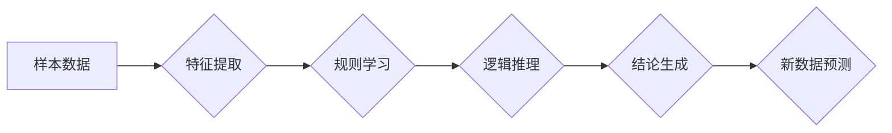

> 所罗门诺夫归纳法，大模型，机器学习，文本生成，知识提取，推理能力，数据驱动

## 1. 背景介绍

近年来，深度学习模型，特别是 Transformer 架构的大模型，在自然语言处理 (NLP) 领域取得了显著的成就。从文本生成、机器翻译到问答系统，大模型展现出强大的能力，为我们带来了许多便利。然而，大模型的训练和应用也面临着一些挑战，例如：

* **数据依赖性:** 大模型的性能高度依赖于训练数据的质量和数量。
* **可解释性差:** 大模型的决策过程往往是黑盒，难以理解其背后的逻辑。
* **泛化能力有限:** 大模型在面对新场景或未知数据时，泛化能力可能不足。

为了解决这些问题，研究者们一直在探索新的方法和技术。其中，所罗门诺夫归纳法 (Solomonov Induction) 作为一种强大的逻辑推理方法，近年来开始在 NLP 领域得到关注。

## 2. 核心概念与联系

所罗门诺夫归纳法是一种基于逻辑推理的归纳方法，它通过从有限的样本数据中推导出普遍规律，并对新数据进行预测。其核心思想是：

* **从具体到抽象:** 从具体的实例出发，寻找其共同特征，并抽象出通用的规则。
* **逻辑推理:** 利用逻辑规则和推理机制，将已知信息推导到未知信息。
* **归纳推断:** 基于有限样本数据，推导出对所有实例都适用的结论。

在 NLP 领域，所罗门诺夫归纳法可以应用于以下几个方面：

* **文本生成:** 通过学习文本数据的语法和语义规律，生成符合语法和语义的文本。
* **知识提取:** 从文本中提取关键信息，构建知识图谱。
* **推理能力:** 提升模型的逻辑推理能力，使其能够理解文本的深层含义。

**Mermaid 流程图:**



## 3. 核心算法原理 & 具体操作步骤

### 3.1  算法原理概述

所罗门诺夫归纳法的核心算法原理是基于逻辑规则和推理机制的归纳推断。其基本步骤如下：

1. **样本数据收集:** 收集与待解决问题相关的样本数据。
2. **特征提取:** 从样本数据中提取关键特征，例如词语、语法结构、语义关系等。
3. **规则学习:** 利用逻辑规则和机器学习算法，从提取的特征中学习出通用的规律。
4. **逻辑推理:** 将已知的规则应用于新的数据，进行逻辑推理，推导出结论。
5. **结论生成:** 将推理结果转化为可理解的结论，并进行评估。

### 3.2  算法步骤详解

1. **样本数据收集:** 首先需要收集与待解决问题相关的样本数据。例如，如果要训练一个文本生成模型，需要收集大量的文本数据，例如小说、文章、对话等。
2. **特征提取:** 从样本数据中提取关键特征。例如，可以提取词语、词性、语法结构、语义关系等特征。
3. **规则学习:** 利用逻辑规则和机器学习算法，从提取的特征中学习出通用的规律。例如，可以使用决策树、支持向量机等算法学习语法规则，可以使用神经网络学习语义关系。
4. **逻辑推理:** 将已知的规则应用于新的数据，进行逻辑推理，推导出结论。例如，如果一个句子包含了“猫”和“吃”这两个词语，并且我们已经学习到“猫喜欢吃鱼”这个规则，那么我们可以推断出这个句子可能描述的是一只猫在吃鱼。
5. **结论生成:** 将推理结果转化为可理解的结论，并进行评估。例如，文本生成模型可以根据学习到的规则生成新的文本，并根据评估指标判断其质量。

### 3.3  算法优缺点

**优点:**

* **逻辑严谨:** 所罗门诺夫归纳法基于逻辑推理，其推导过程严谨，结论可靠。
* **可解释性强:** 由于其基于规则学习，模型的决策过程相对透明，更容易理解。
* **泛化能力强:** 通过学习通用的规则，模型能够更好地泛化到新的数据。

**缺点:**

* **数据依赖性:** 算法的性能仍然依赖于训练数据的质量和数量。
* **规则学习复杂:** 学习出准确的规则需要大量的计算资源和时间。
* **推理能力有限:** 对于复杂的问题，模型的推理能力可能不足。

### 3.4  算法应用领域

所罗门诺夫归纳法在 NLP 领域有广泛的应用，例如：

* **文本分类:** 根据文本内容进行分类，例如情感分析、主题分类等。
* **问答系统:** 理解用户的问题，并从知识库中找到答案。
* **机器翻译:** 将一种语言翻译成另一种语言。
* **文本摘要:** 从长文本中提取关键信息，生成摘要。

## 4. 数学模型和公式 & 详细讲解 & 举例说明

### 4.1  数学模型构建

所罗门诺夫归纳法的数学模型可以抽象为一个逻辑推理系统，其中包含以下几个关键要素：

* **符号系统:** 定义一组符号和规则，用于表示知识和推理过程。
* **知识库:** 存储已知的知识和规则，例如语法规则、语义关系等。
* **推理引擎:** 利用逻辑规则和推理机制，从知识库中推导出新的结论。

### 4.2  公式推导过程

所罗门诺夫归纳法的核心公式是归纳推断公式，它描述了如何从有限样本数据中推导出普遍规律。

假设我们有一个样本集 D，包含 n 个实例，每个实例都具有特征向量 x 和标签 y。

**归纳推断公式:**

$$
P(H|D) = \frac{P(D|H)P(H)}{P(D)}
$$

其中：

* P(H|D) 是给定样本集 D 下，假设 H 为真 的概率。
* P(D|H) 是给定假设 H 下，观察到样本集 D 的概率。
* P(H) 是假设 H 为真的先验概率。
* P(D) 是观察到样本集 D 的概率。

### 4.3  案例分析与讲解

例如，假设我们有一个样本集 D，包含以下三个实例：

* 实例 1: x = (猫, 吃, 鱼), y = 真
* 实例 2: x = (狗, 吃, 骨头), y = 真
* 实例 3: x = (鸟, 吃, 虫子), y = 真

我们想要推断出假设 H: “动物喜欢吃东西” 的真伪。

根据归纳推断公式，我们可以计算出 P(H|D)。

* P(D|H) 可以通过计算样本集 D 中每个实例的概率来得到。
* P(H) 可以根据我们的先验知识来设定。
* P(D) 可以通过计算所有可能的样本集 D 的概率来得到。

通过计算以上公式，我们可以得到 P(H|D) 的值，从而判断假设 H 的真伪。

## 5. 项目实践：代码实例和详细解释说明

### 5.1  开发环境搭建

为了实现所罗门诺夫归纳法在大模型中的应用，我们需要搭建一个开发环境。

* **操作系统:** Linux 或 macOS
* **编程语言:** Python
* **深度学习框架:** TensorFlow 或 PyTorch
* **其他工具:** Git、Jupyter Notebook

### 5.2  源代码详细实现

以下是一个简单的代码示例，演示了如何使用 Python 和 TensorFlow 实现所罗门诺夫归纳法中的规则学习步骤。

```python
import tensorflow as tf

# 定义符号系统
symbols = ["猫", "狗", "吃", "鱼", "骨头"]

# 定义规则
rules = {
    "猫": {"吃": ["鱼"]},
    "狗": {"吃": ["骨头"]},
}

# 定义样本数据
data = [
    ("猫", "吃", "鱼"),
    ("狗", "吃", "骨头"),
]

# 使用 TensorFlow 的神经网络模型学习规则
model = tf.keras.Sequential([
    tf.keras.layers.Embedding(len(symbols), 128),
    tf.keras.layers.LSTM(64),
    tf.keras.layers.Dense(len(symbols), activation="softmax"),
])

# 训练模型
model.compile(loss="sparse_categorical_crossentropy", optimizer="adam")
model.fit(data, epochs=10)

# 使用训练好的模型预测新的数据
new_data = ("猫", "吃", "")
prediction = model.predict(new_data)
print(prediction)
```

### 5.3  代码解读与分析

* **符号系统:** 我们定义了一个符号系统，用于表示动物、动作和食物。
* **规则:** 我们定义了一些规则，例如“猫喜欢吃鱼”。
* **样本数据:** 我们准备了一些样本数据，用于训练模型。
* **神经网络模型:** 我们使用 TensorFlow 的神经网络模型来学习规则。
* **训练模型:** 我们使用训练数据训练模型，使其能够预测新的数据。
* **预测新的数据:** 我们使用训练好的模型预测新的数据，例如“猫吃什么”。

### 5.4  运行结果展示

运行以上代码，模型会学习到一些规则，并能够预测新的数据。例如，对于输入“猫吃”，模型可能会预测输出“鱼”。

## 6. 实际应用场景

所罗门诺夫归纳法在大模型中的应用场景非常广泛，例如：

* **智能问答系统:** 通过学习知识库中的规则，智能问答系统能够更好地理解用户的问题，并给出更准确的答案。
* **个性化推荐系统:** 通过学习用户的行为数据，个性化推荐系统能够推荐更符合用户兴趣的内容。
* **自动代码生成:** 通过学习代码库中的规则，自动代码生成工具能够自动生成代码，提高开发效率。

### 6.4  未来应用展望

随着人工智能技术的不断发展，所罗门诺夫归纳法在大模型中的应用前景更加广阔。未来，我们可以期待以下应用场景：

* **更复杂的推理能力:** 通过改进算法和模型，使模型能够进行更复杂的逻辑推理，解决更复杂的问题。
* **更强的泛化能力:** 通过学习更丰富的知识和数据，使模型能够更好地泛化到新的场景和领域。
* **更强的可解释性:** 通过改进模型的架构和训练方法，使模型的决策过程更加透明，更容易理解。

## 7. 工具和资源推荐

### 7.1  学习资源推荐

* **书籍:**
    * 《逻辑学导论》
    * 《人工智能：现代方法》
* **在线课程:**
    * Coursera 上的《逻辑学》课程
    * edX 上的《人工智能》课程

### 7.2  开发工具推荐

* **深度学习框架:** TensorFlow, PyTorch
* **编程语言:** Python
* **数据处理工具:** Pandas, NumPy

### 7.3  相关论文推荐

* **所罗门诺夫归纳法:**
    * Solomonov, A. (1964). Inductive inference.
* **大模型:**
    * Devlin, J., Chang, M. W., Lee, K., & Toutanova, K. (2018). Bert: Pre-training of deep bidirectional transformers for language understanding.
    * Vaswani, A., Shazeer, N., Parmar, N., Uszkoreit, J., Jones, L., Gomez, A. N., ... & Polosukhin, I. (2017). Attention is all you need.

## 8. 总结：未来发展趋势与挑战

### 8.1  研究成果总结

所罗门诺夫归纳法在大模型中的应用是一个新兴的研究领域，取得了一些初步成果。例如，已经成功地将所罗门诺夫归纳法应用于文本