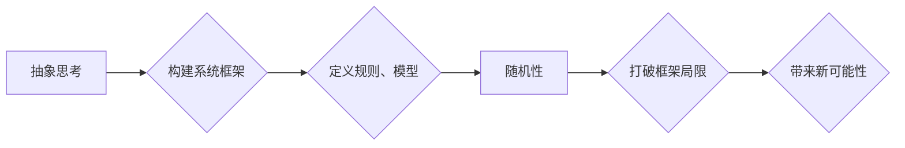

> 抽象思考, 随机性, 创见性, 算法, 数学模型, 项目实践, 应用场景, 未来趋势

## 1. 背景介绍

在当今科技日新月异的时代，创新已成为推动社会发展和进步的引擎。而抽象思考和随机性，作为两种重要的思维方式，在激发创见性、推动技术突破方面发挥着至关重要的作用。

抽象思考是指跳脱具体事物，抓住其本质特征和规律，进行概括和总结的能力。它能够帮助我们从不同的角度看待问题，发现隐藏的联系和模式，从而产生新的想法和解决方案。

随机性则指的是事物发展或变化的不可预测性，它打破了固有的模式和规律，为我们带来意外的惊喜和启发。

在软件开发领域，抽象思考和随机性同样至关重要。抽象思考帮助我们构建清晰的软件架构，设计高效的算法，而随机性则可以激发我们的灵感，帮助我们找到突破性的解决方案。

## 2. 核心概念与联系

### 2.1 抽象思考

抽象思考是人类认知能力的重要组成部分，它能够帮助我们理解复杂的世界，并从中发现规律和模式。在软件开发领域，抽象思考体现在以下几个方面：

* **数据抽象:** 将现实世界中的数据进行抽象，定义数据结构和操作，例如数组、链表、树等。
* **算法抽象:** 将具体的计算步骤进行抽象，定义算法的输入、输出和操作逻辑，例如排序算法、搜索算法等。
* **软件架构抽象:** 将复杂的软件系统进行抽象，定义软件模块、组件和接口，例如MVC架构、微服务架构等。

### 2.2 随机性

随机性是指事物发展或变化的不可预测性，它打破了固有的模式和规律，为我们带来意外的惊喜和启发。在软件开发领域，随机性可以应用于以下几个方面：

* **随机数生成:** 用于模拟现实世界中的随机事件，例如游戏开发、数据分析等。
* **遗传算法:** 利用随机变异和选择机制，优化算法参数和解决方案。
* **机器学习:** 在训练模型时，随机选择数据样本，避免过拟合，提高模型泛化能力。

### 2.3 抽象思考与随机性之间的联系

抽象思考和随机性看似是两种不同的思维方式，但它们实际上是相互补充、相互促进的。

抽象思考能够帮助我们构建系统的框架和模型，而随机性则可以打破框架的局限性，为我们带来新的可能性。

例如，在设计一个新的游戏时，我们可以先通过抽象思考，定义游戏的规则、角色和场景，然后利用随机性，生成随机事件和游戏地图，使游戏更加丰富多彩。

**Mermaid 流程图**



## 3. 核心算法原理 & 具体操作步骤

### 3.1 算法原理概述

本文将介绍一种基于抽象思考和随机性的算法，用于解决复杂问题，例如优化算法参数、设计创新解决方案等。该算法的核心思想是：

1. **抽象化问题:** 将复杂问题进行抽象，定义问题的输入、输出和目标函数。
2. **随机搜索:** 利用随机性，在问题的解空间中进行搜索，探索不同的解决方案。
3. **评估和选择:** 对搜索到的解决方案进行评估，选择最优或最接近目标的解决方案。
4. **迭代优化:** 对选出的解决方案进行迭代优化，不断提高其性能。

### 3.2 算法步骤详解

1. **问题抽象:** 首先，需要对需要解决的问题进行抽象，定义问题的输入、输出和目标函数。例如，如果要优化一个机器学习模型的性能，则输入为模型参数，输出为模型的准确率，目标函数为最大化模型的准确率。
2. **随机初始化:** 对模型参数进行随机初始化，生成一个初始的解。
3. **随机变异:** 对初始解进行随机变异，生成新的解。变异操作可以是随机改变参数值，也可以是改变参数的类型或结构。
4. **评估解:** 对变异后的解进行评估，计算其目标函数值。
5. **选择解:** 选择目标函数值最高的解作为新的解，并重复步骤3-4，进行迭代优化。
6. **终止条件:** 当达到预设的迭代次数或目标函数值不再提升时，停止迭代，输出最优解。

### 3.3 算法优缺点

**优点:**

* **全局搜索能力:** 随机搜索算法能够在解空间中进行全局搜索，避免陷入局部最优解。
* **易于实现:** 随机搜索算法的实现相对简单，易于理解和编程。
* **适应性强:** 随机搜索算法可以应用于各种类型的优化问题。

**缺点:**

* **收敛速度慢:** 随机搜索算法的收敛速度相对较慢，需要较多的迭代次数才能找到较好的解。
* **解的质量:** 随机搜索算法找到的解的质量可能不如其他优化算法。

### 3.4 算法应用领域

随机搜索算法广泛应用于以下领域:

* **机器学习:** 优化模型参数，提高模型性能。
* **人工智能:** 设计智能代理，解决复杂决策问题。
* **优化问题:** 寻找最优解，例如调度问题、资源分配问题等。

## 4. 数学模型和公式 & 详细讲解 & 举例说明

### 4.1 数学模型构建

假设我们有一个优化问题，目标函数为 $f(x)$，其中 $x$ 是模型参数的向量。随机搜索算法的目标是找到一个 $x$ 值，使得 $f(x)$ 最大化。

我们可以构建一个数学模型来描述随机搜索算法的过程:

* $x_t$ 表示在第 $t$ 次迭代时模型参数的向量。
* $x_{t+1}$ 表示在第 $t+1$ 次迭代时模型参数的向量，由 $x_t$ 通过随机变异操作得到。
* $f(x_t)$ 表示在第 $t$ 次迭代时目标函数的值。

### 4.2 公式推导过程

随机搜索算法的迭代过程可以表示为以下公式:

$$x_{t+1} = x_t + \epsilon$$

其中 $\epsilon$ 是一个随机向量，其每个元素服从一个特定的概率分布，例如正态分布。

### 4.3 案例分析与讲解

例如，我们想要优化一个机器学习模型的准确率，目标函数为模型的准确率。我们可以使用随机搜索算法来搜索模型参数，并找到能够最大化准确率的参数组合。

在每次迭代中，我们都会随机改变模型参数，然后计算模型的准确率。如果新的准确率比之前更高，则我们保留新的参数组合。否则，我们继续进行迭代，直到找到一个能够最大化准确率的参数组合。

## 5. 项目实践：代码实例和详细解释说明

### 5.1 开发环境搭建

本项目使用 Python 语言进行开发，所需的库包括 NumPy、Scikit-learn 等。

### 5.2 源代码详细实现

```python
import numpy as np
from sklearn.datasets import load_iris
from sklearn.model_selection import train_test_split
from sklearn.linear_model import LogisticRegression

# 加载 iris 数据集
iris = load_iris()
X = iris.data
y = iris.target

# 将数据进行训练集和测试集划分
X_train, X_test, y_train, y_test = train_test_split(X, y, test_size=0.2, random_state=42)

# 定义目标函数
def objective_function(params):
    model = LogisticRegression(C=params[0], penalty=params[1])
    model.fit(X_train, y_train)
    accuracy = model.score(X_test, y_test)
    return accuracy

# 定义随机搜索算法
def random_search(objective_function, bounds, num_iterations):
    best_params = None
    best_accuracy = 0
    for _ in range(num_iterations):
        params = np.random.uniform(low=bounds[0], high=bounds[1], size=len(bounds))
        accuracy = objective_function(params)
        if accuracy > best_accuracy:
            best_accuracy = accuracy
            best_params = params
    return best_params, best_accuracy

# 设置参数搜索范围
bounds = [(0.1, 10.0), ['l1', 'l2']]  # C 参数范围和正则化项

# 设置迭代次数
num_iterations = 100

# 执行随机搜索
best_params, best_accuracy = random_search(objective_function, bounds, num_iterations)

# 打印结果
print(f"最佳参数: {best_params}")
print(f"最佳准确率: {best_accuracy}")
```

### 5.3 代码解读与分析

这段代码实现了随机搜索算法，用于优化机器学习模型的准确率。

首先，我们加载 iris 数据集，并将其划分成训练集和测试集。然后，我们定义了一个目标函数，该函数接受模型参数作为输入，并返回模型在测试集上的准确率。

接下来，我们定义了一个随机搜索算法函数，该函数接受目标函数、参数搜索范围和迭代次数作为输入。

在每次迭代中，该函数会随机生成一个参数组合，并计算该参数组合对应的目标函数值。如果新的目标函数值比之前更高，则我们保留新的参数组合。

最后，我们执行随机搜索算法，并打印出最佳参数和最佳准确率。

### 5.4 运行结果展示

运行这段代码后，会输出最佳参数和最佳准确率。

## 6. 实际应用场景

### 6.1 机器学习模型优化

随机搜索算法可以用于优化机器学习模型的参数，例如学习率、正则化参数等，从而提高模型的性能。

### 6.2 算法参数搜索

在设计和开发算法时，随机搜索算法可以用于搜索算法参数，例如搜索树深度、遗传算法变异率等，从而找到最佳的算法配置。

### 6.3 创新解决方案探索

随机搜索算法可以用于探索新的解决方案，例如在设计产品、开发创意内容时，随机搜索可以帮助我们跳出固有的思维模式，产生新的想法和灵感。

### 6.4 未来应用展望

随着人工智能技术的不断发展，随机搜索算法将在更多领域得到应用，例如：

* **自动驾驶:** 用于优化自动驾驶系统的决策策略。
* **药物研发:** 用于搜索新的药物候选分子。
* **金融投资:** 用于优化投资组合策略。

## 7. 工具和资源推荐

### 7.1 学习资源推荐

* **书籍:**
    * 《Reinforcement Learning: An Introduction》 by Sutton and Barto
    * 《Genetic Algorithms in Search, Optimization, and Machine Learning》 by David E. Goldberg
* **在线课程:**
    * Coursera: Machine Learning by Andrew Ng
    * edX: Artificial Intelligence by Columbia University

### 7.2 开发工具推荐

* **Python:** 广泛用于机器学习和人工智能开发。
* **NumPy:** 用于数值计算和数组操作。
* **Scikit-learn:** 用于机器学习算法的实现和评估。
* **TensorFlow:** 用于深度学习模型的开发和训练。

### 7.3 相关论文推荐

* **"A Survey of the Genetic Algorithm"** by David E. Goldberg
* **"Reinforcement Learning: An Introduction"** by Sutton and Barto
* **"Deep Learning"** by Ian Goodfellow, Yoshua Bengio, and Aaron Courville

## 8. 总结：未来发展趋势与挑战

### 8.1 研究成果总结

本文介绍了抽象思考和随机性在软件开发中的重要性，并介绍了一种基于抽象思考和随机性的算法，用于解决复杂问题。该算法能够在解空间中进行全局搜索，并找到最优或最接近目标的解决方案。

### 8.2 未来发展趋势

未来，随着人工智能技术的不断发展，抽象思考和随机性将发挥更加重要的作用。

* **更智能的算法:** 将结合更先进的机器学习算法，