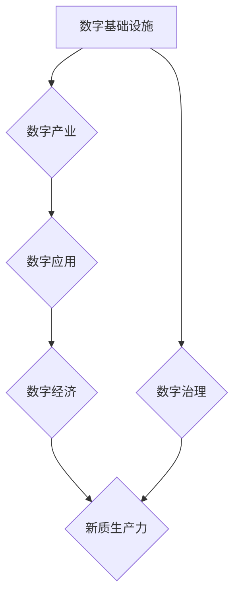

> 数字中国战略, 新质生产力, 互联网技术, 大数据, 云计算, 人工智能, 数字经济, 产业升级

## 1. 背景介绍

21世纪初，以互联网、大数据、云计算、人工智能为代表的新一代信息技术蓬勃发展，深刻地改变着人类社会生产方式和生活方式。中国政府于2021年发布了《数字中国建设整体方案》，明确提出要以数字技术为驱动，推动经济社会数字化转型升级，建设数字中国。

数字中国战略的提出，标志着中国迈向数字经济时代的新征程。数字经济以数据为要素、网络为基础、智能为特征，其核心是利用数字技术提高生产效率、优化资源配置、提升社会治理水平。

## 2. 核心概念与联系

**2.1 数字中国战略**

数字中国战略是指以数字技术为基础，构建数字基础设施、发展数字产业、提升数字应用、加强数字治理，推动经济社会数字化转型升级，建设数字强国，实现数字中国愿景的战略规划。

**2.2 新质生产力**

新质生产力是指以数字技术为核心，融合人工智能、大数据、云计算等新兴技术，以数据为驱动，以智能化、网络化、平台化为特征的生产力。

**2.3 核心概念联系**

数字中国战略是实现新质生产力的重要支撑。数字基础设施建设是新质生产力的基础，数字产业发展是新质生产力的源泉，数字应用创新是新质生产力的动力，数字治理体系建设是新质生产力的保障。

**2.4 核心概念架构**

## 3. 核心算法原理 & 具体操作步骤

**3.1 算法原理概述**

新质生产力离不开算法的驱动。例如，人工智能算法可以实现智能化生产，大数据算法可以优化资源配置，云计算算法可以提高计算效率。

**3.2 算法步骤详解**

以机器学习算法为例，其基本步骤包括：

1. 数据收集和预处理：收集相关数据，并进行清洗、转换、特征提取等预处理工作。
2. 模型选择：根据具体任务选择合适的机器学习模型，例如线性回归、决策树、支持向量机等。
3. 模型训练：利用训练数据训练模型，调整模型参数，使模型能够学习数据中的规律。
4. 模型评估：利用测试数据评估模型的性能，例如准确率、召回率、F1-score等。
5. 模型部署：将训练好的模型部署到实际应用场景中，用于预测、分类、识别等任务。

**3.3 算法优缺点**

不同的算法具有不同的优缺点，需要根据具体任务选择合适的算法。例如，线性回归算法简单易实现，但对非线性关系的拟合能力较弱；决策树算法可以处理非线性关系，但容易过拟合；支持向量机算法可以处理高维数据，但训练时间较长。

**3.4 算法应用领域**

机器学习算法广泛应用于各个领域，例如：

* **医疗保健:** 疾病诊断、药物研发、个性化医疗
* **金融服务:** 欺诈检测、风险评估、信用评分
* **电商:** 商品推荐、用户画像、精准营销
* **制造业:** 质量控制、设备预测维护、生产优化

## 4. 数学模型和公式 & 详细讲解 & 举例说明

**4.1 数学模型构建**

新质生产力可以抽象为一个数学模型，其中包括生产要素、生产过程、生产效率等多个变量。例如，可以构建一个生产函数，描述生产要素投入与产出之间的关系。

**4.2 公式推导过程**

生产函数的推导过程通常需要利用经济学理论和数学工具，例如微积分、线性代数等。

**4.3 案例分析与讲解**

以 Cobb-Douglas 生产函数为例，其公式为：

$$Y = A K^{\alpha} L^{\beta}$$

其中：

* $Y$：产出
* $A$：全要素生产率
* $K$：资本投入
* $L$：劳动力投入
* $\alpha$、$\beta$：资本和劳动力投入的弹性系数

该公式表明，产出与资本投入和劳动力投入的乘积成正比，并且每个要素的贡献率由弹性系数决定。

## 5. 项目实践：代码实例和详细解释说明

**5.1 开发环境搭建**

新质生产力项目开发通常需要搭建一个完整的开发环境，包括操作系统、编程语言、数据库、云计算平台等。

**5.2 源代码详细实现**

以机器学习算法为例，其源代码实现通常需要使用机器学习框架，例如 TensorFlow、PyTorch 等。

**5.3 代码解读与分析**

需要对源代码进行详细解读和分析，理解算法的逻辑流程、数据处理方式、模型训练过程等。

**5.4 运行结果展示**

需要对算法的运行结果进行展示和分析，例如模型的准确率、召回率、F1-score等指标。

## 6. 实际应用场景

**6.1 数字经济发展**

数字中国战略的实施将推动数字经济的快速发展，例如电子商务、在线教育、数字金融等领域将迎来新的增长机遇。

**6.2 产业升级转型**

数字技术将推动传统产业的升级转型，例如制造业将实现智能化、自动化、数字化，提升生产效率和产品质量。

**6.3 社会治理优化**

数字技术将优化社会治理，例如智慧城市建设、公共服务便捷化、社会管理精细化等。

**6.4 未来应用展望**

数字中国战略的实施将带来更多新的应用场景，例如元宇宙、Web3.0、数字孪生等，为人类社会带来更加便捷、高效、智能的生活方式。

## 7. 工具和资源推荐

**7.1 学习资源推荐**

* **在线课程:** Coursera、edX、Udacity 等平台提供丰富的数字技术相关课程。
* **书籍:** 《数字经济》、《人工智能》、《云计算》等书籍可以帮助读者深入了解相关知识。
* **开源社区:** GitHub、Stack Overflow 等开源社区可以提供技术支持和学习资源。

**7.2 开发工具推荐**

* **编程语言:** Python、Java、C++ 等编程语言是数字技术开发的常用语言。
* **机器学习框架:** TensorFlow、PyTorch、Scikit-learn 等机器学习框架可以帮助开发者构建和训练机器学习模型。
* **云计算平台:** AWS、Azure、GCP 等云计算平台可以提供计算资源、存储资源和网络资源。

**7.3 相关论文推荐**

* **数字经济:** "The Digital Economy" by Michael E. Porter
* **人工智能:** "Artificial Intelligence: A Modern Approach" by Stuart Russell and Peter Norvig
* **云计算:** "Cloud Computing: Concepts, Technology & Architecture" by Thomas Erl

## 8. 总结：未来发展趋势与挑战

**8.1 研究成果总结**

数字中国战略的实施取得了显著成果，数字基础设施建设取得了重大进展，数字产业发展取得了快速增长，数字应用创新取得了突破性进展。

**8.2 未来发展趋势**

未来，数字中国战略将继续深入推进，重点关注以下几个方面：

* **基础设施建设:** 加强数字基础设施建设，构建更加安全、可靠、高效的数字基础设施。
* **产业发展:** 培育壮大数字产业，推动数字产业向高端化、智能化、国际化发展。
* **应用创新:** 加强数字应用创新，推动数字技术在各个领域的应用，提升社会治理水平。
* **人才培养:** 加强数字人才培养，培养更多具有创新能力、实践能力和国际视野的数字人才。

**8.3 面临的挑战**

数字中国战略的实施也面临着一些挑战，例如：

* **数据安全:** 数据安全问题日益突出，需要加强数据安全保护，构建安全可靠的数据共享机制。
* **数字鸿沟:** 数字鸿沟问题依然存在，需要加大对农村、欠发达地区和弱势群体的数字技术支持力度。
* **伦理道德:** 数字技术发展带来了一些伦理道德问题，需要加强伦理道德规范建设，引导数字技术健康发展。

**8.4 研究展望**

未来，数字中国战略的研究将更加深入，更加注重以下几个方面：

* **数字经济发展模式:** 研究数字经济发展的新模式、新机制、新业态。
* **新质生产力构建:** 研究新质生产力的核心要素、关键技术、发展路径。
* **数字社会治理:** 研究数字技术在社会治理中的应用，构建更加智能、高效、公平的社会治理体系。

## 9. 附录：常见问题与解答

**9.1 数字中国战略的实施对企业有什么影响？**

数字中国战略的实施将为企业带来新的机遇和挑战。企业需要积极拥抱数字技术，进行数字化转型升级，才能在数字经济时代获得发展。

**9.2 如何参与数字中国战略的实施？**

个人和企业都可以参与数字中国战略的实施。个人可以学习数字技术知识，提升自身技能；企业可以积极参与数字产业发展，推动数字技术应用创新。

**9.3 数字中国战略的未来发展方向是什么？**

数字中国战略的未来发展方向将更加注重基础设施建设、产业发展、应用创新、人才培养等方面，推动数字技术在各个领域的应用，构建更加安全、可靠、高效的数字社会。

作者：禅与计算机程序设计艺术 / Zen and the Art of Computer Programming 
<end_of_turn>