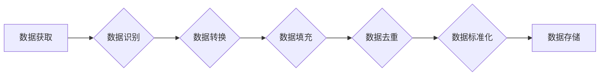

> 数据清洗、数据质量、软件开发、数据工程、机器学习、数据分析、数据标准化

## 1. 背景介绍

在当今数据爆炸的时代，数据已成为企业最重要的资产。然而，现实中收集到的数据往往是脏乱的，包含着大量的缺失值、错误值、重复值等问题。这些数据质量问题会严重影响数据分析、机器学习等应用的准确性和可靠性，甚至导致决策失误。因此，数据清洗成为了软件2.0开发中不可或缺的一部分。

传统的软件开发模式主要关注于功能实现，而数据清洗则属于数据工程领域，需要对数据进行深入的理解和处理。随着数据驱动决策的理念深入人心，数据清洗的重要性日益凸显。

## 2. 核心概念与联系

数据清洗是指对原始数据进行一系列处理操作，以消除数据中的噪声、错误和不完整性，从而提高数据质量。

数据清洗是一个复杂的过程，涉及到多个环节和技术，包括：

* **数据识别:** 识别数据中的各种问题，例如缺失值、错误值、重复值、格式不一致等。
* **数据转换:** 将数据转换为一致的格式，例如将日期格式统一、将数值类型转换为字符串等。
* **数据填充:** 对缺失值进行填充，例如使用平均值、中位数或其他统计方法进行填充。
* **数据去重:** 去除重复数据，确保数据唯一性。
* **数据标准化:** 将数据转换为标准格式，例如将数值范围压缩到0到1之间。

**数据清洗与软件开发的关系**

数据清洗与软件开发密切相关，可以看作是软件开发生命周期的重要组成部分。

* **数据获取:** 软件开发过程中需要从各种数据源获取数据，这些数据可能存在质量问题。
* **数据处理:** 软件开发过程中需要对数据进行处理，例如计算、分析、存储等。数据质量问题会影响数据处理的准确性和效率。
* **数据展示:** 软件开发过程中需要将数据展示给用户，数据质量问题会影响用户体验。

**数据清洗流程图**



## 3. 核心算法原理 & 具体操作步骤

### 3.1  算法原理概述

数据清洗算法主要分为以下几类：

* **缺失值处理算法:** 
    * 平均值填充
    * 中位数填充
    * 最常见值填充
    * K最近邻插值
* **错误值处理算法:** 
    * 异常值检测
    * 规则匹配
    * 统计分析
* **重复值处理算法:** 
    * 哈希表
    * 聚类算法
* **数据标准化算法:** 
    * Min-Max 标准化
    * Z-score 标准化

### 3.2  算法步骤详解

以缺失值填充为例，详细说明算法步骤：

1. **识别缺失值:** 遍历数据，找到所有缺失值。
2. **选择填充方法:** 根据数据类型和缺失值情况，选择合适的填充方法。
3. **填充缺失值:** 使用选定的方法填充缺失值。

### 3.3  算法优缺点

不同的数据清洗算法各有优缺点，需要根据实际情况选择合适的算法。

* **平均值填充:** 简单易行，但容易受到异常值的影响。
* **中位数填充:** 对异常值更鲁棒，但可能丢失一些信息。
* **最常见值填充:** 适用于类别型数据，但可能导致数据分布不均匀。
* **K最近邻插值:** 能够更好地保留数据特征，但计算复杂度较高。

### 3.4  算法应用领域

数据清洗算法广泛应用于各个领域，例如：

* **金融领域:** 处理银行交易数据、信用评分数据等。
* **医疗领域:** 处理患者病历数据、医疗影像数据等。
* **电商领域:** 处理用户购买数据、商品评价数据等。
* **互联网领域:** 处理用户行为数据、网站访问数据等。

## 4. 数学模型和公式 & 详细讲解 & 举例说明

### 4.1  数学模型构建

数据清洗可以看作是一个优化问题，目标是最大化数据质量，最小化数据噪声。

我们可以使用以下数学模型来描述数据清洗过程：

```latex
Q(D) = \sum_{i=1}^{n} w_i * f_i(d_i)
```

其中：

* $Q(D)$ 表示数据质量
* $D$ 表示数据集合
* $n$ 表示数据数量
* $w_i$ 表示第 $i$ 个数据特征的重要性权重
* $f_i(d_i)$ 表示第 $i$ 个数据特征的质量函数

### 4.2  公式推导过程

数据质量函数 $f_i(d_i)$ 可以根据具体的清洗任务进行定义。例如，对于缺失值填充，我们可以定义如下质量函数：

```latex
f_i(d_i) = \begin{cases}
1 & \text{if } d_i \text{ is not missing} \\
0 & \text{if } d_i \text{ is missing}
\end{cases}
```

### 4.3  案例分析与讲解

假设我们有一组数据，其中包含年龄特征，部分数据缺失。我们可以使用平均值填充来处理缺失值。

* 首先，计算年龄特征的平均值。
* 然后，将所有缺失值填充为平均值。

通过这种方式，我们可以提高数据完整性，但需要注意的是，平均值填充可能会导致数据分布失真。

## 5. 项目实践：代码实例和详细解释说明

### 5.1  开发环境搭建

* Python 3.x
* Pandas 库
* NumPy 库

### 5.2  源代码详细实现

```python
import pandas as pd
import numpy as np

# 加载数据
data = pd.read_csv('data.csv')

# 缺失值填充
data['age'].fillna(data['age'].mean(), inplace=True)

# 保存数据
data.to_csv('cleaned_data.csv', index=False)
```

### 5.3  代码解读与分析

* `pd.read_csv('data.csv')`: 读取数据文件，生成 Pandas DataFrame。
* `data['age'].fillna(data['age'].mean(), inplace=True)`: 使用平均值填充年龄特征的缺失值。
* `data.to_csv('cleaned_data.csv', index=False)`: 保存处理后的数据文件。

### 5.4  运行结果展示

运行代码后，将生成一个名为 `cleaned_data.csv` 的文件，其中包含处理后的数据。

## 6. 实际应用场景

数据清洗在各个领域都有广泛的应用场景，例如：

* **金融领域:** 处理银行交易数据、信用评分数据等，提高数据质量，降低风险。
* **医疗领域:** 处理患者病历数据、医疗影像数据等，提高诊断准确率，促进医疗决策。
* **电商领域:** 处理用户购买数据、商品评价数据等，优化商品推荐、个性化营销等。
* **互联网领域:** 处理用户行为数据、网站访问数据等，分析用户行为，提高网站运营效率。

### 6.4  未来应用展望

随着数据量的不断增长和数据分析技术的不断发展，数据清洗的重要性将更加突出。未来，数据清洗技术将朝着以下方向发展：

* **自动化:** 利用机器学习等技术，实现数据清洗的自动化。
* **智能化:** 基于数据理解和知识图谱，实现数据清洗的智能化。
* **实时化:** 实现对实时数据进行清洗，满足实时数据分析的需求。

## 7. 工具和资源推荐

### 7.1  学习资源推荐

* **书籍:**
    * 《数据清洗》
    * 《数据工程实践》
* **在线课程:**
    * Coursera: Data Cleaning and Preprocessing
    * Udemy: Data Cleaning and Preparation

### 7.2  开发工具推荐

* **Pandas:** Python 数据分析库，提供丰富的清洗数据功能。
* **NumPy:** Python 数值计算库，用于数据处理和转换。
* **Scikit-learn:** Python 机器学习库，提供一些数据清洗算法。

### 7.3  相关论文推荐

* **Data Cleaning: A Survey**
* **A Survey of Data Cleaning Techniques**

## 8. 总结：未来发展趋势与挑战

### 8.1  研究成果总结

数据清洗技术已经取得了显著的成果，为数据分析、机器学习等领域提供了重要的支持。

### 8.2  未来发展趋势

数据清洗技术将朝着自动化、智能化、实时化方向发展，并与其他数据技术融合，形成更加强大的数据处理能力。

### 8.3  面临的挑战

数据清洗技术还面临着一些挑战，例如：

* 数据质量问题越来越复杂，需要开发更智能的清洗算法。
* 数据量越来越大，需要提高数据清洗的效率。
* 数据隐私保护问题需要得到重视，需要开发更加安全的清洗技术。

### 8.4  研究展望

未来，数据清洗技术的研究将继续深入，探索更有效的清洗算法、更智能的清洗系统和更安全的清洗方法。


## 9. 附录：常见问题与解答

**Q1: 数据清洗的目的是什么？**

**A1:** 数据清洗的目标是提高数据质量，消除数据中的噪声、错误和不完整性。

**Q2: 数据清洗有哪些常用算法？**

**A2:** 数据清洗常用算法包括缺失值填充、错误值处理、重复值处理和数据标准化等。

**Q3: 如何选择合适的缺失值填充方法？**

**A3:** 选择合适的缺失值填充方法需要根据数据类型和缺失值情况进行判断。

**Q4: 数据清洗对机器学习有什么影响？**

**A4:** 数据清洗可以显著提高机器学习模型的准确性和性能。

**Q5: 数据清洗的工具有哪些？**

**A5:** 常用的数据清洗工具包括 Pandas、NumPy、Scikit-learn 等。


作者：禅与计算机程序设计艺术 / Zen and the Art of Computer Programming 
<end_of_turn>