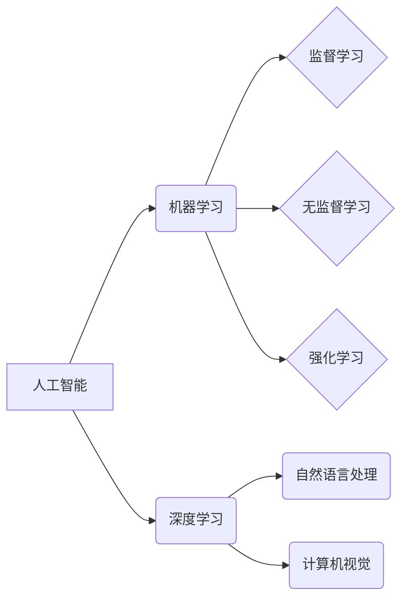

> 苹果, AI应用, 深度学习, 自然语言处理, 计算机视觉, 机器学习, 人工智能

## 1. 背景介绍

近年来，人工智能（AI）技术飞速发展，已渗透到生活的方方面面。从智能手机的语音助手到自动驾驶汽车，AI正在改变着我们的世界。苹果公司作为科技领域的巨头，也积极拥抱AI技术，并将其应用于其产品和服务中。

2023年，苹果公司发布了一系列搭载AI技术的应用，包括Siri的升级、照片识别的增强、健康监测的智能化等。这些应用的发布，标志着苹果公司在AI领域的战略布局进一步深入。

## 2. 核心概念与联系

### 2.1  人工智能（AI）

人工智能是指模拟人类智能行为的计算机系统。它涵盖了多种技术，包括机器学习、深度学习、自然语言处理、计算机视觉等。

### 2.2  机器学习（ML）

机器学习是人工智能的一个子领域，它使计算机能够从数据中学习，并根据学习到的知识进行预测或决策。机器学习算法可以分为监督学习、无监督学习和强化学习三种类型。

### 2.3  深度学习（DL）

深度学习是机器学习的一个子领域，它使用多层神经网络来模拟人类大脑的学习过程。深度学习算法在图像识别、语音识别、自然语言处理等领域取得了突破性的进展。

### 2.4  自然语言处理（NLP）

自然语言处理是指使计算机能够理解和处理人类语言的技术。NLP应用广泛，包括机器翻译、文本摘要、情感分析等。

### 2.5  计算机视觉（CV）

计算机视觉是指使计算机能够“看”和理解图像的技术。计算机视觉应用广泛，包括图像识别、物体检测、图像分割等。

**核心概念与联系流程图**



## 3. 核心算法原理 & 具体操作步骤

### 3.1  算法原理概述

深度学习算法的核心是多层神经网络。神经网络由许多相互连接的神经元组成，每个神经元接收来自其他神经元的输入，并根据输入进行计算，输出到其他神经元。

深度学习算法通过训练神经网络来学习数据中的模式。训练过程 involves 使用大量的 labeled 数据来调整神经网络的权重，使得神经网络能够准确地预测或分类新的数据。

### 3.2  算法步骤详解

1. **数据预处理:** 将原始数据转换为深度学习算法可以理解的格式。这可能包括数据清洗、数据转换、数据归一化等操作。
2. **网络结构设计:** 根据具体任务选择合适的深度学习网络结构。常见的网络结构包括卷积神经网络（CNN）、循环神经网络（RNN）和Transformer等。
3. **模型训练:** 使用训练数据训练深度学习模型。训练过程 involves 迭代地调整模型的权重，使得模型能够准确地预测或分类新的数据。
4. **模型评估:** 使用测试数据评估模型的性能。常用的评估指标包括准确率、召回率、F1-score等。
5. **模型部署:** 将训练好的模型部署到实际应用场景中。

### 3.3  算法优缺点

**优点:**

* 能够学习复杂的数据模式。
* 性能优于传统机器学习算法。
* 应用广泛，涵盖图像识别、语音识别、自然语言处理等多个领域。

**缺点:**

* 需要大量的 labeled 数据进行训练。
* 训练过程耗时和耗能。
* 模型解释性较差。

### 3.4  算法应用领域

深度学习算法已广泛应用于以下领域：

* **图像识别:** 人脸识别、物体检测、图像分类等。
* **语音识别:** 语音转文本、语音助手等。
* **自然语言处理:** 机器翻译、文本摘要、情感分析等。
* **推荐系统:** 商品推荐、内容推荐等。
* **医疗诊断:** 疾病诊断、影像分析等。

## 4. 数学模型和公式 & 详细讲解 & 举例说明

### 4.1  数学模型构建

深度学习模型的核心是神经网络，神经网络由许多层神经元组成。每个神经元接收来自其他神经元的输入，并根据输入进行计算，输出到其他神经元。

神经网络的数学模型可以表示为：

$$
y = f(W x + b)
$$

其中：

* $y$ 是神经元的输出。
* $x$ 是神经元的输入。
* $W$ 是权重矩阵。
* $b$ 是偏置向量。
* $f$ 是激活函数。

### 4.2  公式推导过程

深度学习模型的训练过程 involves 使用梯度下降算法来调整模型的权重，使得模型能够准确地预测或分类新的数据。

梯度下降算法的基本原理是：

1. 计算模型的损失函数。
2. 计算损失函数对权重的梯度。
3. 根据梯度更新权重。

损失函数通常是模型的预测值与真实值的差值。梯度表示损失函数在当前权重下的变化方向。

### 4.3  案例分析与讲解

例如，在图像分类任务中，深度学习模型的输入是图像像素值，输出是图像所属类别。

训练过程中，模型会使用大量的 labeled 图像数据来学习图像特征。

当模型遇到新的图像时，它会根据学习到的特征对图像进行分类。

## 5. 项目实践：代码实例和详细解释说明

### 5.1  开发环境搭建

为了实现深度学习模型的开发，需要搭建相应的开发环境。

常用的开发环境包括：

* **Python:** 深度学习框架的编程语言。
* **TensorFlow:** Google 开发的开源深度学习框架。
* **PyTorch:** Facebook 开发的开源深度学习框架。
* **CUDA:** NVIDIA 开发的 GPU 计算平台。

### 5.2  源代码详细实现

以下是一个使用 TensorFlow 实现图像分类模型的简单代码示例：

```python
import tensorflow as tf

# 定义模型结构
model = tf.keras.models.Sequential([
  tf.keras.layers.Conv2D(32, (3, 3), activation='relu', input_shape=(28, 28, 1)),
  tf.keras.layers.MaxPooling2D((2, 2)),
  tf.keras.layers.Conv2D(64, (3, 3), activation='relu'),
  tf.keras.layers.MaxPooling2D((2, 2)),
  tf.keras.layers.Flatten(),
  tf.keras.layers.Dense(10, activation='softmax')
])

# 编译模型
model.compile(optimizer='adam',
              loss='sparse_categorical_crossentropy',
              metrics=['accuracy'])

# 训练模型
model.fit(x_train, y_train, epochs=5)

# 评估模型
loss, accuracy = model.evaluate(x_test, y_test)
print('Test loss:', loss)
print('Test accuracy:', accuracy)
```

### 5.3  代码解读与分析

这段代码定义了一个简单的卷积神经网络模型，用于图像分类任务。

模型结构包括两个卷积层、两个最大池化层、一个全连接层和一个输出层。

模型使用 Adam 优化器、稀疏类别交叉熵损失函数和准确率作为评估指标。

模型使用训练数据进行训练，并使用测试数据进行评估。

### 5.4  运行结果展示

训练完成后，模型的准确率会随着训练轮数的增加而提高。

评估结果会显示模型在测试数据上的损失值和准确率。

## 6. 实际应用场景

### 6.1  智能语音助手

深度学习算法可以用于训练语音识别模型，使智能语音助手能够更准确地理解用户的语音指令。

### 6.2  图像识别

深度学习算法可以用于训练图像识别模型，使计算机能够识别图像中的物体、场景和人物。

### 6.3  医疗诊断

深度学习算法可以用于训练医疗诊断模型，帮助医生更快、更准确地诊断疾病。

### 6.4  未来应用展望

随着深度学习算法的不断发展，其应用场景将会更加广泛。

例如，深度学习算法可以用于自动驾驶汽车、机器人控制、个性化教育等领域。

## 7. 工具和资源推荐

### 7.1  学习资源推荐

* **Coursera:** 提供深度学习相关的在线课程。
* **Udacity:** 提供深度学习相关的在线课程和项目。
* **Stanford CS231n:** 深度学习课程的公开课视频和笔记。

### 7.2  开发工具推荐

* **TensorFlow:** Google 开发的开源深度学习框架。
* **PyTorch:** Facebook 开发的开源深度学习框架。
* **Keras:** TensorFlow 上的深度学习 API。

### 7.3  相关论文推荐

* **AlexNet:** ImageNet Large Scale Visual Recognition Challenge 2012 冠军论文。
* **VGGNet:** 2014 年 ImageNet 大规模视觉识别挑战赛冠军论文。
* **ResNet:** 深度残差网络论文。

## 8. 总结：未来发展趋势与挑战

### 8.1  研究成果总结

近年来，深度学习算法取得了显著的进展，在图像识别、语音识别、自然语言处理等领域取得了突破性的成果。

### 8.2  未来发展趋势

未来，深度学习算法将会朝着以下方向发展：

* **模型更深、更复杂:** 研究更深、更复杂的深度学习模型，以提高模型的性能。
* **模型更易解释:** 研究更易解释的深度学习模型，以提高模型的可信度。
* **模型更节能:** 研究更节能的深度学习模型，以降低模型的训练和部署成本。

### 8.3  面临的挑战

深度学习算法也面临着一些挑战：

* **数据依赖:** 深度学习算法需要大量的 labeled 数据进行训练。
* **计算资源:** 训练深度学习模型需要大量的计算资源。
* **伦理问题:** 深度学习算法的应用可能引发一些伦理问题，例如算法偏见、隐私泄露等。

### 8.4  研究展望

未来，我们需要继续研究深度学习算法，以克服其面临的挑战，并将其应用于更多领域，造福人类社会。

## 9. 附录：常见问题与解答

### 9.1  深度学习和机器学习有什么区别？

深度学习是机器学习的一个子领域，它使用多层神经网络来模拟人类大脑的学习过程。

### 9.2  如何选择合适的深度学习框架？

选择深度学习框架需要考虑以下因素：

* **项目需求:** 不同的项目可能需要不同的深度学习框架。
* **开发经验:** 选择自己熟悉的深度学习框架。
* **社区支持:** 选择社区支持良好的深度学习框架。

### 9.3  如何解决深度学习模型的过拟合问题？

过拟合是指模型在训练数据上表现很好，但在测试数据上表现较差。

解决过拟合问题的方法包括：

* **增加训练数据量:** 更多的训练数据可以帮助模型更好地泛化。
* **使用正则化技术:** 正则化技术可以防止模型过于复杂。
* **使用 dropout 技术:** dropout 技术可以随机丢弃神经元的输出，防止模型过拟合。


作者：禅与计算机程序设计艺术 / Zen and the Art of Computer Programming 
<end_of_turn>