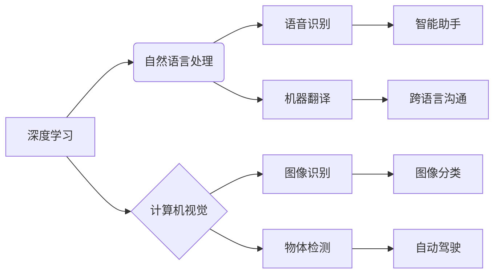

> 苹果, AI, 应用, 未来, 深度学习, 自然语言处理, 计算机视觉

## 1. 背景介绍

近年来，人工智能（AI）技术取得了飞速发展，并开始渗透到人们生活的方方面面。从智能手机的语音助手到自动驾驶汽车，AI正在改变着我们的世界。作为科技巨头，苹果也积极布局AI领域，并将其融入到其产品和服务中。

2017年，苹果发布了其首款AI芯片A11 Bionic，并将其应用于iPhone X等产品。该芯片拥有强大的神经网络处理能力，为苹果的AI应用提供了硬件基础。随后，苹果陆续发布了新的AI芯片，并不断提升其AI能力。

苹果在AI应用方面也取得了一定的成果。例如，其Face ID人脸识别技术、Siri语音助手、以及照片识别功能等，都离不开AI技术的支持。

然而，苹果在AI领域仍然面临着诸多挑战。首先，苹果的AI技术相对封闭，缺乏与开源社区的合作。其次，苹果的AI应用场景相对有限，尚未真正实现AI技术的全面应用。

## 2. 核心概念与联系

### 2.1  深度学习

深度学习是机器学习的一种重要分支，它利用多层神经网络来模拟人类大脑的学习过程。深度学习算法能够从海量数据中自动提取特征，并进行复杂的模式识别和预测。

### 2.2  自然语言处理

自然语言处理（NLP）是人工智能领域的一个重要分支，它致力于使计算机能够理解和处理人类语言。NLP技术广泛应用于语音识别、机器翻译、文本摘要等领域。

### 2.3  计算机视觉

计算机视觉是人工智能领域的一个重要分支，它致力于使计算机能够“看”和理解图像和视频。计算机视觉技术广泛应用于图像识别、物体检测、人脸识别等领域。

**核心概念与联系流程图**



## 3. 核心算法原理 & 具体操作步骤

### 3.1  算法原理概述

深度学习算法的核心是多层神经网络。神经网络由多个节点（神经元）组成，每个节点都连接着其他节点，并通过权重来传递信息。通过训练神经网络，可以学习到数据中的模式和特征。

### 3.2  算法步骤详解

1. **数据预处理:** 将原始数据转换为神经网络可以理解的格式。
2. **网络结构设计:** 根据任务需求设计神经网络的结构，包括层数、节点数、激活函数等。
3. **参数初始化:** 为神经网络的权重和偏置赋予初始值。
4. **前向传播:** 将输入数据通过神经网络传递，得到输出结果。
5. **反向传播:** 计算输出结果与真实值的误差，并根据误差调整神经网络的权重和偏置。
6. **迭代训练:** 重复前向传播和反向传播的过程，直到模型达到预期的性能。

### 3.3  算法优缺点

**优点:**

* 能够自动提取特征，无需人工特征工程。
* 能够处理海量数据，学习到更复杂的模式。
* 在图像识别、语音识别、自然语言处理等领域取得了优异的性能。

**缺点:**

* 训练数据量大，训练时间长。
* 对硬件资源要求高。
* 模型解释性差，难以理解模型的决策过程。

### 3.4  算法应用领域

深度学习算法广泛应用于以下领域：

* **计算机视觉:** 图像识别、物体检测、人脸识别、图像分割等。
* **自然语言处理:** 语音识别、机器翻译、文本摘要、情感分析等。
* **推荐系统:** 商品推荐、内容推荐、用户画像等。
* **医疗诊断:** 病理图像分析、疾病预测、药物研发等。
* **金融分析:** 风险评估、欺诈检测、投资预测等。

## 4. 数学模型和公式 & 详细讲解 & 举例说明

### 4.1  数学模型构建

深度学习模型的核心是神经网络，其数学模型可以表示为一系列的矩阵运算。

**神经网络层:**

一个神经网络由多个层组成，每一层包含多个神经元。每个神经元接收来自上一层的输入信号，并通过权重进行加权求和，然后应用激活函数得到输出信号。

**激活函数:**

激活函数的作用是引入非线性，使神经网络能够学习到更复杂的模式。常见的激活函数包括 sigmoid 函数、ReLU 函数、tanh 函数等。

**损失函数:**

损失函数用于衡量模型预测结果与真实值的差距。常见的损失函数包括均方误差、交叉熵等。

**优化算法:**

优化算法用于更新神经网络的权重和偏置，使其能够最小化损失函数。常见的优化算法包括梯度下降、Adam 算法等。

### 4.2  公式推导过程

**前向传播公式:**

```latex
y = f(W * x + b)
```

其中：

* $y$ 是神经元的输出信号。
* $f$ 是激活函数。
* $W$ 是权重矩阵。
* $x$ 是输入信号。
* $b$ 是偏置向量。

**反向传播公式:**

```latex
\Delta W = \eta \frac{\partial L}{\partial W}
```

其中：

* $\Delta W$ 是权重更新量。
* $\eta$ 是学习率。
* $L$ 是损失函数。

### 4.3  案例分析与讲解

**图像分类案例:**

假设我们有一个图像分类任务，目标是将图像分类为猫、狗、鸟三种类别。我们可以使用深度学习模型来解决这个问题。

1. **数据预处理:** 将图像数据转换为合适的格式，例如将图像尺寸调整为 224x224。
2. **网络结构设计:** 可以使用预训练的模型，例如 ResNet 或 VGG，并对其进行微调。
3. **训练模型:** 使用训练数据训练模型，并使用损失函数和优化算法来更新模型参数。
4. **测试模型:** 使用测试数据评估模型的性能，例如计算准确率、召回率等指标。

## 5. 项目实践：代码实例和详细解释说明

### 5.1  开发环境搭建

* **操作系统:** Ubuntu 18.04
* **编程语言:** Python 3.6
* **深度学习框架:** TensorFlow 2.0

### 5.2  源代码详细实现

```python
import tensorflow as tf

# 定义模型结构
model = tf.keras.models.Sequential([
    tf.keras.layers.Conv2D(32, (3, 3), activation='relu', input_shape=(224, 224, 3)),
    tf.keras.layers.MaxPooling2D((2, 2)),
    tf.keras.layers.Conv2D(64, (3, 3), activation='relu'),
    tf.keras.layers.MaxPooling2D((2, 2)),
    tf.keras.layers.Flatten(),
    tf.keras.layers.Dense(10, activation='softmax')
])

# 编译模型
model.compile(optimizer='adam',
              loss='sparse_categorical_crossentropy',
              metrics=['accuracy'])

# 训练模型
model.fit(x_train, y_train, epochs=10)

# 评估模型
loss, accuracy = model.evaluate(x_test, y_test)
print('Test loss:', loss)
print('Test accuracy:', accuracy)
```

### 5.3  代码解读与分析

* **模型结构:** 代码定义了一个简单的卷积神经网络模型，包含两个卷积层、两个最大池化层、一个全连接层和一个输出层。
* **激活函数:** 使用ReLU函数作为激活函数，可以提高模型的训练效率。
* **损失函数:** 使用稀疏类别交叉熵损失函数，适用于多分类问题。
* **优化算法:** 使用Adam优化算法，可以快速收敛到局部最优解。

### 5.4  运行结果展示

训练完成后，可以将模型应用于新的图像数据进行预测。

## 6. 实际应用场景

### 6.1  智能助手

苹果的Siri语音助手就是深度学习技术的应用场景之一。Siri能够理解用户的语音指令，并执行相应的操作，例如发送短信、设置闹钟、播放音乐等。

### 6.2  人脸识别

Face ID是苹果iPhone X及其后继机型中的人脸识别技术，它利用深度学习算法来识别用户的面部特征，并进行身份验证。

### 6.3  图像识别

苹果的照片识别功能能够识别图像中的物体、场景和人物，并提供相应的标签和描述。

### 6.4  未来应用展望

随着深度学习技术的不断发展，苹果未来将有更多AI应用场景。例如：

* **更智能的语音助手:** Siri将能够理解更复杂的指令，并提供更个性化的服务。
* **更精准的人脸识别:** Face ID将能够识别更多的人脸特征，并提高识别准确率。
* **更强大的图像识别:** 苹果将能够识别更复杂的图像内容，并提供更丰富的功能。
* **个性化推荐:** 苹果将能够根据用户的喜好和行为，提供更个性化的产品和服务推荐。

## 7. 工具和资源推荐

### 7.1  学习资源推荐

* **书籍:**
    * 深度学习
    * 人工智能：一种现代方法
* **在线课程:**
    * Coursera 深度学习课程
    * Udacity 深度学习工程师 Nanodegree

### 7.2  开发工具推荐

* **深度学习框架:** TensorFlow, PyTorch, Keras
* **编程语言:** Python
* **云平台:** Google Cloud Platform, Amazon Web Services, Microsoft Azure

### 7.3  相关论文推荐

* **ImageNet Classification with Deep Convolutional Neural Networks**
* **Attention Is All You Need**
* **BERT: Pre-training of Deep Bidirectional Transformers for Language Understanding**

## 8. 总结：未来发展趋势与挑战

### 8.1  研究成果总结

近年来，深度学习技术取得了显著进展，在图像识别、语音识别、自然语言处理等领域取得了突破性成果。苹果也积极布局AI领域，并将AI技术融入到其产品和服务中。

### 8.2  未来发展趋势

* **模型规模和复杂度不断提升:** 未来深度学习模型将更加庞大，包含更多层和参数，从而能够学习到更复杂的模式。
* **模型训练效率不断提高:** 研究人员将继续探索新的训练算法和硬件架构，以提高模型训练效率。
* **模型解释性和可解释性增强:** 研究人员将致力于开发更可解释的深度学习模型，以便更好地理解模型的决策过程。
* **AI技术与其他技术的融合:** 深度学习技术将与其他技术，例如边缘计算、物联网等，进行融合，从而实现更广泛的应用场景。

### 8.3  面临的挑战

* **数据获取和标注:** 深度学习模型需要海量数据进行训练，而获取和标注高质量数据仍然是一个挑战。
* **模型训练成本:** 训练大型深度学习模型需要大量的计算资源和时间，成本较高。
* **模型安全性与可靠性:** 深度学习模型容易受到攻击和误用，因此需要提高模型的安全性与可靠性。
* **伦理问题:** AI技术的快速发展也带来了伦理问题，例如算法偏见、隐私保护等，需要引起重视和探讨。

### 8.4  研究展望

未来，深度学习技术将继续发展，并对我们的生活产生更深远的影响。研究人员将继续探索新的算法、架构和应用场景，以推动AI技术的进步。


## 9. 附录：常见问题与解答

**Q1: 深度学习模型的训练需要多长时间？**

**A1:**