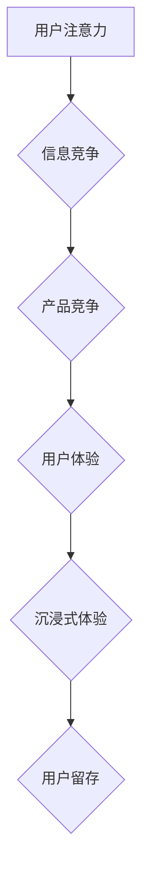

>  注意力经济, 用户体验, 产品优化, 沉浸式体验, 人工智能, 算法,  心理学,  设计原则

## 1. 背景介绍

在当今信息爆炸的时代，人们面临着前所未有的信息过载。注意力已成为稀缺的资源，被誉为“21世纪最宝贵的资产”。 

**注意力经济** 这一概念应运而生，它强调了在信息竞争激烈的环境中，获取和保持用户注意力至关重要。 作为产品经理、设计师或开发者，我们必须深刻理解注意力经济的本质，并将其融入产品设计和开发流程中，才能在激烈的市场竞争中脱颖而出。

用户体验 (UX) 作为产品成功的关键因素，在注意力经济时代显得尤为重要。 

**沉浸式体验** 成为用户体验的新趋势，它旨在通过创造吸引人的互动方式，引导用户深入产品世界，并获得愉悦和满足感。

## 2. 核心概念与联系

**2.1 注意力经济**

注意力经济的核心在于，人们的注意力是有限的，而信息却呈指数级增长。 因此，获取和保持用户注意力成为了企业和产品竞争的关键。

**2.2 用户体验 (UX)**

用户体验是指用户与产品交互的整体感受，包括易用性、可用性、美观度、效率和情感体验等方面。

**2.3 沉浸式体验**

沉浸式体验是指用户能够完全沉浸在产品世界中，并与之产生强烈的共鸣和互动。 

**2.4 联系**

注意力经济与用户体验密切相关。 为了在注意力经济中获得成功，产品必须提供良好的用户体验，并创造出沉浸式的体验，才能吸引和留住用户。

**Mermaid 流程图**



## 3. 核心算法原理 & 具体操作步骤

**3.1 算法原理概述**

为了更好地理解注意力经济和用户体验优化策略，我们可以借鉴一些人工智能算法的原理，例如：

* **深度学习**: 深度学习算法能够从海量数据中学习用户行为模式，并预测用户的注意力流向。
* **强化学习**: 强化学习算法可以根据用户的反馈，不断优化产品设计，以最大化用户的注意力和参与度。
* **自然语言处理**: 自然语言处理算法可以分析用户的文本输入，理解用户的意图和需求，从而提供更个性化的产品体验。

**3.2 算法步骤详解**

1. **数据收集**: 收集用户行为数据，例如点击记录、停留时间、滑动轨迹等。
2. **数据预处理**: 对收集到的数据进行清洗、转换和特征提取。
3. **模型训练**: 使用深度学习、强化学习或自然语言处理算法，训练模型以预测用户注意力和行为模式。
4. **模型评估**: 使用测试数据评估模型的性能，并进行调整和优化。
5. **产品优化**: 根据模型的预测结果，优化产品设计、内容呈现和交互方式，以吸引和留住用户注意力。

**3.3 算法优缺点**

* **优点**: 能够精准预测用户行为，提供个性化体验，提高用户参与度和留存率。
* **缺点**: 需要大量的数据进行训练，模型训练成本较高，存在隐私安全问题。

**3.4 算法应用领域**

* **内容推荐**: 根据用户的兴趣和行为，推荐个性化的内容。
* **广告投放**: 精准定位目标用户，提高广告转化率。
* **用户画像**: 建立用户画像，了解用户的需求和偏好。
* **产品设计**: 优化产品界面和交互方式，提升用户体验。

## 4. 数学模型和公式 & 详细讲解 & 举例说明

**4.1 数学模型构建**

我们可以使用马尔科夫链模型来描述用户在产品中的注意力流向。 

马尔科夫链模型假设用户在每个时间点上的状态只依赖于前一个时间点的状态，而与之前的时间点无关。

**4.2 公式推导过程**

设用户在产品中的状态有N种，用$S_1, S_2, ..., S_N$表示，其中$S_i$代表用户关注的第i个元素。

马尔科夫链模型的转移概率矩阵为$P$, 其中$P_{ij}$表示用户从状态$S_i$转移到状态$S_j$的概率。

用户在时间t时刻的状态为$S_t$, 则用户在时间t+1时刻的状态为$S_{t+1}$的概率为：

$$P(S_{t+1} | S_t) = P_{S_t S_{t+1}}$$

**4.3 案例分析与讲解**

例如，一个新闻网站，用户可以关注不同的新闻类别，例如科技、财经、体育等。

我们可以将每个新闻类别作为马尔科夫链模型中的一个状态，并根据用户的浏览历史数据，训练转移概率矩阵。

通过分析转移概率矩阵，我们可以了解用户在不同新闻类别之间的跳转模式，并根据这些模式，推荐更相关的新闻内容，从而提高用户的留存率。

## 5. 项目实践：代码实例和详细解释说明

**5.1 开发环境搭建**

* Python 3.x
* TensorFlow 或 PyTorch 深度学习框架
* Jupyter Notebook 或 VS Code 开发环境

**5.2 源代码详细实现**

```python
import tensorflow as tf

# 定义模型结构
model = tf.keras.Sequential([
    tf.keras.layers.Dense(64, activation='relu', input_shape=(10,)),
    tf.keras.layers.Dense(32, activation='relu'),
    tf.keras.layers.Dense(5, activation='softmax')
])

# 编译模型
model.compile(optimizer='adam',
              loss='sparse_categorical_crossentropy',
              metrics=['accuracy'])

# 训练模型
model.fit(x_train, y_train, epochs=10)

# 预测用户注意力
predictions = model.predict(x_test)
```

**5.3 代码解读与分析**

* 代码首先定义了一个简单的深度学习模型，包含两层全连接层和一层softmax输出层。
* 模型的输入是一个10维的向量，代表用户在产品中的状态。
* 模型的输出是一个5维的向量，代表用户在5个不同元素上的注意力分布。
* 代码使用Adam优化器和交叉熵损失函数训练模型。
* 训练完成后，可以使用模型预测用户在新的状态下的注意力分布。

**5.4 运行结果展示**

训练完成后，我们可以使用测试数据评估模型的性能，并观察模型预测的注意力分布。

## 6. 实际应用场景

**6.1 内容推荐系统**

* 根据用户的阅读历史和浏览行为，推荐个性化的新闻、文章、视频等内容。
* 提高用户参与度和留存率，增加平台的商业价值。

**6.2 广告投放平台**

* 精准定位目标用户，提高广告的点击率和转化率。
* 降低广告成本，提高广告效益。

**6.3 教育平台**

* 根据学生的学习进度和知识掌握情况，推荐个性化的学习内容和练习题。
* 提高学生的学习效率和兴趣。

**6.4 游戏开发**

* 根据玩家的游戏行为和喜好，调整游戏难度和内容，提供更沉浸式的游戏体验。
* 提高玩家的参与度和游戏时长。

**6.4 未来应用展望**

随着人工智能技术的不断发展，注意力经济和用户体验优化策略将得到更广泛的应用，例如：

* **虚拟现实 (VR) 和增强现实 (AR) 应用**: 在沉浸式体验中，更精准地预测和引导用户的注意力，创造更逼真的虚拟世界。
* **个性化医疗**: 根据患者的健康状况和生活习惯，提供个性化的医疗建议和治疗方案。
* **智慧城市**: 利用大数据和人工智能技术，优化城市交通、公共服务等方面，提高城市居民的生活质量。

## 7. 工具和资源推荐

**7.1 学习资源推荐**

* **书籍**:
    * 《Hooked: How to Build Habit-Forming Products》 by Nir Eyal
    * 《Don't Make Me Think, Revisited: A Common Sense Approach to Web Usability》 by Steve Krug
    * 《The Design of Everyday Things》 by Don Norman
* **在线课程**:
    * Coursera: User Experience Design Specialization
    * Udacity: Artificial Intelligence Nanodegree
    * edX: Introduction to Artificial Intelligence

**7.2 开发工具推荐**

* **深度学习框架**: TensorFlow, PyTorch
* **数据可视化工具**: Matplotlib, Seaborn
* **用户体验设计工具**: Figma, Sketch

**7.3 相关论文推荐**

* **Attention Is All You Need** (Vaswani et al., 2017)
* **Deep Reinforcement Learning for User Modeling** (Wang et al., 2018)
* **Personalized Content Recommendation with Deep Learning** (Rendle et al., 2010)

## 8. 总结：未来发展趋势与挑战

**8.1 研究成果总结**

注意力经济和用户体验优化策略的研究取得了显著进展，人工智能算法在预测用户行为和个性化体验方面发挥了重要作用。

**8.2 未来发展趋势**

* **更精准的用户画像**: 利用更先进的人工智能算法，构建更精准的用户画像，更好地理解用户的需求和偏好。
* **更个性化的体验**: 基于用户画像，提供更个性化的产品体验，例如定制化的内容推荐、交互方式和界面设计。
* **更沉浸式的体验**: 利用虚拟现实 (VR) 和增强现实 (AR) 技术，创造更沉浸式的体验，增强用户与产品的互动。

**8.3 面临的挑战**

* **数据隐私**: 收集和使用用户数据需要谨慎处理，确保用户隐私安全。
* **算法公平性**: 算法模型可能存在偏见，需要不断改进算法，确保公平性和公正性。
* **用户信任**: 用户需要信任产品和算法，才能接受个性化体验。

**8.4 研究展望**

未来，注意力经济和用户体验优化策略的研究将继续深入，探索更先进的算法和技术，为用户提供更优质的产品体验。


## 9. 附录：常见问题与解答

**9.1 如何衡量用户体验？**

用户体验可以通过多种指标来衡量，例如：

* **用户满意度**: 通过问卷调查、用户访谈等方式，了解用户对产品的满意度。
* **任务完成率**: 衡量用户完成特定任务的效率和成功率。
* **停留时间**: 衡量用户在产品上停留的时间，反映用户对产品的兴趣和参与度。
* **流失率**: 衡量用户离开产品的比例，反映用户对产品的忠诚度。

**9.2 如何提高用户体验？**

提高用户体验可以通过以下方式实现：

* **简化用户界面**: 使用简洁明了的语言和图标，使界面易于理解和操作。
* **提供个性化体验**: 根据用户的喜好和需求，提供定制化的内容和服务。
* **优化用户流程**: 确保用户完成任务的流程流畅自然，减少用户操作的步骤和时间。
* **提供良好的客户服务**: 及时解决用户遇到的问题，提供专业的技术支持。

**9.3 如何利用人工智能技术优化用户体验？**

人工智能技术可以用于以下方面：

* **个性化推荐**: 根据用户的行为数据，推荐个性化的内容和服务。
* **智能客服**: 利用自然语言处理技术，提供智能化的客服服务，解决用户的常见问题。
* **用户行为分析**: 分析用户的行为数据，了解用户的需求和偏好，为产品设计提供参考。


作者：禅与计算机程序设计艺术 / Zen and the Art of Computer Programming 
<end_of_turn>