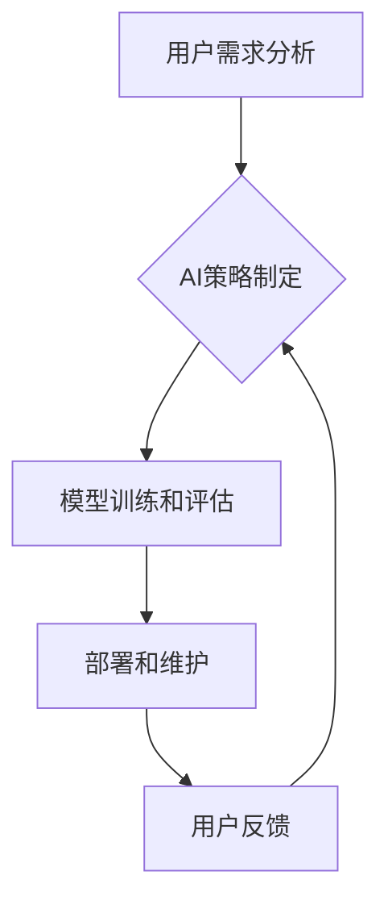

> 人工智能 (AI)、用户需求、策略制定、模型训练、评估指标、迭代优化、伦理考量

## 1. 背景介绍

人工智能 (AI) 正以惊人的速度发展，其应用领域不断拓展，从医疗保健到金融服务，再到娱乐和教育，AI 都在改变着我们的生活。然而，AI 的发展并非一帆风顺，其成功应用的关键在于如何有效地满足用户需求。

用户需求是 AI 系统发展的基石，也是衡量 AI 系统成功与否的关键指标。然而，用户需求往往是多方面的、复杂的，并且随着时间的推移而不断变化。因此，制定有效的 AI 策略，以满足用户需求，至关重要。

## 2. 核心概念与联系

**2.1 用户需求分析**

用户需求分析是 AI 策略制定过程中的第一步，它旨在深入了解用户的实际需求、痛点和期望。可以通过以下方式进行用户需求分析：

* **用户访谈:** 与目标用户进行一对一或小组访谈，了解他们的使用场景、需求痛点和对 AI 系统的期望。
* **问卷调查:** 设计问卷调查，收集用户对 AI 系统的认知、态度和使用习惯等信息。
* **数据分析:** 分析用户行为数据，例如用户使用频率、偏好功能、反馈意见等，从中挖掘用户需求的潜在模式。

**2.2 AI 策略制定**

AI 策略制定是指根据用户需求分析结果，制定一个清晰、可行的 AI 系统发展方向和实施方案。AI 策略应包含以下关键要素：

* **目标定义:** 明确 AI 系统的目标和预期效果，例如提高效率、降低成本、提升用户体验等。
* **技术选择:** 选择合适的 AI 技术和算法，例如机器学习、深度学习、自然语言处理等，以实现 AI 系统的目标。
* **数据获取和处理:** 确定 AI 系统所需的训练数据来源和处理方法，确保数据质量和安全性。
* **模型训练和评估:** 制定模型训练方案和评估指标，不断优化模型性能，以满足用户需求。
* **部署和维护:** 制定 AI 系统部署和维护方案，确保系统稳定运行和持续更新。

**2.3 用户反馈和迭代优化**

用户反馈是 AI 系统持续改进的重要来源。应建立有效的用户反馈机制，收集用户对 AI 系统的使用体验、建议和问题等信息。根据用户反馈，不断迭代优化 AI 系统，使其更加符合用户需求。

**Mermaid 流程图**



## 3. 核心算法原理 & 具体操作步骤

**3.1 算法原理概述**

在满足用户需求的 AI 策略中，机器学习算法扮演着至关重要的角色。机器学习算法能够从数据中学习模式和规律，从而实现对用户需求的理解和响应。常见的机器学习算法包括：

* **监督学习:** 利用标记数据训练模型，预测新的数据标签。例如，分类问题 (例如垃圾邮件识别) 和回归问题 (例如房价预测)。
* **无监督学习:** 利用未标记数据发现数据中的潜在结构和模式。例如，聚类问题 (例如用户画像) 和降维问题 (例如特征提取)。
* **强化学习:** 通过试错学习，让智能体在环境中获得最大奖励。例如，游戏 AI 和机器人控制。

**3.2 算法步骤详解**

以监督学习为例，其基本步骤如下：

1. **数据收集和预处理:** 收集相关数据，并进行清洗、转换和特征工程等预处理操作，以确保数据质量和算法性能。
2. **模型选择:** 根据具体任务选择合适的机器学习模型，例如决策树、支持向量机、神经网络等。
3. **模型训练:** 利用标记数据训练模型，调整模型参数，使其能够准确预测新的数据标签。
4. **模型评估:** 使用测试数据评估模型性能，例如准确率、召回率、F1-score等。
5. **模型优化:** 根据评估结果，调整模型参数、选择不同的模型或特征工程方法，不断优化模型性能。
6. **模型部署:** 将训练好的模型部署到实际应用场景中，用于预测新的数据标签。

**3.3 算法优缺点**

不同的机器学习算法具有不同的优缺点，需要根据具体任务选择合适的算法。例如，决策树算法易于理解和解释，但泛化能力较弱；支持向量机算法具有较好的泛化能力，但训练时间较长；神经网络算法具有强大的学习能力，但训练数据量要求较高，且易于过拟合。

**3.4 算法应用领域**

机器学习算法在各个领域都有广泛的应用，例如：

* **医疗保健:** 疾病诊断、药物研发、患者画像等。
* **金融服务:** 欺诈检测、风险评估、个性化推荐等。
* **电商:** 商品推荐、价格预测、用户画像等。
* **交通运输:** 交通流量预测、自动驾驶、路线规划等。

## 4. 数学模型和公式 & 详细讲解 & 举例说明

**4.1 数学模型构建**

机器学习算法的核心是数学模型，这些模型通过数学公式来描述数据之间的关系。例如，线性回归模型的数学公式如下：

$$y = w_0 + w_1x_1 + w_2x_2 + ... + w_nx_n + \epsilon$$

其中：

* $y$ 是预测值
* $w_0, w_1, w_2, ..., w_n$ 是模型参数
* $x_1, x_2, ..., x_n$ 是输入特征
* $\epsilon$ 是误差项

**4.2 公式推导过程**

机器学习算法的模型参数通常通过优化算法来求解。常见的优化算法包括梯度下降法、随机梯度下降法和Adam算法等。这些算法通过迭代更新模型参数，使得模型预测值与真实值之间的误差最小化。

**4.3 案例分析与讲解**

以线性回归为例，假设我们想要预测房屋价格，输入特征包括房屋面积、房间数量和地理位置等。我们可以使用线性回归模型来建立房屋价格与输入特征之间的关系。通过训练数据，模型会学习到最佳的模型参数，从而能够预测新的房屋价格。

## 5. 项目实践：代码实例和详细解释说明

**5.1 开发环境搭建**

可以使用 Python 语言和相关的机器学习库，例如 scikit-learn、TensorFlow 或 PyTorch，来开发 AI 系统。

**5.2 源代码详细实现**

```python
from sklearn.linear_model import LinearRegression
from sklearn.model_selection import train_test_split
from sklearn.metrics import mean_squared_error

# 加载数据
data = ...

# 将数据分为训练集和测试集
X_train, X_test, y_train, y_test = train_test_split(data.drop('price', axis=1), data['price'], test_size=0.2)

# 创建线性回归模型
model = LinearRegression()

# 训练模型
model.fit(X_train, y_train)

# 预测测试集数据
y_pred = model.predict(X_test)

# 计算模型性能
mse = mean_squared_error(y_test, y_pred)
print(f'Mean Squared Error: {mse}')
```

**5.3 代码解读与分析**

这段代码演示了如何使用 scikit-learn 库训练一个线性回归模型来预测房屋价格。

* `train_test_split()` 函数将数据分为训练集和测试集，用于训练和评估模型性能。
* `LinearRegression()` 函数创建了一个线性回归模型实例。
* `fit()` 函数训练模型，使用训练数据学习模型参数。
* `predict()` 函数使用训练好的模型预测测试集数据。
* `mean_squared_error()` 函数计算模型预测值与真实值之间的均方误差，作为模型性能指标。

**5.4 运行结果展示**

运行代码后，会输出模型的均方误差值，该值越小，模型性能越好。

## 6. 实际应用场景

**6.1 个性化推荐系统**

AI 算法可以分析用户的行为数据，例如浏览历史、购买记录、评分等，从而推荐个性化的商品、服务或内容。例如，电商平台的商品推荐系统、音乐平台的歌曲推荐系统等。

**6.2 聊天机器人**

AI 算法可以训练聊天机器人，使其能够理解用户的自然语言输入，并生成相应的回复。例如，客服机器人、虚拟助理等。

**6.3 医疗诊断辅助系统**

AI 算法可以分析患者的医疗影像数据、病历信息等，辅助医生进行疾病诊断。例如，癌症检测、心血管疾病诊断等。

**6.4 自动驾驶系统**

AI 算法可以训练自动驾驶系统，使其能够感知周围环境、做出决策并控制车辆行驶。

**6.4 未来应用展望**

随着 AI 技术的不断发展，其应用场景将更加广泛，例如：

* **个性化教育:** 根据学生的学习进度和特点，提供个性化的学习方案和辅导。
* **智能制造:** 利用 AI 算法优化生产流程、提高生产效率和产品质量。
* **智慧城市:** 利用 AI 算法解决城市交通、环境监测、公共安全等问题。

## 7. 工具和资源推荐

**7.1 学习资源推荐**

* **在线课程:** Coursera、edX、Udacity 等平台提供丰富的 AI 课程。
* **书籍:** 《深度学习》、《机器学习实战》等书籍是学习 AI 的经典教材。
* **博客和论坛:** Kaggle、Towards Data Science 等平台提供大量的 AI 相关博客文章和论坛讨论。

**7.2 开发工具推荐**

* **Python:** Python 是 AI 开发最常用的编程语言。
* **scikit-learn:** scikit-learn 是 Python 的机器学习库，提供各种常用的机器学习算法。
* **TensorFlow:** TensorFlow 是 Google 开发的开源深度学习框架。
* **PyTorch:** PyTorch 是 Facebook 开发的开源深度学习框架。

**7.3 相关论文推荐**

* **《ImageNet Classification with Deep Convolutional Neural Networks》**
* **《Attention Is All You Need》**
* **《BERT: Pre-training of Deep Bidirectional Transformers for Language Understanding》**

## 8. 总结：未来发展趋势与挑战

**8.1 研究成果总结**

近年来，AI 技术取得了长足的进步，在各个领域都取得了显著的应用成果。例如，深度学习算法在图像识别、自然语言处理等领域取得了突破性进展。

**8.2 未来发展趋势**

未来，AI 技术将朝着以下方向发展：

* **更强大的计算能力:** 随着硬件技术的进步，AI 模型将能够处理更大规模的数据，学习更复杂的模式。
* **更通用的人工智能:** 目前 AI 系统大多局限于特定领域，未来将发展出更通用的 AI 系统，能够适应不同的任务和环境。
* **更注重伦理和可解释性:** 随着 AI 技术的应用越来越广泛，其伦理和可解释性问题将更加重要。

**8.3 面临的挑战**

AI 技术的发展也面临着一些挑战：

* **数据获取和隐私问题:** AI 算法需要大量数据进行训练，如何获取高质量数据并保护用户隐私是一个重要问题。
* **算法偏见和公平性:** AI 算法可能存在偏见，导致不公平的结果。如何解决算法偏见和确保公平性是一个重要的研究方向。
* **安全性和可靠性:** AI 系统的安全性和可靠性至关重要，需要开发出能够应对各种攻击和故障的 AI 系统。

**8.4 研究展望**

未来，AI 研究将继续探索更强大的算法、更有效的训练方法和更广泛的应用场景。同时，也将更加注重 AI 的伦理、可解释性和安全性，使其更好地服务于人类社会。

## 9. 附录：常见问题与解答

**9.1 如何选择合适的 AI 算法？**

选择合适的 AI 算法取决于具体的任务和数据特点。例如，对于分类问题，可以考虑使用决策树、支持向量机或神经网络等算法。对于回归问题，可以考虑使用线性回归、逻辑回归或支持向量回归等算法。

**