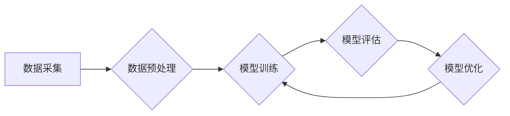

> 生成式AI，AIGC，数据驱动，模型训练，GPU，深度学习，Transformer

## 1. 背景介绍

近年来，人工智能（AI）领域取得了令人瞩目的进展，其中生成式人工智能（Generative AI）作为一朵新兴的奇葩，迅速吸引了全球的目光。从ChatGPT的爆火到DALL-E 2的惊艳表现，生成式AI的强大能力正在改变着我们与世界交互的方式。

生成式AI的核心在于能够根据输入的文本、图像或其他数据，生成新的、类似于训练数据的内容。它广泛应用于文本创作、图像生成、音乐作曲、视频制作等领域，为创意产业和技术创新带来了前所未有的机遇。

然而，在生成式AI的蓬勃发展背后，也存在着一些争议和挑战。一些人认为，生成式AI只是昙花一现的泡沫，其能力有限，难以真正替代人类的创造力。而另一些人则认为，生成式AI是未来科技发展的重要方向，其潜力巨大，将深刻地改变我们的生活方式。

## 2. 核心概念与联系

### 2.1 生成式AI的本质

生成式AI本质上是一种利用深度学习算法，从大量数据中学习模式和规律，并根据这些模式生成新数据的模型。

### 2.2 数据驱动与模型训练

数据是生成式AI的核心驱动力。模型的训练过程就是通过大量的训练数据，让模型学习到数据的内在规律和结构。

### 2.3 GPU加速与训练效率

GPU（图形处理单元）由于其强大的并行计算能力，在深度学习训练中发挥着至关重要的作用。GPU加速可以显著提高模型训练的效率，缩短训练时间。

**Mermaid 流程图**



## 3. 核心算法原理 & 具体操作步骤

### 3.1 算法原理概述

生成式AI常用的算法包括：

* **变分自编码器（VAE）:** 通过编码器将输入数据压缩成低维表示，然后通过解码器将低维表示恢复成原始数据，从而学习数据的潜在结构。
* **生成对抗网络（GAN）:** 由两个网络组成：生成器和判别器。生成器试图生成逼真的数据，而判别器试图区分真实数据和生成数据。两者相互竞争，最终生成器能够生成与真实数据相似的样本。
* **Transformer:**  一种基于注意力机制的深度学习模型，能够捕捉文本序列中的长距离依赖关系，在文本生成任务中表现出色。

### 3.2 算法步骤详解

以GAN为例，其训练步骤如下：

1. **初始化生成器和判别器:**  随机初始化两个网络的参数。
2. **生成器生成数据:** 生成器根据随机噪声输入生成样本数据。
3. **判别器判断真实性:** 判别器接收真实数据和生成数据，并判断其真实性。
4. **更新生成器参数:** 根据判别器的反馈，更新生成器的参数，使其生成的样本数据更接近真实数据。
5. **更新判别器参数:** 根据判别器的判断结果，更新判别器的参数，使其能够更好地区分真实数据和生成数据。
6. **重复步骤2-5:**  重复上述步骤，直到生成器能够生成逼真的样本数据。

### 3.3 算法优缺点

**VAE:**

* **优点:** 可以生成高质量的样本数据，并能够学习数据的潜在结构。
* **缺点:** 训练过程相对复杂，容易出现模式崩溃问题。

**GAN:**

* **优点:** 可以生成非常逼真的样本数据，在图像生成领域表现出色。
* **缺点:** 训练过程不稳定，容易出现模式崩溃问题，需要精心调参。

**Transformer:**

* **优点:** 能够捕捉文本序列中的长距离依赖关系，在文本生成任务中表现出色。
* **缺点:** 计算量较大，需要大量的计算资源。

### 3.4 算法应用领域

* **文本生成:**  ChatGPT、Bard等聊天机器人，自动写作工具。
* **图像生成:** DALL-E 2、Stable Diffusion等图像生成模型。
* **音乐生成:**  作曲、音乐伴奏生成。
* **视频生成:**  视频剪辑、特效合成。

## 4. 数学模型和公式 & 详细讲解 & 举例说明

### 4.1 数学模型构建

**VAE:**

* **编码器:**  将输入数据映射到低维潜在空间。
* **解码器:** 将低维潜在空间映射回原始数据空间。

**GAN:**

* **生成器:**  将随机噪声映射到数据空间。
* **判别器:**  判断数据是否为真实数据或生成数据。

**Transformer:**

* **注意力机制:**  计算每个词与其他词之间的相关性，并根据相关性权重进行加权求和。

### 4.2 公式推导过程

**VAE:**

* **损失函数:**  KL散度（衡量编码器输出与标准正态分布的差异）+ 重建损失（衡量解码器输出与真实数据的差异）。

**GAN:**

* **生成器损失函数:**  判别器对生成数据的判别概率。
* **判别器损失函数:**  分类误差（判别器对真实数据和生成数据的判别概率）。

**Transformer:**

* **注意力机制公式:**  $Attention(Q, K, V) = softmax(\frac{QK^T}{\sqrt{d_k}})V$

### 4.3 案例分析与讲解

**VAE:**

* 用于图像压缩和去噪。

**GAN:**

* 用于生成逼真的图像、视频和音频。

**Transformer:**

* 用于机器翻译、文本摘要和对话系统。

## 5. 项目实践：代码实例和详细解释说明

### 5.1 开发环境搭建

* Python 3.x
* TensorFlow 或 PyTorch
* CUDA 和 cuDNN

### 5.2 源代码详细实现

```python
# VAE代码示例
import tensorflow as tf

# 定义编码器
encoder = tf.keras.Sequential([
    tf.keras.layers.Input(shape=(28, 28, 1)),
    tf.keras.layers.Conv2D(32, (3, 3), activation='relu'),
    tf.keras.layers.MaxPooling2D((2, 2)),
    tf.keras.layers.Flatten(),
    tf.keras.layers.Dense(128, activation='relu'),
    tf.keras.layers.Dense(latent_dim)
])

# 定义解码器
decoder = tf.keras.Sequential([
    tf.keras.layers.Input(shape=(latent_dim,)),
    tf.keras.layers.Dense(7 * 7 * 128, activation='relu'),
    tf.keras.layers.Reshape((7, 7, 128)),
    tf.keras.layers.Conv2DTranspose(32, (3, 3), activation='relu'),
    tf.keras.layers.UpSampling2D((2, 2)),
    tf.keras.layers.Conv2DTranspose(1, (3, 3), activation='sigmoid')
])

# 定义VAE模型
vae = tf.keras.Model(inputs=encoder.input, outputs=decoder(encoder.output))

# 定义损失函数
reconstruction_loss = tf.keras.losses.BinaryCrossentropy()
kl_loss = -0.5 * tf.reduce_mean(1 + log_variance - tf.square(mu) - tf.exp(log_variance))
vae_loss = reconstruction_loss(x, decoder(encoder(x))) + kl_loss

# 训练模型
vae.compile(optimizer='adam', loss=vae_loss)
vae.fit(x_train, epochs=10)

```

### 5.3 代码解读与分析

* 编码器将输入数据压缩到低维潜在空间。
* 解码器将低维潜在空间映射回原始数据空间。
* VAE模型的损失函数由重建损失和KL散度组成。
* 训练模型时，使用Adam优化器和交叉熵损失函数。

### 5.4 运行结果展示

* 可视化重建图像，观察重建效果。
* 可视化潜在空间，观察数据分布。

## 6. 实际应用场景

### 6.1 文本生成

* 自动写作工具：生成新闻报道、产品描述、社交媒体内容等。
* 代码生成工具：根据自然语言描述生成代码。
* 聊天机器人：生成自然流畅的对话文本。

### 6.2 图像生成

* 艺术创作：生成独特的艺术作品。
* 游戏开发：生成游戏场景、角色和道具。
* 图像修复：修复损坏的图像。

### 6.3 音乐生成

* 音乐作曲：生成新的音乐旋律和和声。
* 音乐伴奏生成：根据旋律生成伴奏音乐。
* 音乐风格转换：将一首音乐转换为不同的风格。

### 6.4 未来应用展望

* 更逼真的图像和视频生成。
* 更自然流畅的对话系统。
* 更个性化的内容创作体验。
* 更智能的辅助工具。

## 7. 工具和资源推荐

### 7.1 学习资源推荐

* **书籍:**
    * 《深度学习》
    * 《生成对抗网络》
    * 《Transformer模型》
* **在线课程:**
    * Coursera
    * edX
    * fast.ai

### 7.2 开发工具推荐

* **TensorFlow:**  开源深度学习框架。
* **PyTorch:**  开源深度学习框架。
* **Hugging Face:**  提供预训练模型和工具。

### 7.3 相关论文推荐

* **Generative Adversarial Networks**
* **Auto-Encoding Variational Bayes**
* **Attention Is All You Need**

## 8. 总结：未来发展趋势与挑战

### 8.1 研究成果总结

* 生成式AI取得了显著进展，能够生成逼真的图像、文本和音频。
* 算法模型不断改进，训练效率不断提高。
* 应用场景不断拓展，对社会产生深远影响。

### 8.2 未来发展趋势

* 更强大的模型和算法。
* 更丰富的应用场景。
* 更安全的应用环境。

### 8.3 面临的挑战

* 数据安全和隐私问题。
* 模型可解释性和透明度问题。
* 伦理和社会影响问题。

### 8.4 研究展望

* 研究更强大的生成式AI模型。
* 开发更安全、更可靠的生成式AI应用。
* 探讨生成式AI的伦理和社会影响。

## 9. 附录：常见问题与解答

* **Q: 生成式AI的训练需要多少数据？**
* **A:** 训练生成式AI模型需要大量的训练数据，数据量越大，模型性能越好。

* **Q: 生成式AI的训练需要多长时间？**
* **A:** 训练时间取决于模型大小、数据量和硬件配置。

* **Q: 生成式AI的应用场景有哪些？**
* **A:** 生成式AI的应用场景非常广泛，包括文本生成、图像生成、音乐生成、视频生成等。


作者：禅与计算机程序设计艺术 / Zen and the Art of Computer Programming 
<end_of_turn>