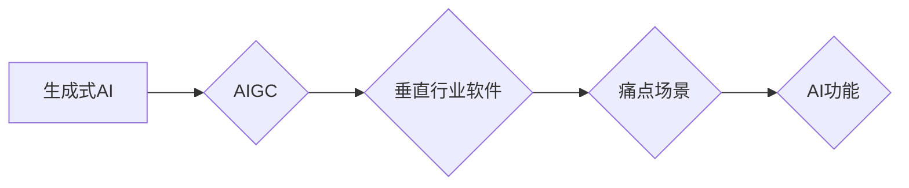

> 生成式AI, AIGC, 垂直行业, 软件开发, 痛点场景, AI功能, 应用场景

## 1. 背景介绍

近年来，人工智能（AI）技术突飞猛进，特别是生成式人工智能（AIGC）的兴起，引发了广泛的关注和讨论。AIGC能够根据输入的文本、代码、图像等数据，生成新的、原创的内容，例如文本、代码、图像、音频等。

AIGC技术的应用场景日益广泛，涵盖了文本创作、代码生成、图像设计、音乐创作等多个领域。在软件开发领域，AIGC也展现出巨大的潜力，能够帮助开发者更高效地完成软件开发任务。

然而，AIGC技术也面临着一些挑战，例如数据安全、模型偏见、伦理问题等。因此，我们需要理性看待AIGC技术的发展，并将其应用于实际场景中，才能真正发挥其价值。

## 2. 核心概念与联系

### 2.1 生成式AI

生成式AI是指能够根据输入数据生成新数据的AI模型。它与传统的AI模型不同，传统的AI模型主要用于分类、预测等任务，而生成式AI则能够创造新的内容。

### 2.2 AIGC

AIGC（AI-Generated Content）是指由AI模型生成的各种内容，包括文本、代码、图像、音频等。

### 2.3 垂直行业软件

垂直行业软件是指针对特定行业或领域的软件应用，例如医疗软件、金融软件、教育软件等。

**核心概念与联系流程图**



## 3. 核心算法原理 & 具体操作步骤

### 3.1 算法原理概述

生成式AIGC的核心算法主要基于深度学习，特别是变分自编码器（VAE）和生成对抗网络（GAN）。

* **变分自编码器（VAE）**：VAE是一种将输入数据编码成低维表示，然后解码成输出数据的模型。它通过学习数据的潜在分布，能够生成与训练数据相似的新的数据。

* **生成对抗网络（GAN）**：GAN由两个网络组成：生成器和鉴别器。生成器试图生成新的数据，而鉴别器试图区分真实数据和生成数据。两者在对抗博弈中相互学习，最终生成器能够生成逼真的数据。

### 3.2 算法步骤详解

**VAE算法步骤：**

1. **编码器**：将输入数据编码成低维表示。
2. **解码器**：将低维表示解码成输出数据。
3. **训练过程**：通过最小化重建误差和KL散度来训练VAE模型。

**GAN算法步骤：**

1. **生成器**：根据随机噪声生成新的数据。
2. **鉴别器**：区分真实数据和生成数据。
3. **训练过程**：通过最小化鉴别器错误率和最大化生成器错误率来训练GAN模型。

### 3.3 算法优缺点

**VAE算法优点：**

* 生成数据质量相对较高。
* 训练过程稳定。

**VAE算法缺点：**

* 生成数据多样性较低。
* 训练速度较慢。

**GAN算法优点：**

* 生成数据多样性较高。
* 训练速度较快。

**GAN算法缺点：**

* 生成数据质量可能较低。
* 训练过程不稳定。

### 3.4 算法应用领域

* **文本生成**：例如新闻文章、小说、诗歌等。
* **代码生成**：例如函数、类、程序等。
* **图像生成**：例如照片、绘画、设计图等。
* **音频生成**：例如音乐、语音、音效等。

## 4. 数学模型和公式 & 详细讲解 & 举例说明

### 4.1 数学模型构建

**VAE模型数学模型：**

* **编码器：** $z = E(x)$，其中 $x$ 是输入数据， $z$ 是低维表示。
* **解码器：** $x' = D(z)$，其中 $z$ 是低维表示， $x'$ 是输出数据。

**GAN模型数学模型：**

* **生成器：** $G(z) = x'$，其中 $z$ 是随机噪声， $x'$ 是生成数据。
* **鉴别器：** $D(x) = p(x)$，其中 $x$ 是输入数据， $p(x)$ 是真实数据概率。

### 4.2 公式推导过程

**VAE模型损失函数：**

$$
L_{VAE} = KL(p(z) || q(z)) + \mathbb{E}_{x \sim p_{data}(x)}[D(x, E(x))]
$$

其中：

* $KL(p(z) || q(z))$ 是KL散度，衡量编码器输出的分布 $q(z)$ 与真实分布 $p(z)$ 的差异。
* $\mathbb{E}_{x \sim p_{data}(x)}[D(x, E(x))]$ 是重建误差，衡量解码器输出的数据 $x'$ 与真实数据 $x$ 的差异。

**GAN模型损失函数：**

$$
L_{GAN} = \mathbb{E}_{x \sim p_{data}(x)}[log(D(x))] + \mathbb{E}_{z \sim p_{z}(z)}[log(1 - D(G(z)))]
$$

其中：

* $\mathbb{E}_{x \sim p_{data}(x)}[log(D(x))]$ 是鉴别器对真实数据的判别概率。
* $\mathbb{E}_{z \sim p_{z}(z)}[log(1 - D(G(z)))]$ 是鉴别器对生成数据的判别概率。

### 4.3 案例分析与讲解

**文本生成案例：**

使用VAE模型生成新闻文章，输入新闻标题和关键词，模型可以根据训练数据生成一篇相关的新闻文章。

**代码生成案例：**

使用GAN模型生成代码，输入代码功能描述，模型可以根据训练数据生成相应的代码片段。

## 5. 项目实践：代码实例和详细解释说明

### 5.1 开发环境搭建

* Python 3.7+
* TensorFlow/PyTorch
* CUDA/cuDNN

### 5.2 源代码详细实现

```python
# VAE模型代码示例
import tensorflow as tf

# 定义编码器
encoder = tf.keras.Sequential([
    tf.keras.layers.Dense(128, activation='relu'),
    tf.keras.layers.Dense(64, activation='relu'),
    tf.keras.layers.Dense(latent_dim)
])

# 定义解码器
decoder = tf.keras.Sequential([
    tf.keras.layers.Dense(64, activation='relu'),
    tf.keras.layers.Dense(128, activation='relu'),
    tf.keras.layers.Dense(input_dim, activation='sigmoid')
])

# 定义VAE模型
vae = tf.keras.Model(inputs=input_tensor, outputs=decoder(encoder(input_tensor)))

# 定义损失函数
def vae_loss(x, x_recon):
    reconstruction_loss = tf.reduce_mean(tf.square(x - x_recon))
    kl_loss = -0.5 * tf.reduce_mean(1 + log_var - tf.square(mu) - tf.exp(log_var))
    return reconstruction_loss + kl_loss

# 训练VAE模型
vae.compile(optimizer='adam', loss=vae_loss)
vae.fit(train_data, epochs=10)

# 生成新数据
z = tf.random.normal(shape=(10, latent_dim))
generated_data = decoder(z)
```

### 5.3 代码解读与分析

* **编码器和解码器：** 编码器将输入数据压缩成低维表示，解码器将低维表示解码成输出数据。
* **损失函数：** VAE模型的损失函数由重建误差和KL散度组成，用于衡量模型的生成质量和数据分布的逼近程度。
* **训练过程：** 使用梯度下降算法训练VAE模型，最小化损失函数。
* **数据生成：** 使用训练好的VAE模型，可以根据随机噪声生成新的数据。

### 5.4 运行结果展示

训练好的VAE模型可以生成与训练数据相似的新的数据，例如文本、图像等。

## 6. 实际应用场景

### 6.1 垂直行业软件痛点场景

* **医疗软件：** 患者病历信息分析、医学影像诊断辅助、药物研发等。
* **金融软件：** 欺诈检测、风险评估、个性化金融服务等。
* **教育软件：** 智能辅导、个性化学习路径、自动批改作业等。

### 6.2 AI功能应用

* **文本生成：** 自动生成患者病历摘要、撰写金融报告、生成个性化学习内容等。
* **代码生成：** 自动生成医疗软件代码、金融交易系统代码、教育软件代码等。
* **图像生成：** 生成医学影像分析结果、金融风险评估图表、个性化学习场景等。

### 6.3 案例分析

* **医疗软件：** 使用AIGC技术，可以自动生成患者病历摘要，帮助医生快速了解患者病情，提高诊断效率。
* **金融软件：** 使用AIGC技术，可以自动生成金融报告，帮助分析师快速分析市场趋势，做出更准确的投资决策。
* **教育软件：** 使用AIGC技术，可以自动生成个性化学习内容，根据学生的学习进度和兴趣爱好，提供定制化的学习体验。

### 6.4 未来应用展望

随着AIGC技术的不断发展，其在垂直行业软件中的应用场景将更加广泛，例如：

* **虚拟助手：** 为用户提供个性化的服务，例如预约医生、办理金融业务、辅导学习等。
* **智能客服：** 自动回答用户问题，提高客户服务效率。
* **数据分析：** 自动分析海量数据，发现隐藏的商业价值。

## 7. 工具和资源推荐

### 7.1 学习资源推荐

* **书籍：**
    * 《Deep Learning》 by Ian Goodfellow, Yoshua Bengio, and Aaron Courville
    * 《Generative Deep Learning》 by David Foster
* **在线课程：**
    * Coursera: Deep Learning Specialization
    * Udacity: Deep Learning Nanodegree
* **博客和论坛：**
    * Towards Data Science
    * Reddit: r/MachineLearning

### 7.2 开发工具推荐

* **TensorFlow:** 开源深度学习框架
* **PyTorch:** 开源深度学习框架
* **Hugging Face Transformers:** 预训练模型库

### 7.3 相关论文推荐

* **Generative Adversarial Networks** by Ian Goodfellow et al. (2014)
* **Auto-Encoding Variational Bayes** by Diederik P. Kingma and Max Welling (2013)
* **Attention Is All You Need** by Ashish Vaswani et al. (2017)

## 8. 总结：未来发展趋势与挑战

### 8.1 研究成果总结

AIGC技术取得了显著的进展，在文本生成、图像生成、代码生成等领域展现出巨大的潜力。

### 8.2 未来发展趋势

* **模型能力提升：** 模型参数规模、训练数据量、算法效率将不断提升，生成数据质量和多样性将进一步提高。
* **应用场景拓展：** AIGC技术将应用于更多领域，例如科学研究、艺术创作、教育培训等。
* **伦理规范制定：** 随着AIGC技术的应用越来越