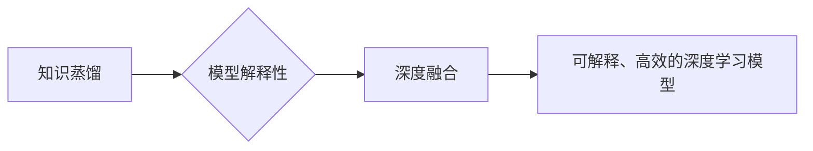

> 知识蒸馏，模型解释性，深度学习，可解释人工智能，AI透明度，模型压缩

## 1. 背景介绍

深度学习在过去十年中取得了令人瞩目的成就，在图像识别、自然语言处理、语音识别等领域取得了突破性的进展。然而，深度学习模型的复杂性和黑盒性质也引发了广泛的关注和担忧。

**1.1 深度学习的局限性**

* **缺乏可解释性:** 深度学习模型的决策过程通常难以理解，其内部特征和权重之间的关系复杂且难以解释。这使得模型的决策结果难以被人类信任和接受，尤其是在高风险领域，例如医疗诊断和金融决策。
* **模型尺寸庞大:** 许多深度学习模型具有数百万甚至数十亿个参数，这导致模型部署成本高昂，对计算资源要求极高。
* **数据依赖性:** 深度学习模型的性能高度依赖于训练数据，而训练数据往往存在偏差和噪声，这可能导致模型产生不准确或不公平的预测结果。

**1.2 知识蒸馏与模型解释性的重要性**

知识蒸馏是一种模型压缩技术，通过将知识从一个大型教师模型迁移到一个小型学生模型，从而实现模型压缩和性能提升。模型解释性是指能够理解和解释深度学习模型的决策过程的能力。

将知识蒸馏与模型解释性深度融合，可以有效解决深度学习模型的上述局限性，从而推动人工智能的可解释性和可信任性。

## 2. 核心概念与联系

**2.1 知识蒸馏**

知识蒸馏是一种模型压缩技术，通过将知识从一个大型教师模型迁移到一个小型学生模型，从而实现模型压缩和性能提升。

**2.2 模型解释性**

模型解释性是指能够理解和解释深度学习模型的决策过程的能力。

**2.3 深度融合**

将知识蒸馏与模型解释性深度融合，是指在知识蒸馏过程中，同时考虑模型的解释性，使得学生模型不仅具有较高的压缩率和性能，还具有良好的可解释性。

**2.4 融合架构**



## 3. 核心算法原理 & 具体操作步骤

**3.1 算法原理概述**

知识蒸馏与模型解释性深度融合的算法原理基于以下几个关键点：

* **教师模型:** 选择一个具有高准确率和复杂结构的教师模型作为知识来源。
* **学生模型:** 选择一个小型、高效的学生模型作为知识接收者。
* **知识迁移:** 通过调整教师模型和学生模型的输出分布，将教师模型的知识迁移到学生模型中。
* **解释性增强:** 在知识迁移过程中，引入模型解释性相关的技术，例如注意力机制、可视化等，使得学生模型的决策过程更加透明和可解释。

**3.2 算法步骤详解**

1. **预训练教师模型:** 使用大量的训练数据预训练一个大型教师模型，使其达到高准确率。
2. **选择学生模型:** 选择一个小型、高效的学生模型作为知识接收者。
3. **知识蒸馏训练:** 使用教师模型的输出作为软标签，训练学生模型。
4. **解释性增强:** 在知识蒸馏训练过程中，引入模型解释性相关的技术，例如注意力机制、可视化等，使得学生模型的决策过程更加透明和可解释。
5. **模型评估:** 对训练好的学生模型进行评估，验证其压缩率、性能和解释性。

**3.3 算法优缺点**

**优点:**

* **模型压缩:** 可以有效压缩模型尺寸，降低部署成本和计算资源需求。
* **性能提升:** 可以提高学生模型的性能，使其接近或超过教师模型的性能。
* **模型解释性:** 可以增强学生模型的解释性，使得模型的决策过程更加透明和可理解。

**缺点:**

* **训练复杂度:** 知识蒸馏与模型解释性深度融合的训练过程相对复杂，需要更多的计算资源和时间。
* **解释性程度:** 即使使用模型解释性相关的技术，学生模型的解释性仍然可能不如教师模型。

**3.4 算法应用领域**

* **移动设备:** 将大型深度学习模型压缩到移动设备上，实现高效的边缘计算。
* **嵌入式系统:** 将深度学习模型部署到资源受限的嵌入式系统上，例如无人机、智能家居设备等。
* **医疗诊断:** 提高医疗诊断模型的可解释性，增强医生对模型决策的信任。
* **金融决策:** 提高金融风险评估模型的可解释性，降低模型决策的风险。

## 4. 数学模型和公式 & 详细讲解 & 举例说明

**4.1 数学模型构建**

知识蒸馏的目标是将教师模型的知识迁移到学生模型中。我们可以使用以下数学模型来描述知识蒸馏过程：

* **教师模型输出:** $p_t(x)$，表示教师模型对输入 $x$ 的预测概率分布。
* **学生模型输出:** $p_s(x)$，表示学生模型对输入 $x$ 的预测概率分布。
* **知识蒸馏损失函数:** $L_{KD}(p_t(x), p_s(x))$，用于衡量教师模型输出和学生模型输出之间的差异。

**4.2 公式推导过程**

常用的知识蒸馏损失函数包括交叉熵损失和KL散度损失。

* **交叉熵损失:** $L_{CE}(p_t(x), p_s(x)) = -\sum_{i=1}^{C} p_t(i) \log p_s(i)$，其中 $C$ 是类别数。
* **KL散度损失:** $L_{KL}(p_t(x), p_s(x)) = \sum_{i=1}^{C} p_t(i) \log \frac{p_t(i)}{p_s(i)}$

**4.3 案例分析与讲解**

假设我们有一个图像分类任务，教师模型是一个大型ResNet模型，学生模型是一个小型MobileNet模型。

我们可以使用知识蒸馏技术将ResNet模型的知识迁移到MobileNet模型中。

在训练过程中，我们将ResNet模型的输出作为软标签，训练MobileNet模型。

使用交叉熵损失函数作为知识蒸馏损失函数，可以有效地将ResNet模型的知识迁移到MobileNet模型中。

## 5. 项目实践：代码实例和详细解释说明

**5.1 开发环境搭建**

* Python 3.7+
* TensorFlow 2.0+
* PyTorch 1.5+

**5.2 源代码详细实现**

```python
# 知识蒸馏代码示例 (使用 TensorFlow)

import tensorflow as tf

# 定义教师模型和学生模型
teacher_model = tf.keras.applications.ResNet50(weights='imagenet', include_top=True)
student_model = tf.keras.applications.MobileNetV2(weights=None, include_top=True)

# 定义知识蒸馏损失函数
def distillation_loss(teacher_output, student_output, temperature=1.0):
    # 使用交叉熵损失函数
    return tf.keras.losses.categorical_crossentropy(
        tf.keras.layers.Softmax(axis=-1)(teacher_output / temperature),
        student_output
    )

# 定义训练模型
def train_model(teacher_model, student_model, dataset, epochs=10):
    # 使用教师模型的输出作为软标签
    teacher_predictions = teacher_model(dataset['images'])
    student_predictions = student_model(dataset['images'])

    # 计算知识蒸馏损失
    loss = distillation_loss(teacher_predictions, student_predictions)

    # 训练学生模型
    student_model.compile(optimizer='adam', loss=loss)
    student_model.fit(dataset['images'], dataset['labels'], epochs=epochs)

# 训练模型
train_model(teacher_model, student_model, dataset)
```

**5.3 代码解读与分析**

* **教师模型和学生模型:** 代码中定义了教师模型和学生模型，分别使用ResNet50和MobileNetV2模型。
* **知识蒸馏损失函数:** 代码中定义了知识蒸馏损失函数，使用交叉熵损失函数来衡量教师模型输出和学生模型输出之间的差异。
* **训练模型:** 代码中定义了训练模型函数，使用教师模型的输出作为软标签，训练学生模型。

**5.4 运行结果展示**

训练完成后，可以评估学生模型的性能，例如准确率、召回率等。

## 6. 实际应用场景

**6.1 移动设备上的图像识别**

将大型深度学习模型压缩到移动设备上，实现高效的边缘计算。

**6.2 嵌入式系统上的语音识别**

将深度学习模型部署到资源受限的嵌入式系统上，例如无人机、智能家居设备等。

**6.3 医疗诊断中的疾病预测**

提高医疗诊断模型的可解释性，增强医生对模型决策的信任。

**6.4 金融决策中的风险评估**

提高金融风险评估模型的可解释性，降低模型决策的风险。

**6.5 未来应用展望**

随着人工智能技术的不断发展，知识蒸馏与模型解释性深度融合将有更广泛的应用场景，例如：

* **自动驾驶:** 提高自动驾驶模型的可解释性，增强驾驶员对模型决策的信任。
* **个性化推荐:** 提高个性化推荐模型的可解释性，帮助用户理解模型推荐的原因。
* **科学研究:** 提高科学研究模型的可解释性，帮助科学家更好地理解模型的发现。

## 7. 工具和资源推荐

**7.1 学习资源推荐**

* **书籍:**
    * Deep Learning by Ian Goodfellow, Yoshua Bengio, and Aaron Courville
    * Distilling the Knowledge in a Neural Network by Geoffrey Hinton, Oriol Vinyals, and Jeff Dean
* **论文:**
    * https://arxiv.org/abs/1503.02531
    * https://arxiv.org/abs/1705.07218
* **在线课程:**
    * https://www.coursera.org/learn/deep-learning
    * https://www.fast.ai/

**7.2 开发工具推荐**

* **TensorFlow:** https://www.tensorflow.org/
* **PyTorch:** https://pytorch.org/
* **Keras:** https://keras.io/

**7.3 相关论文推荐**

* **知识蒸馏:**
    * Distilling the Knowledge in a Neural Network (Hinton et al., 2015)
    * Teacher-Student Learning (Wang et al., 2019)
* **模型解释性:**
    * LIME: Local Interpretable Model-Agnostic Explanations (Ribeiro et al., 2016)
    * SHAP: SHapley Additive exPlanations (Lundberg & Lee, 2017)

## 8. 总结：未来发展趋势与挑战

**8.1 研究成果总结**

知识蒸馏与模型解释性深度融合取得了显著的进展，在模型压缩、性能提升和解释性增强方面都取得了突破。

**8.2 未来发展趋势**

* **更有效的知识蒸馏方法:** 研究更有效的知识蒸馏方法，例如基于强化学习的知识蒸馏、基于对抗训练的知识蒸馏等。
* **更强大的模型解释性技术:** 研究更强大的模型解释性技术，例如基于图神经网络的模型解释、基于因果推理的模型解释等。
* **端到端的可解释深度学习:** 研究端到端的可解释深度学习方法，使得整个深度学习模型都具有良好的可解释性。

**8.3 面临的挑战**

* **解释性与性能之间的权衡:** 提高模型解释性可能需要牺牲一定的性能。如何平衡解释性和性能是未来研究的一个重要挑战。
* **可解释模型的泛化能力:** 可解释模型的泛化能力可能不如不可解释模型。如何提高可解释模型的泛化能力也是