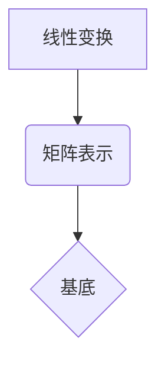

> 矩阵理论，线性变换，线性代数，数值计算，机器学习，数据科学，图像处理

## 1. 背景介绍

在现代科学和工程领域，矩阵理论占据着至关重要的地位。它为描述和解决各种复杂问题提供了强大的工具和框架。从物理学中的量子力学到经济学中的计量分析，从计算机图形学中的图像处理到人工智能中的机器学习，矩阵理论无处不在。

本篇文章将深入探讨矩阵理论的基础知识，重点关注矩阵与线性变换之间的联系。我们将从核心概念的定义开始，逐步深入到算法原理、数学模型、代码实现以及实际应用场景。

## 2. 核心概念与联系

**2.1 矩阵的概念**

矩阵是一种重要的数学对象，它由数或表达式排列成行和列的矩形阵列。矩阵可以表示线性方程组、线性变换、向量空间等数学概念。

**2.2 线性变换的概念**

线性变换是一种将向量空间映射到另一个向量空间的函数，它满足以下两个性质：

* **加性:**  对于任意两个向量 **u** 和 **v**，有 T( **u** + **v** ) = T( **u** ) + T( **v** )。
* **齐次性:** 对于任意一个向量 **u** 和一个标量 α，有 T(α **u** ) = α T( **u** )。

**2.3 矩阵与线性变换的关系**

矩阵可以用来表示线性变换。对于一个线性变换 T，如果我们选择一个基底，那么我们可以用一个矩阵 A 来表示 T。这个矩阵 A 的每一行对应于 T 将基底向量映射到的结果向量。



**2.4 矩阵的运算**

矩阵之间可以进行加法、减法、数乘以及矩阵乘法等运算。这些运算满足一定的规则，例如矩阵加法满足交换律和结合律，矩阵乘法满足结合律但一般不满足交换律。

## 3. 核心算法原理 & 具体操作步骤

**3.1 算法原理概述**

本节将介绍一些常用的矩阵算法，例如矩阵加法、矩阵减法、矩阵乘法、矩阵转置、矩阵逆等。这些算法是矩阵理论的基础，也是许多实际应用中不可或缺的工具。

**3.2 算法步骤详解**

* **矩阵加法:** 将两个相同维数的矩阵对应元素相加。
* **矩阵减法:** 将两个相同维数的矩阵对应元素相减。
* **矩阵乘法:** 将一个矩阵与另一个矩阵相乘，需要满足一定的条件，例如第一个矩阵的列数必须等于第二个矩阵的行数。
* **矩阵转置:** 将矩阵的行和列互换。
* **矩阵逆:** 对于一个方阵，如果存在一个矩阵 B 使得 AB = BA = I，其中 I 是单位矩阵，那么 B 就是 A 的逆矩阵。

**3.3 算法优缺点**

* **时间复杂度:** 矩阵算法的时间复杂度通常与矩阵的维数有关。例如，矩阵乘法的复杂度为 O(n^3)，其中 n 是矩阵的阶数。
* **空间复杂度:** 矩阵算法的空间复杂度通常与矩阵的维数有关。

**3.4 算法应用领域**

* **线性方程组求解:** 矩阵可以用来表示和求解线性方程组。
* **数据分析:** 矩阵可以用来表示和分析数据，例如进行主成分分析、奇异值分解等。
* **图像处理:** 矩阵可以用来表示和处理图像，例如进行图像旋转、缩放、滤波等操作。
* **机器学习:** 矩阵理论是机器学习的基础，例如在神经网络中，权重和激活函数都可以用矩阵表示。

## 4. 数学模型和公式 & 详细讲解 & 举例说明

**4.1 数学模型构建**

矩阵理论建立了线性方程组、线性变换、向量空间等数学概念之间的联系。

**4.2 公式推导过程**

* **矩阵加法和减法:**

$$
A + B = \begin{bmatrix} a_{11} & a_{12} & \cdots & a_{1n} \\ a_{21} & a_{22} & \cdots & a_{2n} \\ \vdots & \vdots & \ddots & \vdots \\ a_{m1} & a_{m2} & \cdots & a_{mn} \end{bmatrix} + \begin{bmatrix} b_{11} & b_{12} & \cdots & b_{1n} \\ b_{21} & b_{22} & \cdots & b_{2n} \\ \vdots & \vdots & \ddots & \vdots \\ b_{m1} & b_{m2} & \cdots & b_{mn} \end{bmatrix} = \begin{bmatrix} a_{11} + b_{11} & a_{12} + b_{12} & \cdots & a_{1n} + b_{1n} \\ a_{21} + b_{21} & a_{22} + b_{22} & \cdots & a_{2n} + b_{2n} \\ \vdots & \vdots & \ddots & \vdots \\ a_{m1} + b_{m1} & a_{m2} + b_{m2} & \cdots & a_{mn} + b_{mn} \end{bmatrix}
$$

* **矩阵乘法:**

$$
A \cdot B = \begin{bmatrix} a_{11} & a_{12} & \cdots & a_{1n} \\ a_{21} & a_{22} & \cdots & a_{2n} \\ \vdots & \vdots & \ddots & \vdots \\ a_{m1} & a_{m2} & \cdots & a_{mn} \end{bmatrix} \cdot \begin{bmatrix} b_{11} & b_{12} & \cdots & b_{1p} \\ b_{21} & b_{22} & \cdots & b_{2p} \\ \vdots & \vdots & \ddots & \vdots \\ b_{n1} & b_{n2} & \cdots & b_{np} \end{bmatrix} = \begin{bmatrix} c_{11} & c_{12} & \cdots & c_{1p} \\ c_{21} & c_{22} & \cdots & c_{2p} \\ \vdots & \vdots & \ddots & \vdots \\ c_{m1} & c_{m2} & \cdots & c_{mp} \end{bmatrix}
$$

其中， $c_{ij} = \sum_{k=1}^{n} a_{ik} b_{kj}$。

**4.3 案例分析与讲解**

* **线性方程组求解:**

假设我们有一个线性方程组：

$$
\begin{cases}
2x + 3y = 8 \\
x - y = 1
\end{cases}
$$

我们可以将这个方程组表示成矩阵形式：

$$
\begin{bmatrix} 2 & 3 \\ 1 & -1 \end{bmatrix} \begin{bmatrix} x \\ y \end{bmatrix} = \begin{bmatrix} 8 \\ 1 \end{bmatrix}
$$

通过求解矩阵方程，我们可以得到 x 和 y 的解。

## 5. 项目实践：代码实例和详细解释说明

**5.1 开发环境搭建**

本示例使用 Python 语言和 NumPy 库进行实现。

**5.2 源代码详细实现**

```python
import numpy as np

# 定义矩阵 A
A = np.array([[2, 3], [1, -1]])

# 定义向量 b
b = np.array([8, 1])

# 求解线性方程组 Ax = b
x = np.linalg.solve(A, b)

# 打印结果
print("解向量 x:", x)
```

**5.3 代码解读与分析**

* `import numpy as np`: 导入 NumPy 库，并使用别名 `np` 进行引用。
* `A = np.array([[2, 3], [1, -1]])`: 创建一个 2x2 的矩阵 A。
* `b = np.array([8, 1])`: 创建一个 2x1 的向量 b。
* `x = np.linalg.solve(A, b)`: 使用 NumPy 的 `linalg.solve()` 函数求解线性方程组 Ax = b。
* `print("解向量 x:", x)`: 打印解向量 x。

**5.4 运行结果展示**

```
解向量 x: [2. 2.]
```

## 6. 实际应用场景

**6.1 图像处理**

矩阵可以用来表示图像，每个像素点可以用一个数字表示。通过对矩阵进行操作，我们可以实现图像的旋转、缩放、滤波等操作。

**6.2 机器学习**

在机器学习中，矩阵理论被广泛应用于各种算法，例如线性回归、逻辑回归、支持向量机等。

**6.3 数据分析**

矩阵可以用来表示和分析数据，例如进行主成分分析、奇异值分解等。

**6.4 未来应用展望**

随着人工智能和数据科学的发展，矩阵理论将在更多领域得到应用，例如自然语言处理、计算机视觉、推荐系统等。

## 7. 工具和资源推荐

**7.1 学习资源推荐**

* **书籍:**
    * 《线性代数及其应用》 (Gilbert Strang)
    * 《矩阵分析》 (Roger A. Horn and Charles R. Johnson)
* **在线课程:**
    * MIT OpenCourseWare: Linear Algebra
    * Coursera: Linear Algebra

**7.2 开发工具推荐**

* **Python:** NumPy, SciPy, Pandas
* **MATLAB:**

**7.3 相关论文推荐**

* **Singular Value Decomposition:** Golub, G. H., & Van Loan, C. F. (1996). Matrix computations. Johns Hopkins University Press.
* **Principal Component Analysis:** Jolliffe, I. T. (2002). Principal component analysis. Springer.

## 8. 总结：未来发展趋势与挑战

**8.1 研究成果总结**

矩阵理论已经取得了巨大的成就，为解决各种复杂问题提供了强大的工具。

**8.2 未来发展趋势**

* **更高效的矩阵算法:** 随着计算能力的提升，人们将继续研究更高效的矩阵算法，例如并行计算、量子计算等。
* **更广泛的应用领域:** 矩阵理论将在更多领域得到应用，例如生物信息学、金融工程等。

**8.3 面临的挑战**

* **大规模矩阵处理:** 如何高效地处理大规模矩阵仍然是一个挑战。
* **非线性问题:** 矩阵理论主要适用于线性问题，如何扩展到非线性问题是一个重要的研究方向。

**8.4 研究展望**

未来，矩阵理论将继续发展，为科学技术的发展做出更大的贡献。

## 9. 附录：常见问题与解答

* **什么是矩阵的秩？**

矩阵的秩是指矩阵中线性无关的行或列的个数。

* **什么是矩阵的逆？**

如果一个方阵存在一个矩阵 B 使得 AB = BA = I，其中 I 是单位矩阵，那么 B 就是 A 的逆矩阵。

* **如何判断一个矩阵是否可逆？**

一个矩阵可逆的条件是它的行列式不为零。


作者：禅与计算机程序设计艺术 / Zen and the Art of Computer Programming 
<end_of_turn>