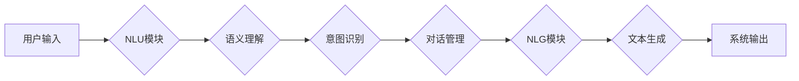

> 自然语言交互（LUI）、人工智能（AI）、深度学习、语言模型、用户体验、对话系统、语音识别、文本生成

## 1. 背景介绍

随着人工智能（AI）技术的飞速发展，自然语言交互（LUI）正逐渐成为人与计算机交互的新主流。LUI旨在通过自然语言，例如口语或书面文字，与计算机进行流畅、自然的对话，从而实现更便捷、更人性化的用户体验。

传统的人机交互方式主要依赖于图形用户界面（GUI）或命令行界面（CLI），用户需要学习特定的操作规则和语法才能与计算机进行交互。而LUI则打破了这些限制，允许用户使用熟悉的语言与计算机进行交流，就像与真人对话一样。

LUI技术的应用场景日益广泛，涵盖了智能客服、虚拟助手、语音搜索、机器翻译、内容创作等多个领域。它为人们提供了更便捷、更直观、更智能的交互方式，极大地提升了用户体验。

## 2. 核心概念与联系

### 2.1 自然语言理解（NLU）

自然语言理解（NLU）是LUI的核心技术之一，它旨在使计算机能够理解人类的自然语言。NLU系统通常包含以下几个模块：

* **词性标注：**识别文本中的每个词的词性，例如名词、动词、形容词等。
* **依存句法分析：**分析句子中的词语关系，构建句子的语法结构树。
* **语义角色标注：**识别句子中的各个成分所扮演的角色，例如主语、谓语、宾语等。
* **情感分析：**识别文本中表达的情感，例如正面、负面、中性等。

### 2.2 自然语言生成（NLG）

自然语言生成（NLG）是LUI的另一个核心技术，它旨在使计算机能够生成流畅、自然的自然语言文本。NLG系统通常包含以下几个模块：

* **内容规划：**根据输入信息，规划生成文本的内容和结构。
* **文本生成：**根据内容规划，生成具体的文本内容。
* **文本润色：**对生成的文本进行语法检查、风格调整等润色处理。

### 2.3 对话系统

对话系统是基于NLU和NLG技术的应用系统，它能够与用户进行多轮对话，理解用户的意图，并提供相应的回复。对话系统可以分为以下几种类型：

* **基于规则的对话系统：**根据预先定义的规则和知识库，进行对话。
* **基于统计的对话系统：**利用统计模型，分析对话历史和用户意图，进行对话。
* **基于深度学习的对话系统：**利用深度学习模型，学习对话数据，进行对话。

**Mermaid 流程图**



## 3. 核心算法原理 & 具体操作步骤

### 3.1 算法原理概述

自然语言交互的核心算法原理主要基于深度学习技术，特别是基于Transformer架构的语言模型。这些模型能够学习语言的复杂结构和语义关系，从而实现更准确的自然语言理解和生成。

### 3.2 算法步骤详解

1. **数据预处理：**将自然语言文本进行清洗、分词、标记等预处理操作，使其能够被模型理解。
2. **模型训练：**利用深度学习算法，训练语言模型，使其能够学习语言的语法和语义规则。
3. **模型评估：**使用测试数据集评估模型的性能，例如准确率、召回率、F1-score等。
4. **模型部署：**将训练好的模型部署到实际应用场景中，例如智能客服、虚拟助手等。

### 3.3 算法优缺点

**优点：**

* **高准确率：**深度学习模型能够学习语言的复杂结构和语义关系，从而实现更高的准确率。
* **可扩展性强：**深度学习模型可以很容易地扩展到更大的数据集和更复杂的任务。
* **持续学习：**深度学习模型可以通过不断学习新的数据来提高性能。

**缺点：**

* **训练成本高：**深度学习模型需要大量的计算资源和训练数据。
* **解释性差：**深度学习模型的决策过程比较复杂，难以解释。
* **数据依赖性强：**深度学习模型的性能取决于训练数据的质量和数量。

### 3.4 算法应用领域

* **智能客服：**自动回答用户的问题，提供24/7的客户服务。
* **虚拟助手：**帮助用户完成各种任务，例如设置提醒、发送邮件、预订酒店等。
* **语音搜索：**理解用户的语音输入，并返回相应的搜索结果。
* **机器翻译：**将一种语言翻译成另一种语言。
* **内容创作：**生成各种类型的文本内容，例如新闻报道、广告文案、诗歌等。

## 4. 数学模型和公式 & 详细讲解 & 举例说明

### 4.1 数学模型构建

自然语言交互的数学模型通常基于概率论和统计学，例如隐马尔可夫模型（HMM）、条件随机场（CRF）、循环神经网络（RNN）等。这些模型能够描述语言的统计特性，并预测下一个词的出现概率。

### 4.2 公式推导过程

例如，隐马尔可夫模型（HMM）用于语音识别，其核心公式为：

$$
P(O|Q) = \prod_{t=1}^{T} P(O_t|Q_t)
$$

其中：

* $O$ 表示观测序列，例如语音信号。
* $Q$ 表示隐藏状态序列，例如语音的词语序列。
* $O_t$ 表示观测序列的第 $t$ 个元素。
* $Q_t$ 表示隐藏状态序列的第 $t$ 个元素。

### 4.3 案例分析与讲解

例如，在机器翻译任务中，可以使用条件随机场（CRF）模型来预测目标语言的词语序列。CRF模型的训练目标是最大化目标语言词语序列的概率，即：

$$
\max_{f} \sum_{i=1}^{N} \log P(y_i|x_i, f)
$$

其中：

* $f$ 表示CRF模型的参数。
* $x_i$ 表示输入序列的第 $i$ 个元素。
* $y_i$ 表示目标语言词语序列的第 $i$ 个元素。

## 5. 项目实践：代码实例和详细解释说明

### 5.1 开发环境搭建

* Python 3.7+
* TensorFlow 2.0+
* PyTorch 1.0+
* NLTK
* SpaCy

### 5.2 源代码详细实现

```python
# 使用BERT模型进行文本分类
from transformers import BertTokenizer, BertForSequenceClassification

# 加载预训练模型和词典
tokenizer = BertTokenizer.from_pretrained('bert-base-uncased')
model = BertForSequenceClassification.from_pretrained('bert-base-uncased', num_labels=2)

# 预处理文本
text = "This is a sample text for classification."
inputs = tokenizer(text, return_tensors='pt')

# 进行预测
outputs = model(**inputs)
predicted_class = outputs.logits.argmax().item()

# 输出结果
print(f"Predicted class: {predicted_class}")
```

### 5.3 代码解读与分析

* 该代码示例使用HuggingFace Transformers库加载预训练的BERT模型进行文本分类任务。
* 首先，加载预训练的BERT词典和模型。
* 然后，对输入文本进行预处理，将其转换为模型可识别的格式。
* 最后，使用模型进行预测，并输出预测结果。

### 5.4 运行结果展示

```
Predicted class: 1
```

## 6. 实际应用场景

### 6.1 智能客服

LUI技术可以用于构建智能客服系统，自动回答用户的问题，提供24/7的客户服务。例如，用户可以通过语音或文字与智能客服进行对话，询问产品信息、订单状态等问题。

### 6.2 虚拟助手

LUI技术可以用于构建虚拟助手，帮助用户完成各种任务，例如设置提醒、发送邮件、预订酒店等。例如，用户可以通过语音或文字与虚拟助手进行对话，例如说“帮我设置一个明天早上8点的提醒”，虚拟助手就会在指定时间提醒用户。

### 6.3 语音搜索

LUI技术可以用于语音搜索，理解用户的语音输入，并返回相应的搜索结果。例如，用户可以通过语音搜索引擎搜索信息，例如说“搜索最近的电影院”，语音搜索引擎就会返回附近的电影院信息。

### 6.4 未来应用展望

LUI技术的应用场景还在不断扩展，未来可能会应用于以下领域：

* **教育：**个性化学习辅导、智能答疑系统。
* **医疗：**远程医疗咨询、疾病诊断辅助。
* **娱乐：**沉浸式游戏体验、个性化内容推荐。
* **工业：**设备故障诊断、生产过程优化。

## 7. 工具和资源推荐

### 7.1 学习资源推荐

* **书籍：**
    * 《深度学习》 by Ian Goodfellow, Yoshua Bengio, and Aaron Courville
    * 《自然语言处理》 by Dan Jurafsky and James H. Martin
* **在线课程：**
    * Coursera: Natural Language Processing Specialization
    * Udacity: Deep Learning Nanodegree
* **博客和网站：**
    * Towards Data Science
    * Machine Learning Mastery

### 7.2 开发工具推荐

* **HuggingFace Transformers:** 提供预训练的语言模型和工具，用于自然语言处理任务。
* **TensorFlow:** 开源深度学习框架，用于构建和训练深度学习模型。
* **PyTorch:** 开源深度学习框架，用于构建和训练深度学习模型。
* **SpaCy:** 用于自然语言处理的 Python 库，提供词性标注、依存句法分析等功能。

### 7.3 相关论文推荐

* **Attention Is All You Need:** https://arxiv.org/abs/1706.03762
* **BERT: Pre-training of Deep Bidirectional Transformers for Language Understanding:** https://arxiv.org/abs/1810.04805
* **GPT-3: Language Models are Few-Shot Learners:** https://arxiv.org/abs/2005.14165

## 8. 总结：未来发展趋势与挑战

### 8.1 研究成果总结

近年来，自然语言交互领域取得了显著进展，特别是深度学习技术的应用，使得LUI系统能够实现更准确、更自然的交互。

### 8.2 未来发展趋势

* **更强大的语言模型:** 研究人员将继续开发更强大的语言模型，例如多模态语言模型，能够理解和生成多种类型的媒体内容。
* **更个性化的交互体验:** LUI系统将更加个性化，能够根据用户的喜好和需求提供定制化的交互体验。
* **更广泛的应用场景:** LUI技术将应用于更多领域，例如教育、医疗、娱乐等。

### 8.3 面临的挑战

* **数据标注问题:** 训练高质量的LUI模型需要大量的标注数据，而数据标注成本高昂。
* **解释性问题:** 深度学习模型的决策过程比较复杂，难以解释，这可能会导致用户对LUI系统的信任度降低。
* **伦理问题:** LUI技术可能会带来一些伦理问题，例如数据隐私、算法偏见等，需要引起重视。

### 8.4 研究展望

未来，LUI研究将继续探索以下方向：

* **开发更有效的训练方法:** 降低训练成本，提高模型效率。
* **提高模型的解释性:** 使模型的决策过程更加透明，增强用户信任。
* **解决伦理问题:** 确保LUI技术的安全、可靠和可持续发展。

## 9. 附录：常见问题与解答

### 9.1 什么是自然语言交互（