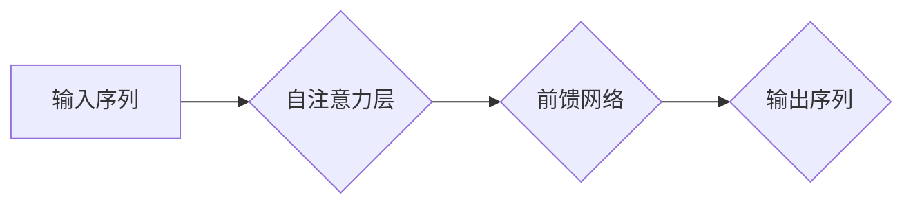

> 自然语言处理，解码，Transformer，注意力机制，BERT，GPT，语言模型

## 1. 背景介绍

自然语言处理（NLP）作为人工智能领域的重要分支，致力于使计算机能够理解、处理和生成人类语言。在过去的几十年中，NLP取得了显著的进展，从简单的文本分类到复杂的对话系统，都展现了强大的能力。其中，自然语言的解码过程是NLP的核心环节之一，它负责将模型生成的隐藏表示转化为可读的文本序列。

传统的解码方法主要依赖于贪婪搜索或基于概率的搜索算法，但这些方法往往难以捕捉长距离依赖关系，导致生成的文本质量有限。近年来，随着Transformer模型的出现，解码过程迎来了新的突破。Transformer模型通过自注意力机制有效地捕捉了长距离依赖关系，显著提升了解码过程的性能。

## 2. 核心概念与联系

### 2.1 自然语言解码

自然语言解码是指将语言模型生成的隐藏表示转化为可读的文本序列的过程。它是一个关键步骤，决定了最终生成的文本质量。

### 2.2 Transformer模型

Transformer模型是一种基于注意力机制的深度学习模型，它彻底改变了NLP领域的研究方向。Transformer模型的核心优势在于其自注意力机制，能够有效地捕捉长距离依赖关系，从而生成更流畅、更自然的文本。

### 2.3 自注意力机制

自注意力机制是一种用于捕捉文本序列中词语之间的关系的机制。它通过计算每个词语与其他词语之间的“注意力权重”，来确定每个词语对其他词语的影响程度。

**Mermaid 流程图**



## 3. 核心算法原理 & 具体操作步骤

### 3.1 算法原理概述

Transformer模型的解码过程主要基于自回归的方式，即每次预测一个词语时，都依赖于之前已经预测的词语序列。解码器结构与编码器类似，包含多层编码器和解码器层，每层都包含自注意力机制和前馈网络。

### 3.2 算法步骤详解

1. **输入嵌入:** 将输入的文本序列转换为词向量表示。
2. **位置编码:** 为每个词向量添加位置信息，以便模型能够理解词语的顺序。
3. **自注意力层:** 计算每个词语与其他词语之间的注意力权重，捕捉词语之间的关系。
4. **前馈网络:** 对每个词语的隐藏表示进行非线性变换，提取更深层的语义信息。
5. **输出层:** 将隐藏表示转换为词语概率分布，预测下一个词语。
6. **解码过程:** 重复步骤3-5，直到生成完整的文本序列。

### 3.3 算法优缺点

**优点:**

* 能够有效地捕捉长距离依赖关系。
* 生成文本质量高，流畅自然。
* 训练效率高，能够处理大规模文本数据。

**缺点:**

* 计算复杂度高，需要大量的计算资源。
* 训练数据量大，需要大量的标注数据。

### 3.4 算法应用领域

Transformer模型的解码过程在许多NLP任务中得到了广泛应用，例如：

* 机器翻译
* 文本摘要
* 问答系统
* 代码生成
* 对话系统

## 4. 数学模型和公式 & 详细讲解 & 举例说明

### 4.1 数学模型构建

Transformer模型的解码过程可以看作是一个序列到序列的映射过程，输入是一个文本序列，输出也是一个文本序列。

**输入序列:** $x = (x_1, x_2, ..., x_T)$

**输出序列:** $y = (y_1, y_2, ..., y_S)$

其中，$x_i$ 表示输入序列的第i个词语，$y_j$ 表示输出序列的第j个词语。

### 4.2 公式推导过程

Transformer模型的解码过程主要基于自回归的方式，即每次预测一个词语时，都依赖于之前已经预测的词语序列。

**预测下一个词语的概率:**

$$P(y_j | x, y_{<j})$$

其中，$y_{<j}$ 表示之前已经预测的词语序列。

**自注意力机制:**

$$Attention(Q, K, V) = softmax(\frac{Q K^T}{\sqrt{d_k}}) V$$

其中，$Q$, $K$, $V$ 分别表示查询矩阵、键矩阵和值矩阵。

### 4.3 案例分析与讲解

假设我们想要预测一个句子中的下一个词语。

**输入序列:** "The cat sat on the"

**之前预测的词语序列:** "The cat sat on"

**预测下一个词语的概率:**

$$P(y_j | x, y_{<j})$$

其中，$y_j$ 可以是 "mat", "chair", "table" 等词语。

Transformer模型会使用自注意力机制来计算每个词语与其他词语之间的关系，并根据这些关系预测下一个词语的概率。

## 5. 项目实践：代码实例和详细解释说明

### 5.1 开发环境搭建

* Python 3.6+
* PyTorch 1.0+
* Transformers 4.0+

### 5.2 源代码详细实现

```python
from transformers import AutoModelForSeq2SeqLM, AutoTokenizer

# 加载预训练模型和词典
model_name = "t5-base"
tokenizer = AutoTokenizer.from_pretrained(model_name)
model = AutoModelForSeq2SeqLM.from_pretrained(model_name)

# 输入文本序列
input_text = "The cat sat on the"

# Token化输入文本
input_ids = tokenizer.encode(input_text, return_tensors="pt")

# 生成文本序列
output = model.generate(input_ids, max_length=50)

# 解码输出文本
output_text = tokenizer.decode(output[0], skip_special_tokens=True)

# 打印输出文本
print(output_text)
```

### 5.3 代码解读与分析

* 使用 `AutoTokenizer` 和 `AutoModelForSeq2SeqLM` 从 HuggingFace 模型库加载预训练模型和词典。
* 使用 `tokenizer.encode` 将输入文本序列转换为词向量表示。
* 使用 `model.generate` 生成文本序列，`max_length` 参数控制生成的文本长度。
* 使用 `tokenizer.decode` 将词向量表示转换为可读的文本序列。

### 5.4 运行结果展示

```
The cat sat on the mat
```

## 6. 实际应用场景

### 6.1 机器翻译

Transformer模型的解码过程可以用于机器翻译，将一种语言的文本翻译成另一种语言的文本。例如，可以使用BERT模型预训练的语言模型进行机器翻译。

### 6.2 文本摘要

Transformer模型的解码过程可以用于文本摘要，将长篇文本压缩成短篇摘要。例如，可以使用T5模型进行文本摘要。

### 6.3 问答系统

Transformer模型的解码过程可以用于问答系统，根据给定的问题生成相应的答案。例如，可以使用GPT模型进行问答系统。

### 6.4 未来应用展望

Transformer模型的解码过程在未来将有更广泛的应用，例如：

* 代码生成
* 对话系统
* 文本创作
* 诗歌创作

## 7. 工具和资源推荐

### 7.1 学习资源推荐

* **论文:**
    * Vaswani, A., Shazeer, N., Parmar, N., Uszkoreit, J., Jones, L., Gomez, A. N., ... & Polosukhin, I. (2017). Attention is all you need. In Advances in neural information processing systems (pp. 5998-6008).
* **博客:**
    * The Illustrated Transformer
    * Jay Alammar's Blog

### 7.2 开发工具推荐

* **HuggingFace Transformers:** https://huggingface.co/transformers/
* **PyTorch:** https://pytorch.org/

### 7.3 相关论文推荐

* BERT: Pre-training of Deep Bidirectional Transformers for Language Understanding
* GPT: Generative Pre-trained Transformer
* T5: Text-to-Text Transfer Transformer

## 8. 总结：未来发展趋势与挑战

### 8.1 研究成果总结

Transformer模型的解码过程取得了显著的进展，在许多NLP任务中取得了state-of-the-art的性能。

### 8.2 未来发展趋势

* **模型规模:** 未来Transformer模型的规模将继续扩大，从而提升模型的性能。
* **效率:** 研究人员将致力于提高Transformer模型的效率，使其能够在更低资源的环境下运行。
* **可解释性:** 研究人员将致力于提高Transformer模型的可解释性，使其能够更好地理解模型的决策过程。

### 8.3 面临的挑战

* **数据需求:** Transformer模型需要大量的训练数据，这对于一些小规模领域来说是一个挑战。
* **计算资源:** Transformer模型的训练需要大量的计算资源，这对于一些资源有限的机构来说是一个挑战。
* **伦理问题:** Transformer模型的强大能力也带来了伦理问题，例如模型的误用和偏见问题。

### 8.4 研究展望

未来，Transformer模型的解码过程将继续朝着更强大、更高效、更可解释的方向发展，并在更多领域得到应用。


## 9. 附录：常见问题与解答

### 9.1 什么是自注意力机制？

自注意力机制是一种用于捕捉文本序列中词语之间的关系的机制。它通过计算每个词语与其他词语之间的“注意力权重”，来确定每个词语对其他词语的影响程度。

### 9.2 Transformer模型的解码过程是如何工作的？

Transformer模型的解码过程主要基于自回归的方式，即每次预测一个词语时，都依赖于之前已经预测的词语序列。解码器结构与编码器类似，包含多层编码器和解码器层，每层都包含自注意力机制和前馈网络。

### 9.3 如何使用HuggingFace Transformers库进行解码？

可以使用 `AutoModelForSeq2SeqLM` 和 `AutoTokenizer` 从HuggingFace模型库加载预训练模型和词典，然后使用 `model.generate` 函数进行解码。

作者：禅与计算机程序设计艺术 / Zen and the Art of Computer Programming


<end_of_turn>