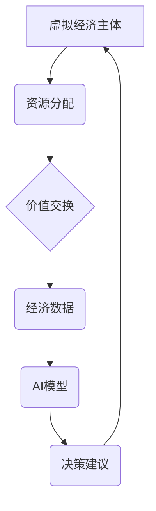

> 虚拟经济、AI驱动的价值交换、模拟器、区块链、智能合约、机器学习、经济学模型

## 1. 背景介绍

随着人工智能技术的飞速发展，其在各个领域的应用日益广泛，其中包括经济学和金融领域。传统的经济学模型往往基于人类行为的假设，而人工智能能够模拟更复杂的、更接近现实世界的经济行为。虚拟经济模拟器作为一种新型的实验平台，可以利用人工智能技术，构建一个虚拟的经济环境，并通过模拟不同的经济场景和政策，研究经济现象的演化规律，从而为现实世界的经济决策提供参考。

## 2. 核心概念与联系

**2.1 虚拟经济**

虚拟经济是指在计算机网络环境中构建的模拟现实经济的系统。它包含虚拟的经济主体（如虚拟用户、虚拟企业）、虚拟的资源（如虚拟货币、虚拟商品）、虚拟的市场机制（如虚拟交易平台、虚拟价格机制）等。

**2.2 AI驱动的价值交换**

AI驱动的价值交换是指利用人工智能技术，实现虚拟经济中资源的自动分配和价值交换。这可以通过以下方式实现：

* **智能合约:** 智能合约是一种基于区块链技术的自动执行合约，可以根据预先设定的规则自动执行交易，无需第三方参与。
* **机器学习:** 机器学习算法可以从历史数据中学习，预测未来市场需求和价格趋势，从而帮助虚拟经济主体进行更有效的交易决策。

**2.3 虚拟经济模拟器的架构**



**2.4 核心概念联系**

虚拟经济模拟器通过构建虚拟经济环境，并利用AI技术实现资源分配和价值交换，从而模拟现实世界的经济现象。AI模型可以根据虚拟经济中的数据进行分析和预测，并提供决策建议，从而帮助虚拟经济主体进行更有效的交易决策。

## 3. 核心算法原理 & 具体操作步骤

**3.1 算法原理概述**

虚拟经济模拟器的核心算法主要包括资源分配算法、价值交换算法和AI模型训练算法。

* **资源分配算法:** 该算法负责根据虚拟经济主体的需求和资源的供给情况，分配虚拟资源。常见的资源分配算法包括市场机制、拍卖机制和配额机制等。
* **价值交换算法:** 该算法负责实现虚拟经济主体之间的价值交换。常见的价值交换算法包括双边交易、多边交易和智能合约等。
* **AI模型训练算法:** 该算法负责根据虚拟经济中的数据，训练AI模型，使其能够预测未来市场需求和价格趋势。常见的AI模型训练算法包括监督学习、无监督学习和强化学习等。

**3.2 算法步骤详解**

1. **构建虚拟经济环境:** 首先需要构建一个虚拟经济环境，包括虚拟经济主体、虚拟资源、虚拟市场机制等。
2. **设定初始条件:** 设置虚拟经济环境的初始条件，例如虚拟经济主体的初始资源、虚拟资源的初始价格等。
3. **运行模拟:** 启动虚拟经济模拟器，并根据预设的规则，模拟虚拟经济主体的行为和资源的流动。
4. **收集数据:** 在模拟过程中，收集虚拟经济中的数据，例如交易记录、价格变化、资源分配情况等。
5. **训练AI模型:** 使用收集到的数据，训练AI模型，使其能够预测未来市场需求和价格趋势。
6. **评估结果:** 评估虚拟经济模拟器的结果，例如虚拟经济的稳定性、资源的分配效率、AI模型的预测准确率等。

**3.3 算法优缺点**

* **优点:**
    * 可以模拟现实世界的经济现象，并研究其演化规律。
    * 可以进行大量的实验，并快速评估不同的政策方案。
    * 可以利用AI技术，实现更复杂的经济行为模拟。
* **缺点:**
    * 虚拟经济模型的复杂度有限，难以完全模拟现实世界的经济复杂性。
    * 虚拟经济数据与现实世界数据存在差异，可能会影响AI模型的训练效果。

**3.4 算法应用领域**

* **经济学研究:** 研究经济现象的演化规律，评估不同经济政策的效应。
* **金融市场分析:** 预测市场需求和价格趋势，辅助投资决策。
* **商业策略制定:** 模拟不同商业策略的效果，优化资源配置。
* **教育培训:** 提供一个虚拟的经济环境，帮助学生学习经济学知识。

## 4. 数学模型和公式 & 详细讲解 & 举例说明

**4.1 数学模型构建**

虚拟经济模拟器的数学模型通常基于微观经济学和宏观经济学理论，并结合人工智能算法。

* **微观经济学模型:** 描述虚拟经济主体之间的交易行为，例如供求关系、价格机制、消费者行为等。
* **宏观经济学模型:** 描述虚拟经济整体的运行状况，例如生产总值、失业率、通货膨胀率等。

**4.2 公式推导过程**

例如，我们可以使用以下公式来描述虚拟经济中的价格机制：

$$
P = \frac{D(P)}{S(P)}
$$

其中：

* $P$ 表示虚拟商品的价格。
* $D(P)$ 表示虚拟商品的市场需求函数。
* $S(P)$ 表示虚拟商品的市场供给函数。

**4.3 案例分析与讲解**

假设虚拟经济中存在一种虚拟商品，其需求函数为：

$$
D(P) = 100 - 2P
$$

其供给函数为：

$$
S(P) = 2P - 20
$$

根据公式，我们可以计算出虚拟商品的均衡价格：

$$
P = \frac{100 - 2P}{2P - 20}
$$

解方程，得到：

$$
P = 25
$$

因此，虚拟商品的均衡价格为25。

## 5. 项目实践：代码实例和详细解释说明

**5.1 开发环境搭建**

虚拟经济模拟器的开发环境通常包括以下软件：

* **编程语言:** Python、Java、C++等。
* **数据存储:** MySQL、MongoDB等。
* **区块链平台:** Ethereum、Hyperledger Fabric等。
* **机器学习库:** TensorFlow、PyTorch等。

**5.2 源代码详细实现**

以下是一个简单的虚拟经济模拟器代码示例，使用Python语言实现：

```python
class VirtualUser:
    def __init__(self, name, initial_money):
        self.name = name
        self.money = initial_money

    def buy(self, item, price):
        if self.money >= price:
            self.money -= price
            print(f"{self.name} bought {item} for {price}")
        else:
            print(f"{self.name} doesn't have enough money to buy {item}")

class VirtualItem:
    def __init__(self, name, price):
        self.name = name
        self.price = price

    def sell(self, user):
        user.buy(self.name, self.price)

# 创建虚拟用户和虚拟商品
user1 = VirtualUser("Alice", 100)
item1 = VirtualItem("Apple", 10)

# 模拟交易
item1.sell(user1)
```

**5.3 代码解读与分析**

该代码示例定义了两个类：`VirtualUser` 和 `VirtualItem`。

* `VirtualUser` 类代表虚拟经济中的用户，拥有姓名和金钱属性。
* `VirtualItem` 类代表虚拟经济中的商品，拥有名称和价格属性。

代码中创建了一个虚拟用户`Alice`和一个虚拟商品`Apple`，并模拟了`Alice`购买`Apple`的交易过程。

**5.4 运行结果展示**

运行该代码后，会输出以下结果：

```
Alice bought Apple for 10
```

## 6. 实际应用场景

**6.1 经济学研究**

虚拟经济模拟器可以用于研究各种经济现象，例如市场竞争、价格波动、货币政策等。例如，可以模拟一个虚拟市场，并研究不同类型的竞争机制对市场效率的影响。

**6.2 金融市场分析**

虚拟经济模拟器可以用于模拟金融市场，并预测市场趋势。例如，可以模拟股票市场，并根据历史数据训练AI模型，预测未来股票价格的走势。

**6.3 商业策略制定**

虚拟经济模拟器可以帮助企业制定商业策略。例如，可以模拟一个虚拟的市场环境，并测试不同类型的营销策略的效果。

**6.4 未来应用展望**

随着人工智能技术的不断发展，虚拟经济模拟器的应用场景将会更加广泛。例如，可以利用虚拟经济模拟器进行教育培训，帮助学生学习经济学知识；也可以利用虚拟经济模拟器进行政策模拟，帮助政府制定更有效的政策。

## 7. 工具和资源推荐

**7.1 学习资源推荐**

* **书籍:**
    * 《经济学原理》
    * 《人工智能》
    * 《区块链技术》
* **在线课程:**
    * Coursera
    * edX
    * Udacity

**7.2 开发工具推荐**

* **编程语言:** Python、Java、C++
* **数据存储:** MySQL、MongoDB
* **区块链平台:** Ethereum、Hyperledger Fabric
* **机器学习库:** TensorFlow、PyTorch

**7.3 相关论文推荐**

* **《基于人工智能的虚拟经济模拟》**
* **《区块链技术在虚拟经济中的应用》**
* **《机器学习在金融市场预测中的应用》**

## 8. 总结：未来发展趋势与挑战

**8.1 研究成果总结**

虚拟经济模拟器作为一种新型的实验平台，在经济学、金融学、商业策略等领域具有重要的应用价值。通过利用人工智能技术，虚拟经济模拟器能够模拟更复杂的经济现象，并提供更准确的预测结果。

**8.2 未来发展趋势**

未来，虚拟经济模拟器将会朝着以下方向发展：

* **更加复杂和真实的模型:** 虚拟经济模型将会更加复杂，能够模拟现实世界经济的更多方面。
* **更强大的AI算法:** AI算法将会更加强大，能够提供更准确的预测结果。
* **更广泛的应用场景:** 虚拟经济模拟器将会应用于更多领域，例如教育、政策制定等。

**8.3 面临的挑战**

虚拟经济模拟器的发展也面临着一些挑战：

* **模型复杂度:** 构建更加复杂和真实的虚拟经济模型是一个技术难题。
* **数据质量:** 虚拟经济模拟器的训练数据质量直接影响模型的预测精度。
* **伦理问题:** 虚拟经济模拟器可能会被用于进行不道德的实验，需要考虑伦理问题。

**8.4 研究展望**

未来，我们需要继续研究虚拟经济模拟器的模型、算法和应用，使其能够更好地服务于经济学、金融学、商业策略等领域。同时，也需要关注虚拟经济模拟器的伦理问题，确保其应用安全和可控。

## 9. 附录：常见问题与解答

**9.1 如何构建一个虚拟经济模型？**

构建一个虚拟经济模型需要考虑以下几个方面：

* **模型目标:** 你想要研究什么经济现象？
* **模型主体:** 虚拟经济中有哪些主体？
* **模型机制:** 虚拟经济中的资源分配、价值交换等机制是什么？
* **模型数据:** 你需要收集哪些数据来训练模型？

**9.2 如何训练一个AI模型用于虚拟经济模拟？**

训练一个AI模型用于虚拟经济模拟需要以下步骤：

* **数据收集:** 收集虚拟经济中的数据，例如交易记录、价格变化、资源分配情况等。
* **数据预处理:** 对收集到的数据进行清洗、转换和特征工程。
* **模型选择:** 选择合适的AI模型，例如监督学习、无监督学习或强化学习。
* **模型训练:** 使用训练数据训练AI模型。
* **模型评估:** 使用测试数据评估模型的性能。

**9.3 虚拟经济模拟器的伦理问题有哪些？**

虚拟经济模拟