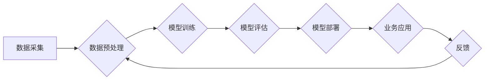

>  人工智能、行业知识、数据驱动、模型训练、业务价值、可解释性、伦理

## 1. 背景介绍

人工智能（AI）技术近年来发展迅速，已渗透到各个行业，为企业带来了巨大的变革和机遇。从自动驾驶到医疗诊断，从金融风险管理到个性化推荐，AI正在改变着我们的生活和工作方式。然而，单纯依靠强大的算法和海量数据，并不能保证AI技术的成功应用。行业知识的融入，是AI技术真正发挥价值的关键。

传统AI模型的训练主要依赖于海量数据，通过算法学习数据中的模式和规律，从而实现预测、分类、识别等功能。然而，行业知识往往蕴含在数据背后的业务逻辑、专业规则和经验中，这些信息难以被直接提取和学习。如果AI模型缺乏对行业知识的理解，其决策结果可能缺乏准确性和可靠性，甚至可能带来意想不到的风险。

## 2. 核心概念与联系

**2.1 行业知识的定义**

行业知识是指特定行业领域内积累的经验、技能、规则、规范、最佳实践等，是该行业专业人员通过长期实践和学习获得的宝贵资产。它包含了对行业流程、产品、客户、市场等方面的深刻理解，是推动行业发展和创新不可或缺的要素。

**2.2 AI与行业知识的融合**

将行业知识融入AI模型，可以提升模型的准确性、可靠性和可解释性，使其更好地服务于特定行业的需求。

**2.3 融合方式**

* **专家规则嵌入:** 将行业专家定义的规则和知识直接编码到AI模型中，例如使用规则引擎或专家系统。
* **知识图谱构建:** 建立行业相关的知识图谱，将行业知识表示为结构化的知识关系，并将其与AI模型相结合。
* **迁移学习:** 利用已训练好的通用AI模型，通过少量行业特定数据进行微调，使其具备对特定行业的理解能力。
* **人类-AI协作:** 建立人类和AI协作的平台，让专家和AI模型共同参与决策过程，充分发挥各自的优势。

**2.4 流程图**



## 3. 核心算法原理 & 具体操作步骤

**3.1 算法原理概述**

深度学习算法是目前AI领域最热门的算法之一，其核心思想是通过多层神经网络模拟人类大脑的学习过程，从数据中自动学习特征和模式。深度学习算法在图像识别、自然语言处理、语音识别等领域取得了突破性的进展。

**3.2 算法步骤详解**

1. **数据预处理:** 将原始数据进行清洗、转换、特征提取等操作，使其适合深度学习模型的训练。
2. **网络结构设计:** 根据具体任务需求，设计合适的深度学习网络结构，例如卷积神经网络（CNN）、循环神经网络（RNN）等。
3. **模型训练:** 使用训练数据训练深度学习模型，通过调整模型参数，使模型的预测结果与真实值尽可能接近。
4. **模型评估:** 使用测试数据评估模型的性能，例如准确率、召回率、F1-score等。
5. **模型调优:** 根据评估结果，调整模型参数、网络结构等，进一步提升模型性能。
6. **模型部署:** 将训练好的模型部署到实际应用场景中，用于进行预测、分类、识别等任务。

**3.3 算法优缺点**

**优点:**

* 能够自动学习特征，无需人工特征工程。
* 性能优异，在许多任务上取得了突破性进展。
* 可处理海量数据，具有强大的学习能力。

**缺点:**

* 训练成本高，需要大量的计算资源和时间。
* 模型解释性差，难以理解模型的决策过程。
* 对数据质量要求高，容易受到噪声和偏差的影响。

**3.4 算法应用领域**

* **图像识别:** 人脸识别、物体检测、图像分类等。
* **自然语言处理:** 文本分类、情感分析、机器翻译等。
* **语音识别:** 语音转文本、语音助手等。
* **推荐系统:** 商品推荐、内容推荐等。
* **医疗诊断:** 病情预测、疾病诊断等。

## 4. 数学模型和公式 & 详细讲解 & 举例说明

**4.1 数学模型构建**

深度学习模型的核心是神经网络，其结构由多个层组成，每一层包含多个神经元。每个神经元接收来自上一层的输入信号，并通过激活函数进行处理，输出到下一层。

**4.2 公式推导过程**

神经网络的训练过程是通过反向传播算法来实现的。反向传播算法的核心思想是通过计算误差，并根据误差反向调整模型参数，使得模型的预测结果与真实值尽可能接近。

**损失函数:** 用于衡量模型预测结果与真实值的差距。常见的损失函数包括均方误差（MSE）、交叉熵损失（Cross-Entropy Loss）等。

**梯度下降:** 用于更新模型参数的方法。梯度下降算法通过计算损失函数的梯度，沿着梯度方向调整模型参数，使得损失函数的值不断减小。

**4.3 案例分析与讲解**

假设我们有一个简单的线性回归模型，其目标是预测房价。模型的输入特征包括房屋面积、房间数量等，输出为房价。

损失函数可以定义为均方误差：

$$
L = \frac{1}{n} \sum_{i=1}^{n} (y_i - \hat{y}_i)^2
$$

其中：

* $L$ 为损失函数值
* $n$ 为样本数量
* $y_i$ 为真实房价
* $\hat{y}_i$ 为模型预测的房价

梯度下降算法可以用来更新模型参数：

$$
\theta = \theta - \alpha \nabla L
$$

其中：

* $\theta$ 为模型参数
* $\alpha$ 为学习率
* $\nabla L$ 为损失函数的梯度

通过不断迭代更新模型参数，最终可以得到一个能够准确预测房价的模型。

## 5. 项目实践：代码实例和详细解释说明

**5.1 开发环境搭建**

* Python 3.x
* TensorFlow 或 PyTorch 等深度学习框架
* Jupyter Notebook 或 VS Code 等开发工具

**5.2 源代码详细实现**

```python
import tensorflow as tf

# 定义模型结构
model = tf.keras.models.Sequential([
    tf.keras.layers.Dense(64, activation='relu', input_shape=(784,)),
    tf.keras.layers.Dense(10, activation='softmax')
])

# 编译模型
model.compile(optimizer='adam',
              loss='sparse_categorical_crossentropy',
              metrics=['accuracy'])

# 训练模型
model.fit(x_train, y_train, epochs=10)

# 评估模型
loss, accuracy = model.evaluate(x_test, y_test)
print('Test loss:', loss)
print('Test accuracy:', accuracy)
```

**5.3 代码解读与分析**

* 首先，我们定义了一个简单的深度学习模型，包含两层全连接神经网络。
* 然后，我们使用Adam优化器、交叉熵损失函数和准确率作为评估指标，对模型进行编译。
* 接着，我们使用训练数据对模型进行训练，训练10个epochs。
* 最后，我们使用测试数据评估模型的性能，并打印测试损失和准确率。

**5.4 运行结果展示**

训练完成后，我们可以观察模型的训练过程和测试结果，例如训练损失和准确率的变化趋势。

## 6. 实际应用场景

**6.1 金融领域**

* 风险评估：利用AI模型分析客户数据，评估贷款风险和投资风险。
* 欺诈检测：识别信用卡欺诈交易和网络金融犯罪。
* 量化投资：根据市场数据和模型预测，进行自动交易和投资决策。

**6.2 医疗领域**

* 病情诊断：利用AI模型分析患者影像数据和病历信息，辅助医生诊断疾病。
* 药物研发：加速药物研发过程，预测药物的疗效和安全性。
* 个性化医疗：根据患者的基因信息和生活习惯，提供个性化的医疗方案。

**6.3 制造业**

* 质量控制：利用AI模型识别产品缺陷，提高产品质量。
* 预测性维护：预测设备故障，及时进行维护保养，降低设备停机时间。
* 智能制造：实现自动化生产，提高生产效率和产品质量。

**6.4 未来应用展望**

随着AI技术的不断发展，其应用场景将更加广泛，例如：

* 智能客服：提供24小时在线客服服务，解决客户问题。
* 自动驾驶：实现无人驾驶汽车，提高交通安全和效率。
* 人机交互：开发更加自然和智能的人机交互方式。

## 7. 工具和资源推荐

**7.1 学习资源推荐**

* **在线课程:** Coursera、edX、Udacity 等平台提供丰富的AI课程。
* **书籍:** 《深度学习》、《机器学习》、《人工智能导论》等经典书籍。
* **开源项目:** TensorFlow、PyTorch、Keras 等开源深度学习框架。

**7.2 开发工具推荐**

* **Python:** 作为AI开发的主要编程语言。
* **Jupyter Notebook:** 用于编写和运行Python代码，可视化数据和模型结果。
* **VS Code:** 强大的代码编辑器，支持Python开发和调试。

**7.3 相关论文推荐**

* **《ImageNet Classification with Deep Convolutional Neural Networks》**
* **《Attention Is All You Need》**
* **《BERT: Pre-training of Deep Bidirectional Transformers for Language Understanding》**

## 8. 总结：未来发展趋势与挑战

**8.1 研究成果总结**

近年来，AI技术取得了显著进展，在图像识别、自然语言处理、语音识别等领域取得了突破性成果。行业知识的融入，进一步提升了AI模型的准确性和可靠性，使其能够更好地服务于特定行业的需求。

**8.2 未来发展趋势**

* **模型解释性增强:** 研究更可解释的AI模型，帮助人们理解模型的决策过程。
* **数据安全与隐私保护:** 加强数据安全和隐私保护机制，确保AI模型的伦理合规性。
* **边缘计算与部署:** 将AI模型部署到边缘设备，实现更快速的响应和更低的延迟。
* **跨模态学习:** 研究跨模态学习，例如图像与文本的联合学习，提升AI模型的理解能力。

**8.3 面临的挑战**

* **数据获取与标注:** 高质量的行业数据是AI模型训练的基础，但获取和标注行业数据成本高昂。
* **模型可解释性:** 许多AI模型的决策过程难以理解，这限制了其在一些领域中的应用。
* **伦理与社会影响:** AI技术的快速发展，带来了伦理和社会影响问题，需要引起重视和探讨。

**8.4 研究展望**

未来，AI技术将继续发展，并与行业知识更加紧密地融合。这将推动各行各业的数字化转型，创造新的价值和机遇。


## 9. 附录：常见问题与解答

**9.1 如何将行业知识融入AI模型？**

* **专家规则嵌入:** 将行业专家定义的规则和知识直接编码到AI模型中。
* **知识图谱构建:** 建立行业相关的知识图谱，将行业知识表示为结构化的知识关系。
* **迁移学习:** 利用已训练好的通用AI模型，通过少量行业特定数据进行微调。
* **人类-AI协作:** 建立人类和AI协作的平台，让专家和AI模型共同参与决策过程。

**9.2 如何评估AI模型的性能？**

常用的评估指标包括准确率、召回率、F1-score、AUC等。