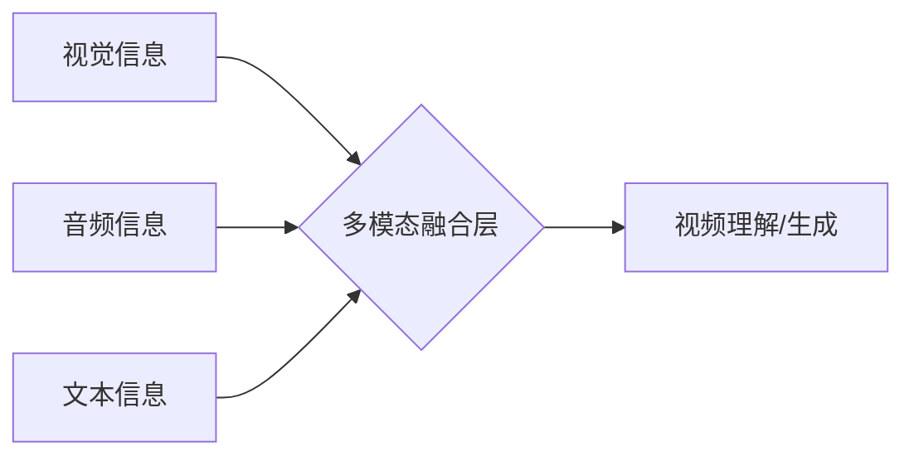

> 视频大模型、多模态融合、计算机视觉、自然语言处理、深度学习、Transformer、视频理解、视频生成

## 1. 背景介绍

近年来，人工智能技术取得了飞速发展，深度学习算法的突破性进展推动了计算机视觉和自然语言处理等领域的巨大进步。其中，视频大模型作为一种融合了视觉和语言信息的多模态模型，展现出强大的潜力，在视频理解、视频生成、视频编辑等领域具有广泛的应用前景。

传统的视频处理方法往往局限于单一模态，例如只关注视频的视觉信息或音频信息。而视频大模型则能够同时处理视频的视觉、音频、文本等多模态信息，从而更全面地理解视频内容，并进行更复杂的交互和生成。

## 2. 核心概念与联系

视频大模型的核心概念是多模态融合，即将不同模态的信息有效地结合起来，形成一个统一的表示，从而提升模型的理解和生成能力。

**多模态融合的架构**



**核心概念解释:**

* **视觉信息:** 视频中的图像帧序列，可以利用计算机视觉技术进行分析和理解。
* **音频信息:** 视频中的声音信息，可以利用语音识别和自然语言处理技术进行分析和理解。
* **文本信息:** 视频相关的文本信息，例如字幕、描述、评论等，可以利用自然语言处理技术进行分析和理解。
* **多模态融合层:** 将不同模态的信息进行融合，形成一个统一的视频表示。
* **视频理解/生成:** 基于融合后的视频表示，进行视频理解、视频生成、视频编辑等任务。

## 3. 核心算法原理 & 具体操作步骤

### 3.1  算法原理概述

视频大模型通常基于深度学习算法，例如Transformer网络，进行多模态融合和视频理解/生成。Transformer网络具有强大的序列建模能力，能够有效地捕捉视频中不同帧之间的时空关系。

### 3.2  算法步骤详解

1. **数据预处理:** 将视频数据预处理成模型可接受的格式，例如将视频帧提取成图像序列，将音频信息转换为音频特征，将文本信息转换为词向量。
2. **多模态特征提取:** 利用不同的深度学习模型提取不同模态的信息特征，例如利用卷积神经网络提取图像特征，利用循环神经网络提取音频特征，利用词嵌入模型提取文本特征。
3. **多模态融合:** 将不同模态的特征进行融合，形成一个统一的视频表示。常用的融合方法包括：
    * **早期融合:** 在特征提取阶段将不同模态的信息进行拼接或连接。
    * **晚期融合:** 在模型输出阶段将不同模态的预测结果进行融合。
    * **跨模态注意力机制:** 利用注意力机制学习不同模态之间的关系，并赋予不同模态不同的权重。
4. **视频理解/生成:** 基于融合后的视频表示，进行视频理解或视频生成任务。例如，可以利用视频大模型进行视频分类、视频摘要、视频问答、视频生成等任务。

### 3.3  算法优缺点

**优点:**

* 能够有效地融合多模态信息，提升模型的理解和生成能力。
* 能够处理更复杂的视频任务，例如视频问答、视频摘要等。
* 能够生成更逼真的视频内容。

**缺点:**

* 训练数据量大，计算资源消耗高。
* 模型结构复杂，需要更强的计算能力和优化算法。
* 跨模态信息融合仍然是一个挑战性问题。

### 3.4  算法应用领域

视频大模型在以下领域具有广泛的应用前景:

* **视频理解:** 视频分类、视频检索、视频摘要、视频问答、视频异常检测等。
* **视频生成:** 视频合成、视频编辑、视频特效制作等。
* **视频辅助决策:** 视频监控、医疗诊断、教育培训等。
* **娱乐和社交:** 视频内容推荐、视频游戏、虚拟现实等。

## 4. 数学模型和公式 & 详细讲解 & 举例说明

### 4.1  数学模型构建

视频大模型的数学模型通常基于深度学习框架，例如TensorFlow或PyTorch。模型结构通常包括多层神经网络，例如卷积神经网络、循环神经网络和Transformer网络。

### 4.2  公式推导过程

视频大模型的训练过程通常使用反向传播算法，通过优化模型参数来最小化模型预测误差。反向传播算法的核心公式是梯度下降公式：

$$
\theta = \theta - \alpha \nabla L(\theta)
$$

其中：

* $\theta$ 是模型参数。
* $\alpha$ 是学习率。
* $L(\theta)$ 是模型预测误差函数。
* $\nabla L(\theta)$ 是模型预测误差函数对模型参数的梯度。

### 4.3  案例分析与讲解

例如，在视频分类任务中，视频大模型的输出是一个类别概率分布。模型的目标是将视频分类到正确的类别，即最大化正确类别的概率。

假设视频分类任务有三个类别，模型的输出概率分布为：

$$
P(C_1) = 0.3, \quad P(C_2) = 0.6, \quad P(C_3) = 0.1
$$

其中 $C_1$, $C_2$, $C_3$ 分别代表三个类别。如果视频的真实类别是 $C_2$，则模型的预测误差为：

$$
L(\theta) = - \log P(C_2) = - \log 0.6
$$

通过反向传播算法，可以计算出模型参数 $\theta$ 的梯度，并更新模型参数，从而降低模型预测误差。

## 5. 项目实践：代码实例和详细解释说明

### 5.1  开发环境搭建

视频大模型的开发环境通常需要强大的计算资源，例如GPU。常用的开发框架包括TensorFlow和PyTorch。

### 5.2  源代码详细实现

由于篇幅限制，这里只提供一个简单的视频分类模型的代码示例：

```python
import tensorflow as tf

# 定义模型结构
model = tf.keras.models.Sequential([
    tf.keras.layers.Conv2D(32, (3, 3), activation='relu', input_shape=(224, 224, 3)),
    tf.keras.layers.MaxPooling2D((2, 2)),
    tf.keras.layers.Conv2D(64, (3, 3), activation='relu'),
    tf.keras.layers.MaxPooling2D((2, 2)),
    tf.keras.layers.Flatten(),
    tf.keras.layers.Dense(10, activation='softmax')
])

# 编译模型
model.compile(optimizer='adam',
              loss='sparse_categorical_crossentropy',
              metrics=['accuracy'])

# 训练模型
model.fit(x_train, y_train, epochs=10)

# 评估模型
loss, accuracy = model.evaluate(x_test, y_test)
print('Loss:', loss)
print('Accuracy:', accuracy)
```

### 5.3  代码解读与分析

这段代码定义了一个简单的卷积神经网络模型，用于视频分类任务。模型包含两层卷积层、两层最大池化层、一层全连接层和一层softmax输出层。

### 5.4  运行结果展示

训练完成后，可以评估模型的性能，例如计算模型在测试集上的准确率。

## 6. 实际应用场景

### 6.1  视频理解

* **视频分类:** 将视频分类到不同的类别，例如体育、娱乐、新闻等。
* **视频检索:** 根据视频内容检索相关的视频。
* **视频摘要:** 生成视频的简短摘要，例如提取视频的关键帧和事件。
* **视频问答:** 回答关于视频内容的问题。
* **视频异常检测:** 检测视频中的异常行为，例如入侵检测、交通事故检测等。

### 6.2  视频生成

* **视频合成:** 将多个视频片段合成一个新的视频。
* **视频编辑:** 自动剪辑视频、添加字幕、调整视频特效等。
* **视频特效制作:** 生成逼真的视频特效，例如火焰、爆炸、水流等。

### 6.3  视频辅助决策

* **视频监控:** 利用视频大模型进行视频监控，例如人脸识别、行为分析等。
* **医疗诊断:** 利用视频大模型辅助医生进行诊断，例如分析病人的症状、预测疾病的进展等。
* **教育培训:** 利用视频大模型进行个性化教育培训，例如根据学生的学习进度和能力提供不同的学习内容。

### 6.4  未来应用展望

随着视频大模型技术的不断发展，其应用场景将会更加广泛，例如：

* **虚拟现实和增强现实:** 利用视频大模型生成逼真的虚拟场景和增强现实体验。
* **自动驾驶:** 利用视频大模型帮助自动驾驶汽车理解道路环境和做出决策。
* **机器人交互:** 利用视频大模型帮助机器人理解人类的行为和意图，从而进行更自然的交互。

## 7. 工具和资源推荐

### 7.1  学习资源推荐

* **书籍:**
    * 《深度学习》 by Ian Goodfellow, Yoshua Bengio, and Aaron Courville
    * 《动手学深度学习》 by Aurélien Géron
* **在线课程:**
    * TensorFlow 官方教程: https://www.tensorflow.org/tutorials
    * PyTorch 官方教程: https://pytorch.org/tutorials/

### 7.2  开发工具推荐

* **TensorFlow:** https://www.tensorflow.org/
* **PyTorch:** https://pytorch.org/
* **Keras:** https://keras.io/

### 7.3  相关论文推荐

* **BERT:** Devlin, J., Chang, M. W., Lee, K., & Toutanova, K. (2018). BERT: Pre-training of deep bidirectional transformers for language understanding. arXiv preprint arXiv:1810.04805.
* **Vision Transformer (ViT):** Dosovitskiy, A., Beyer, L., Kolesnikov, A., Weissenborn, D., Houlsby, N., Elsen, J., ... & Fischer, A. (2020). An image is worth 16x16 words: Transformers for image recognition at scale. arXiv preprint arXiv:2010.11929.

## 8. 总结：未来发展趋势与挑战

### 8.1  研究成果总结

近年来，视频大模型取得了显著的进展，在视频理解和视频生成等领域展现出强大的潜力。

### 8.2  未来发展趋势

* **模型规模和能力的提升:** 未来视频大模型的规模和能力将会进一步提升，能够处理更复杂的任务，生成更逼真的视频内容。
* **多模态融合的深入研究:** 未来将更加深入地研究多模态融合的方法，提升模型对不同模态信息的理解和利用能力。
* **跨领域应用的拓展:** 视频大模型的应用场景将会更加广泛，例如虚拟现实、增强现实、自动驾驶等领域。

### 8.3  面临的挑战

* **数据获取和标注:** 视频大模型的训练需要大量的视频数据，而获取和标注高质量的视频数据仍然是一个挑战。
* **计算资源消耗:** 视频大模型的训练需要大量的计算资源，这对于资源有限的机构和个人来说是一个障碍。
* **模型解释性和可解释性:** 视频大模型的决策过程往往是复杂的，难以解释和理解，这对于模型的信任度和应用推广来说是一个挑战。

### 8.4  研究展望

未来，视频大模型的研究将继续朝着更强大、更智能、更可解释的方向发展，为人类社会带来更多便利和福祉。

## 9. 附录：常见问题与解答

**Q1: 视频大模型的训练需要哪些数据？**

**A1:** 视频大模型的训练需要大量的视频数据，